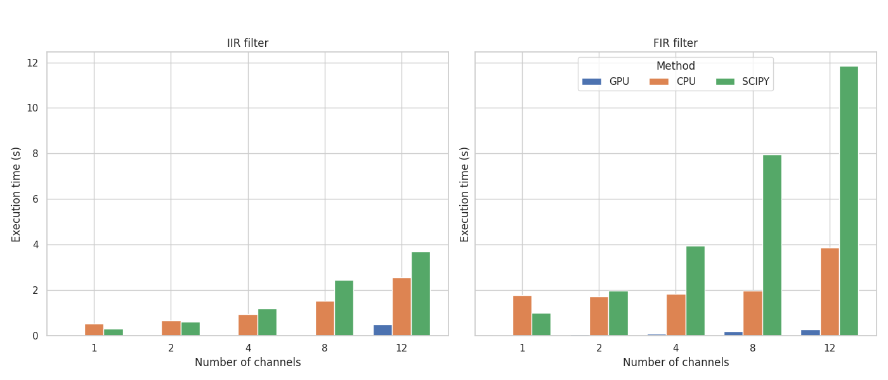

===============================================
TorchFX: GPU-Accelerated Audio DSP
===============================================

.. container:: lead

   A modern Python library for high-performance digital signal processing in audio, leveraging **PyTorch** and **GPU acceleration**.

TorchFX is designed for researchers, engineers, and developers who need **fast, flexible, and differentiable** audio processing. Build complex DSP pipelines with a clean, PyTorch-native API that scales from prototyping to production.

----

.. grid:: 2
   :gutter: 3

   .. grid-item-card:: 🚀 Quick Start
      :link: guides/getting-started/getting_started
      :link-type: doc

      New to TorchFX? Get started in minutes with our installation guide and first examples.

   .. grid-item-card:: 📚 API Reference
      :link: api/index
      :link-type: doc

      Explore the complete API documentation for filters, effects, and core classes.

   .. grid-item-card:: 🎓 Tutorials
      :link: guides/tutorials/index
      :link-type: doc

      Learn through practical examples: ML preprocessing, real-time processing, custom effects.

   .. grid-item-card:: 💬 Community
      :link: https://github.com/matteospanio/torchfx

      Join the community on GitHub. Contribute, report issues, or discuss ideas.

Why TorchFX?
------------

.. grid:: 1 1 2 3
   :gutter: 2

   .. grid-item-card:: ⚡ GPU Acceleration

      Built on PyTorch for high-performance audio processing on CUDA-enabled devices. Process multichannel signals orders of magnitude faster than traditional CPU-based libraries.

   .. grid-item-card:: 🔗 Composable Pipelines

      Chain filters and effects with the intuitive **pipe operator** (``|``) or combine them in **parallel** (``+``). Build complex processing chains with readable, maintainable code.

   .. grid-item-card:: 🧠 PyTorch Native

      All filters are ``torch.nn.Module`` subclasses. Seamlessly integrate DSP into neural networks, enable gradient-based optimization, and leverage PyTorch's ecosystem.

   .. grid-item-card:: 🎯 Simple & Intuitive

      Clean, object-oriented API designed for ease of use. Focus on your audio processing logic, not on boilerplate code.

   .. grid-item-card:: ⚙️ Highly Extensible

      Create custom filters and effects by extending base classes. Implement your own processing algorithms while keeping full compatibility with the framework.

   .. grid-item-card:: 📊 Performance Optimized

      Benchmarks show substantial performance gains over SciPy, especially with long and multichannel signals. Efficient threading even on CPU.

Key Features
------------

**Rich Filter Library**
   Comprehensive collection of IIR and FIR filters: Butterworth, Chebyshev, Elliptic, Linkwitz-Riley, parametric EQ, shelving filters, and more.

**Professional Effects**
   Built-in audio effects including reverb, delay, normalization with multiple strategies, and gain control.

**Flexible Composition**
   - **Sequential**: Chain filters with ``wave | filter1 | filter2``
   - **Parallel**: Combine filters with ``filter1 + filter2`` for parallel processing
   - **Modular**: Build reusable processing blocks as ``torch.nn.Module`` instances

**Differentiable Processing**
   All operations are differentiable, enabling gradient-based optimization of filter parameters and integration with neural audio models.

**Multi-channel Support**
   Efficiently process stereo, surround, and multi-mic audio with full GPU acceleration across channels.

Quick Example
-------------

.. code-block:: python

   import torch
   from torchfx import Wave
   from torchfx.filter import LoButterworth, ParametricEQ

   # Load audio
   wave = Wave.from_file("audio.wav")

   # Create filters
   lowpass = LoButterworth(cutoff=5000, order=4, fs=wave.fs)
   eq = ParametricEQ(frequency=1000, q=2.0, gain=3.0, fs=wave.fs)

   # Sequential processing
   processed = wave | lowpass | eq

   # Parallel processing (filter combination)
   stereo_enhancer = lowpass + eq
   enhanced = wave | stereo_enhancer

   # Save result
   processed.save("output.wav")

Performance
-----------

TorchFX delivers **significant performance improvements** over traditional libraries like SciPy, especially for:

- **Long audio signals** (minutes to hours)
- **Multichannel processing** (stereo, surround, multi-mic)
- **Real-time applications** (low-latency streaming)
- **Batch processing** (ML dataset preprocessing)

Benchmarks from our `research paper <https://arxiv.org/abs/2504.08624>`_ demonstrate TorchFX's efficient use of parallel GPU computation. Even on CPU, optimized PyTorch internals provide competitive performance.

Get Started
-----------

Install TorchFX with pip:

.. code-block:: bash

   pip install torchfx

Or from source:

.. code-block:: bash

   git clone https://github.com/matteospanio/torchfx.git
   cd torchfx
   pip install -e .

See the :doc:`installation guide <guides/getting-started/installation>` for more details.

Citation
--------

If you use TorchFX in your research, please cite our paper:

.. code-block:: bibtex

   @misc{spanio2025torchfxmodernapproachaudio,
     title={TorchFX: A modern approach to Audio DSP with PyTorch and GPU acceleration},
     author={Matteo Spanio and Antonio Rodà},
     year={2025},
     eprint={2504.08624},
     archivePrefix={arXiv},
     primaryClass={eess.AS},
     url={https://arxiv.org/abs/2504.08624},
   }

----

.. toctree::
   :maxdepth: 2
   :caption: Guides
   :hidden:

   guides/index

.. toctree::
   :maxdepth: 2
   :caption: API
   :hidden:

   api/index

.. toctree::
   :maxdepth: 1
   :caption: Blog
   :hidden:

   blog/index

.. toctree::
   :maxdepth: 1
   :caption: Reference
   :hidden:

   glossary
