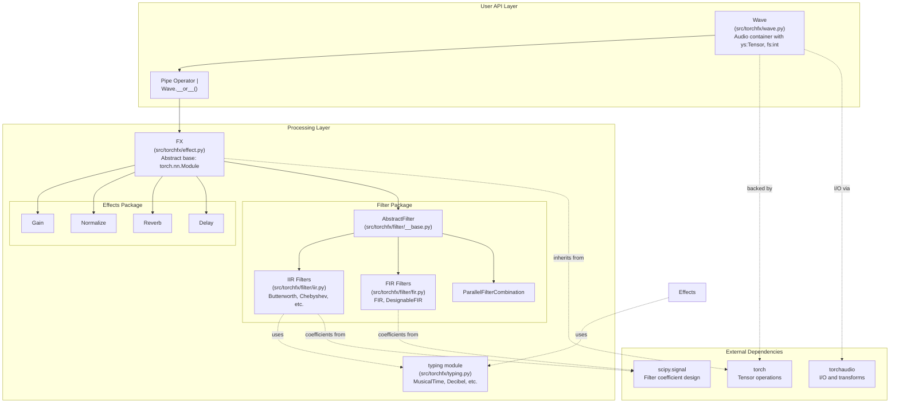
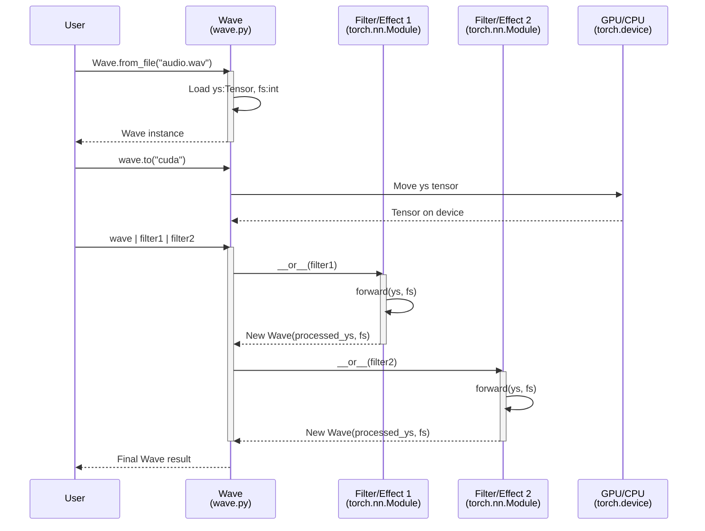
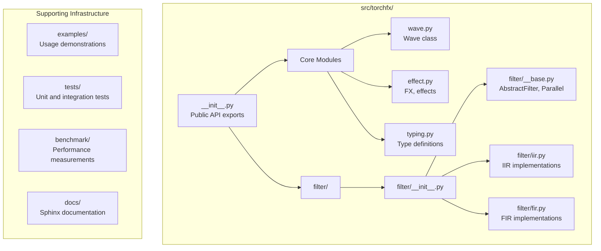

# 1 Overview

# Overview

<details>
<summary>Relevant source files</summary>

The following files were used as context for generating this wiki page:

- [CHANGELOG](CHANGELOG)
- [README.md](README.md)
- [examples/series_and_parallel_filters.py](examples/series_and_parallel_filters.py)
- [pyproject.toml](pyproject.toml)

</details>


## Purpose and Scope

This page provides a high-level introduction to **torchfx**, a GPU-accelerated audio digital signal processing (DSP) library built on PyTorch. It covers the library's purpose, key features, architectural components, and how they relate to each other.

For installation instructions and a quick start example, see [Quick Start](#1.1). For detailed information about core concepts like the `Wave` class and `FX` base class, see [Core Concepts](#2).

**Sources**: [README.md:1-10](), [pyproject.toml:1-10]()

## What is torchfx

**torchfx** is a Python library that enables modern audio digital signal processing using PyTorch's tensor operations and automatic differentiation capabilities. The library provides a functional, composable API for creating audio processing pipelines that can be executed on both CPU and GPU hardware.

The library is designed for researchers and developers working in audio processing who want to leverage GPU acceleration and integrate seamlessly with existing PyTorch workflows. It is currently in **Alpha** development status (version 0.2.1).

**Key characteristics**:
- Built on PyTorch tensors for automatic GPU/CPU compatibility
- Functional pipeline syntax using the pipe operator (`|`)
- Compatible with `torch.nn.Module` ecosystem
- Type-checked with strict mypy configuration

**Sources**: [README.md:1-15](), [pyproject.toml:2-4](), [pyproject.toml:29-30]()

## Key Features

| Feature | Description | Implementation |
|---------|-------------|----------------|
| **GPU Acceleration** | Audio processing operations execute on CUDA-capable GPUs for real-time performance | `Wave.to("cuda")` method, PyTorch tensor backend |
| **Pipe Operator** | Functional chaining of effects and filters using `\|` operator | `Wave.__or__` method in [src/torchfx/wave.py]() |
| **PyTorch Integration** | All effects/filters inherit from `torch.nn.Module` | `FX` base class in [src/torchfx/effect.py]() |
| **Type Safety** | Strict type checking with custom audio-specific types | `typing` module with `MusicalTime`, `Decibel`, etc. |
| **Flexible Pipelines** | Combine filters in series (using `\|`) and parallel (using `+`) | `ParallelFilterCombination` in [src/torchfx/filter/__base.py]() |

**Sources**: [README.md:11-16](), [pyproject.toml:70-85]()

## Architecture Overview

The following diagram illustrates the main components of torchfx and their relationships:



**Sources**: [src/torchfx/__init__.py](), [README.md:36-50](), [pyproject.toml:11-18]()

## Core Components

### Wave Class

The `Wave` class is the primary data container in torchfx. It encapsulates an audio signal as a PyTorch tensor along with its sampling rate.

**Key attributes**:
- `ys` (Tensor): Audio samples with shape `(channels, samples)`
- `fs` (int): Sampling rate in Hz

**Key methods**:
- `from_file(path)`: Load audio from disk
- `to(device)`: Move audio tensor to specified device (CPU/CUDA)
- `__or__(other)`: Pipe operator implementation for chaining

The `Wave` class implements the pipe operator (`|`), enabling functional composition of processing chains.

**Sources**: [src/torchfx/wave.py](), [README.md:50]()

### FX Base Class

`FX` is the abstract base class for all audio effects and filters. It inherits from `torch.nn.Module`, making all torchfx effects compatible with PyTorch's neural network ecosystem.

**Key characteristics**:
- Inherits from `torch.nn.Module`
- Defines the contract for `forward(x: Tensor, fs: int)` method
- Enables integration with `nn.Sequential`, gradient computation, and other PyTorch features

All effects in [src/torchfx/effect.py]() and filters in [src/torchfx/filter/]() inherit from `FX`.

**Sources**: [src/torchfx/effect.py]()

### Effects Package

The effects package provides time-domain audio transformations:

| Effect Class | Purpose | Key Parameters |
|--------------|---------|----------------|
| `Gain` | Amplitude adjustment | `gain` (dB, amplitude, or power) |
| `Normalize` | Dynamic range normalization | `strategy` (peak, RMS, percentile) |
| `Reverb` | Reverberation simulation | `delay`, `decay`, `mix` |
| `Delay` | Time-based delay effect | `time` (MusicalTime or seconds), `feedback` |

**Sources**: [src/torchfx/effect.py](), [CHANGELOG:14]()

### Filter Package

The filter package provides frequency-domain transformations organized into two categories:

**IIR Filters** ([src/torchfx/filter/iir.py]()):
- `Butterworth`, `Chebyshev1`, `Chebyshev2`
- `HiShelving`, `LoShelving`, `Peaking`, `Notch`
- `AllPass`, `LinkwitzRiley` (and variants)

**FIR Filters** ([src/torchfx/filter/fir.py]()):
- `FIR`: Basic FIR filter with manual coefficients
- `DesignableFIR`: FIR filter with automatic coefficient design

Filters can be combined in series using the pipe operator (`|`) or in parallel using the addition operator (`+`), which creates a `ParallelFilterCombination` instance.

**Sources**: [src/torchfx/filter/iir.py](), [src/torchfx/filter/fir.py](), [src/torchfx/filter/__base.py]()

## Data Flow and Processing Pipeline

The following sequence diagram shows how audio data flows through a typical torchfx processing pipeline:



**Key aspects of the data flow**:
1. Audio is loaded into a `Wave` object with tensor data and sampling rate
2. The `Wave` can be moved to GPU using `.to("cuda")`
3. The pipe operator (`|`) chains processing modules sequentially
4. Each module receives `(ys, fs)` and returns a new `Wave` instance
5. The pipeline is immutable - each operation returns a new `Wave`

**Sources**: [README.md:36-50](), [examples/series_and_parallel_filters.py:16-20]()

## Package Structure

The torchfx library is organized as follows:



**Public API exports** (from [src/torchfx/__init__.py]()):
- `Wave`: Main audio data container
- `FX`: Base class for effects/filters
- `effect`: Effects module (Gain, Normalize, Reverb, Delay)
- `filter`: Filters module (IIR, FIR, combinations)
- `typing`: Type definitions (MusicalTime, Decibel, etc.)

**Sources**: [src/torchfx/__init__.py](), [README.md:54]()

## Dependencies

torchfx relies on the following external libraries:

| Dependency | Version | Purpose | Source |
|------------|---------|---------|--------|
| **torch** | ≥2.6.0 | Tensor operations, GPU acceleration, nn.Module base | PyTorch |
| **torchaudio** | ≥2.6.0 | Audio I/O, audio transforms | PyTorch Audio |
| **scipy** | ≥1.15.2 | Filter coefficient design (IIR/FIR) | SciPy |
| **numpy** | ≥2.2.4 | Array operations and utilities | NumPy |
| **soundfile** | ≥0.13.1 | Additional audio format support | PySoundFile |

**Platform-specific PyTorch configuration**:
- **Linux**: CUDA 12.4 enabled (`pytorch-cu124` index)
- **macOS/Windows**: CPU-only (`pytorch-cpu` index)

This configuration is managed through `uv` package manager with platform markers in [pyproject.toml:50-68]().

**Sources**: [pyproject.toml:11-18](), [pyproject.toml:50-68](), [README.md:82-91]()

## Usage Example

The following example from the repository demonstrates the core usage pattern:

```python
# From examples/series_and_parallel_filters.py
signal = fx.Wave.from_file("sample_input.wav")
signal = signal.to("cuda" if torch.cuda.is_available() else "cpu")

result = (signal
    | fx.filter.LoButterworth(100, order=2)
    | fx.filter.HiButterworth(2000, order=2) + fx.filter.HiChebyshev1(2000, order=2)
    | T.Vol(0.5)
)
```

This example demonstrates:
1. Loading audio with `Wave.from_file()`
2. Moving to GPU with `.to("cuda")`
3. Series filtering with pipe operator (`|`)
4. Parallel filter combination with addition operator (`+`)
5. Integration with torchaudio transforms (`T.Vol`)

**Sources**: [examples/series_and_parallel_filters.py:13-20](), [README.md:36-50]()

## Development Status and License

**Current Status**: Alpha (version 0.2.1)

**Recent additions** (version 0.2.1):
- `Delay` effect with BPM synchronization
- Parallel filter combination support
- Custom normalization strategies
- Improved type safety and pre-commit configuration

**License**: GNU General Public License v3.0 (GPLv3)

**Repository**: https://github.com/matteospanio/torchfx  
**Documentation**: https://matteospanio.github.io/torchfx/  
**PyPI**: https://pypi.org/project/torchfx/

For a complete version history, see [Changelog](#10).

**Sources**: [pyproject.toml:1-6](), [pyproject.toml:29-30](), [CHANGELOG:10-27](), [README.md:77-79]()

## Citation

If you use torchfx in research, cite the following paper:

```bibtex
@misc{spanio2025torchfxmodernapproachaudio,
      title={TorchFX: A modern approach to Audio DSP with PyTorch and GPU acceleration},
      author={Matteo Spanio and Antonio Rodà},
      year={2025},
      eprint={2504.08624},
      archivePrefix={arXiv},
      primaryClass={eess.AS},
      url={https://arxiv.org/abs/2504.08624},
}
```

**Sources**: [README.md:56-70]()