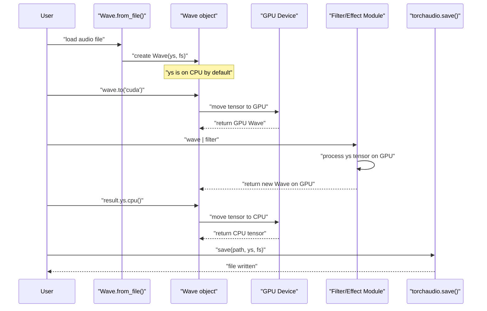
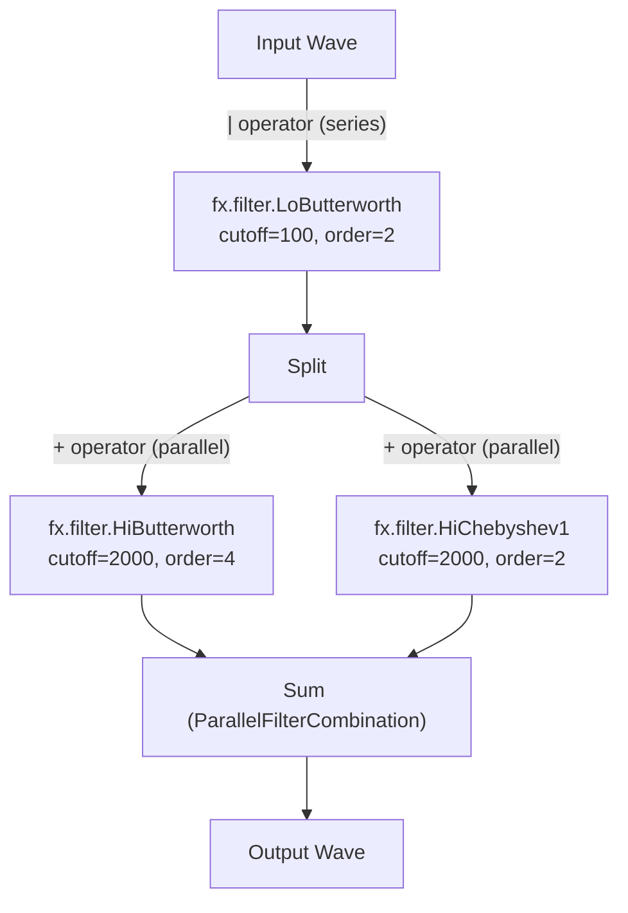

# 1.1 Quick Start

# Quick Start

<details>
<summary>Relevant source files</summary>

The following files were used as context for generating this wiki page:

- [README.md](README.md)
- [examples/series_and_parallel_filters.py](examples/series_and_parallel_filters.py)
- [pyproject.toml](pyproject.toml)

</details>


This page provides a quick start guide for getting started with torchfx. It covers basic installation, loading audio files, applying audio processing effects and filters, and saving results. For detailed installation options including platform-specific PyTorch configuration, see [Installation](#1.2). For in-depth explanations of the core concepts, see [Core Concepts](#2).

## Scope

This guide demonstrates the fundamental torchfx workflow:
1. Installing the library
2. Loading audio with `Wave.from_file()`
3. Chaining filters and effects using the pipe operator `|`
4. Managing device placement (CPU/GPU)
5. Saving processed audio

## Installation

Install torchfx using pip:

```bash
pip install torchfx
```

This command installs torchfx along with its dependencies: PyTorch, torchaudio, NumPy, SciPy, and soundfile. For advanced installation options, dependency management with `uv`, or platform-specific PyTorch builds (CPU vs CUDA), see [Installation](#1.2).

**Sources**: [README.md:17-30](), [pyproject.toml:11-18]()

## Basic Usage Example

The following example demonstrates the core torchfx workflow:

```python
import torch
import torchfx as fx

# Load audio file
wave = fx.Wave.from_file("path_to_audio.wav")

# Apply processing pipeline
filtered_wave = (
    wave
    | fx.filter.LoButterworth(8000)
    | fx.filter.HiShelving(2000)
    | fx.effect.Reverb()
)

# Access the processed audio tensor
output_tensor = filtered_wave.ys
```

This example creates a processing chain that:
1. Loads an audio file into a `Wave` object
2. Applies a low-pass Butterworth filter at 8000 Hz
3. Applies a high-shelving filter at 2000 Hz
4. Applies a reverb effect
5. Returns a new `Wave` object containing the processed audio

**Sources**: [README.md:36-46]()

## Wave Object and Pipeline Processing

The following diagram illustrates how the `Wave` class and pipeline operator work together:

**Diagram: Wave Processing Pipeline Architecture**

```mermaid
graph LR
    AudioFile["Audio File<br/>(WAV/MP3/etc)"]
    WaveFromFile["Wave.from_file()"]
    WaveObj1["Wave object<br/>ys: Tensor<br/>fs: int"]
    
    Filter1["fx.filter.LoButterworth<br/>torch.nn.Module"]
    WaveObj2["Wave object<br/>(filtered)"]
    
    Filter2["fx.filter.HiShelving<br/>torch.nn.Module"]
    WaveObj3["Wave object<br/>(filtered + shaped)"]
    
    Effect["fx.effect.Reverb<br/>torch.nn.Module"]
    WaveObjFinal["Wave object<br/>(final output)"]
    
    AudioFile -->|"load"| WaveFromFile
    WaveFromFile --> WaveObj1
    WaveObj1 -->|"| operator"| Filter1
    Filter1 -->|"returns"| WaveObj2
    WaveObj2 -->|"| operator"| Filter2
    Filter2 -->|"returns"| WaveObj3
    WaveObj3 -->|"| operator"| Effect
    Effect -->|"returns"| WaveObjFinal
```



Each `Wave` object encapsulates:
- `ys`: A PyTorch `Tensor` containing audio samples (shape: `[channels, samples]`)
- `fs`: An integer representing the sampling rate in Hz

The pipe operator `|` is overloaded on the `Wave` class to enable functional chaining. Each filter or effect in the chain receives a `Wave`, processes its `ys` tensor, and returns a new `Wave` object.

**Sources**: [README.md:50](), [examples/series_and_parallel_filters.py:16-20]()

## Complete Example with File I/O

Here's a complete example that loads a file, processes it, and saves the output:

```python
import torch
import torchfx as fx
import torchaudio

# Load audio
signal = fx.Wave.from_file("input.wav")

# Optional: Move to GPU for acceleration
if torch.cuda.is_available():
    signal = signal.to("cuda")

# Apply processing pipeline
result = (
    signal
    | fx.filter.LoButterworth(100, order=2)
    | fx.filter.HiButterworth(2000, order=2)
    | fx.effect.Gain(db=-6)
)

# Save output (move back to CPU for I/O)
torchaudio.save("output.wav", result.ys.cpu(), result.fs)
```

**Sources**: [examples/series_and_parallel_filters.py:13-22]()

## Processing Flow with Device Management

The following sequence diagram shows the complete processing flow including device management:

**Diagram: Audio Processing Sequence with Device Placement**



**Key Points**:
1. `Wave.from_file()` loads audio onto CPU by default
2. `wave.to("cuda")` moves the `Wave` and its `ys` tensor to GPU
3. Filters and effects process tensors on whatever device they reside
4. `ys.cpu()` moves the tensor back to CPU for file I/O
5. `torchaudio.save()` requires CPU tensors for writing to disk

**Sources**: [examples/series_and_parallel_filters.py:13-14](), [examples/series_and_parallel_filters.py:22]()

## Parallel Filter Combination

Torchfx supports combining filters in parallel using the `+` operator:

```python
result = (
    signal
    | fx.filter.LoButterworth(100, order=2)
    | fx.filter.HiButterworth(2000, order=4) + fx.filter.HiChebyshev1(2000, order=2)
)
```

This creates a parallel combination where the signal is split, processed by both filters independently, and then summed. The `+` operator creates a `ParallelFilterCombination` object that handles this routing automatically.

**Diagram: Series and Parallel Filter Topology**



For more details on parallel filter combinations, see [Parallel Filter Combination](#4.3).

**Sources**: [examples/series_and_parallel_filters.py:1-22](), [README.md:41-46]()

## Available Filters and Effects

The following table lists commonly used filters and effects available in torchfx:

| Category | Class Name | Description |
|----------|-----------|-------------|
| **IIR Filters** | `fx.filter.LoButterworth` | Low-pass Butterworth filter |
| | `fx.filter.HiButterworth` | High-pass Butterworth filter |
| | `fx.filter.BandButterworth` | Band-pass Butterworth filter |
| | `fx.filter.LoChebyshev1` | Low-pass Chebyshev Type I filter |
| | `fx.filter.HiChebyshev1` | High-pass Chebyshev Type I filter |
| | `fx.filter.LoShelving` | Low-frequency shelving filter |
| | `fx.filter.HiShelving` | High-frequency shelving filter |
| | `fx.filter.Peaking` | Peaking/notch filter |
| **FIR Filters** | `fx.filter.FIR` | Finite impulse response filter |
| | `fx.filter.DesignableFIR` | FIR with automatic coefficient design |
| **Effects** | `fx.effect.Gain` | Amplitude/dB gain control |
| | `fx.effect.Normalize` | Signal normalization |
| | `fx.effect.Reverb` | Reverb effect |
| | `fx.effect.Delay` | BPM-synced delay effect |

For complete API documentation, see [API Reference](#8).

**Sources**: [README.md:54](), [pyproject.toml:19-28]()

## Next Steps

After completing this quick start:
- Learn about the `Wave` class in detail: [Wave Class](#2.1)
- Understand the `FX` base class and pipeline operator: [FX Base Class](#2.2) and [Pipeline Operator](#2.3)
- Explore individual effects: [Effects](#3)
- Explore filters in depth: [Filters](#4)
- Learn about GPU acceleration: [GPU Acceleration](#5.2)
- See more examples: [Examples](#6)