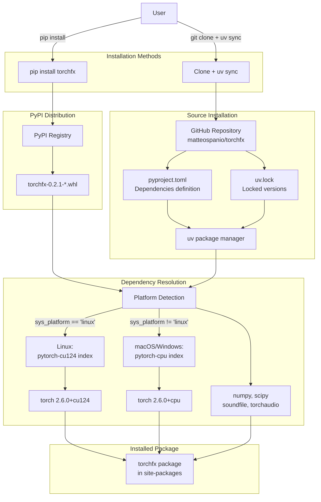
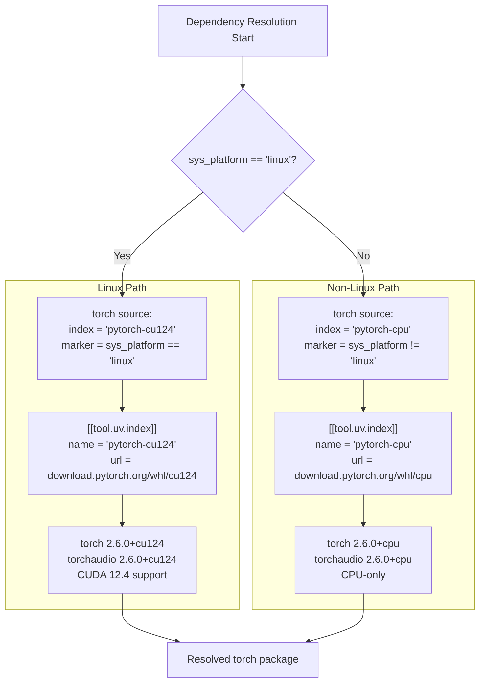
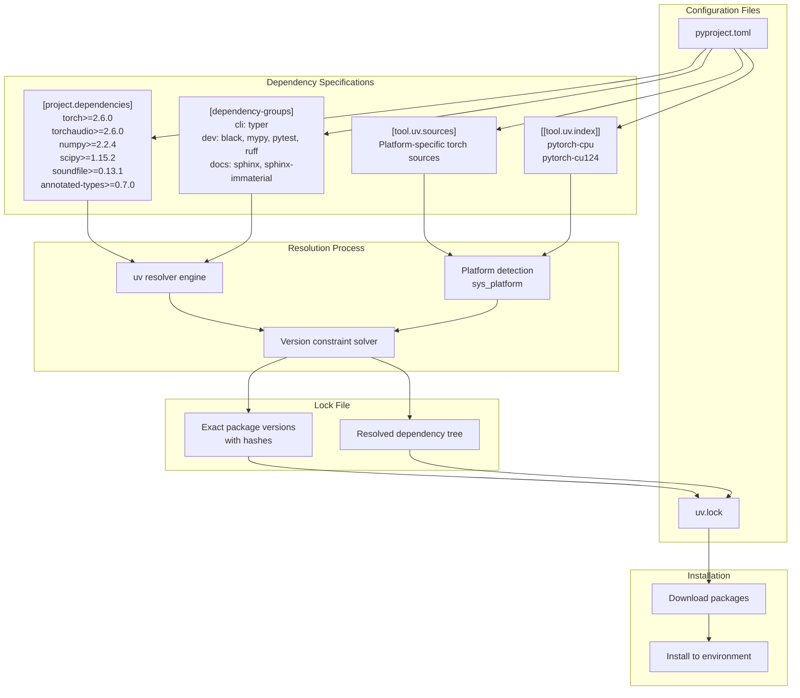

# 1.2 Installation

# Installation

<details>
<summary>Relevant source files</summary>

The following files were used as context for generating this wiki page:

- [pyproject.toml](pyproject.toml)
- [uv.lock](uv.lock)

</details>


## Purpose and Scope

This document describes the installation procedures for torchfx, including system requirements, installation methods, platform-specific PyTorch configuration, and dependency management. For a quick start guide with minimal setup, see [Quick Start](#1.1). For details on the development environment setup, see [Development Workflow](#7.3).

## System Requirements

torchfx requires **Python 3.10 or higher** as specified in [pyproject.toml:10](). The library is designed to run on multiple platforms with different hardware acceleration capabilities:

| Platform | PyTorch Backend | CUDA Support |
|----------|----------------|--------------|
| Linux | CUDA 12.4 | Yes |
| macOS | CPU | No |
| Windows | CPU | No |

The platform-specific PyTorch configuration is defined in [pyproject.toml:50-68]() using the `uv` package manager's source selection mechanism.

**Core Dependencies:**

- `torch>=2.6.0` - PyTorch tensor library
- `torchaudio>=2.6.0` - Audio I/O and transforms
- `numpy>=2.2.4` - Numerical computing
- `scipy>=1.15.2` - Signal processing algorithms
- `soundfile>=0.13.1` - Audio file reading/writing
- `annotated-types>=0.7.0` - Type annotation support

These are declared in [pyproject.toml:11-18]().

## Installation Methods

### Installation via pip

The simplest installation method is through PyPI:

```bash
pip install torchfx
```

This installs the package with platform-appropriate PyTorch binaries. On Linux systems, this will attempt to install CUDA 12.4-enabled PyTorch; on macOS and Windows, it will install CPU-only versions.

### Installation from Source with uv

For development or to use the latest unreleased features, install from source using the `uv` package manager:

```bash
# Install uv if not already installed
pip install uv

# Clone the repository
git clone https://github.com/matteospanio/torchfx
cd torchfx

# Install in editable mode with all dependencies
uv sync
```

The `uv sync` command reads [pyproject.toml]() and [uv.lock]() to install all dependencies with exact versions for reproducible builds.

**Installation Workflow Diagram:**



**Sources:** [pyproject.toml:1-18](), [pyproject.toml:50-68]()

## Platform-Specific PyTorch Configuration

The `uv` package manager uses **platform markers** to select the appropriate PyTorch distribution. This configuration is defined in [pyproject.toml:50-68]().

**PyTorch Source Selection Logic:**



**Sources:** [pyproject.toml:50-68]()

The platform detection uses Python's `sys_platform` to determine which PyTorch index to use:

- **Linux systems** ([pyproject.toml:53]()): Resolves `torch` and `torchvision` from the `pytorch-cu124` index at `https://download.pytorch.org/whl/cu124`, providing CUDA 12.4 GPU acceleration.

- **macOS and Windows** ([pyproject.toml:52]()): Resolves from the `pytorch-cpu` index at `https://download.pytorch.org/whl/cpu`, providing CPU-only builds.

The `explicit = true` flag in [pyproject.toml:63, 68]() ensures these indices are only used when explicitly specified by the source configuration.

## Dependency Management with uv

The project uses **uv** as its primary dependency manager, which provides faster dependency resolution and reproducible builds through lock files.

**Dependency Resolution Components:**



**Sources:** [pyproject.toml:11-18](), [pyproject.toml:50-68](), [pyproject.toml:139-156]()

### Dependency Groups

The project defines optional dependency groups for different use cases:

| Group | Purpose | Key Packages |
|-------|---------|--------------|
| `cli` | Command-line interface | `typer>=0.16.0` |
| `dev` | Development tools | `black`, `mypy`, `pytest`, `ruff`, `coverage`, `scalene` |
| `docs` | Documentation building | `sphinx>=8.1.3`, `sphinx-immaterial>=0.13.5` |

These are defined in [pyproject.toml:139-156]().

To install with specific groups:

```bash
# Install with dev dependencies
uv sync --group dev

# Install with all groups
uv sync --all-groups

# Install only docs dependencies
uv sync --group docs
```

## Build System

The project uses **hatchling** as its build backend, specified in [pyproject.toml:135-137]():

```toml
[build-system]
requires = ["hatchling"]
build-backend = "hatchling.build"
```

To build a distribution package:

```bash
# Using uv
uv build

# Or using standard tools
python -m build
```

This produces a wheel file (`.whl`) in the `dist/` directory that can be distributed or installed with pip.

**Sources:** [pyproject.toml:135-137]()

## Verification

After installation, verify that torchfx is correctly installed and can import all core components:

```python
import torchfx
from torchfx import Wave, FX, Gain, Normalize
from torchfx.filter import Butterworth, LowPass

# Check version
print(torchfx.__version__)  # Should print '0.2.1'

# Verify PyTorch backend
import torch
print(f"CUDA available: {torch.cuda.is_available()}")
print(f"PyTorch version: {torch.__version__}")
```

On Linux systems with NVIDIA GPUs, `torch.cuda.is_available()` should return `True`. On macOS and Windows, it will return `False`, indicating CPU-only operation.

To verify audio I/O capabilities:

```python
import torchaudio
print(f"torchaudio version: {torchaudio.__version__}")
print(f"Available backends: {torchaudio.list_audio_backends()}")
```

**Sources:** [pyproject.toml:2-3](), [pyproject.toml:11-18]()

## Troubleshooting

### PyTorch CUDA Version Mismatch

If you have an existing PyTorch installation with a different CUDA version, you may need to uninstall it first:

```bash
pip uninstall torch torchaudio torchvision
uv sync --reinstall-package torch
```

### Platform Detection Issues

If the wrong PyTorch variant is installed, verify your platform:

```python
import sys
print(f"Platform: {sys.platform}")
```

The marker `sys_platform == 'linux'` should be `True` on Linux systems.

### Dependency Conflicts

If you encounter dependency conflicts, regenerate the lock file:

```bash
rm uv.lock
uv lock
uv sync
```

**Sources:** [pyproject.toml:50-68]()