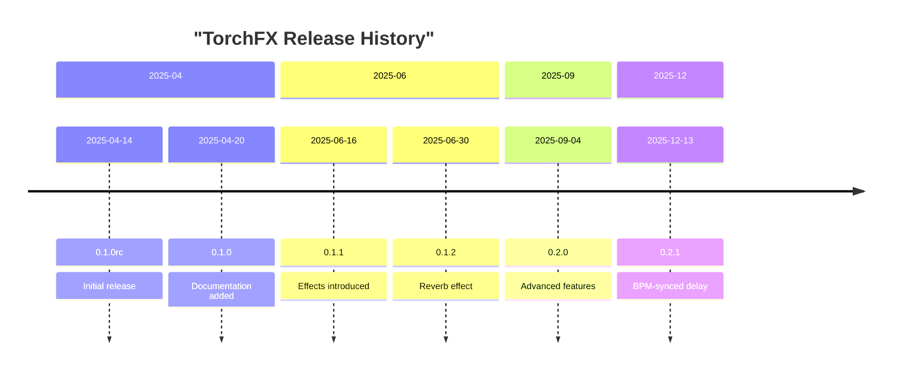
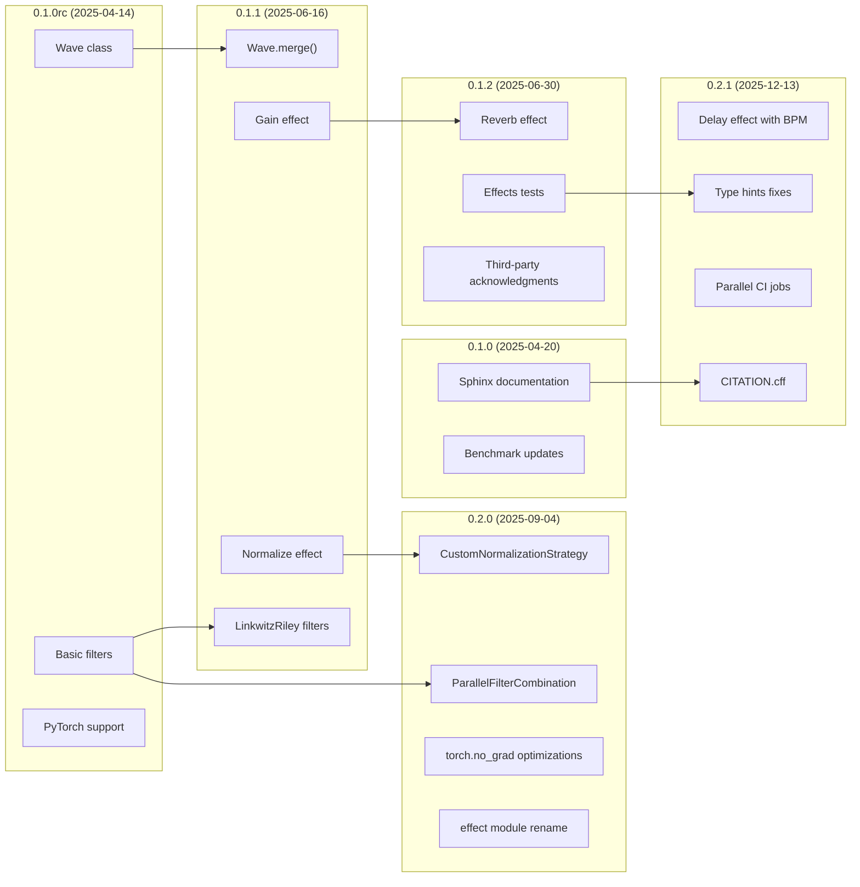
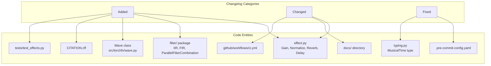

# 10 Changelog

# Changelog

<details>
<summary>Relevant source files</summary>

The following files were used as context for generating this wiki page:

- [CHANGELOG](CHANGELOG)

</details>


This document provides the complete version history of the torchfx library, documenting all releases, features added, changes made, and bugs fixed. The changelog follows the [Keep a Changelog](https://keepachangelog.com/en/1.0.0/) format and the project adheres to [Semantic Versioning](https://semver.org/spec/v2.0.0.html).

For information about specific features and their current usage, see the following pages:
- Effects documentation: [Effects](#3)
- Filters documentation: [Filters](#4)
- API reference: [API Reference](#8)
- Development practices: [Development Guide](#7)

**Sources**: [CHANGELOG:1-83]()

---

## Version History Overview

The table below summarizes all releases of torchfx:

| Version | Release Date | Type | Key Features |
|---------|-------------|------|--------------|
| 0.2.1 | 2025-12-13 | Minor | Delay effect with BPM sync, citation file, parallel CI jobs |
| 0.2.0 | 2025-09-04 | Minor | Custom normalization strategies, parallel filter combination, performance improvements |
| 0.1.2 | 2025-06-30 | Patch | Reverb effect, effects tests, third-party acknowledgments |
| 0.1.1 | 2025-06-16 | Patch | Linkwitz-Riley filters, Gain and Normalize effects, Wave.merge() |
| 0.1.0 | 2025-04-20 | Major | Sphinx documentation, benchmark updates |
| 0.1.0rc | 2025-04-14 | Release Candidate | Initial release with filters, Wave class, PyTorch support |

**Sources**: [CHANGELOG:10-83]()

---

## Release Timeline



**Sources**: [CHANGELOG:10-83]()

---

## Feature Evolution Across Versions

This diagram maps major features and components to the versions in which they were introduced:



**Sources**: [CHANGELOG:10-83]()

---

## Code Entity Mapping

This diagram shows the relationship between changelog entries and specific code entities in the repository:



**Sources**: [CHANGELOG:10-83]()

---

## Detailed Version History

### Version 0.2.1 (2025-12-13)

#### Added
- **`Delay` effect**: New time-based effect with BPM synchronization capability, implemented by @itsuzef
  - Location: `src/torchfx/effect.py`
  - Features multiple delay strategies (mono, ping-pong)
  - Supports musical time divisions via `MusicalTime` type
  - Reference: [Delay Effect](#3.4)
- **Examples**: New demonstration script `examples/delay.py` showcasing BPM-synced delay usage
- **Citation file**: `CITATION.cff` added for academic referencing

#### Changed
- **Documentation**: Updated to include `Delay` effect and revised existing examples
- **CI Pipeline**: GitHub Actions workflow refactored to run checks in parallel jobs for improved feedback speed
  - File: `.github/workflows/ci.yml`

#### Fixed
- **Pre-commit configuration**: Corrected hooks for `mypy`, `docformatter`, and `black`
  - File: `.pre-commit-config.yaml`
- **Type hints**: Corrected type annotations throughout the codebase for better type safety

**Sources**: [CHANGELOG:10-28]()

---

### Version 0.2.0 (2025-09-04)

#### Added
- **`CustomNormalizationStrategy`**: New class enabling custom normalization functions
  - Location: `src/torchfx/effect.py`
  - Allows passing callable strategies to `Normalize` effect
  - Reference: [Normalize Effect](#3.2)
- **`ParallelFilterCombination`**: Class for combining multiple filters in parallel using the `+` operator
  - Location: `src/torchfx/filter/__base.py`
  - Reference: [Parallel Filter Combination](#4.3)
- **Performance optimizations**: Added `torch.no_grad` decorators to non-trainable operations for increased performance

#### Changed
- **Module rename**: Changed `effects` module to `effect` for consistency with `filter` module naming
  - Breaking change affecting imports

**Sources**: [CHANGELOG:29-41]()

---

### Version 0.1.2 (2025-06-30)

#### Added
- **`Reverb` effect**: Feedback delay network-based reverb implementation
  - Location: `src/torchfx/effect.py`
  - Parameters: delay, decay, mix
  - Reference: [Reverb Effect](#3.3)
- **Effects tests**: Comprehensive test suite for effects module
  - Location: `tests/test_effects.py`
  - Reference: [Testing](#7.4)
- **Third-party acknowledgments**: Added acknowledgments section in `README.md` and `LICENSE`

**Sources**: [CHANGELOG:42-49]()

---

### Version 0.1.1 (2025-06-16)

#### Added
- **Linkwitz-Riley filters**: Three new filter implementations
  - `LinkwitzRiley`: Base class
  - `HiLinkwitzRiley`: High-pass variant
  - `LoLinkwitzRiley`: Low-pass variant
  - Location: `src/torchfx/filter/iir.py`
  - Reference: [IIR Filters](#4.1)
- **Effects**: Two new audio effects
  - `Normalize`: Audio normalization with multiple strategies (peak, RMS, percentile, per-channel)
  - `Gain`: Amplitude scaling with dB, amplitude, and power modes
  - Location: `src/torchfx/effect.py`
  - Reference: [Gain](#3.1), [Normalize](#3.2)
- **`Wave.merge()` method**: Method for combining multiple Wave objects
  - Location: `src/torchfx/wave.py`
  - Reference: [Wave Class](#2.1)

#### Fixed
- **Shelving and Peaking filters**: Corrected missing instance variables that prevented proper operation
  - Location: `src/torchfx/filter/iir.py`

**Sources**: [CHANGELOG:50-66]()

---

### Version 0.1.0 (2025-04-20)

#### Added
- **Sphinx documentation**: Complete documentation system with API reference
  - Location: `docs/` directory
  - Deployed to GitHub Pages via automated workflow
  - Reference: [Documentation](#7.6)

#### Changed
- **Benchmark script**: Updated parameters in benchmark scripts
  - Location: `benchmark/` directory

**Sources**: [CHANGELOG:67-74]()

---

### Version 0.1.0rc (2025-04-14)

Initial release candidate with core functionality:

#### Added
- **Documentation**: Initial documentation and README
- **Filters**: Complete filter system including IIR and FIR implementations
  - Location: `src/torchfx/filter/`
  - Reference: [Filters](#4)
- **`Wave` class**: Core audio data container
  - Location: `src/torchfx/wave.py`
  - Reference: [Wave Class](#2.1)
- **PyTorch support**: Full integration with PyTorch tensor operations and device management

**Sources**: [CHANGELOG:75-83]()

---

## Version Comparison Matrix

This table shows which major features are available in each version:

| Feature | 0.1.0rc | 0.1.0 | 0.1.1 | 0.1.2 | 0.2.0 | 0.2.1 |
|---------|---------|-------|-------|-------|-------|-------|
| Wave class | ✓ | ✓ | ✓ | ✓ | ✓ | ✓ |
| Basic filters | ✓ | ✓ | ✓ | ✓ | ✓ | ✓ |
| Sphinx docs | - | ✓ | ✓ | ✓ | ✓ | ✓ |
| Linkwitz-Riley filters | - | - | ✓ | ✓ | ✓ | ✓ |
| Gain effect | - | - | ✓ | ✓ | ✓ | ✓ |
| Normalize effect | - | - | ✓ | ✓ | ✓ | ✓ |
| Wave.merge() | - | - | ✓ | ✓ | ✓ | ✓ |
| Reverb effect | - | - | - | ✓ | ✓ | ✓ |
| Effects tests | - | - | - | ✓ | ✓ | ✓ |
| CustomNormalizationStrategy | - | - | - | - | ✓ | ✓ |
| ParallelFilterCombination | - | - | - | - | ✓ | ✓ |
| torch.no_grad optimizations | - | - | - | - | ✓ | ✓ |
| Delay effect | - | - | - | - | - | ✓ |
| BPM synchronization | - | - | - | - | - | ✓ |
| Parallel CI jobs | - | - | - | - | - | ✓ |

**Sources**: [CHANGELOG:10-83]()

---

## Breaking Changes

The following breaking changes have been introduced across versions:

### Version 0.2.0
- **Module rename**: The `effects` module was renamed to `effect`. Any code importing from `torchfx.effects` must be updated to import from `torchfx.effect` instead.
  ```python
  # Old (0.1.x)
  from torchfx.effects import Gain
  
  # New (0.2.x)
  from torchfx.effect import Gain
  ```

**Sources**: [CHANGELOG:40-41]()

---

## Changelog Maintenance

The changelog file is maintained at [CHANGELOG:1-83]() and follows these conventions:

1. **Format**: Based on [Keep a Changelog](https://keepachangelog.com/en/1.0.0/)
2. **Versioning**: Adheres to [Semantic Versioning](https://semver.org/spec/v2.0.0.html)
3. **Categories**: Changes are classified as:
   - **Added**: New features
   - **Changed**: Changes to existing functionality
   - **Fixed**: Bug fixes
   - **Removed**: Removed features (none to date)
   - **Deprecated**: Soon-to-be removed features (none to date)
   - **Security**: Security-related changes (none to date)

4. **Unreleased section**: Used for tracking changes not yet in a release (as noted in [CHANGELOG:8]())

**Sources**: [CHANGELOG:1-9]()