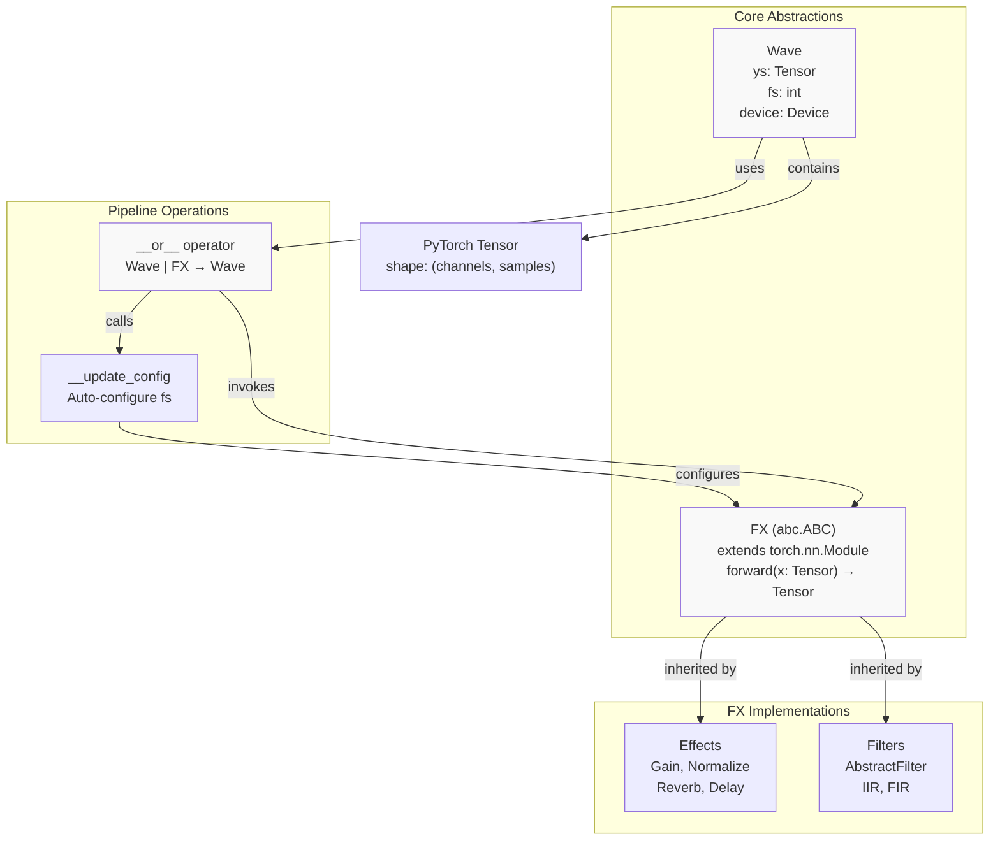
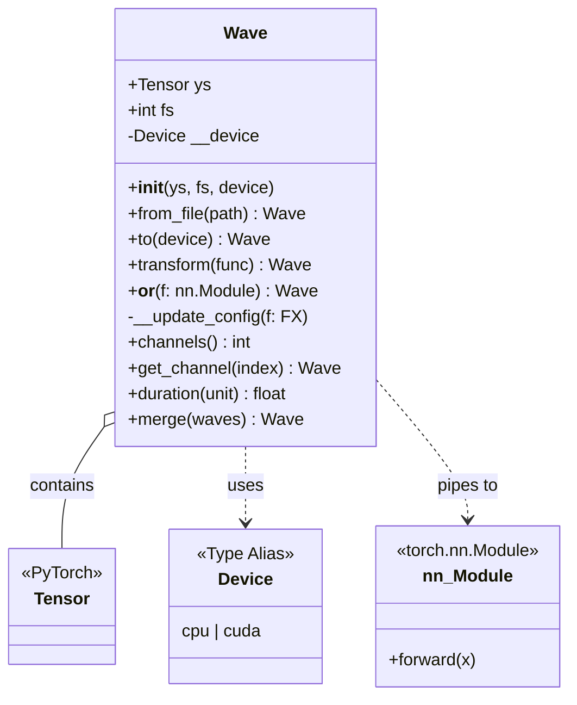
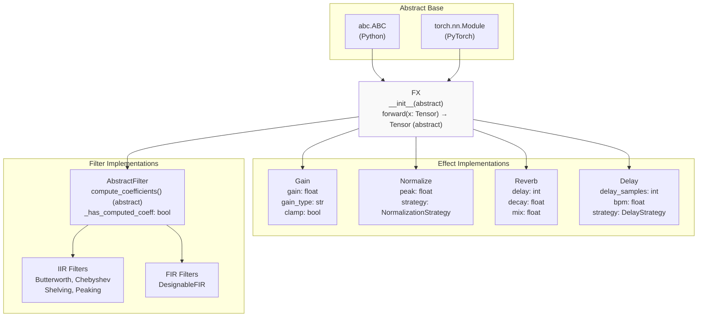
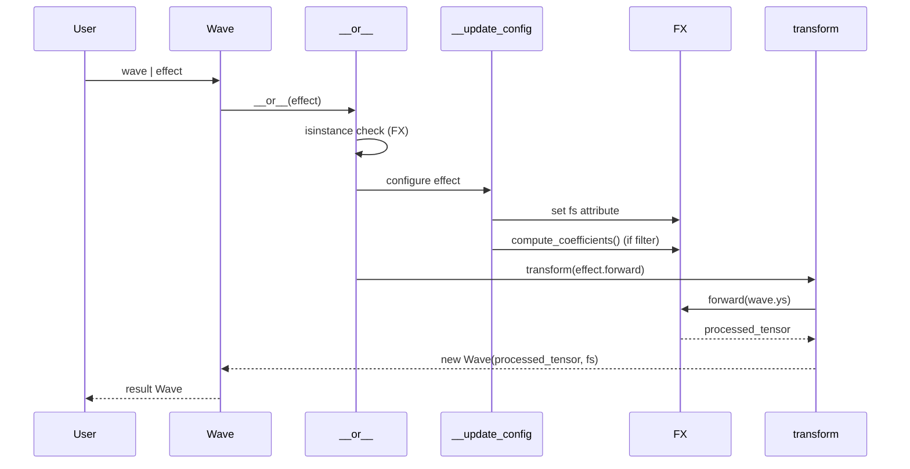
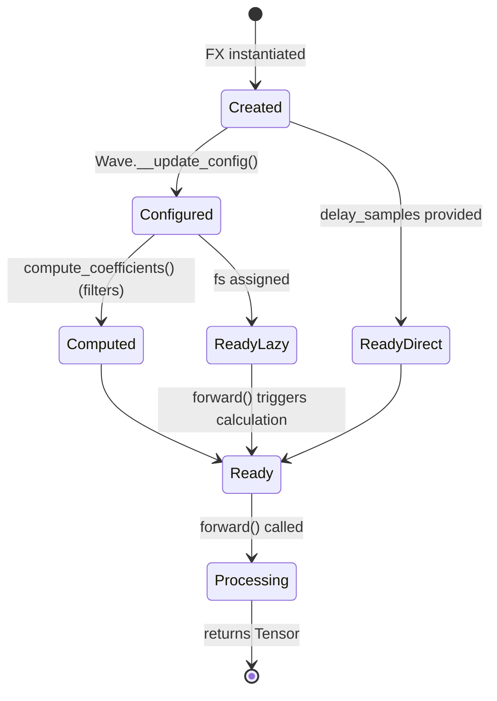

# 2 Core Concepts

# Core Concepts

<details>
<summary>Relevant source files</summary>

The following files were used as context for generating this wiki page:

- [README.md](README.md)
- [examples/series_and_parallel_filters.py](examples/series_and_parallel_filters.py)
- [src/torchfx/effect.py](src/torchfx/effect.py)
- [src/torchfx/wave.py](src/torchfx/wave.py)

</details>


This page explains the fundamental design patterns and architectural concepts in torchfx. It covers the three core abstractions that enable GPU-accelerated audio processing: the `Wave` class for audio data encapsulation, the `FX` base class for processing modules, and the pipeline operator (`|`) for functional composition. For detailed API documentation of specific components, see [Wave Class](#2.1), [FX Base Class](#2.2), and [Pipeline Operator](#2.3). For type definitions used throughout the library, see [Type System](#2.4).

## Architectural Overview

The torchfx library is built on three foundational concepts that work together to provide a PyTorch-native audio processing framework:

| Concept | Purpose | Key Implementation |
|---------|---------|-------------------|
| **Wave** | Audio data container | Encapsulates `Tensor` and sample rate (`fs`) |
| **FX** | Processing abstraction | Abstract base class inheriting from `torch.nn.Module` |
| **Pipeline Operator** | Functional composition | Overloaded `__or__` method enabling `wave \| effect` syntax |

These abstractions enable a declarative programming style while maintaining full compatibility with PyTorch's computational graph and device management.



**Diagram 1: Core Abstractions and Their Relationships**

Sources: [src/torchfx/wave.py:28-44](), [src/torchfx/effect.py:15-29]()

## Wave: The Audio Data Container

The `Wave` class [src/torchfx/wave.py:28-48]() serves as the primary data structure in torchfx. It wraps a PyTorch `Tensor` along with metadata necessary for audio processing.

**Core Attributes:**
- `ys`: A `Tensor` containing audio samples, typically shaped `(channels, samples)`
- `fs`: Integer representing the sampling frequency in Hz
- `device`: Device placement (`"cpu"` or `"cuda"`)

The `Wave` class provides methods for file I/O (`from_file`), device management (`to`), channel manipulation (`get_channel`, `channels`), and functional transformations (`transform`). The critical design decision is the overloading of the `__or__` operator [src/torchfx/wave.py:135-174](), which enables pipeline-style processing.



**Diagram 2: Wave Class Structure and Dependencies**

Sources: [src/torchfx/wave.py:28-292]()

## FX: The Processing Abstraction

The `FX` class [src/torchfx/effect.py:15-29]() is an abstract base class that defines the interface for all audio processing modules in torchfx. It inherits from both `torch.nn.Module` and `abc.ABC`, making it compatible with PyTorch's module system while enforcing implementation requirements.

**Key Design Decisions:**

1. **PyTorch Module Inheritance**: By extending `torch.nn.Module`, all `FX` subclasses can be used in standard PyTorch workflows, including `nn.Sequential`, gradient computation, and device management.

2. **Abstract Interface**: The `forward` method is declared abstract, requiring all implementations to define their processing logic.

3. **Stateless Processing**: Effects operate on tensors directly, maintaining immutability of `Wave` objects.



**Diagram 3: FX Class Hierarchy**

Sources: [src/torchfx/effect.py:15-29](), [src/torchfx/effect.py:32-94](), [src/torchfx/effect.py:97-130](), [src/torchfx/effect.py:263-322](), [src/torchfx/effect.py:494-714]()

### Strategy Pattern for Extensibility

Several effects implement the strategy pattern to allow customizable behavior:

- **Normalize** uses `NormalizationStrategy` [src/torchfx/effect.py:132-139]() with implementations including `PeakNormalizationStrategy`, `RMSNormalizationStrategy`, `PercentileNormalizationStrategy`, and `PerChannelNormalizationStrategy` [src/torchfx/effect.py:152-261]()

- **Delay** uses `DelayStrategy` [src/torchfx/effect.py:325-356]() with `MonoDelayStrategy` and `PingPongDelayStrategy` implementations [src/torchfx/effect.py:359-491]()

This pattern enables users to provide custom strategies while maintaining a consistent interface.

## Pipeline Operator: Functional Composition

The pipeline operator (`|`) is implemented via the `__or__` method [src/torchfx/wave.py:135-174]() and serves as the primary composition mechanism in torchfx.

**Processing Flow:**



**Diagram 4: Pipeline Operator Execution Flow**

Sources: [src/torchfx/wave.py:135-183]()

### Automatic Configuration

The `__update_config` method [src/torchfx/wave.py:176-183]() performs automatic configuration when piping a `Wave` to an `FX`:

1. **Sample Rate Propagation**: If the effect has an `fs` attribute set to `None`, it is automatically assigned the `Wave`'s sample rate. This is crucial for BPM-synced effects like `Delay` [src/torchfx/effect.py:590-625]().

2. **Filter Coefficient Computation**: For `AbstractFilter` instances, if coefficients haven't been computed (`_has_computed_coeff == False`), the `compute_coefficients()` method is called automatically [src/torchfx/wave.py:181-182]().

This lazy initialization pattern allows effects to be instantiated without knowing the sample rate, deferring computation until the pipeline is executed.

### Chaining and Sequential Processing

The pipeline operator returns a new `Wave` object [src/torchfx/wave.py:174](), enabling method chaining:

```python
result = (
    wave 
    | filter1  # Returns new Wave
    | filter2  # Operates on previous result
    | effect   # Returns final Wave
)
```

The operator also supports `nn.Sequential` and `nn.ModuleList` [src/torchfx/wave.py:169-172](), iterating through contained modules and configuring each `FX` instance.

**Example from codebase:**

[examples/series_and_parallel_filters.py:16-20]() demonstrates series and parallel composition:
- Series: `signal | fx.filter.LoButterworth(100, order=2) | ...`
- Parallel: `fx.filter.HiButterworth(2000, order=2) + fx.filter.HiChebyshev1(2000, order=2)`

Sources: [examples/series_and_parallel_filters.py:1-22]()

## Design Principles

### Immutability

The `transform` method [src/torchfx/wave.py:88-107]() creates a new `Wave` instance rather than modifying the existing object. This immutability ensures that pipeline operations don't have side effects and supports functional programming patterns.

### Device-Aware Processing

The `Wave.to(device)` method [src/torchfx/wave.py:65-86]() manages device placement of the underlying tensor. Effects inherit device placement from their input tensors through PyTorch's automatic device propagation in `forward` methods.

### Integration with PyTorch Ecosystem

By inheriting from `torch.nn.Module`, `FX` subclasses can:
- Be used in `torch.nn.Sequential` containers
- Participate in gradient computation (though most effects use `@torch.no_grad()`)
- Leverage PyTorch's device management
- Be serialized using `torch.save` and `torch.load`

### Type Safety and Configuration

Effects that require sample rate information (like `Delay` with BPM synchronization) defer their full initialization until they receive the sample rate from the `Wave` object. The `_needs_calculation` flag [src/torchfx/effect.py:611-625]() tracks whether deferred initialization is required.



**Diagram 5: Effect Lifecycle and Configuration States**

Sources: [src/torchfx/wave.py:176-183](), [src/torchfx/effect.py:590-704]()

## Integration Points

The core concepts integrate with broader torchfx systems:

- **Filters** extend `FX` through `AbstractFilter`, adding coefficient computation [src/torchfx/filter/__base.py]()
- **Type System** provides type aliases like `Device`, `Second`, `Millisecond` and `MusicalTime` for BPM-synced effects [src/torchfx/typing.py]()
- **File I/O** uses `torchaudio.load` for reading audio files [src/torchfx/wave.py:132-133]()

For implementation details of specific effects and filters, see [Effects](#3) and [Filters](#4). For advanced usage patterns including multi-channel processing and GPU acceleration, see [Advanced Usage](#5).

---

Sources: [src/torchfx/wave.py:1-292](), [src/torchfx/effect.py:1-714](), [README.md:1-92](), [examples/series_and_parallel_filters.py:1-22]()