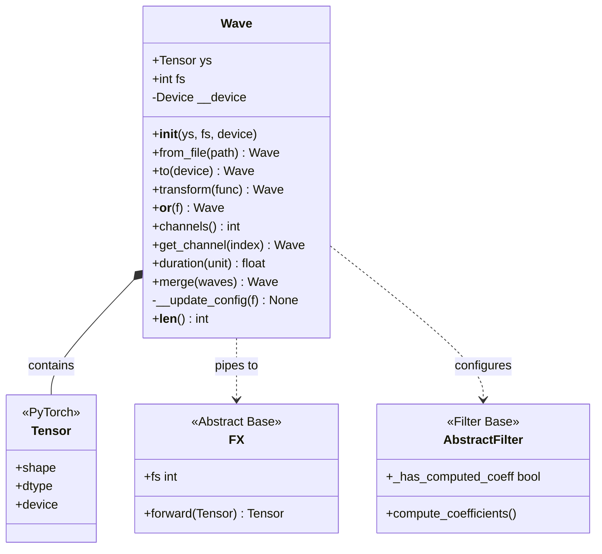
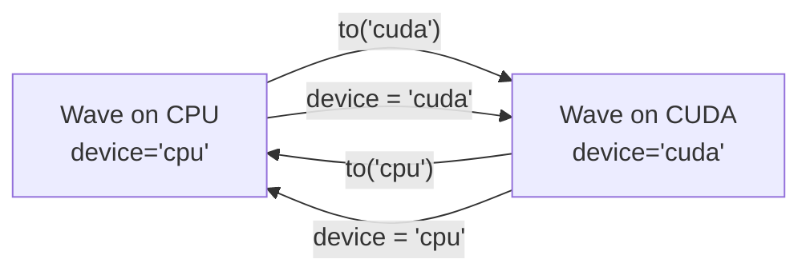
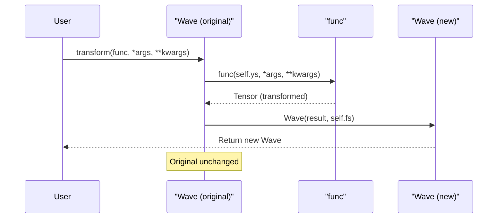
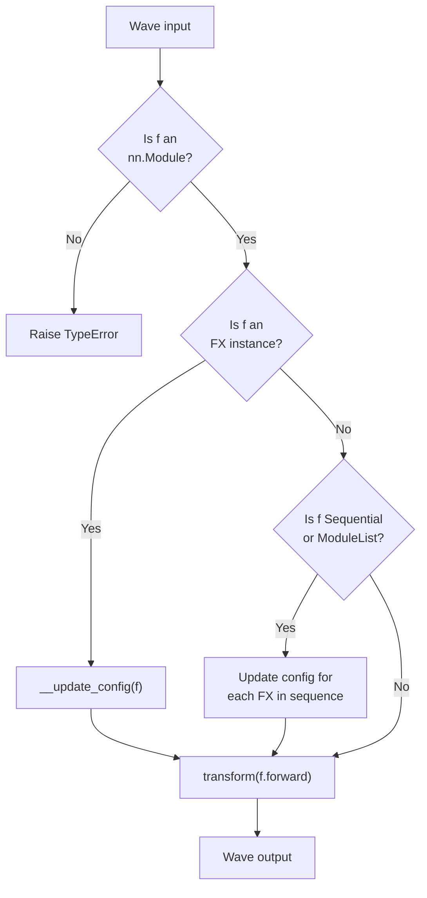
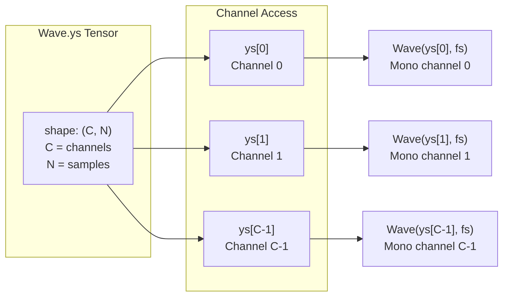
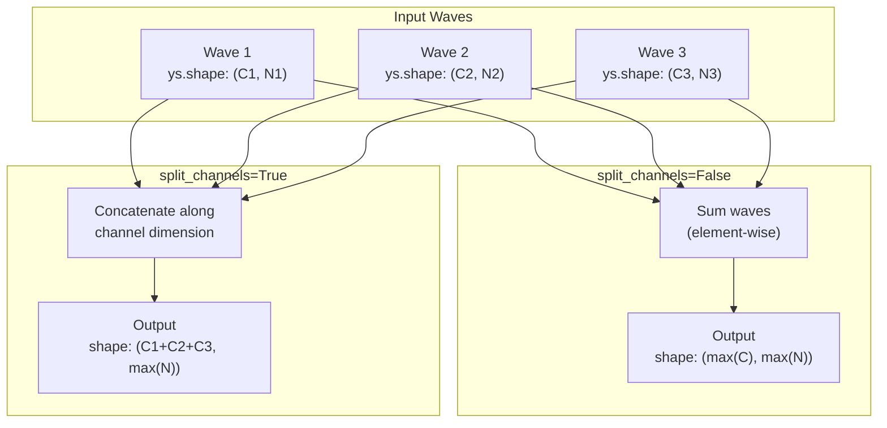

# 2.1 Wave Class

# Wave Class

<details>
<summary>Relevant source files</summary>

The following files were used as context for generating this wiki page:

- [README.md](README.md)
- [examples/series_and_parallel_filters.py](examples/series_and_parallel_filters.py)
- [src/torchfx/wave.py](src/torchfx/wave.py)

</details>


## Purpose and Scope

This document provides a comprehensive technical reference for the `Wave` class, which is the core data container for audio signals in torchfx. The Wave class encapsulates a PyTorch tensor representing audio samples (`ys`) along with its sampling frequency (`fs`), providing methods for device management, file I/O, transformation, and pipeline composition.

For information about applying effects and filters to Wave objects, see [FX Base Class](#2.2) and [Pipeline Operator](#2.3). For device-specific performance considerations, see [GPU Acceleration](#5.2).

**Sources:** [src/torchfx/wave.py:1-11](), [README.md:1-92]()

---

## Core Architecture

The Wave class serves as a wrapper around PyTorch tensors that represent discrete-time audio signals. Audio data is stored as a 2D tensor where the first dimension represents channels and the second dimension represents time (samples).

### Class Structure Diagram



**Sources:** [src/torchfx/wave.py:28-292]()

---

## Construction and Initialization

### Basic Initialization

The Wave class can be instantiated directly from array-like data:

| Parameter | Type | Description |
|-----------|------|-------------|
| `ys` | `ArrayLike` | Audio signal data (will be converted to Tensor) |
| `fs` | `int` | Sampling frequency in Hz |
| `device` | `Device` | Target device ("cpu" or "cuda"), default is "cpu" |

**Implementation:** [src/torchfx/wave.py:44-47]()

The constructor converts the input data to a PyTorch Tensor and immediately moves it to the specified device.

### Loading from Audio Files

The `from_file` classmethod provides audio file loading via torchaudio:

```python
Wave.from_file(path: str | Path, *args, **kwargs) -> Wave
```

This method delegates to `torchaudio.load()`, which automatically detects the audio format and returns both the waveform tensor and sampling rate.

**Implementation:** [src/torchfx/wave.py:109-133]()

**Example Usage:** [README.md:42](), [examples/series_and_parallel_filters.py:13]()

**Sources:** [src/torchfx/wave.py:44-133](), [README.md:36-50]()

---

## Core Attributes

### Tensor and Sampling Frequency

| Attribute | Type | Description |
|-----------|------|-------------|
| `ys` | `Tensor` | 2D tensor with shape `(channels, samples)` |
| `fs` | `int` | Sampling frequency in samples per second (Hz) |
| `device` | `Device` | Current device location (read-only property) |

The `ys` tensor follows the convention where:
- First dimension (axis 0): Channel index
- Second dimension (axis 1): Time samples

**Sources:** [src/torchfx/wave.py:32-42]()

---

## Device Management

### Device Property and Movement

The Wave class provides both a property-based interface and an explicit method for device management:



### to() Method

**Signature:** [src/torchfx/wave.py:65-86]()

```python
def to(self, device: Device) -> Self
```

Moves the Wave object to the specified device and returns `self` for method chaining. The internal tensor (`ys`) is transferred using PyTorch's tensor movement mechanism.

### device Property

**Implementation:** [src/torchfx/wave.py:49-63]()

The `device` property provides read access to the current device location. When assigned to, it calls `to()` internally, providing a more Pythonic interface:

```python
wave.device = "cuda"  # Equivalent to wave.to("cuda")
```

**Sources:** [src/torchfx/wave.py:49-86](), [examples/series_and_parallel_filters.py:14]()

---

## Transformation Methods

### Generic Transformation

The `transform` method applies arbitrary functions to the audio tensor:

**Signature:** [src/torchfx/wave.py:88-107]()

```python
def transform(self, func: Callable[..., Tensor], *args, **kwargs) -> Wave
```

This method:
1. Applies `func` to `self.ys` with optional arguments
2. Creates a new Wave object with the result
3. Preserves the original sampling frequency

The original Wave object remains unchanged (immutable transformation pattern).

### Transformation Flow Diagram



**Sources:** [src/torchfx/wave.py:88-107]()

---

## Pipeline Operator Implementation

### The `__or__` Method

The pipe operator (`|`) is implemented via `__or__` and enables functional chaining of PyTorch modules:

**Implementation:** [src/torchfx/wave.py:135-174]()

```python
def __or__(self, f: nn.Module) -> Wave
```

### Pipeline Processing Flow



### Automatic Configuration

The `__update_config` private method [src/torchfx/wave.py:176-182]() handles two critical setup tasks:

1. **Sampling Frequency Injection:** If the module is an `FX` subclass with `fs=None`, sets `f.fs = self.fs`
2. **Filter Coefficient Computation:** For `AbstractFilter` instances, triggers `compute_coefficients()` if not already computed

| Module Type | Configuration Action |
|-------------|---------------------|
| `FX` with `fs=None` | Set `fs` from Wave |
| `AbstractFilter` (not computed) | Call `compute_coefficients()` |
| `nn.Sequential` / `nn.ModuleList` | Recurse through elements |
| Generic `nn.Module` | No configuration |

**Sources:** [src/torchfx/wave.py:135-182](), [README.md:40-50](), [examples/series_and_parallel_filters.py:16-20]()

---

## Channel Operations

### Channel Count and Access

The Wave class provides methods for multi-channel audio handling:

#### channels() Method

**Implementation:** [src/torchfx/wave.py:188-197]()

```python
def channels(self) -> int
```

Returns the number of channels by reading `self.ys.shape[0]`.

#### get_channel() Method

**Implementation:** [src/torchfx/wave.py:199-218]()

```python
def get_channel(self, index: int) -> Wave
```

Extracts a single channel by index, returning a new Wave object containing only `self.ys[index]` with the same sampling frequency.

### Channel Organization



**Sources:** [src/torchfx/wave.py:188-218]()

---

## Utility Methods

### Length and Duration

#### __len__() Method

**Implementation:** [src/torchfx/wave.py:184-186]()

Returns the number of samples: `self.ys.shape[1]`

#### duration() Method

**Implementation:** [src/torchfx/wave.py:220-242]()

```python
def duration(self, unit: Literal["sec", "ms"]) -> Second | Millisecond
```

Computes duration using the formula: `length / fs * multiplier`

| Unit | Multiplier | Return Type |
|------|-----------|-------------|
| "sec" | 1 | `Second` (float) |
| "ms" | 1000 | `Millisecond` (float) |

**Sources:** [src/torchfx/wave.py:184-242]()

---

## Wave Merging

### merge() Class Method

**Implementation:** [src/torchfx/wave.py:244-291]()

```python
@classmethod
def merge(cls, waves: Sequence[Wave], split_channels: bool = False) -> Wave
```

Combines multiple Wave objects into a single Wave with two merging strategies:

### Merge Strategies

| Parameter | Behavior | Result |
|-----------|----------|--------|
| `split_channels=False` | Sum waves element-wise | Mixed (mono output if all mono) |
| `split_channels=True` | Concatenate along channel axis | Multi-channel (C1 + C2 + ... channels) |

### Merge Strategy Diagram



### Validation Rules

The method enforces the following constraints:
1. At least one wave must be provided (raises `ValueError` if empty)
2. All waves must have identical sampling frequencies (raises `ValueError` on mismatch)

**Implementation Details:** [src/torchfx/wave.py:269-291]()

**Sources:** [src/torchfx/wave.py:244-291]()

---

## Type System Integration

The Wave class integrates with the torchfx type system defined in the `typing` module:

| Type Alias | Purpose | Used In |
|------------|---------|---------|
| `Device` | "cpu" or "cuda" literal | Device management |
| `Second` | Float representing seconds | Duration calculations |
| `Millisecond` | Float representing milliseconds | Duration calculations |

**Import Location:** [src/torchfx/wave.py:25]()

For complete type system documentation, see [Type System](#2.4).

**Sources:** [src/torchfx/wave.py:13-25]()

---

## Usage Patterns

### Complete Processing Pipeline Example

The following pattern demonstrates typical Wave usage incorporating device management, pipeline composition, and file I/O:

```python
# Pattern from examples/series_and_parallel_filters.py:13-22
signal = fx.Wave.from_file("sample_input.wav")
signal = signal.to("cuda" if torch.cuda.is_available() else "cpu")

result = (signal
    | fx.filter.LoButterworth(100, order=2)
    | fx.filter.HiButterworth(2000, order=2) + fx.filter.HiChebyshev1(2000, order=2)
    | T.Vol(0.5)
)

torchaudio.save("examples/out.wav", result.ys.cpu(), signal.fs)
```

### Key Pattern Elements

1. **File Loading:** `Wave.from_file()` handles format detection
2. **Device Transfer:** Conditional GPU usage with fallback to CPU
3. **Pipeline Chaining:** `|` operator for serial processing
4. **Filter Combination:** `+` operator for parallel filter combination (see [Parallel Filter Combination](#4.3))
5. **Result Extraction:** Access `result.ys.cpu()` for saving, preserving `signal.fs`

**Sources:** [examples/series_and_parallel_filters.py:1-22](), [README.md:36-50]()

---

## Summary Table

| Feature | Methods/Attributes | Key Characteristics |
|---------|-------------------|---------------------|
| Construction | `__init__`, `from_file` | Converts to Tensor, loads audio files |
| Attributes | `ys`, `fs`, `device` | Tensor data, sampling rate, device location |
| Device Management | `to()`, `device` property | Explicit and property-based movement |
| Transformation | `transform()` | Immutable functional transformations |
| Pipeline | `__or__()` | Pipe operator with automatic configuration |
| Channels | `channels()`, `get_channel()` | Multi-channel access and extraction |
| Utility | `__len__()`, `duration()`, `merge()` | Length queries, duration, wave combining |

**Sources:** [src/torchfx/wave.py:28-292]()