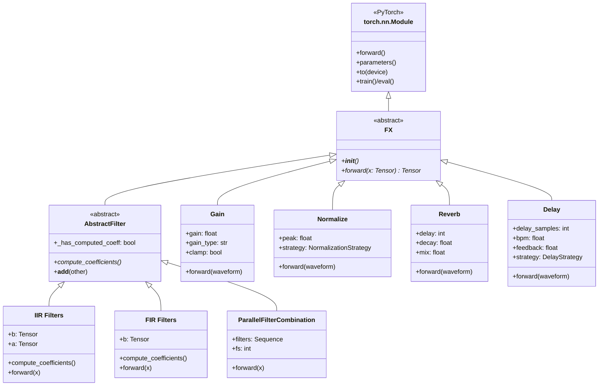
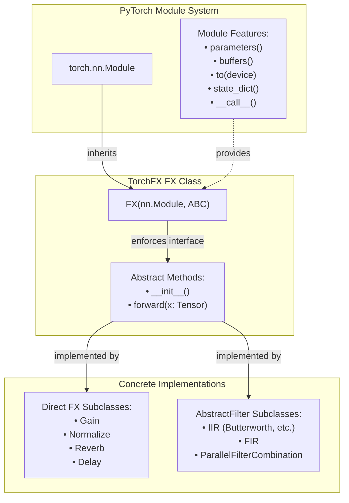
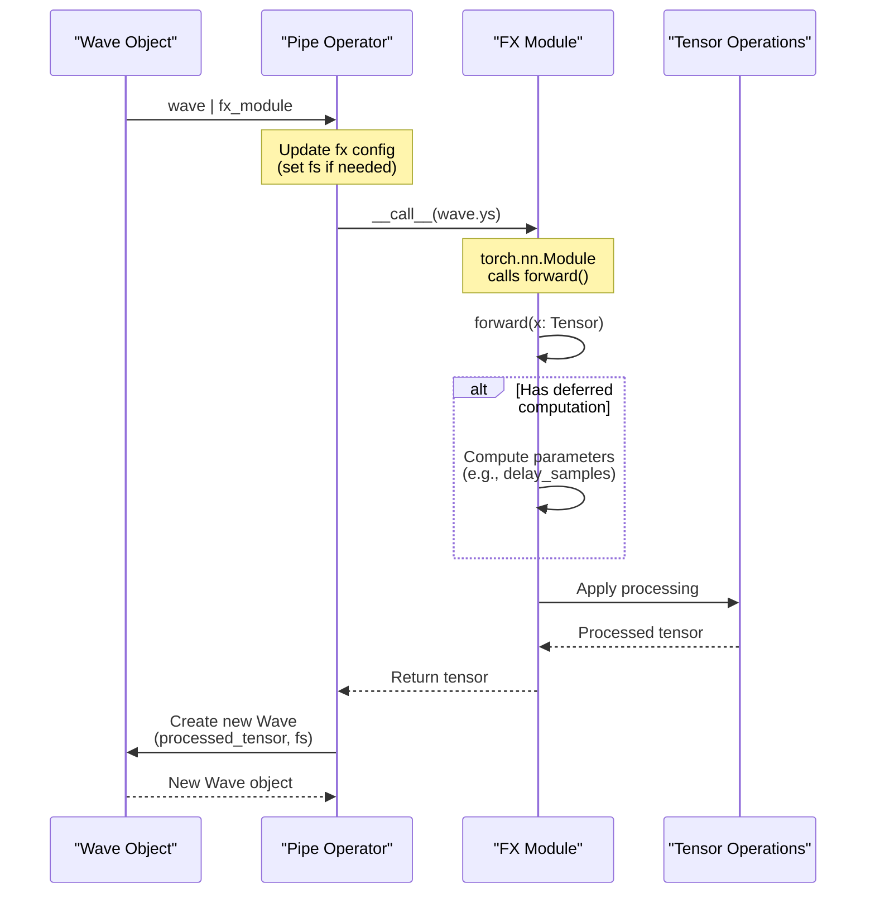

# 2.2 FX Base Class

# FX Base Class

<details>
<summary>Relevant source files</summary>

The following files were used as context for generating this wiki page:

- [src/torchfx/effect.py](src/torchfx/effect.py)
- [src/torchfx/filter/__base.py](src/torchfx/filter/__base.py)

</details>


This document describes the `FX` abstract base class, which serves as the foundation for all audio processing modules in torchfx. It defines the core interface that all effects and filters must implement, enabling seamless integration with PyTorch's module system and the pipeline operator.

For details about the Wave class that provides audio data to FX modules, see [Wave Class](#2.1). For information about chaining FX modules using the pipe operator, see [Pipeline Operator](#2.3). For guidance on implementing custom effects and filters, see [Creating Custom Effects](#3.5) and [Creating Custom Filters](#4.4).

## Class Definition and Purpose

The `FX` class is an abstract base class defined in [src/torchfx/effect.py:15-29]() that inherits from both `torch.nn.Module` and `abc.ABC`. It establishes the interface contract that all audio processors in torchfx must satisfy.

```python
class FX(nn.Module, abc.ABC):
    """Abstract base class for all effects."""
    
    @abc.abstractmethod
    def __init__(self, *args, **kwargs) -> None:
        super().__init__(*args, **kwargs)
    
    @abc.abstractmethod
    def forward(self, x: Tensor) -> Tensor: ...
```

**Key characteristics:**
- **Abstract Base Class**: Cannot be instantiated directly; must be subclassed
- **PyTorch Module**: Inherits from `torch.nn.Module`, providing access to PyTorch's module system
- **Simple Interface**: Requires only two methods (`__init__` and `forward`)
- **Type Safety**: The `forward` method signature is strictly typed as `Tensor -> Tensor`

**Sources:** [src/torchfx/effect.py:15-29]()

## Class Hierarchy

The following diagram shows how `FX` sits at the root of torchfx's processing hierarchy and its two main inheritance paths:



**Sources:** [src/torchfx/effect.py:15-29](), [src/torchfx/filter/__base.py:11-41](), [src/torchfx/effect.py:32-715]()

## Abstract Method Requirements

All subclasses of `FX` must implement two abstract methods:

### `__init__` Method

The constructor must call `super().__init__()` to properly initialize the `torch.nn.Module` base class. This ensures that PyTorch's parameter registration and device management work correctly.

**Implementation pattern:**
```python
def __init__(self, param1: type1, param2: type2, ...) -> None:
    super().__init__()
    self.param1 = param1
    self.param2 = param2
    # Additional initialization
```

**Sources:** [src/torchfx/effect.py:24-25]()

### `forward` Method

The `forward` method defines the audio processing operation. It receives a tensor containing audio samples and returns a processed tensor.

**Signature:**
```python
def forward(self, x: Tensor) -> Tensor:
    """Process audio tensor.
    
    Args:
        x: Audio tensor of shape (..., time) or (channels, time)
    
    Returns:
        Processed audio tensor with same or extended shape
    """
```

**Important characteristics:**
- **Input shape**: `(..., time)` or `(channels, time)` where the last dimension is time
- **Output shape**: Same as input, or extended if the effect adds samples (e.g., delay echoes)
- **Device handling**: Operations should work on both CPU and CUDA tensors
- **No gradient computation**: Most effects use `@torch.no_grad()` decorator since they are signal processing operations, not learnable transformations

**Sources:** [src/torchfx/effect.py:28-29](), [src/torchfx/effect.py:73-94]()

## Integration with PyTorch Module System

By inheriting from `torch.nn.Module`, `FX` subclasses gain access to PyTorch's module infrastructure:

| PyTorch Feature | How FX Uses It | Example |
|-----------------|----------------|---------|
| **Device Management** | Move effects to GPU/CPU | `effect.to("cuda")` |
| **Parameter Registration** | Store learnable/non-learnable parameters | Filters store coefficients as buffers |
| **Module Composition** | Chain effects with `nn.Sequential` | `nn.Sequential(effect1, effect2)` |
| **State Dict** | Save/load effect configurations | `torch.save(effect.state_dict(), path)` |
| **Training/Eval Modes** | Switch between modes (though most effects don't differentiate) | `effect.eval()` |
| **Callable Interface** | Call effects as functions | `output = effect(input)` |

The following diagram illustrates the integration:



**Sources:** [src/torchfx/effect.py:15-29]()

## Inheritance Patterns

There are two primary patterns for inheriting from `FX`:

### Pattern 1: Direct FX Inheritance (Effects)

Effects that perform time-domain transformations typically inherit directly from `FX`. These include amplitude modifications, delay-based effects, and other signal processing operations that don't require filter coefficient computation.

**Examples:**
- `Gain` [src/torchfx/effect.py:32-94](): Amplitude/dB/power gain with optional clamping
- `Normalize` [src/torchfx/effect.py:97-130](): Peak, RMS, or percentile normalization using strategy pattern
- `Reverb` [src/torchfx/effect.py:263-322](): Feedback delay network
- `Delay` [src/torchfx/effect.py:494-714](): BPM-synced delay with multiple taps and strategies

**Common structure:**
```python
class Effect(FX):
    def __init__(self, param1, param2, ...):
        super().__init__()
        self.param1 = param1
        self.param2 = param2
    
    @torch.no_grad()
    def forward(self, waveform: Tensor) -> Tensor:
        # Direct tensor operations
        processed = # ... processing logic
        return processed
```

**Sources:** [src/torchfx/effect.py:32-714]()

### Pattern 2: AbstractFilter Inheritance (Filters)

Filters that require coefficient computation inherit from `AbstractFilter`, which extends `FX` with additional methods for filter design.

**Key additions in AbstractFilter:**
- `compute_coefficients()`: Abstract method for calculating filter coefficients
- `_has_computed_coeff`: Property to check if coefficients are computed
- `__add__()` and `__radd__()`: Operator overloading for parallel filter combination

**Structure:**
```python
class AbstractFilter(FX, abc.ABC):
    @property
    def _has_computed_coeff(self) -> bool:
        # Check if b and a coefficients exist
        ...
    
    @abc.abstractmethod
    def compute_coefficients(self) -> None:
        """Compute filter coefficients (b, a)."""
        pass
    
    def __add__(self, other):
        return ParallelFilterCombination(self, other)
```

**Sources:** [src/torchfx/filter/__base.py:11-41]()

## Configuration Management

FX modules may require configuration from the Wave object they process. This is handled through a configuration update mechanism implemented in the Wave class.

### Automatic Configuration from Wave

When an FX module is applied to a Wave object using the pipe operator, the Wave automatically sets the `fs` (sample rate) attribute if the effect has one:

**Example: Delay with BPM synchronization**

The `Delay` effect can defer calculation of `delay_samples` until it receives `fs` from a Wave:

```python
# Delay initialized without fs
delay = Delay(bpm=120, delay_time="1/8")  # fs not provided

# When used with Wave, fs is automatically configured
wave = Wave.from_file("audio.wav")  # fs=44100 from file
result = wave | delay  # delay.fs is automatically set to 44100
```

**Configuration attributes commonly used:**
- `fs`: Sample frequency (required by BPM-synced effects and filters)
- `bpm`: Beats per minute (for musical time synchronization)
- `delay_time`: Musical time division (for BPM-synced delays)

**Sources:** [src/torchfx/effect.py:590-626]()

## Forward Method Data Flow

The following sequence diagram shows how data flows through an FX module's `forward` method:



**Sources:** [src/torchfx/effect.py:73-714](), [src/torchfx/wave.py]() (referenced from context)

## Special Considerations

### Device Compatibility

FX modules must ensure their operations work correctly regardless of device (CPU or CUDA):

```python
@torch.no_grad()
def forward(self, waveform: Tensor) -> Tensor:
    # Operations automatically use the input tensor's device
    result = torch.zeros_like(waveform)  # Inherits device from waveform
    # ... processing
    return result
```

**Sources:** [src/torchfx/effect.py:73-94]()

### Gradient Computation

Most FX effects use the `@torch.no_grad()` decorator because they implement fixed signal processing algorithms rather than learnable transformations. However, this is not enforced by the FX base class, allowing for learnable effects if needed.

**Sources:** [src/torchfx/effect.py:73](), [src/torchfx/effect.py:127](), [src/torchfx/effect.py:308]()

### Operator Overloading

Only `AbstractFilter` subclasses support the `+` operator for parallel combination. Direct `FX` subclasses do not have this capability:

```python
# Valid for filters
combined = lowpass_filter + highpass_filter

# Not valid for direct FX effects
# combined = gain + reverb  # This would fail
```

**Sources:** [src/torchfx/filter/__base.py:34-40]()

## Relationship to Other Core Concepts

The FX base class integrates with other core torchfx concepts:

| Concept | Relationship | Page Reference |
|---------|-------------|----------------|
| **Wave** | FX modules process Wave.ys tensors; Wave configures FX modules | [Wave Class](#2.1) |
| **Pipeline Operator** | The `\|` operator chains FX modules by calling their `forward` methods | [Pipeline Operator](#2.3) |
| **MusicalTime** | Used by effects like Delay for BPM synchronization | [Type System](#2.4) |
| **Effects** | Direct implementations of FX for time-domain processing | [Effects](#3) |
| **Filters** | Inherit from AbstractFilter (which extends FX) for frequency-domain processing | [Filters](#4) |

**Sources:** [src/torchfx/effect.py:15-29](), [src/torchfx/filter/__base.py:11-41]()