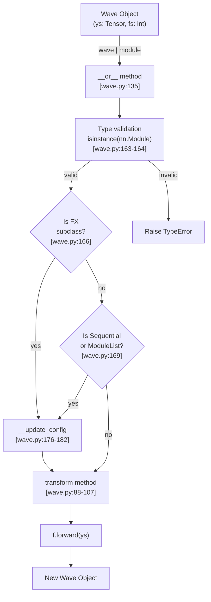
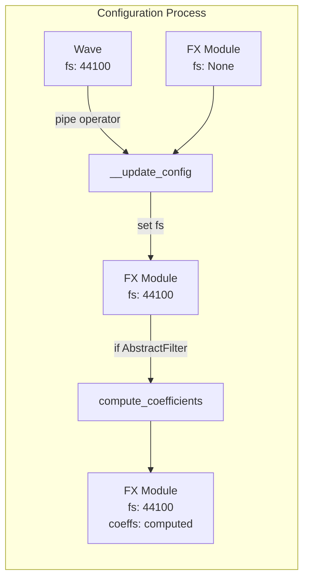
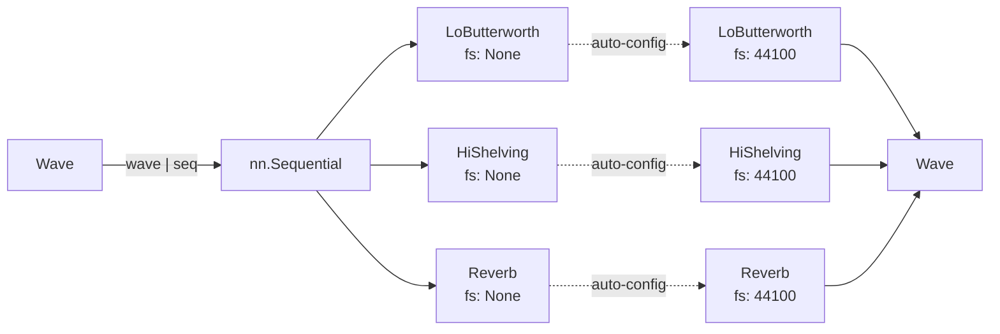
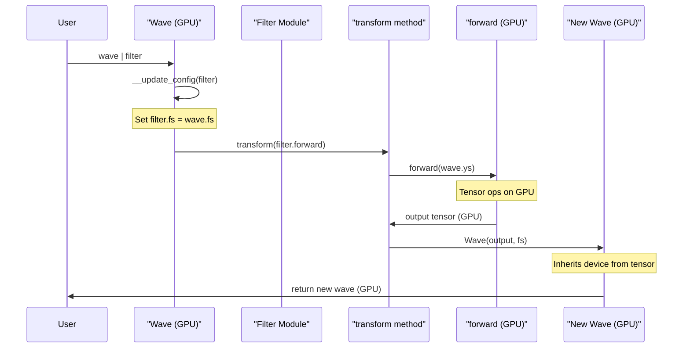

# 2.3 Pipeline Operator

# Pipeline Operator

<details>
<summary>Relevant source files</summary>

The following files were used as context for generating this wiki page:

- [README.md](README.md)
- [examples/series_and_parallel_filters.py](examples/series_and_parallel_filters.py)
- [src/torchfx/wave.py](src/torchfx/wave.py)

</details>


The pipeline operator (`|`) is the primary interface for chaining audio processing operations in torchfx. It allows functional composition of filters and effects in a readable, left-to-right syntax while automatically handling configuration details like sampling frequency propagation and filter coefficient computation.

For information about the Wave class that implements the pipeline operator, see [Wave Class](#2.1). For details on the FX base class that defines compatible modules, see [FX Base Class](#2.2).

## Purpose and Scope

The pipeline operator provides:
- **Functional chaining** of audio processing modules using `wave | module` syntax
- **Automatic configuration** by propagating sampling frequency to filters and effects
- **Lazy coefficient computation** for filters when first applied
- **Immutable transformations** by returning new Wave objects
- **Type safety** by validating module compatibility

## Operator Syntax

The pipeline operator is implemented through Python's bitwise OR operator (`|`) overload on the Wave class. It enables left-to-right chaining of processing modules:

```python
result = wave | filter1 | filter2 | effect
```

This is equivalent to nested function calls but significantly more readable:

```python
result = wave.transform(effect.forward).transform(filter2.forward).transform(filter1.forward)
```

**Example from Usage**:
```python
filtered_out = (
    fx.Wave.from_file("path_to_audio.wav")
    | fx.filter.LoButterworth(8000)
    | fx.filter.HiShelving(2000)
    | fx.effect.Reverb()
)
```

Sources: [README.md:41-46](), [src/torchfx/wave.py:135-174]()

## Implementation Overview



**Diagram: Pipeline Operator Execution Flow**

The `__or__` method follows this sequence:

1. **Type validation**: Ensures the right operand is an `nn.Module` [src/torchfx/wave.py:163-164]()
2. **Configuration update**: If the module is an `FX` subclass, propagate configuration [src/torchfx/wave.py:166-172]()
3. **Transformation**: Apply the module's forward method via `transform` [src/torchfx/wave.py:174]()
4. **Wave construction**: Return a new Wave with transformed audio and original sampling rate

Sources: [src/torchfx/wave.py:135-174]()

## Automatic Configuration

One of the key features of the pipeline operator is automatic configuration of processing modules. When a module is applied through the pipe operator, the Wave object automatically configures it with the appropriate parameters.



**Diagram: Automatic Configuration Process**

### Sampling Frequency Propagation

The `__update_config` method [src/torchfx/wave.py:176-179]() checks if the module has an `fs` attribute set to `None` and automatically assigns the Wave's sampling frequency:

```python
if hasattr(f, "fs") and f.fs is None:
    f.fs = self.fs
```

This eliminates the need for manual configuration when instantiating filters and effects.

### Coefficient Computation

For `AbstractFilter` subclasses, the pipeline operator triggers automatic coefficient computation if not already performed [src/torchfx/wave.py:181-182]():

```python
if isinstance(f, AbstractFilter) and not f._has_computed_coeff:
    f.compute_coefficients()
```

This lazy computation pattern ensures coefficients are calculated only when needed, using the correct sampling frequency.

Sources: [src/torchfx/wave.py:176-183]()

## Module Compatibility

The pipeline operator accepts any `torch.nn.Module` that implements a `forward` method with compatible signature. The following table shows common module types and their compatibility:

| Module Type | Compatibility | Automatic Configuration | Notes |
|-------------|--------------|------------------------|-------|
| `FX` subclass | ✓ Full | ✓ fs propagation | All built-in effects and filters |
| `AbstractFilter` | ✓ Full | ✓ fs + coefficient computation | IIR and FIR filters |
| `nn.Sequential` | ✓ Full | ✓ Recursive | Configures each contained FX module |
| `nn.ModuleList` | ✓ Full | ✓ Recursive | Configures each contained FX module |
| Generic `nn.Module` | ✓ Partial | ✗ None | Must accept and return Tensor |
| `torchaudio.transforms` | ✓ Partial | ✗ None | Example: `Vol`, `Fade` |

**Type Validation**: Non-Module objects raise a `TypeError` [src/torchfx/wave.py:163-164]():

```python
if not isinstance(f, nn.Module):
    raise TypeError(f"Expected nn.Module, but got {type(f).__name__} instead.")
```

Sources: [src/torchfx/wave.py:135-174]()

## Sequential Processing

The pipeline operator supports composite modules like `nn.Sequential` and `nn.ModuleList`, automatically configuring each contained FX module [src/torchfx/wave.py:169-172]():

```python
elif isinstance(f, (nn.Sequential | nn.ModuleList)):
    for a in f:
        if isinstance(a, FX):
            self.__update_config(a)
```

This enables complex processing chains to be packaged as a single module:

```python
# Create a reusable processing chain
processing_chain = nn.Sequential(
    fx.filter.LoButterworth(8000),
    fx.filter.HiShelving(2000),
    fx.effect.Reverb()
)

# Apply the entire chain with the pipe operator
result = wave | processing_chain
```



**Diagram: Sequential Module Processing with Auto-Configuration**

Sources: [src/torchfx/wave.py:169-172](), [README.md:151-152]()

## Immutable Transformation Pattern

The pipeline operator returns a new Wave object rather than modifying the original, implementing an immutable transformation pattern. This is achieved through the `transform` method [src/torchfx/wave.py:88-107]():

```python
def transform(self, func: Callable[..., Tensor], *args, **kwargs) -> "Wave":
    return Wave(func(self.ys, *args, **kwargs), self.fs)
```

The `__or__` method calls `transform` with the module's forward function [src/torchfx/wave.py:174]():

```python
return self.transform(f.forward)
```

**Immutability Benefits**:
- **Safe reuse**: Original Wave can be reused in multiple pipelines
- **Debugging**: Intermediate results can be inspected without side effects
- **Branching**: Multiple processing paths can diverge from the same source

**Example**:
```python
# Original wave is preserved
original = fx.Wave.from_file("audio.wav")

# Create multiple processing paths
path_a = original | fx.filter.LoButterworth(100)
path_b = original | fx.filter.HiButterworth(2000)

# original is unchanged and can be reused
path_c = original | fx.effect.Reverb()
```

Sources: [src/torchfx/wave.py:88-107](), [src/torchfx/wave.py:174]()

## Device Handling

The pipeline operator preserves device placement throughout the processing chain. The Wave's device is maintained when creating new Wave objects through the `transform` method:



**Diagram: Device Preservation Through Pipeline**

The transform method constructs the new Wave with the output tensor, which automatically preserves the device [src/torchfx/wave.py:107]():

```python
return Wave(func(self.ys, *args, **kwargs), self.fs)
```

**Device Management Example**:
```python
# Load and move to GPU
wave = fx.Wave.from_file("audio.wav").to("cuda")

# Pipeline operations maintain GPU placement
result = wave | fx.filter.LoButterworth(100) | fx.effect.Reverb()

# result.ys is still on CUDA
assert result.ys.device.type == "cuda"
```

Sources: [src/torchfx/wave.py:88-107](), [examples/series_and_parallel_filters.py:14]()

## Practical Example

The following example demonstrates the pipeline operator in a complete audio processing workflow:

```python
import torchfx as fx
import torch

# Load audio and move to appropriate device
signal = fx.Wave.from_file("sample_input.wav")
signal = signal.to("cuda" if torch.cuda.is_available() else "cpu")

# Create processing pipeline with automatic configuration
result = (signal
    | fx.filter.LoButterworth(100, order=2)        # Auto-configured with fs
    | fx.filter.HiButterworth(2000, order=2)       # Coefficients computed
    | fx.effect.Reverb()                            # fs propagated
)

# Save result
torchaudio.save("output.wav", result.ys.cpu(), signal.fs)
```

This example from [examples/series_and_parallel_filters.py:16-20]() shows:
- Device management with `to("cuda")`
- Multiple filters chained with the pipe operator
- Automatic sampling frequency propagation to all modules
- Preservation of sampling rate in the result

Sources: [examples/series_and_parallel_filters.py:13-20]()

## Code Entity Reference

The following table maps natural language concepts to specific code entities:

| Concept | Code Entity | Location |
|---------|-------------|----------|
| Pipeline operator | `Wave.__or__` | [src/torchfx/wave.py:135-174]() |
| Automatic configuration | `Wave.__update_config` | [src/torchfx/wave.py:176-183]() |
| Transformation application | `Wave.transform` | [src/torchfx/wave.py:88-107]() |
| Sampling frequency attribute | `FX.fs` | [src/torchfx/effect.py]() |
| Coefficient computation flag | `AbstractFilter._has_computed_coeff` | [src/torchfx/filter/__base.py]() |
| Coefficient computation | `AbstractFilter.compute_coefficients` | [src/torchfx/filter/__base.py]() |
| Type validation | `isinstance(f, nn.Module)` | [src/torchfx/wave.py:163]() |
| Sequential handling | `isinstance(f, nn.Sequential)` | [src/torchfx/wave.py:169]() |

Sources: [src/torchfx/wave.py:135-183]()