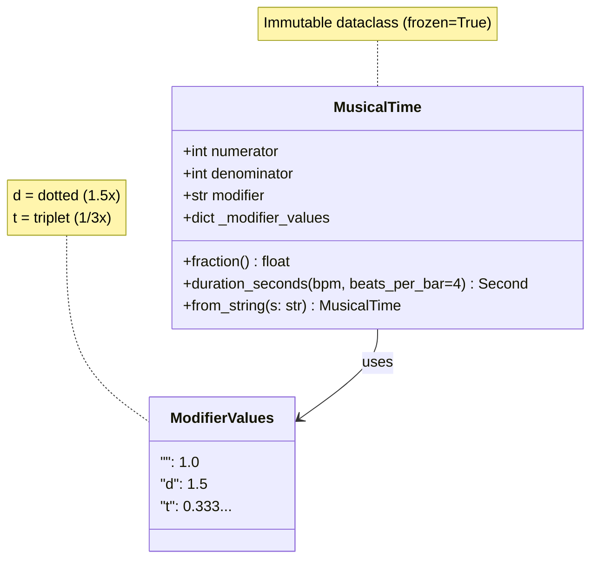
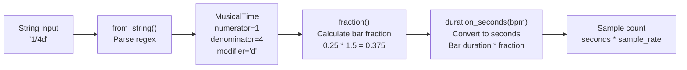
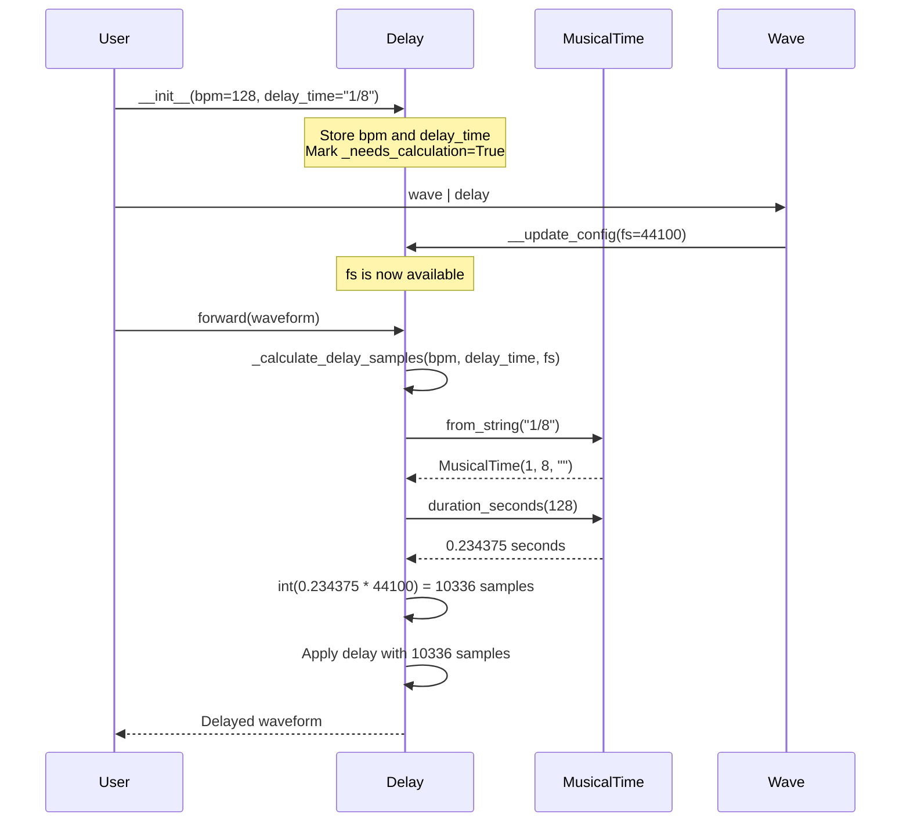

# 2.4 Type System

# Type System

<details>
<summary>Relevant source files</summary>

The following files were used as context for generating this wiki page:

- [.gitignore](.gitignore)
- [.vscode/settings.json](.vscode/settings.json)
- [src/torchfx/effect.py](src/torchfx/effect.py)
- [src/torchfx/typing.py](src/torchfx/typing.py)

</details>


## Purpose and Scope

This document describes the custom type system defined in torchfx, including type aliases for audio parameters and the `MusicalTime` dataclass for BPM-synchronized effects. These types provide compile-time safety through static type checking and runtime validation for audio processing parameters.

For information about how these types are used in specific effects, see [Effects](#3) and [Delay](#3.4). For the base class system that uses these types, see [FX Base Class](#2.2).

**Sources**: [src/torchfx/typing.py]()

---

## Type Aliases Overview

The torchfx library defines several annotated type aliases that enforce constraints on numeric parameters and provide semantic clarity. These types leverage Python's `typing` module and `annotated_types` for runtime validation.

### Numeric Parameter Types

| Type Alias | Base Type | Constraint | Purpose |
|------------|-----------|------------|---------|
| `Decibel` | `float` | `<= 0` | Decibel values (always negative or zero) |
| `Millisecond` | `float` | `>= 0` | Time duration in milliseconds |
| `Second` | `float` | `>= 0` | Time duration in seconds |

These types are defined using `typing.Annotated` with constraints from `annotated_types`:

```python
Decibel = tp.Annotated[float, Le(0)]
Millisecond = tp.Annotated[float, Ge(0)]
Second = tp.Annotated[float, Ge(0)]
```

**Sources**: [src/torchfx/typing.py:10-12]()

### Audio Processing Types

The following literal types restrict parameters to specific valid values:

| Type | Valid Values | Usage |
|------|--------------|-------|
| `BitRate` | `16`, `24`, `32` | Audio bit depth |
| `SpecScale` | `"mel"`, `"lin"`, `"log"` | Spectrogram scale type |
| `FilterType` | `"low"`, `"high"` | Filter type designation |
| `FilterOrderScale` | `"db"`, `"linear"` | Filter order scaling |
| `WindowType` | `"hann"`, `"hamming"`, `"blackman"`, etc. | Window functions for signal processing |

**Sources**: [src/torchfx/typing.py:13-46]()

### Device Type

The `Device` type alias supports flexible device specification for PyTorch tensors:

```python
Device = tp.Literal["cpu", "cuda"] | torch.device
```

This allows users to specify devices as strings (`"cpu"`, `"cuda"`) or as `torch.device` objects for more granular control (e.g., `torch.device("cuda:1")`).

**Sources**: [src/torchfx/typing.py:30]()

---

## Type System Architecture

```mermaid
graph TB
    subgraph "Type Alias Layer"
        Decibel["Decibel<br/>Annotated[float, Le(0)]"]
        Second["Second<br/>Annotated[float, Ge(0)]"]
        Millisecond["Millisecond<br/>Annotated[float, Ge(0)]"]
        BitRate["BitRate<br/>Literal[16, 24, 32]"]
        Device["Device<br/>Literal['cpu', 'cuda'] | torch.device"]
        WindowType["WindowType<br/>Literal['hann', 'hamming', ...]"]
    end
    
    subgraph "MusicalTime System"
        MusicalTime["MusicalTime<br/>@dataclass(frozen=True)"]
        MT_numerator["numerator: int"]
        MT_denominator["denominator: int"]
        MT_modifier["modifier: str"]
        MT_fraction["fraction() -> float"]
        MT_duration["duration_seconds(bpm, beats_per_bar) -> Second"]
        MT_from_string["from_string(s: str) -> MusicalTime"]
        
        MusicalTime --> MT_numerator
        MusicalTime --> MT_denominator
        MusicalTime --> MT_modifier
        MusicalTime --> MT_fraction
        MusicalTime --> MT_duration
        MusicalTime --> MT_from_string
    end
    
    subgraph "Usage in Effects"
        Delay["Delay effect"]
        Gain["Gain effect"]
        Wave["Wave class"]
    end
    
    MusicalTime -.->|"used by"| Delay
    Device -.->|"used by"| Wave
    Decibel -.->|"validates"| Gain
    Second -.->|"returned by"| MT_duration
    
    style MusicalTime fill:#e1f5ff,stroke:#333,stroke-width:2px
    style Delay fill:#ffe1e1
```



**Sources**: [src/torchfx/typing.py:1-159]()

---

## MusicalTime Dataclass

The `MusicalTime` dataclass represents musical time divisions for BPM-synchronized audio effects. It encapsulates the concept of note durations as fractions of a musical bar (measure).

### Structure



**Sources**: [src/torchfx/typing.py:49-78]()

### Attributes

The `MusicalTime` dataclass is defined as immutable (`frozen=True`) and contains:

- **`numerator: int`** - Numerator of the time fraction (e.g., 1 in "1/4")
- **`denominator: int`** - Denominator of the time fraction (e.g., 4 in "1/4")  
- **`modifier: str`** - Optional modifier: `""` (none), `"d"` (dotted), `"t"` (triplet)

**Sources**: [src/torchfx/typing.py:60-71]()

### Musical Time Calculation

The `MusicalTime` system uses a two-step process to convert musical notation to actual time:



**Sources**: [src/torchfx/typing.py:79-128](), [src/torchfx/effect.py:637-660]()

#### Method: `fraction()`

Computes the duration as a fraction of a musical bar, applying the modifier coefficient:

```
base_fraction = numerator / denominator
final_fraction = base_fraction * modifier_coefficient
```

Modifier coefficients:
- `""` (none): 1.0
- `"d"` (dotted): 1.5 (adds half the base duration)
- `"t"` (triplet): 1/3 (divides into three equal parts)

**Sources**: [src/torchfx/typing.py:79-99]()

#### Method: `duration_seconds(bpm, beats_per_bar=4)`

Converts the musical time fraction to actual seconds:

```
beat_duration = 60.0 / bpm
bar_duration = beat_duration * beats_per_bar
duration_seconds = fraction() * bar_duration
```

Parameters:
- `bpm: float` - Beats per minute (must be positive)
- `beats_per_bar: int` - Number of beats in one bar (default: 4 for 4/4 time)

Returns: `Second` (annotated float >= 0)

**Sources**: [src/torchfx/typing.py:101-128]()

#### Method: `from_string(s: str)`

Class method that parses a string representation into a `MusicalTime` instance.

Format: `numerator/denominator[modifier]`

Examples:
- `"1/4"` → quarter note
- `"1/8d"` → dotted eighth note  
- `"1/8t"` → eighth note triplet
- `"3/16"` → three sixteenth notes

The method uses regex pattern `r"(\d+)/(\d+)([dt]?)$"` to validate and parse the input.

**Sources**: [src/torchfx/typing.py:130-158]()

---

## Integration with Delay Effect

The `MusicalTime` type is primarily used by the `Delay` effect to enable BPM-synchronized delay times. This integration demonstrates practical usage of the type system.



**Sources**: [src/torchfx/effect.py:494-714](), [src/torchfx/typing.py:130-158]()

### Usage Example from Delay

The `Delay` effect uses `MusicalTime` in its `_calculate_delay_samples` method:

```python
# From src/torchfx/effect.py:637-660
@staticmethod
def _calculate_delay_samples(bpm: float, delay_time: str, fs: int) -> int:
    from torchfx.typing import MusicalTime
    
    musical_time = MusicalTime.from_string(delay_time)
    delay_sec = musical_time.duration_seconds(bpm)
    return int(delay_sec * fs)
```

This allows users to specify delays in musical terms:

```python
# BPM-synced delay with eighth note
delay = Delay(bpm=120, delay_time='1/8', fs=44100)

# Dotted quarter note delay
delay = Delay(bpm=128, delay_time='1/4d', fs=48000)

# Triplet sixteenth delay
delay = Delay(bpm=140, delay_time='1/16t', fs=44100)
```

**Sources**: [src/torchfx/effect.py:494-660]()

---

## Type Checking Integration

The type system in torchfx is designed to work with Python's static type checkers like `mypy`. The library uses strict type checking as enforced in its development workflow.

### Benefits

1. **Compile-time validation**: Type checkers catch invalid parameter types before runtime
2. **IDE support**: Editors provide autocomplete and inline documentation
3. **Runtime constraints**: `annotated_types` constraints (e.g., `Ge(0)`, `Le(0)`) can be validated at runtime
4. **Semantic clarity**: Type aliases like `Decibel` and `Second` make code self-documenting

### Type Checking Configuration

The project uses strict mypy configuration as shown in the development workflow:

```toml
# From pyproject.toml (referenced in CI)
[tool.mypy]
strict = true
```

**Sources**: [.github/workflows/ci.yml](), [pyproject.toml]()

---

## Summary Table: Type System Components

| Component | Location | Purpose | Key Features |
|-----------|----------|---------|--------------|
| `Decibel` | [src/torchfx/typing.py:10]() | dB values | `float <= 0` constraint |
| `Second` | [src/torchfx/typing.py:12]() | Time in seconds | `float >= 0` constraint |
| `Millisecond` | [src/torchfx/typing.py:11]() | Time in milliseconds | `float >= 0` constraint |
| `Device` | [src/torchfx/typing.py:30]() | PyTorch device spec | String or `torch.device` |
| `MusicalTime` | [src/torchfx/typing.py:49-159]() | BPM-synced time | Frozen dataclass with methods |
| `BitRate` | [src/torchfx/typing.py:13]() | Audio bit depth | Literal[16, 24, 32] |
| `WindowType` | [src/torchfx/typing.py:34-46]() | Window functions | Multiple scipy window types |

**Sources**: [src/torchfx/typing.py:1-159]()