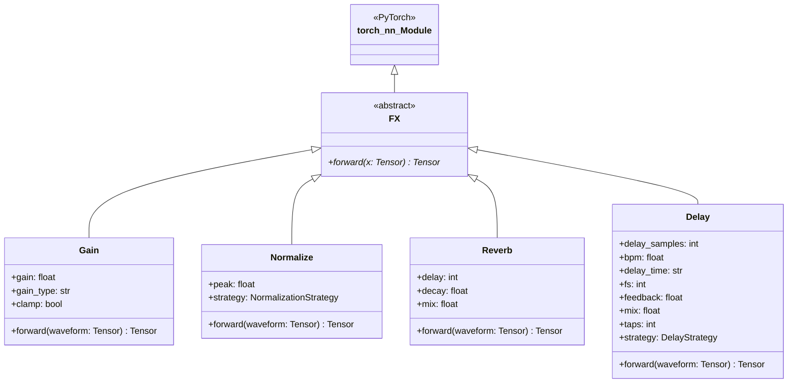

# 3 Effects

# Effects

<details>
<summary>Relevant source files</summary>

The following files were used as context for generating this wiki page:

- [src/torchfx/effect.py](src/torchfx/effect.py)
- [tests/test_effects.py](tests/test_effects.py)

</details>


## Purpose and Scope

This document provides an overview of the effects system in torchfx, describing the available audio effects and the architecture that enables extensibility through the strategy pattern. Effects are time-domain transformations that modify audio signals, including gain adjustment, normalization, reverb, and delay.

For details on the `FX` base class that all effects inherit from, see [FX Base Class](#2.2). For implementation details of individual effects, see [Gain](#3.1), [Normalize](#3.2), [Reverb](#3.3), and [Delay](#3.4). For guidance on creating your own effects, see [Creating Custom Effects](#3.5).

**Sources**: [src/torchfx/effect.py:1-30]()

## Effect Class Hierarchy

All effects in torchfx inherit from the `FX` abstract base class, which itself extends `torch.nn.Module`. This design makes effects compatible with PyTorch's module system and enables GPU acceleration, gradient computation, and integration with neural networks.

### Class Structure



**Sources**: [src/torchfx/effect.py:15-30](), [src/torchfx/effect.py:32-94](), [src/torchfx/effect.py:97-130](), [src/torchfx/effect.py:263-322](), [src/torchfx/effect.py:494-714]()

### Available Effects

| Effect | Purpose | Key Parameters | Line Reference |
|--------|---------|---------------|----------------|
| `Gain` | Adjust amplitude/volume with clamping support | `gain`, `gain_type`, `clamp` | [src/torchfx/effect.py:32-94]() |
| `Normalize` | Normalize waveform using configurable strategies | `peak`, `strategy` | [src/torchfx/effect.py:97-130]() |
| `Reverb` | Simple reverb using feedback delay network | `delay`, `decay`, `mix` | [src/torchfx/effect.py:263-322]() |
| `Delay` | BPM-synced delay with multiple taps and strategies | `delay_samples`, `bpm`, `delay_time`, `feedback`, `taps`, `strategy` | [src/torchfx/effect.py:494-714]() |

**Sources**: [src/torchfx/effect.py:1-714]()

## Strategy Pattern Architecture

Two effects in torchfx (`Normalize` and `Delay`) implement the strategy pattern to provide extensible processing algorithms. This pattern allows users to choose different processing behaviors or inject custom implementations without modifying the core effect classes.

### Strategy Pattern Implementation

```mermaid
classDiagram
    class Normalize {
        +peak: float
        +strategy: NormalizationStrategy
        +forward(waveform: Tensor) Tensor
    }
    
    class NormalizationStrategy {
        <<abstract>>
        +__call__(waveform: Tensor, peak: float) Tensor*
    }
    
    class PeakNormalizationStrategy {
        +__call__(waveform: Tensor, peak: float) Tensor
    }
    
    class RMSNormalizationStrategy {
        +__call__(waveform: Tensor, peak: float) Tensor
    }
    
    class PercentileNormalizationStrategy {
        +percentile: float
        +__call__(waveform: Tensor, peak: float) Tensor
    }
    
    class PerChannelNormalizationStrategy {
        +__call__(waveform: Tensor, peak: float) Tensor
    }
    
    class CustomNormalizationStrategy {
        +func: Callable
        +__call__(waveform: Tensor, peak: float) Tensor
    }
    
    class Delay {
        +delay_samples: int
        +strategy: DelayStrategy
        +forward(waveform: Tensor) Tensor
    }
    
    class DelayStrategy {
        <<abstract>>
        +apply_delay(waveform, delay_samples, taps, feedback) Tensor*
    }
    
    class MonoDelayStrategy {
        +apply_delay(waveform, delay_samples, taps, feedback) Tensor
    }
    
    class PingPongDelayStrategy {
        +apply_delay(waveform, delay_samples, taps, feedback) Tensor
    }
    
    Normalize --> NormalizationStrategy
    NormalizationStrategy <|-- PeakNormalizationStrategy
    NormalizationStrategy <|-- RMSNormalizationStrategy
    NormalizationStrategy <|-- PercentileNormalizationStrategy
    NormalizationStrategy <|-- PerChannelNormalizationStrategy
    NormalizationStrategy <|-- CustomNormalizationStrategy
    
    Delay --> DelayStrategy
    DelayStrategy <|-- MonoDelayStrategy
    DelayStrategy <|-- PingPongDelayStrategy
```



**Sources**: [src/torchfx/effect.py:97-261](), [src/torchfx/effect.py:325-492]()

### Normalization Strategies

The `Normalize` effect supports five built-in strategies and a custom strategy mechanism:

| Strategy | Algorithm | Use Case | Line Reference |
|----------|-----------|----------|----------------|
| `PeakNormalizationStrategy` | Normalizes to absolute peak value | Standard normalization (default) | [src/torchfx/effect.py:152-171]() |
| `RMSNormalizationStrategy` | Normalizes to RMS energy | Perceptual loudness normalization | [src/torchfx/effect.py:174-194]() |
| `PercentileNormalizationStrategy` | Normalizes to percentile of absolute values | Outlier-resistant normalization | [src/torchfx/effect.py:197-228]() |
| `PerChannelNormalizationStrategy` | Normalizes each channel independently | Multi-channel audio with varying levels | [src/torchfx/effect.py:231-260]() |
| `CustomNormalizationStrategy` | Wraps user-provided callable | Custom normalization logic | [src/torchfx/effect.py:141-149]() |

**Sources**: [src/torchfx/effect.py:132-261](), [tests/test_effects.py:78-204]()

### Delay Strategies

The `Delay` effect supports two built-in strategies for different stereo behaviors:

| Strategy | Behavior | Use Case | Line Reference |
|----------|----------|----------|----------------|
| `MonoDelayStrategy` | Same delay applied to all channels (default) | Standard delay effect | [src/torchfx/effect.py:359-419]() |
| `PingPongDelayStrategy` | Alternates delay between left and right channels | Stereo spatial effects | [src/torchfx/effect.py:422-491]() |

**Sources**: [src/torchfx/effect.py:325-492](), [tests/test_effects.py:428-687]()

## Effect Categories

### Time-Domain Effects

Time-domain effects modify audio signals directly in the time domain without frequency analysis:

**Gain** ([src/torchfx/effect.py:32-94]()): Adjusts signal amplitude using three modes:
- `amplitude`: Direct multiplication by gain factor
- `db`: Decibel-based gain adjustment using `torchaudio.functional.gain`
- `power`: Power-based gain conversion

Optional clamping prevents clipping by limiting output to `[-1.0, 1.0]`.

**Reverb** ([src/torchfx/effect.py:263-322]()): Implements a simple feedback delay network:
```
y[n] = (1 - mix) * x[n] + mix * (x[n] + decay * x[n - delay])
```

**Delay** ([src/torchfx/effect.py:494-714]()): Creates echoes with configurable feedback and multiple taps. Supports BPM synchronization using musical time divisions (e.g., `1/8`, `1/4d`, `1/8t`) through the `MusicalTime` type system. The delay calculation occurs lazily when used with the pipeline operator, allowing automatic sample rate inference from `Wave` objects.

**Sources**: [src/torchfx/effect.py:32-322](), [src/torchfx/effect.py:494-714]()

### Normalization Effects

**Normalize** ([src/torchfx/effect.py:97-130]()): Adjusts signal levels to a target peak value. The strategy pattern allows selection of different normalization algorithms at runtime. Strategies must implement the `NormalizationStrategy` abstract base class or can be provided as callables, which are automatically wrapped in `CustomNormalizationStrategy`.

**Sources**: [src/torchfx/effect.py:97-261]()

## Usage Patterns

### Effect Pipeline Flow

```mermaid
sequenceDiagram
    participant User
    participant Wave
    participant Effect1["Effect (e.g., Gain)"]
    participant Effect2["Effect (e.g., Normalize)"]
    participant Strategy["Strategy (if applicable)"]
    
    User->>Wave: "wave = Wave.from_file(...)"
    User->>Effect1: "gain = Gain(2.0)"
    User->>Effect2: "norm = Normalize(peak=1.0, strategy=...)"
    
    User->>Wave: "result = wave | gain | norm"
    
    Wave->>Effect1: "__ror__(wave) calls forward(wave.ys)"
    Effect1->>Effect1: "Process tensor"
    Effect1-->>Wave: "Return new Wave"
    
    Wave->>Effect2: "__ror__(wave) calls forward(wave.ys)"
    Effect2->>Strategy: "strategy(waveform, peak)"
    Strategy->>Strategy: "Apply algorithm"
    Strategy-->>Effect2: "Return processed tensor"
    Effect2-->>Wave: "Return new Wave"
    
    Wave-->>User: "Final processed Wave"
```

**Sources**: [src/torchfx/wave.py](), [src/torchfx/effect.py:15-30]()

### Basic Effect Application

Effects can be applied in two ways:

1. **Using the pipe operator** (recommended):
```python
import torchfx as fx

wave = fx.Wave.from_file("audio.wav")
processed = wave | fx.Gain(2.0) | fx.Normalize(peak=0.8)
```

2. **Direct invocation**:
```python
gain = fx.Gain(2.0)
processed_tensor = gain(wave.ys)
```

The pipe operator automatically handles `Wave` object creation and device management, while direct invocation requires manual tensor handling.

**Sources**: [src/torchfx/wave.py](), [src/torchfx/effect.py:15-30](), [tests/test_effects.py:26-31]()

### Strategy Selection

Strategies can be specified at effect instantiation:

```python
# Using built-in strategies
norm1 = fx.Normalize(peak=1.0, strategy=fx.effect.RMSNormalizationStrategy())
norm2 = fx.Normalize(peak=1.0, strategy=fx.effect.PercentileNormalizationStrategy(percentile=99.0))

# Using custom callable
def custom_norm(waveform, peak):
    return waveform * peak / torch.median(torch.abs(waveform))

norm3 = fx.Normalize(peak=1.0, strategy=custom_norm)

# Default strategy (PeakNormalizationStrategy)
norm4 = fx.Normalize(peak=1.0)
```

For `Delay`, strategies control stereo behavior:

```python
# Mono delay (default)
delay1 = fx.Delay(bpm=120, delay_time="1/8", feedback=0.3)

# Ping-pong delay
delay2 = fx.Delay(bpm=120, delay_time="1/8", feedback=0.5, 
                  strategy=fx.effect.PingPongDelayStrategy())
```

**Sources**: [src/torchfx/effect.py:110-130](), [src/torchfx/effect.py:590-635](), [tests/test_effects.py:85-98](), [tests/test_effects.py:428-442]()

### Device Compatibility

All effects inherit from `torch.nn.Module`, enabling automatic device placement:

```python
wave = fx.Wave.from_file("audio.wav").to("cuda")
gain = fx.Gain(2.0).to("cuda")
processed = wave | gain  # Processing occurs on GPU
```

The `Wave` pipeline operator automatically moves effects to match the wave's device when using the `|` operator.

**Sources**: [src/torchfx/effect.py:15-30](), [src/torchfx/wave.py]()

## Extensibility Mechanisms

### Strategy Pattern Benefits

The strategy pattern provides three extensibility mechanisms:

1. **Built-in strategies**: Pre-implemented algorithms for common use cases
2. **Callable injection**: User-defined functions wrapped automatically
3. **Subclass extension**: Custom strategies extending abstract base classes

This design enables experimentation without modifying core effect implementations. For example, `PercentileNormalizationStrategy` ([src/torchfx/effect.py:197-228]()) provides outlier-resistant normalization by using a configurable percentile instead of absolute peak.

**Sources**: [src/torchfx/effect.py:132-149](), [src/torchfx/effect.py:325-356]()

### Custom Strategy Implementation

Users can create custom strategies by subclassing the abstract base classes:

```python
class CustomDelayStrategy(fx.effect.DelayStrategy):
    def apply_delay(self, waveform, delay_samples, taps, feedback):
        # Custom delay logic
        return processed_waveform

delay = fx.Delay(delay_samples=1000, strategy=CustomDelayStrategy())
```

Tests demonstrate this pattern in [tests/test_effects.py:644-656]().

**Sources**: [src/torchfx/effect.py:325-356](), [tests/test_effects.py:644-656]()

## Parameter Validation and Error Handling

All effects implement strict parameter validation to prevent runtime errors:

| Effect | Validation | Line Reference |
|--------|-----------|----------------|
| `Gain` | `gain > 0` for amplitude/power modes | [src/torchfx/effect.py:69-70]() |
| `Normalize` | `peak > 0`, strategy type checking | [src/torchfx/effect.py:116-124]() |
| `Reverb` | `delay > 0`, `0 < decay < 1`, `0 ≤ mix ≤ 1` | [src/torchfx/effect.py:299-301]() |
| `Delay` | `delay_samples > 0`, `0 ≤ feedback ≤ 0.95`, `0 ≤ mix ≤ 1`, `taps ≥ 1` | [src/torchfx/effect.py:609-630]() |

Test coverage for validation is extensive: [tests/test_effects.py:71-76](), [tests/test_effects.py:100-108](), [tests/test_effects.py:259-274](), [tests/test_effects.py:464-511]()

**Sources**: [src/torchfx/effect.py:69-70](), [src/torchfx/effect.py:116-124](), [src/torchfx/effect.py:299-301](), [src/torchfx/effect.py:609-630](), [tests/test_effects.py:71-108](), [tests/test_effects.py:259-274](), [tests/test_effects.py:464-511]()