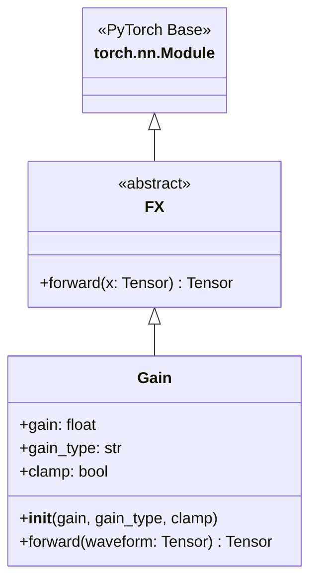
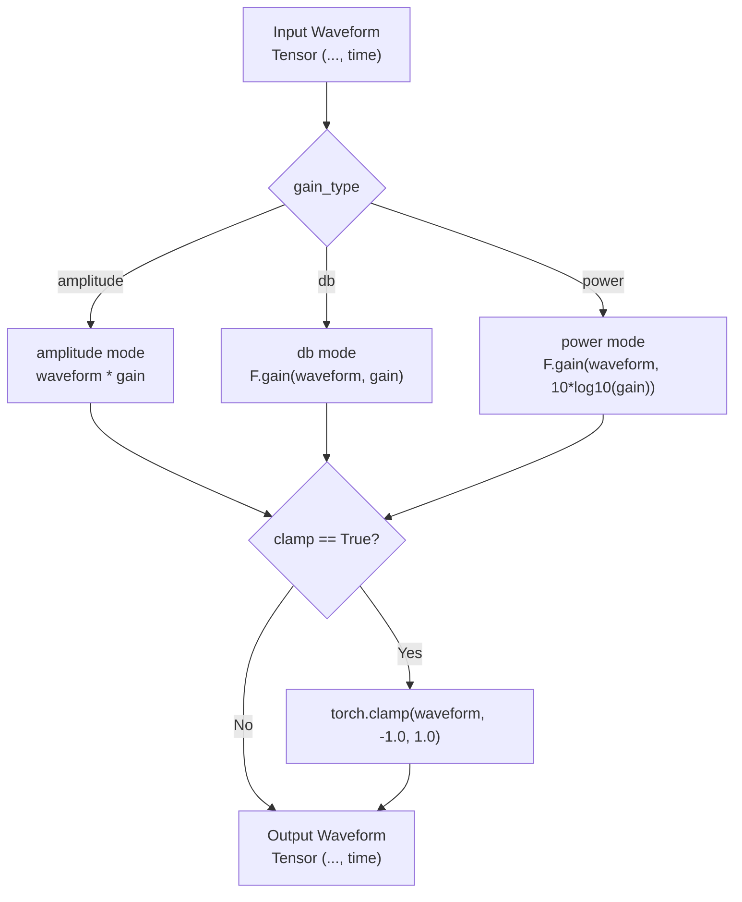
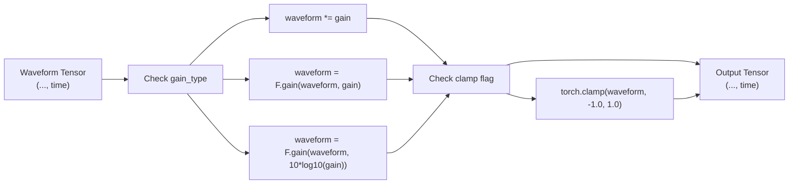
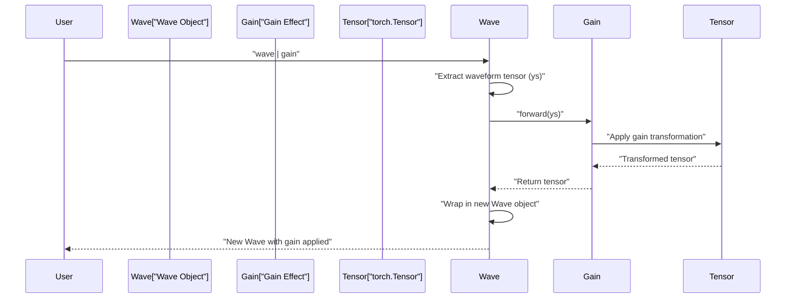

# 3.1 Gain

# Gain

<details>
<summary>Relevant source files</summary>

The following files were used as context for generating this wiki page:

- [src/torchfx/effect.py](src/torchfx/effect.py)
- [tests/test_effects.py](tests/test_effects.py)

</details>


The `Gain` effect adjusts the volume (amplitude) of audio waveforms. It provides three gain modes: amplitude multiplication, decibel adjustment, and power scaling, with optional output clamping to prevent clipping.

For information about other audio effects, see [Effects](#3). For filter-based volume adjustments, see [Filters](#4).

## Overview

The `Gain` class is an audio effect that modifies waveform amplitude. It extends the abstract `FX` base class and is implemented as a `torch.nn.Module`, making it compatible with PyTorch's module system and the torchfx pipeline operator.



**Diagram: Gain Class Hierarchy**

The `Gain` class is located at [src/torchfx/effect.py:32-94]() and inherits from `FX` at [src/torchfx/effect.py:15-29](). This inheritance chain enables GPU acceleration through PyTorch and integration with the torchfx pipeline.

**Sources:** [src/torchfx/effect.py:32-94]()

## Parameters

The `Gain` constructor accepts three parameters:

| Parameter | Type | Default | Description |
|-----------|------|---------|-------------|
| `gain` | `float` | Required | The gain factor to apply. Must be positive for "amplitude" and "power" types. |
| `gain_type` | `str` | `"amplitude"` | The type of gain: `"amplitude"`, `"db"`, or `"power"`. |
| `clamp` | `bool` | `False` | If `True`, clamps the output waveform to the range `[-1.0, 1.0]`. |

**Validation Rules:**
- For `gain_type="amplitude"` or `gain_type="power"`, the `gain` parameter must be positive (`gain >= 0`)
- Negative gain values raise a `ValueError` for amplitude and power modes
- For `gain_type="db"`, negative values are permitted (representing attenuation)

**Sources:** [src/torchfx/effect.py:63-70](), [tests/test_effects.py:71-76]()

## Gain Types

The `Gain` effect supports three distinct gain calculation modes, each suited to different audio processing scenarios:



**Diagram: Gain Forward Method Processing Flow**

### Amplitude Gain

Direct multiplication of the waveform by the gain factor:

```
output = waveform * gain
```

This is the simplest mode, implemented at [src/torchfx/effect.py:82-83](). The gain factor directly scales the amplitude. A gain of 2.0 doubles the amplitude, while 0.5 halves it.

**Sources:** [src/torchfx/effect.py:82-83](), [tests/test_effects.py:26-30]()

### Decibel (dB) Gain

Applies gain specified in decibels using `torchaudio.functional.gain`:

```
output = F.gain(waveform, gain_db)
```

Decibels provide a logarithmic scale where:
- `+6 dB` ≈ doubles amplitude
- `-6 dB` ≈ halves amplitude
- `0 dB` = no change

This mode is implemented at [src/torchfx/effect.py:85-86]() and delegates to torchaudio's gain function.

**Sources:** [src/torchfx/effect.py:85-86](), [tests/test_effects.py:33-45]()

### Power Gain

Applies gain based on power ratio, converting it to decibels internally:

```
output = F.gain(waveform, 10 * log10(gain))
```

Power is proportional to amplitude squared. A power gain of 2.0 increases the power by 2x (equivalent to +3 dB), which corresponds to an amplitude increase of √2 ≈ 1.414x.

The conversion formula `10 * log10(gain)` is implemented at [src/torchfx/effect.py:88-89]().

**Sources:** [src/torchfx/effect.py:88-89](), [tests/test_effects.py:48-61]()

## Clamping

When `clamp=True`, the output waveform is clamped to the range `[-1.0, 1.0]` to prevent clipping artifacts in subsequent processing stages or during audio playback. This is implemented at [src/torchfx/effect.py:91-92]().

```python
if self.clamp:
    waveform = torch.clamp(waveform, -1.0, 1.0)
```

Clamping is typically used when:
- Applying large gain factors that might cause clipping
- Preparing audio for output to hardware with fixed dynamic range
- Preventing numerical overflow in processing chains

**Sources:** [src/torchfx/effect.py:91-92](), [tests/test_effects.py:64-68]()

## Usage Examples

### Basic Amplitude Gain

```python
import torch
import torchfx as fx

# Load audio
wave = fx.Wave.from_file("audio.wav")

# Double the amplitude
gain = fx.effect.Gain(gain=2.0, gain_type="amplitude")
louder = wave | gain
```

### Decibel Gain with Clamping

```python
# Increase volume by 6 dB and clamp to prevent clipping
gain = fx.effect.Gain(gain=6.0, gain_type="db", clamp=True)
louder = wave | gain
```

### Power Gain

```python
# Increase power by 4x (equivalent to +6 dB or 2x amplitude)
gain = fx.effect.Gain(gain=4.0, gain_type="power")
louder = wave | gain
```

### Direct Tensor Processing

The `Gain` effect can also process raw tensors without using the `Wave` wrapper:

```python
# Process a raw tensor
waveform = torch.randn(2, 44100)  # (channels, samples)
gain = fx.effect.Gain(gain=0.5, gain_type="amplitude")
quieter = gain(waveform)
```

**Sources:** [src/torchfx/effect.py:46-50](), [tests/test_effects.py:26-68]()

## Implementation Details

### Forward Method

The `forward` method is decorated with `@torch.no_grad()` at [src/torchfx/effect.py:73](), disabling gradient computation for efficiency. This is appropriate because audio effects are typically applied in inference mode rather than during training.

The method signature accepts waveforms of shape `(..., time)`, supporting:
- 1D tensors: `(time,)` for mono audio
- 2D tensors: `(channels, time)` for multi-channel audio
- 3D+ tensors: `(batch, channels, time)` or higher dimensions



**Diagram: Gain Forward Method Logic Flow**

**Sources:** [src/torchfx/effect.py:73-94]()

### Relationship to torchaudio.transforms.Vol

The `Gain` class is based on `torchaudio.transforms.Vol` (documented at [src/torchfx/effect.py:58-59]()) but adds the `clamp` parameter as an enhancement. The docstring at [src/torchfx/effect.py:35]() explicitly states: "This effect is the same as `torchaudio.transforms.Vol`, but it adds the option to clamp or not the output waveform."

For `db` and `power` gain types, the implementation delegates to `torchaudio.functional.gain` (imported as `F` at [src/torchfx/effect.py:11]()).

**Sources:** [src/torchfx/effect.py:35](), [src/torchfx/effect.py:58-59](), [src/torchfx/effect.py:11]()

## Integration with Pipeline

The `Gain` effect integrates with the torchfx pipeline operator (`|`) through its inheritance from `FX`, which inherits from `torch.nn.Module`. The `Wave` class handles the pipeline integration by calling the effect's `forward` method.



**Diagram: Pipeline Integration Sequence**

The pipeline operator is documented in detail at [Pipeline Operator](#2.3).

**Sources:** [src/torchfx/effect.py:15-29]()

## Testing and Validation

The `Gain` effect has comprehensive test coverage at [tests/test_effects.py:26-76]():

| Test | Purpose | Location |
|------|---------|----------|
| `test_gain_amplitude` | Verifies amplitude multiplication | [tests/test_effects.py:26-30]() |
| `test_gain_db` | Verifies dB gain using torchaudio.functional.gain | [tests/test_effects.py:33-45]() |
| `test_gain_power` | Verifies power gain conversion to dB | [tests/test_effects.py:48-61]() |
| `test_gain_clamp` | Verifies clamping behavior | [tests/test_effects.py:64-68]() |
| `test_gain_invalid_gain_type` | Verifies validation for negative gains | [tests/test_effects.py:71-76]() |

**Sources:** [tests/test_effects.py:26-76]()