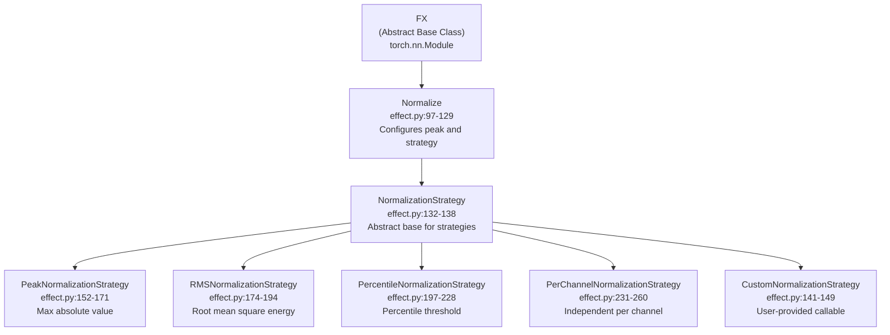
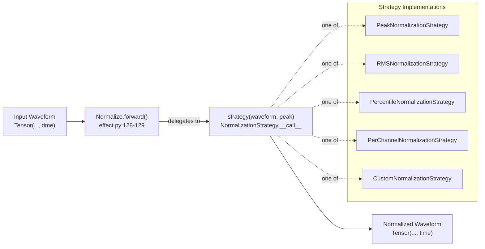
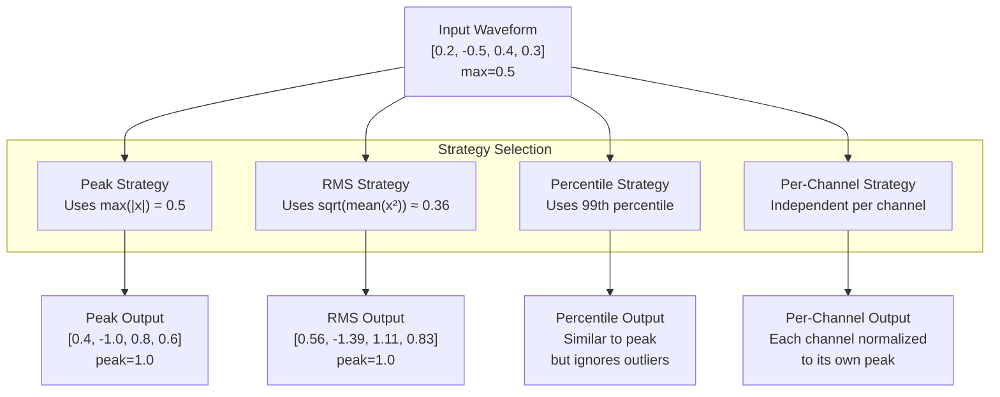

# 3.2 Normalize

# Normalize

<details>
<summary>Relevant source files</summary>

The following files were used as context for generating this wiki page:

- [src/torchfx/effect.py](src/torchfx/effect.py)
- [tests/test_effects.py](tests/test_effects.py)

</details>


The `Normalize` effect adjusts audio waveforms to a target peak amplitude using configurable normalization strategies. This page documents the `Normalize` class and its five built-in strategies: peak, RMS, percentile, per-channel, and custom normalization.

For information about other audio effects, see [Effects](#3). For creating custom normalization strategies, see [Creating Custom Effects](#3.5).

## Overview

The `Normalize` class [src/torchfx/effect.py:97-129]() implements audio normalization using the strategy pattern. It inherits from the `FX` abstract base class and delegates the normalization computation to interchangeable strategy objects.



**Sources:** [src/torchfx/effect.py:15-261]()

## Basic Usage

The `Normalize` effect can be used standalone or in a processing pipeline with the `Wave` class:

```python
import torchfx as fx
import torch

# Load audio
wave = fx.Wave.from_file("audio.wav")

# Normalize to peak value of 0.8
normalized = wave | fx.effect.Normalize(peak=0.8)

# Direct tensor processing
waveform = torch.randn(2, 44100)
norm = fx.effect.Normalize(peak=1.0)
output = norm(waveform)
```

**Sources:** [src/torchfx/effect.py:97-129](), [tests/test_effects.py:78-108]()

## Normalize Class

### Constructor Parameters

| Parameter | Type | Default | Description |
|-----------|------|---------|-------------|
| `peak` | `float` | `1.0` | Target peak amplitude value (must be positive) |
| `strategy` | `NormalizationStrategy \| Callable \| None` | `None` | Normalization strategy to use. Defaults to `PeakNormalizationStrategy` |

The `Normalize` class validates that `peak > 0` at initialization [src/torchfx/effect.py:116](). If a callable is provided as the strategy, it is automatically wrapped in `CustomNormalizationStrategy` [src/torchfx/effect.py:119-120]().

### Forward Method

The `forward` method [src/torchfx/effect.py:127-129]() delegates all processing to the configured strategy:

```python
@torch.no_grad()
def forward(self, waveform: Tensor) -> Tensor:
    return self.strategy(waveform, self.peak)
```

**Sources:** [src/torchfx/effect.py:110-129](), [tests/test_effects.py:78-108]()

## Normalization Strategies

### Strategy Pattern Architecture



**Sources:** [src/torchfx/effect.py:132-261]()

### PeakNormalizationStrategy (Default)

Normalizes the waveform to the absolute maximum value across all samples:

$$
y[n] = \begin{cases}
\frac{x[n]}{\max(|x[n]|)} \cdot \text{peak}, & \text{if } \max(|x[n]|) > 0 \\
x[n], & \text{otherwise}
\end{cases}
$$

**Implementation:** [src/torchfx/effect.py:152-171]()

```python
def __call__(self, waveform: Tensor, peak: float) -> Tensor:
    max_val = torch.max(torch.abs(waveform))
    return waveform / max_val * peak if max_val > 0 else waveform
```

**Usage:**
```python
# Explicit usage (also the default)
norm = Normalize(peak=0.9, strategy=PeakNormalizationStrategy())

# Implicit usage (default strategy)
norm = Normalize(peak=0.9)
```

**Sources:** [src/torchfx/effect.py:152-171](), [tests/test_effects.py:110-122]()

### RMSNormalizationStrategy

Normalizes based on the Root Mean Square (RMS) energy level:

$$
y[n] = \begin{cases}
\frac{x[n]}{\text{RMS}(x[n])} \cdot \text{peak}, & \text{if } \text{RMS}(x[n]) > 0 \\
x[n], & \text{otherwise}
\end{cases}
$$

where $\text{RMS}(x[n]) = \sqrt{\frac{1}{N}\sum_{i=0}^{N-1} x[i]^2}$

**Implementation:** [src/torchfx/effect.py:174-194]()

```python
def __call__(self, waveform: Tensor, peak: float) -> Tensor:
    rms = torch.sqrt(torch.mean(waveform**2))
    return waveform / rms * peak if rms > 0 else waveform
```

**Usage:**
```python
norm = Normalize(peak=0.5, strategy=RMSNormalizationStrategy())
```

This strategy is useful for maintaining consistent perceived loudness across different audio files.

**Sources:** [src/torchfx/effect.py:174-194](), [tests/test_effects.py:124-137]()

### PercentileNormalizationStrategy

Normalizes using a percentile of absolute values, allowing control over outlier handling:

$$
y[n] = \begin{cases}
\frac{x[n]}{P_p(|x[n]|)} \cdot \text{peak}, & \text{if } P_p(|x[n]|) > 0 \\
x[n], & \text{otherwise}
\end{cases}
$$

where $P_p(|x[n]|)$ is the $p$-th percentile of absolute values ($0 < p \leq 100$).

**Implementation:** [src/torchfx/effect.py:197-228]()

```python
def __init__(self, percentile: float = 99.0) -> None:
    assert 0 < percentile <= 100, "Percentile must be between 0 and 100."
    self.percentile = percentile

def __call__(self, waveform: Tensor, peak: float) -> Tensor:
    abs_waveform = torch.abs(waveform)
    threshold = torch.quantile(abs_waveform, self.percentile / 100, 
                               interpolation="linear")
    return waveform / threshold * peak if threshold > 0 else waveform
```

**Usage:**
```python
# Normalize to 99th percentile (default) - ignores top 1% outliers
norm = Normalize(peak=1.0, strategy=PercentileNormalizationStrategy(percentile=99.0))

# Normalize to 95th percentile - more aggressive outlier rejection
norm = Normalize(peak=1.0, strategy=PercentileNormalizationStrategy(percentile=95.0))
```

**Sources:** [src/torchfx/effect.py:197-228](), [tests/test_effects.py:150-170]()

### PerChannelNormalizationStrategy

Normalizes each audio channel independently to its own peak value:

$$
y_c[n] = \begin{cases}
\frac{x_c[n]}{\max(|x_c[n]|)} \cdot \text{peak}, & \text{if } \max(|x_c[n]|) > 0 \\
x_c[n], & \text{otherwise}
\end{cases}
$$

where $c$ denotes the channel index.

**Implementation:** [src/torchfx/effect.py:231-260]()

The implementation handles both 2D `(channels, time)` and 3D `(batch, channels, time)` tensor shapes:

```python
def __call__(self, waveform: Tensor, peak: float) -> Tensor:
    assert waveform.ndim >= 2, "Waveform must have at least 2 dimensions"
    
    dims = waveform.ndim
    if dims == 2:
        max_per_channel = torch.max(torch.abs(waveform), dim=1, keepdim=True).values
        return torch.where(max_per_channel > 0, waveform / max_per_channel * peak, waveform)
    elif dims == 3:
        max_per_channel = torch.max(torch.abs(waveform), dim=2, keepdim=True).values
        return torch.where(max_per_channel > 0, waveform / max_per_channel * peak, waveform)
    else:
        raise ValueError("Waveform must have shape (C, T) or (B, C, T)")
```

**Usage:**
```python
# Stereo audio: each channel normalized independently
stereo = torch.randn(2, 44100)
norm = Normalize(peak=1.0, strategy=PerChannelNormalizationStrategy())
normalized = norm(stereo)

# Batched audio: each channel in each batch item normalized independently
batch = torch.randn(8, 2, 44100)  # (batch, channels, time)
normalized_batch = norm(batch)
```

**Sources:** [src/torchfx/effect.py:231-260](), [tests/test_effects.py:172-204]()

### CustomNormalizationStrategy

Allows custom normalization logic by wrapping user-provided callables:

**Implementation:** [src/torchfx/effect.py:141-149]()

```python
def __init__(self, func: Callable[[Tensor, float], Tensor]) -> None:
    assert callable(func), "func must be callable"
    self.func = func

def __call__(self, waveform: Tensor, peak: float) -> Tensor:
    return self.func(waveform, peak)
```

**Usage:**

Custom strategies can be provided either as strategy objects or as callables directly:

```python
# Option 1: Provide callable directly (auto-wrapped)
def my_normalization(waveform: Tensor, peak: float) -> Tensor:
    # Custom logic: e.g., normalize to median absolute value
    median = torch.median(torch.abs(waveform))
    return waveform / median * peak if median > 0 else waveform

norm = Normalize(peak=0.8, strategy=my_normalization)

# Option 2: Use CustomNormalizationStrategy explicitly
strategy = CustomNormalizationStrategy(my_normalization)
norm = Normalize(peak=0.8, strategy=strategy)

# Option 3: Use lambda
norm = Normalize(peak=2.0, strategy=lambda w, p: w * p)
```

**Sources:** [src/torchfx/effect.py:141-149](), [tests/test_effects.py:85-98](), [tests/test_effects.py:139-148]()

## Normalization Strategy Comparison



| Strategy | Best For | Preserves | Considerations |
|----------|----------|-----------|----------------|
| **Peak** | General purpose, maintaining dynamic range | Relative amplitude relationships | Can be affected by single outlier sample |
| **RMS** | Consistent perceived loudness | Energy/power characteristics | May exceed ±1.0 range on peaks |
| **Percentile** | Audio with transient spikes | Most of dynamic range while rejecting outliers | Percentile threshold selection is application-specific |
| **Per-Channel** | Multi-channel audio with different levels | Independent channel characteristics | Channels may have different scaling factors |
| **Custom** | Specialized requirements | User-defined | Full flexibility for domain-specific needs |

**Sources:** [src/torchfx/effect.py:152-260](), [tests/test_effects.py:78-204]()

## Parameter Validation

The `Normalize` class and its strategies enforce parameter constraints:

### Normalize Class Validation

```python
# Peak must be positive
assert peak > 0, "Peak value must be positive."  # Line 116

# Strategy must be NormalizationStrategy or callable
if callable(strategy):
    strategy = CustomNormalizationStrategy(strategy)  # Lines 119-120
    
if not isinstance(self.strategy, NormalizationStrategy):
    raise TypeError("Strategy must be an instance of NormalizationStrategy.")  # Line 124
```

### Strategy-Specific Validation

| Strategy | Validation | Line Reference |
|----------|-----------|----------------|
| **PercentileNormalizationStrategy** | `0 < percentile <= 100` | [src/torchfx/effect.py:222]() |
| **PerChannelNormalizationStrategy** | `waveform.ndim >= 2` | [src/torchfx/effect.py:249]() |
| **PerChannelNormalizationStrategy** | Shape must be `(C, T)` or `(B, C, T)` | [src/torchfx/effect.py:260]() |
| **CustomNormalizationStrategy** | `callable(func)` | [src/torchfx/effect.py:145]() |

**Sources:** [src/torchfx/effect.py:110-260](), [tests/test_effects.py:100-108](), [tests/test_effects.py:158-163](), [tests/test_effects.py:192-196]()

## Edge Cases

All normalization strategies handle edge cases where normalization would be undefined:

### Zero Waveforms

When the waveform contains only zeros (or when the normalization metric is zero), strategies return the input unchanged:

```python
# Peak strategy: max_val == 0
return waveform / max_val * peak if max_val > 0 else waveform

# RMS strategy: rms == 0
return waveform / rms * peak if rms > 0 else waveform

# Percentile strategy: threshold == 0
return waveform / threshold * peak if threshold > 0 else waveform
```

This prevents division by zero and maintains stability for silent audio segments.

**Sources:** [src/torchfx/effect.py:171](), [src/torchfx/effect.py:194](), [src/torchfx/effect.py:228](), [tests/test_effects.py:117-122](), [tests/test_effects.py:132-137](), [tests/test_effects.py:165-170]()

### Per-Channel Zero Handling

The `PerChannelNormalizationStrategy` uses `torch.where` to selectively normalize only non-zero channels:

```python
max_per_channel = torch.max(torch.abs(waveform), dim=1, keepdim=True).values
return torch.where(max_per_channel > 0, waveform / max_per_channel * peak, waveform)
```

This ensures that silent channels remain unchanged while other channels are normalized correctly.

**Sources:** [src/torchfx/effect.py:254-255](), [src/torchfx/effect.py:257-258](), [tests/test_effects.py:199-204]()

## Integration with Wave Pipeline

The `Normalize` effect integrates seamlessly with the `Wave` pipeline operator:

```python
import torchfx as fx

# Load audio
wave = fx.Wave.from_file("input.wav")

# Pipeline processing with normalization
processed = (
    wave
    | some_filter
    | fx.effect.Normalize(peak=0.8, strategy=RMSNormalizationStrategy())
    | another_effect
)

# Save result
processed.save("output.wav")
```

The effect operates on the tensor data (`wave.ys`) and preserves the sample rate (`wave.fs`) through the pipeline. For more information on pipeline processing, see [Pipeline Operator](#2.3).

**Sources:** [src/torchfx/effect.py:97-129](), [src/torchfx/wave.py]()

## GPU Acceleration

Since `Normalize` inherits from `torch.nn.Module` and uses pure PyTorch operations, it automatically supports GPU acceleration:

```python
wave = fx.Wave.from_file("audio.wav")
wave_gpu = wave.to("cuda")

# Normalization runs on GPU
norm = fx.effect.Normalize(peak=0.9)
normalized = wave_gpu | norm  # GPU computation

# Move back to CPU if needed
result_cpu = normalized.to("cpu")
```

All strategy implementations use GPU-compatible PyTorch operations (`torch.max`, `torch.sqrt`, `torch.mean`, `torch.quantile`, `torch.where`).

**Sources:** [src/torchfx/effect.py:97-261](), [src/torchfx/wave.py]()