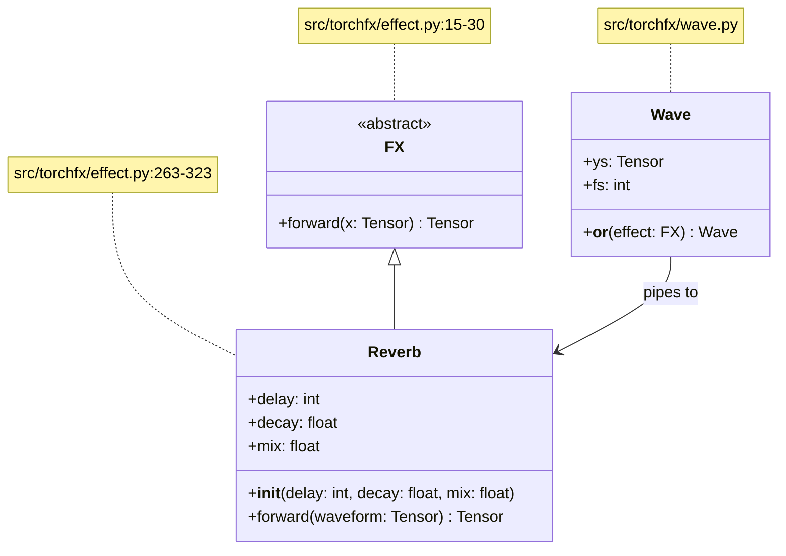
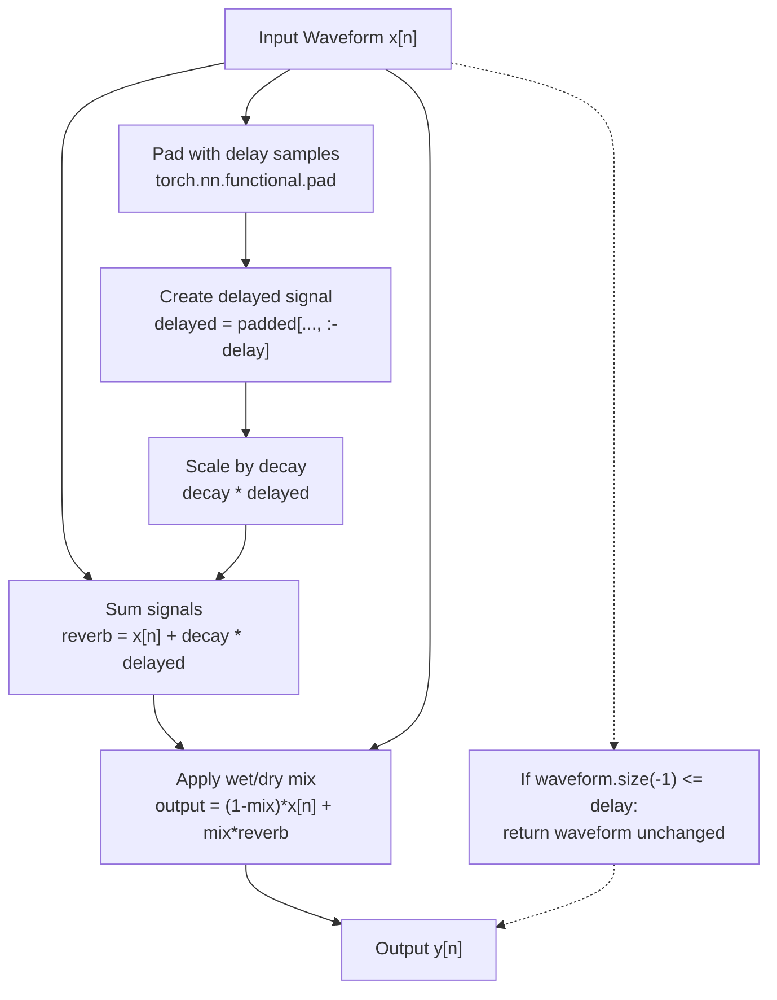
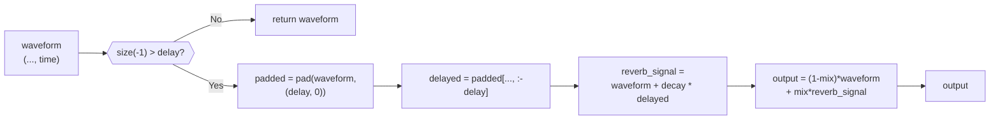
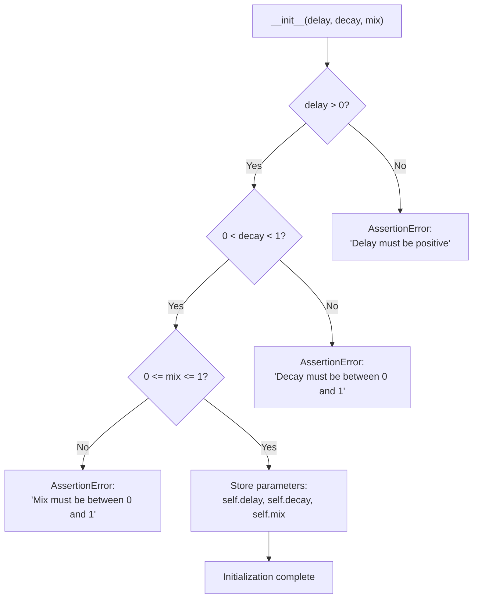
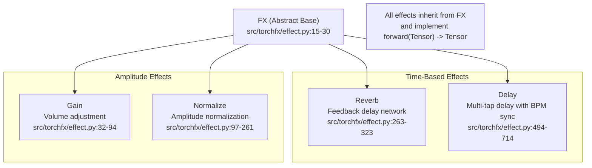

# 3.3 Reverb

# Reverb

<details>
<summary>Relevant source files</summary>

The following files were used as context for generating this wiki page:

- [src/torchfx/effect.py](src/torchfx/effect.py)
- [tests/test_effects.py](tests/test_effects.py)

</details>


## Purpose and Scope

This page documents the `Reverb` effect class in torchfx, which implements a simple reverb effect using a feedback delay network. The `Reverb` class provides a basic reverberation algorithm suitable for adding spatial depth to audio signals.

For information about other time-based effects, see [Delay](#3.4). For the abstract base class that all effects inherit from, see [FX Base Class](#2.2).

**Sources**: [src/torchfx/effect.py:263-323]()

## Overview

The `Reverb` effect creates reverberation by applying a feedback comb filter to the input signal. This is a simplified reverb implementation that processes audio in real-time on GPU or CPU, suitable for basic spatial effects and rapid prototyping.

The effect is implemented as a PyTorch module inheriting from the `FX` abstract base class, making it compatible with the torchfx pipeline operator and PyTorch's neural network ecosystem.

**Sources**: [src/torchfx/effect.py:263-295]()

## Class Structure



**Sources**: [src/torchfx/effect.py:15-30](), [src/torchfx/effect.py:263-323]()

## Parameters

The `Reverb` class accepts three parameters during initialization:

| Parameter | Type | Default | Range | Description |
|-----------|------|---------|-------|-------------|
| `delay` | `int` | `4410` | `> 0` | Delay time in samples for the feedback comb filter. At 44.1kHz, the default of 4410 samples equals 100ms. |
| `decay` | `float` | `0.5` | `0 < decay < 1` | Feedback decay factor controlling how quickly the reverb tail fades. Higher values create longer reverb tails. |
| `mix` | `float` | `0.5` | `0 ≤ mix ≤ 1` | Wet/dry mix ratio. `0` = fully dry (original signal), `1` = fully wet (reverb only). |

**Sources**: [src/torchfx/effect.py:280-287](), [src/torchfx/effect.py:297-305]()

## Mathematical Formulation

The reverb effect implements a feedback comb filter using the following equation:

$$y[n] = (1 - mix) \cdot x[n] + mix \cdot (x[n] + decay \cdot x[n - delay])$$

Where:
- $x[n]$ is the input signal at sample $n$
- $y[n]$ is the output signal at sample $n$
- $delay$ is the delay time in samples
- $decay$ is the feedback decay factor
- $mix$ is the wet/dry mix parameter

The algorithm can be broken down into these steps:

1. **Delay Line Creation**: The input waveform is padded with `delay` samples at the beginning
2. **Feedback Signal**: A delayed copy of the input is created and scaled by `decay`
3. **Reverb Signal**: The original and delayed signals are summed
4. **Wet/Dry Mix**: The reverb signal is blended with the dry signal according to `mix`

**Sources**: [src/torchfx/effect.py:266-277]()

## Signal Flow Diagram



**Sources**: [src/torchfx/effect.py:308-322]()

## Implementation Details

### Forward Pass

The `forward` method implements the reverb algorithm with the following logic:

1. **Short Waveform Handling**: If the input waveform length is less than or equal to `delay`, the waveform is returned unchanged [src/torchfx/effect.py:311-312]()

2. **Padding**: The waveform is padded with `delay` zeros at the beginning using `torch.nn.functional.pad` [src/torchfx/effect.py:315]()

3. **Delayed Signal Extraction**: The delayed signal is extracted by slicing the padded waveform [src/torchfx/effect.py:317]()

4. **Feedback Comb Filter**: The reverb signal is computed by adding the original signal to the scaled delayed signal [src/torchfx/effect.py:319]()

5. **Wet/Dry Mixing**: The final output blends the dry and wet signals [src/torchfx/effect.py:321]()



**Sources**: [src/torchfx/effect.py:308-322]()

### Multi-Channel Support

The `Reverb` effect supports arbitrary tensor dimensions. The reverb algorithm operates on the last dimension (time axis) while preserving all leading dimensions. This enables:

- Single-channel (mono) audio: shape `(time,)`
- Multi-channel audio: shape `(channels, time)`
- Batched multi-channel audio: shape `(batch, channels, time)`
- Higher-dimensional tensors: shape `(..., time)`

The implementation uses broadcasting and ellipsis indexing (`...`) to handle all these cases uniformly.

**Sources**: [src/torchfx/effect.py:310-322](), [tests/test_effects.py:240-256]()

## Usage Examples

### Basic Usage with Wave Pipeline

```python
import torchfx as fx

# Load audio file
wave = fx.Wave.from_file("path_to_audio.wav")

# Create reverb with 100ms delay at 44.1kHz
reverb = fx.effect.Reverb(delay=4410, decay=0.5, mix=0.3)

# Apply reverb using pipeline operator
reverberated = wave | reverb
```

**Sources**: [src/torchfx/effect.py:288-293]()

### Direct Tensor Processing

```python
import torch
from torchfx.effect import Reverb

# Create audio tensor (channels, samples)
waveform = torch.randn(2, 44100)

# Apply reverb directly to tensor
reverb = Reverb(delay=2205, decay=0.7, mix=0.5)
output = reverb(waveform)
```

**Sources**: [tests/test_effects.py:206-221]()

### Multi-Channel Processing

```python
import torch
from torchfx.effect import Reverb

# Create multi-channel audio
waveform = torch.tensor([[1.0, 2.0, 3.0, 4.0], 
                         [0.5, 1.5, 2.5, 3.5]])

# Apply same reverb to all channels
reverb = Reverb(delay=2, decay=0.5, mix=1.0)
output = reverb(waveform)
# Each channel processed independently with same parameters
```

**Sources**: [tests/test_effects.py:240-256]()

## Parameter Validation

The `Reverb` class validates all parameters during initialization:



**Validation Rules**:

- `delay` must be positive (> 0) [src/torchfx/effect.py:299]()
- `decay` must be strictly between 0 and 1 (exclusive) [src/torchfx/effect.py:300]()
- `mix` must be between 0 and 1 (inclusive) [src/torchfx/effect.py:301]()

**Sources**: [src/torchfx/effect.py:297-305](), [tests/test_effects.py:259-274]()

## Edge Cases and Special Behaviors

### Short Waveforms

When the input waveform length is less than or equal to the delay length, the reverb effect cannot be applied. In this case, the waveform is returned unchanged:

```python
waveform = torch.tensor([1.0, 2.0])
reverb = Reverb(delay=3, decay=0.5, mix=1.0)
output = reverb(waveform)
# output == waveform (unchanged)
```

This check prevents indexing errors and maintains predictable behavior for short audio segments.

**Sources**: [src/torchfx/effect.py:311-312](), [tests/test_effects.py:232-237]()

### Mix Parameter Extremes

- **mix=0.0**: Returns only the dry signal (no reverb applied)
- **mix=1.0**: Returns only the wet signal (full reverb, no dry signal)

**Sources**: [tests/test_effects.py:224-229]()

## Device Compatibility

The `Reverb` effect automatically respects the device (CPU/CUDA) of the input tensor. All operations are performed on the same device as the input:

- Padding operations use the input tensor's device
- Intermediate computations remain on the input device
- No explicit device transfers are required

When using the Wave pipeline operator, device management is handled automatically.

**Sources**: [src/torchfx/effect.py:308-322]()

## Gradient Computation

The `forward` method is decorated with `@torch.no_grad()`, disabling gradient tracking. This makes the reverb effect suitable for:

- Real-time audio processing
- Inference-only applications
- Performance-critical pipelines

If gradient computation is required (e.g., for differentiable DSP), the decorator would need to be removed.

**Sources**: [src/torchfx/effect.py:308]()

## Relationship to Other Effects



**Key Differences**:

- **Reverb** uses a simple feedback comb filter with fixed delay
- **Delay** supports multiple taps, BPM synchronization, and complex routing strategies
- Both effects extend the output length, but Delay provides more control over timing

For more complex delay effects with multiple echoes and musical timing, see [Delay](#3.4).

**Sources**: [src/torchfx/effect.py:15-30](), [src/torchfx/effect.py:263-323](), [src/torchfx/effect.py:494-714]()

## Test Coverage

The `Reverb` effect has comprehensive test coverage including:

| Test Category | Tests | Location |
|---------------|-------|----------|
| Basic functionality | `test_reverb_basic` | [tests/test_effects.py:206-221]() |
| Mix parameter | `test_reverb_mix_zero` | [tests/test_effects.py:224-229]() |
| Short waveforms | `test_reverb_short_waveform` | [tests/test_effects.py:232-237]() |
| Multi-channel | `test_reverb_multichannel` | [tests/test_effects.py:240-256]() |
| Parameter validation | `test_reverb_invalid_*` | [tests/test_effects.py:259-274]() |

**Sources**: [tests/test_effects.py:206-275]()

## Performance Considerations

### Computational Complexity

The reverb algorithm has O(n) time complexity where n is the number of samples:
- One padding operation: O(delay)
- One slicing operation: O(n)
- Element-wise operations: O(n)

### Memory Usage

The effect requires additional memory for:
- Padded waveform: `delay` extra samples per channel
- Delayed signal copy: same size as input
- Output tensor: same size as input

Total memory overhead is approximately 2x the input size plus padding.

### GPU Acceleration

All tensor operations are GPU-compatible. For large batch processing, GPU acceleration provides significant speedup:
- Padding and slicing are efficient on GPU
- Element-wise operations benefit from SIMD parallelization

**Sources**: [src/torchfx/effect.py:308-322]()

## Limitations

The current implementation has several limitations:

1. **Single Delay Line**: Uses only one comb filter; professional reverbs use multiple parallel comb filters and all-pass filters
2. **No Early Reflections**: Does not model early reflections that occur in real acoustic spaces
3. **No Diffusion**: Lacks the diffusion characteristic of natural reverberation
4. **Fixed Delay**: Delay parameter cannot be modulated during processing
5. **No Gradient Support**: The `@torch.no_grad()` decorator prevents use in differentiable pipelines

For production-quality reverb, consider using torchaudio's more sophisticated reverb implementations or external reverb engines.

**Sources**: [src/torchfx/effect.py:263-323]()