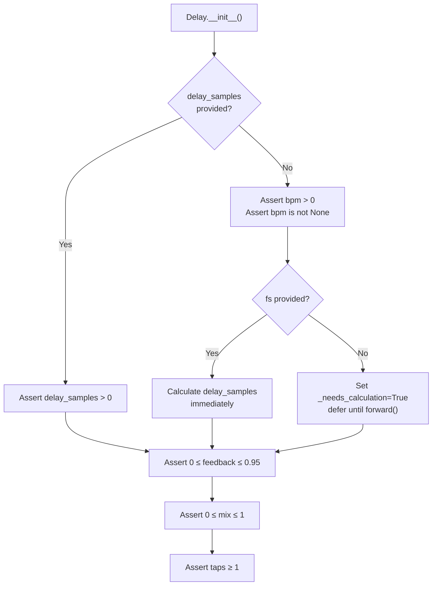
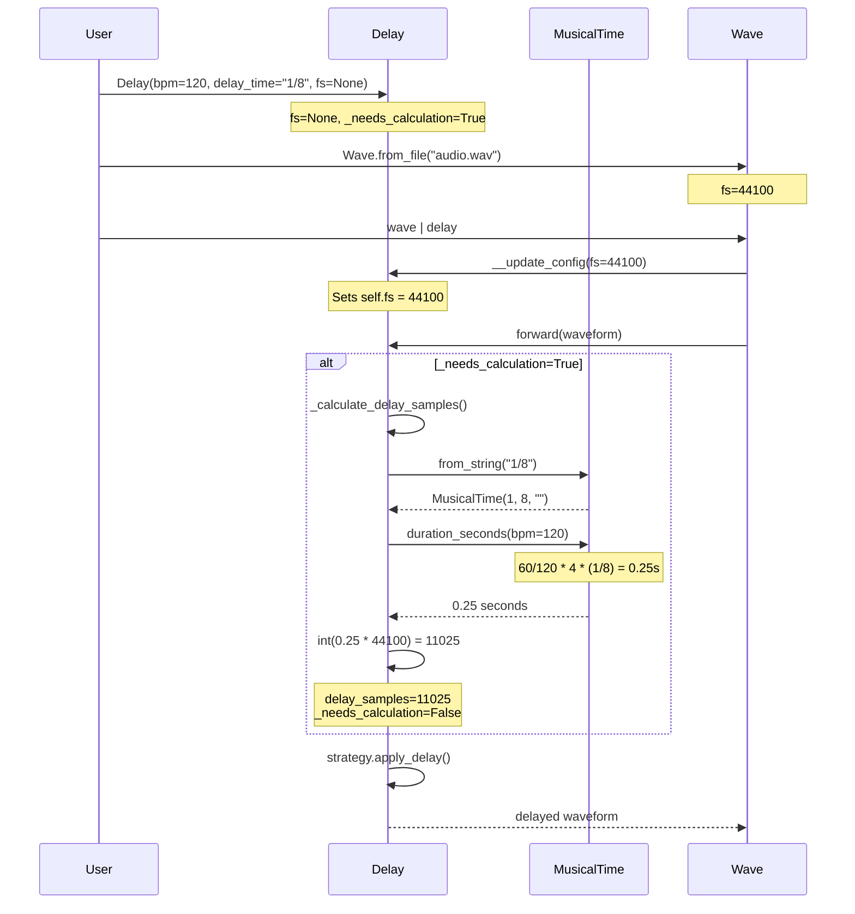
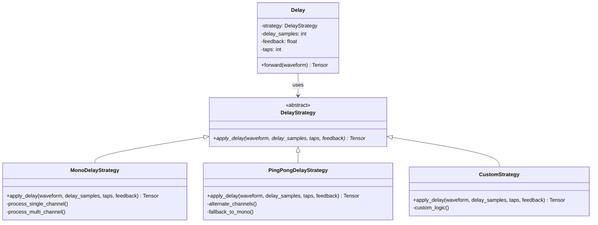
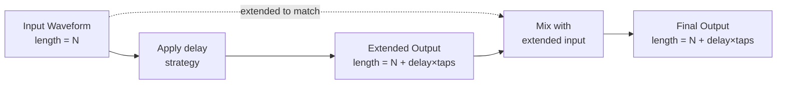
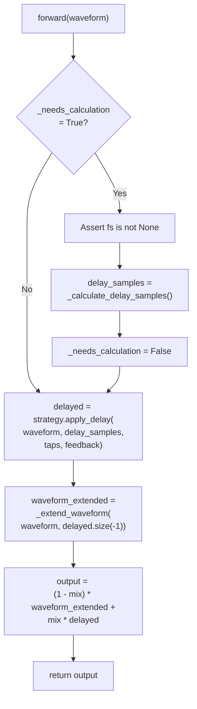

# 3.4 Delay

# Delay

<details>
<summary>Relevant source files</summary>

The following files were used as context for generating this wiki page:

- [.gitignore](.gitignore)
- [.vscode/settings.json](.vscode/settings.json)
- [src/torchfx/effect.py](src/torchfx/effect.py)
- [src/torchfx/typing.py](src/torchfx/typing.py)
- [tests/test_effects.py](tests/test_effects.py)

</details>


The `Delay` effect creates time-delayed echoes of an audio signal with configurable feedback, BPM synchronization, and multiple delay strategies. This effect is implemented in [src/torchfx/effect.py:494-715]() and supports musical time divisions for rhythmically synchronized delays in music production applications.

For information about reverb effects (which use feedback delay networks), see [Reverb](#3.3). For general effects concepts, see [Effects](#3). For creating custom delay behaviors, see [Creating Custom Effects](#3.5).

**Sources:** [src/torchfx/effect.py:494-715]()

## Purpose and Scope

The `Delay` effect provides:
- **BPM-synchronized delays** using musical time divisions (quarter notes, eighth notes, triplets, dotted notes)
- **Multiple delay taps** with exponential feedback decay
- **Stereo delay strategies** including mono and ping-pong modes
- **Automatic sample rate inference** from Wave pipeline
- **Output length extension** to accommodate all delayed echoes

**Sources:** [src/torchfx/effect.py:494-589](), [README.md]()

## Core Architecture

```mermaid
graph TB
    subgraph "Delay Effect System"
        Delay["Delay<br/>(FX subclass)"]
        
        subgraph "Configuration Parameters"
            DelayParams["delay_samples: int<br/>bpm: float | None<br/>delay_time: str<br/>fs: int | None"]
            ProcessParams["feedback: float<br/>mix: float<br/>taps: int"]
        end
        
        subgraph "Strategy Pattern"
            DelayStrategy["DelayStrategy<br/>(Abstract Base)"]
            MonoStrategy["MonoDelayStrategy"]
            PingPongStrategy["PingPongDelayStrategy"]
        end
        
        subgraph "Time Calculation"
            MusicalTime["MusicalTime<br/>(from typing module)"]
            CalcMethod["_calculate_delay_samples()"]
        end
    end
    
    Delay -->|uses| DelayStrategy
    DelayStrategy -->|implemented by| MonoStrategy
    DelayStrategy -->|implemented by| PingPongStrategy
    
    Delay -->|stores| DelayParams
    Delay -->|stores| ProcessParams
    Delay -->|uses| CalcMethod
    
    CalcMethod -->|depends on| MusicalTime
    MusicalTime -->|parses| DelayParams
    
    Delay -->|forward()| MonoStrategy
    Delay -->|forward()| PingPongStrategy
```

**Sources:** [src/torchfx/effect.py:325-715](), [src/torchfx/typing.py:49-159]()

## Mathematical Model

The delay effect applies the following transformations:

**Delayed Signal Generation:**
$$
\text{delayed}[n] = \sum_{i=1}^{\text{taps}} \text{feedback}^{i-1} \cdot x[n - i \cdot \text{delay}]
$$

**Wet/Dry Mix:**
$$
y[n] = (1 - \text{mix}) \cdot x[n] + \text{mix} \cdot \text{delayed}[n]
$$

where:
- $x[n]$ is the input signal
- $y[n]$ is the output signal
- `delay` is the delay time in samples
- `feedback` is the feedback amount (0-0.95), affecting taps 2 and beyond
- `taps` is the number of delay echoes
- `mix` is the wet/dry mix parameter (0=dry, 1=wet)

**Note:** The first tap always has amplitude 1.0, and subsequent taps decay by `feedback^(tap-1)`.

**Sources:** [src/torchfx/effect.py:501-513](), [tests/test_effects.py:278-452]()

## Parameters

### Initialization Parameters

| Parameter | Type | Default | Description |
|-----------|------|---------|-------------|
| `delay_samples` | `int \| None` | `None` | Direct delay time in samples. If provided, BPM sync is disabled. |
| `bpm` | `float \| None` | `None` | Beats per minute for BPM-synced delay. Required if `delay_samples` is `None`. |
| `delay_time` | `str` | `"1/8"` | Musical time division string (e.g., `"1/4"`, `"1/8d"`, `"1/8t"`). |
| `fs` | `int \| None` | `None` | Sample rate in Hz. Auto-inferred from Wave pipeline when `None`. |
| `feedback` | `float` | `0.3` | Feedback amount (0-0.95). Controls echo amplitude decay. |
| `mix` | `float` | `0.2` | Wet/dry mix (0=original only, 1=echoes only). |
| `taps` | `int` | `3` | Number of delay taps (echoes). |
| `strategy` | `DelayStrategy \| None` | `None` | Delay processing strategy. Defaults to `MonoDelayStrategy`. |

### Parameter Validation



**Sources:** [src/torchfx/effect.py:590-636](), [tests/test_effects.py:464-511]()

## BPM Synchronization and Musical Time

### MusicalTime Integration

The `Delay` effect uses the `MusicalTime` dataclass from [src/torchfx/typing.py:49-159]() to convert musical time divisions into actual delay times in samples.

**Musical Time String Format:**
```
numerator/denominator[modifier]
```

- `numerator/denominator`: Note division (e.g., `1/4` for quarter note)
- `modifier` (optional):
  - `d`: Dotted note (1.5x duration)
  - `t`: Triplet note (1/3x duration)

**Valid Examples:**
- `"1/4"`: Quarter note
- `"1/8"`: Eighth note
- `"1/16"`: Sixteenth note
- `"1/8d"`: Dotted eighth note
- `"1/4d"`: Dotted quarter note
- `"1/8t"`: Eighth note triplet
- `"3/16"`: Three sixteenth notes

### Delay Calculation Process



**Sources:** [src/torchfx/effect.py:637-661](), [src/torchfx/effect.py:694-704](), [src/torchfx/typing.py:101-129](), [tests/test_effects.py:381-426]()

### BPM Calculation Example

For BPM = 120 and delay_time = "1/8":
1. Beat duration: `60 / 120 = 0.5` seconds per beat
2. Bar duration: `0.5 * 4 = 2.0` seconds per bar (assuming 4/4 time)
3. Musical fraction: `1/8 = 0.125` bars
4. Delay duration: `0.125 * 2.0 = 0.25` seconds
5. Delay samples: `0.25 * 44100 = 11025` samples

**Sources:** [src/torchfx/typing.py:101-129](), [tests/test_effects.py:394-411]()

## Delay Strategies

### Strategy Pattern Architecture



**Sources:** [src/torchfx/effect.py:325-492]()

### MonoDelayStrategy

The `MonoDelayStrategy` applies the same delay to all channels independently. Each tap is delayed by `delay_samples * tap_number` samples.

**Key Behavior:**
- Processes each channel independently
- First tap has amplitude 1.0
- Subsequent taps decay by `feedback^(tap-1)`
- Output length extended to accommodate all taps

**Implementation Details:**
- Single channel (1D): Creates zero tensor and accumulates delayed signals [src/torchfx/effect.py:376-391]()
- Multi-channel (2D): Processes each channel separately [src/torchfx/effect.py:393-409]()
- Higher dimensions: Flattens to 2D, processes, then reshapes [src/torchfx/effect.py:411-419]()

**Sources:** [src/torchfx/effect.py:359-420](), [tests/test_effects.py:620-630]()

### PingPongDelayStrategy

The `PingPongDelayStrategy` alternates delay taps between left and right channels, creating a stereo "ping-pong" effect.

**Key Behavior:**
- Requires stereo input (2 channels)
- Odd taps: Left channel → Right channel
- Even taps: Right channel → Left channel
- Falls back to `MonoDelayStrategy` for non-stereo input

**Tap Routing:**
| Tap Number | Source Channel | Destination Channel | Feedback Amount |
|------------|----------------|---------------------|-----------------|
| 1 (odd) | Left (0) | Right (1) | 1.0 |
| 2 (even) | Right (1) | Left (0) | feedback¹ |
| 3 (odd) | Left (0) | Right (1) | feedback² |
| 4 (even) | Right (1) | Left (0) | feedback³ |

**Sources:** [src/torchfx/effect.py:422-492](), [tests/test_effects.py:428-442](), [tests/test_effects.py:632-642]()

## Output Length Extension

The `Delay` effect extends the output length to accommodate all delayed echoes, ensuring no audio is clipped.

**Output Length Calculation:**
```
output_length = original_length + (delay_samples * taps)
```

**Extension Process:**


The original waveform is extended with zeros using `_extend_waveform()` to match the delayed signal's length before mixing.

**Sources:** [src/torchfx/effect.py:662-681](), [src/torchfx/effect.py:707-714](), [tests/test_effects.py:286-292]()

## Usage Examples

### Basic Delay with Direct Sample Specification

```python
import torchfx as fx
import torch

# Create waveform
waveform = torch.randn(2, 44100)  # 1 second stereo at 44.1kHz

# Direct sample specification (no fs needed)
delay = fx.effect.Delay(delay_samples=2205, feedback=0.4, mix=0.3)
delayed = delay(waveform)

# Output is extended: (2, 44100 + 2205*3) = (2, 50715)
```

**Sources:** [src/torchfx/effect.py:573-575](), [tests/test_effects.py:454-462]()

### BPM-Synced Delay with Explicit Sample Rate

```python
import torchfx as fx
import torch

waveform = torch.randn(2, 44100)

# BPM-synced delay with explicit fs
delay = fx.effect.Delay(
    bpm=128,
    delay_time='1/8',
    fs=44100,
    feedback=0.3,
    mix=0.2
)
delayed = delay(waveform)
```

**Sources:** [src/torchfx/effect.py:568-571](), [tests/test_effects.py:381-392]()

### BPM-Synced Delay with Wave Pipeline (Auto fs Inference)

```python
import torchfx as fx

# Load audio
wave = fx.Wave.from_file("audio.wav")

# BPM-synced delay (fs automatically inferred from wave)
delay = fx.effect.Delay(bpm=128, delay_time='1/8', feedback=0.3, mix=0.2)
delayed = wave | delay  # fs automatically set by Wave pipeline
```

**Sources:** [src/torchfx/effect.py:563-566](), [tests/test_effects.py:513-525]()

### Ping-Pong Delay

```python
import torchfx as fx
from torchfx.effect import PingPongDelayStrategy

# Create stereo waveform
waveform = torch.randn(2, 44100)

# Ping-pong delay
delay = fx.effect.Delay(
    bpm=128,
    delay_time='1/4',
    fs=44100,
    feedback=0.5,
    mix=0.4,
    strategy=PingPongDelayStrategy()
)
delayed = delay(waveform)
```

**Sources:** [src/torchfx/effect.py:577-582](), [tests/test_effects.py:428-442]()

### Musical Time Divisions

```python
import torchfx as fx

wave = fx.Wave.from_file("audio.wav")

# Quarter note delay
delay_quarter = fx.effect.Delay(bpm=120, delay_time='1/4', feedback=0.3)
delayed = wave | delay_quarter

# Dotted eighth note delay
delay_dotted = fx.effect.Delay(bpm=120, delay_time='1/8d', feedback=0.3)
delayed = wave | delay_dotted

# Eighth note triplet delay
delay_triplet = fx.effect.Delay(bpm=120, delay_time='1/8t', feedback=0.3)
delayed = wave | delay_triplet
```

**Sources:** [tests/test_effects.py:413-426](), [tests/test_effects.py:536-586]()

## Implementation Details

### Forward Pass Execution Flow



**Sources:** [src/torchfx/effect.py:683-714]()

### Lazy Calculation Pattern

The `Delay` effect uses lazy calculation for `delay_samples` when BPM synchronization is enabled but `fs` is not initially provided. This allows automatic inference from the Wave pipeline:

**Initialization:**
- If `delay_samples` provided: Use directly, set `_needs_calculation = False`
- If `bpm` provided with `fs`: Calculate immediately, set `_needs_calculation = False`
- If `bpm` provided without `fs`: Defer calculation, set `_needs_calculation = True`

**First Forward Pass:**
- If `_needs_calculation = True`: Calculate `delay_samples` and set `_needs_calculation = False`
- Subsequent calls skip calculation

**Sources:** [src/torchfx/effect.py:608-626](), [src/torchfx/effect.py:694-704](), [tests/test_effects.py:513-534]()

### Device Compatibility

The `Delay` effect maintains device compatibility with the input tensor:

```python
# Create tensors on device
delayed = torch.zeros(
    output_length, 
    dtype=waveform.dtype, 
    device=waveform.device
)
```

All intermediate tensors are created on the same device as the input waveform, ensuring compatibility with GPU acceleration.

**Sources:** [src/torchfx/effect.py:378](), [src/torchfx/effect.py:396]()

## Multi-Channel Processing

### Channel Handling by Strategy

| Input Shape | MonoDelayStrategy | PingPongDelayStrategy |
|-------------|-------------------|------------------------|
| `(time,)` | Single channel processing | Falls back to mono |
| `(channels, time)` | Independent per channel | Ping-pong if channels=2, else mono |
| `(batch, channels, time)` | Flattens, processes, reshapes | Ping-pong if channels=2, else mono |

### Batched Audio Processing

The delay effect supports batched 3D input tensors `(batch, channels, time)`:

```python
# Batched stereo audio
waveform = torch.randn(4, 2, 1000)  # 4 samples, 2 channels, 1000 samples each

delay = fx.effect.Delay(delay_samples=100, feedback=0.5, mix=0.3, taps=2)
out = delay(waveform)

# Output shape: (4, 2, 1200) - extended by delay_samples * taps
```

**Sources:** [tests/test_effects.py:669-676](), [tests/test_effects.py:678-687]()

## Creating Custom Delay Strategies

Extend `DelayStrategy` to implement custom delay behaviors:

```python
from torchfx.effect import DelayStrategy, Delay
import torch

class CustomDelayStrategy(DelayStrategy):
    def apply_delay(self, waveform, delay_samples, taps, feedback):
        # Custom delay logic
        # Example: apply delay with custom amplitude modulation
        original_length = waveform.size(-1)
        output_length = original_length + delay_samples * taps
        
        delayed = torch.zeros(
            *waveform.shape[:-1], 
            output_length,
            dtype=waveform.dtype,
            device=waveform.device
        )
        
        # Custom processing here
        # ...
        
        return delayed

# Use custom strategy
delay = Delay(
    delay_samples=1000,
    feedback=0.5,
    mix=0.3,
    strategy=CustomDelayStrategy()
)
```

**Sources:** [src/torchfx/effect.py:325-357](), [tests/test_effects.py:644-656]()

## Error Handling and Validation

### Common Errors

| Error Condition | Exception | Error Message |
|-----------------|-----------|---------------|
| `delay_samples ≤ 0` | `AssertionError` | "Delay samples must be positive." |
| No `delay_samples` or `bpm` | `AssertionError` | "BPM must be provided if delay_samples is not set." |
| `bpm ≤ 0` | `AssertionError` | "BPM must be positive." |
| `fs ≤ 0` | `AssertionError` | "Sample rate (fs) must be positive." |
| `feedback < 0` or `> 0.95` | `AssertionError` | "Feedback must be between 0 and 0.95." |
| `mix < 0` or `> 1` | `AssertionError` | "Mix must be between 0 and 1." |
| `taps < 1` | `AssertionError` | "Taps must be at least 1." |
| Invalid `delay_time` string | `ValueError` | "Invalid musical time string: ..." |
| BPM sync without `fs` | `AssertionError` | "Sample rate (fs) is required for BPM-synced delay." |

**Sources:** [src/torchfx/effect.py:609-630](), [src/torchfx/effect.py:696-699](), [tests/test_effects.py:464-511](), [tests/test_effects.py:614-618]()

## Performance Considerations

### Memory Allocation

The delay effect allocates output tensors that are longer than the input by `delay_samples * taps`. For long delays or many taps, this can significantly increase memory usage:

**Example:**
- Input: 44100 samples (1 second)
- Delay: 22050 samples (0.5 seconds)
- Taps: 4
- Output: 44100 + (22050 * 4) = 132,300 samples (~3 seconds)

### GPU Acceleration

All tensor operations are device-agnostic and automatically leverage GPU when available:

```python
# Move to GPU
wave = wave.to("cuda")
delay = fx.effect.Delay(bpm=120, delay_time='1/8', feedback=0.5)
delayed = wave | delay  # Processes on GPU
```

**Sources:** [src/torchfx/effect.py:683](), [src/torchfx/wave.py]()

## Relationship to Other Effects

### Comparison with Reverb

| Feature | Delay | Reverb |
|---------|-------|--------|
| Purpose | Discrete echoes | Dense reflections |
| Taps | Multiple discrete taps | Single feedback loop |
| BPM Sync | Yes | No |
| Strategies | Mono/Ping-pong | N/A |
| Output Length | Extended | Same as input |
| Feedback | Per-tap decay | Single decay |

**Sources:** [src/torchfx/effect.py:263-323](), [src/torchfx/effect.py:494-715]()