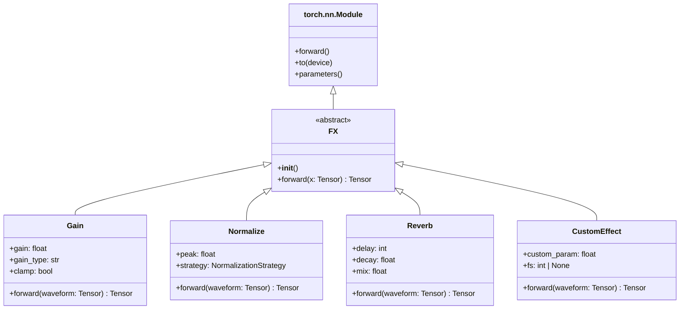
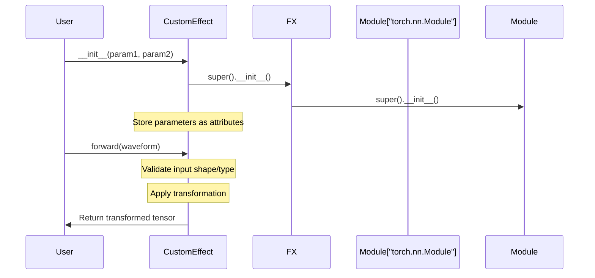
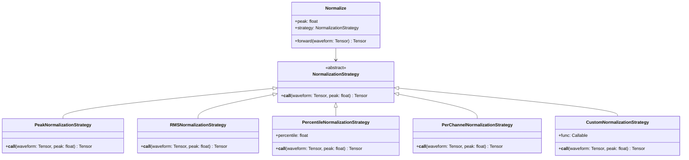
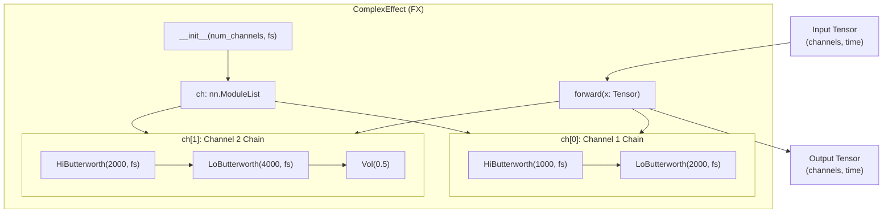
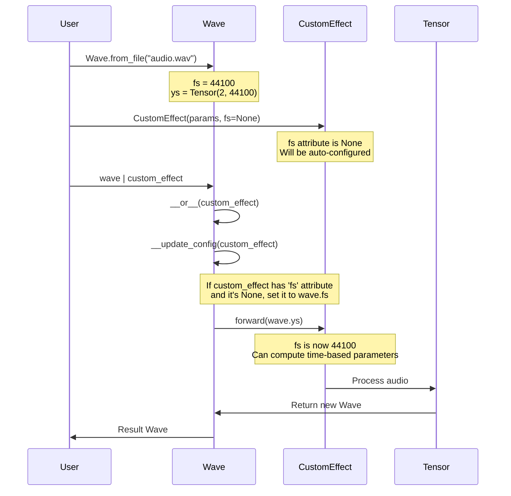

# 3.5 Creating Custom Effects

# Creating Custom Effects

<details>
<summary>Relevant source files</summary>

The following files were used as context for generating this wiki page:

- [examples/multi_channel_effect.py](examples/multi_channel_effect.py)
- [src/torchfx/effect.py](src/torchfx/effect.py)

</details>


This page explains how to create custom audio effects in torchfx by subclassing the `FX` abstract base class. It covers the basic requirements for custom effects, parameter handling, the strategy pattern for extensibility, and multi-channel processing.

For information about using built-in effects, see [Effects](#3). For creating custom filters, see [Creating Custom Filters](#4.4). For integration with PyTorch training pipelines, see [PyTorch Integration](#5.3).

## FX Base Class

All effects in torchfx must inherit from the `FX` abstract base class, which itself inherits from `torch.nn.Module`. This design ensures that effects are compatible with PyTorch's module system and can be used with standard PyTorch features like device management, gradient computation, and serialization.



**FX Class Inheritance Hierarchy**

Sources: [src/torchfx/effect.py:15-30]()

### Required Methods

The `FX` class defines two abstract methods that must be implemented by all subclasses:

| Method | Signature | Purpose |
|--------|-----------|---------|
| `__init__` | `__init__(self, *args, **kwargs) -> None` | Initialize effect parameters and call `super().__init__()` |
| `forward` | `forward(self, x: Tensor) -> Tensor` | Process input tensor and return transformed output |

Both methods are marked with the `@abc.abstractmethod` decorator, ensuring that subclasses must implement them. The `forward` method additionally uses the `@override` decorator for clarity.

Sources: [src/torchfx/effect.py:23-29]()

## Creating a Basic Custom Effect

The minimal structure for a custom effect requires:

1. Subclassing `FX`
2. Calling `super().__init__()` in the constructor
3. Implementing the `forward` method with tensor input/output
4. Optionally decorating `forward` with `@torch.no_grad()` for effects that don't require gradients



**Effect Initialization and Forward Pass Lifecycle**

Sources: [src/torchfx/effect.py:15-30]()

### Structure Template

A basic custom effect follows this structure:

```python
# Template structure based on built-in effects
class CustomEffect(FX):
    def __init__(self, param1: float, param2: int = 100) -> None:
        super().__init__()
        # Validate parameters
        assert param1 > 0, "param1 must be positive"
        # Store as instance attributes
        self.param1 = param1
        self.param2 = param2
    
    @override
    @torch.no_grad()
    def forward(self, waveform: Tensor) -> Tensor:
        # Process waveform tensor
        # Shape: (..., time) or (channels, time)
        processed = waveform * self.param1
        return processed
```

The `@torch.no_grad()` decorator is used in most built-in effects [src/torchfx/effect.py:73](), [src/torchfx/effect.py:127](), [src/torchfx/effect.py:308](), [src/torchfx/effect.py:684]() to disable gradient computation for inference-only effects. Omit this decorator if your effect will be used in training pipelines that require backpropagation.

Sources: [src/torchfx/effect.py:32-94](), [src/torchfx/effect.py:97-130]()

## Parameter Configuration and Validation

Custom effects should validate parameters in the constructor and store them as instance attributes. The library uses assertions for parameter validation.

### Common Validation Patterns

| Validation Type | Pattern | Example |
|----------------|---------|---------|
| Positive values | `assert value > 0` | [src/torchfx/effect.py:299]() |
| Range bounds | `assert 0 < value < 1` | [src/torchfx/effect.py:300]() |
| Range inclusive | `assert 0 <= value <= 1` | [src/torchfx/effect.py:301]() |
| Non-empty | `assert len(value) > 0` | Used in various contexts |
| Type checking | `assert isinstance(x, Type)` | [src/torchfx/effect.py:124]() |

### Sample Rate Handling

Effects that depend on the sampling frequency (like time-based effects) should accept an optional `fs` parameter. This parameter can be automatically configured when the effect is used with the Wave pipeline operator.

```python
# Pattern from Delay effect
class TimeBasedEffect(FX):
    def __init__(self, duration_ms: float, fs: int | None = None) -> None:
        super().__init__()
        self.duration_ms = duration_ms
        self.fs = fs  # Can be set by Wave.__update_config
        
        if fs is not None:
            assert fs > 0, "Sample rate must be positive"
            self.samples = int((duration_ms / 1000) * fs)
            self._needs_calculation = False
        else:
            self.samples = None
            self._needs_calculation = True
```

When `fs` is `None` at initialization, the `Wave` class will automatically set it when the effect is used in a pipeline. This is demonstrated in the `Delay` effect [src/torchfx/effect.py:603-625]().

Sources: [src/torchfx/effect.py:590-636](), [examples/multi_channel_effect.py:18-28]()

## Strategy Pattern for Extensibility

The strategy pattern allows effects to support multiple processing algorithms while maintaining a clean interface. This pattern is used extensively in the `Normalize` and `Delay` effects.



**Normalization Strategy Pattern Structure**

Sources: [src/torchfx/effect.py:97-261]()

### Implementing a Strategy-Based Effect

A strategy-based effect consists of:

1. An abstract strategy base class with a `__call__` method
2. Concrete strategy implementations
3. An effect class that delegates processing to the strategy

The abstract strategy class defines the processing interface:

```python
# Structure from NormalizationStrategy
class ProcessingStrategy(abc.ABC):
    @abc.abstractmethod
    def __call__(self, waveform: Tensor, param: float) -> Tensor:
        pass
```

Concrete strategies implement the abstract method with specific algorithms:

```python
# Pattern from PeakNormalizationStrategy
class ConcreteStrategy(ProcessingStrategy):
    def __call__(self, waveform: Tensor, param: float) -> Tensor:
        # Implement specific processing logic
        max_val = torch.max(torch.abs(waveform))
        return waveform / max_val * param if max_val > 0 else waveform
```

The effect class accepts a strategy in its constructor and delegates processing:

```python
# Pattern from Normalize effect
class StrategyBasedEffect(FX):
    def __init__(
        self,
        param: float,
        strategy: ProcessingStrategy | Callable | None = None
    ) -> None:
        super().__init__()
        self.param = param
        
        # Support custom callable functions
        if callable(strategy):
            strategy = CustomStrategy(strategy)
        
        # Use default strategy if none provided
        self.strategy = strategy or DefaultStrategy()
        
        # Validate strategy type
        if not isinstance(self.strategy, ProcessingStrategy):
            raise TypeError("Strategy must be an instance of ProcessingStrategy")
    
    @override
    def forward(self, waveform: Tensor) -> Tensor:
        return self.strategy(waveform, self.param)
```

Sources: [src/torchfx/effect.py:110-124](), [src/torchfx/effect.py:132-150](), [src/torchfx/effect.py:152-172]()

### Custom Strategy Example

Users can provide custom strategies either as callable functions or as strategy class instances:

```python
# As a callable (converted to CustomNormalizationStrategy internally)
def custom_normalize(waveform: Tensor, peak: float) -> Tensor:
    # Custom normalization logic
    return waveform * peak / waveform.std()

normalize = Normalize(peak=0.8, strategy=custom_normalize)

# As a strategy class instance
class MedianStrategy(NormalizationStrategy):
    def __call__(self, waveform: Tensor, peak: float) -> Tensor:
        median = torch.median(torch.abs(waveform))
        return waveform / median * peak if median > 0 else waveform

normalize = Normalize(peak=0.8, strategy=MedianStrategy())
```

The pattern of accepting `Callable` and wrapping it in a strategy class is implemented at [src/torchfx/effect.py:119-120]().

Sources: [src/torchfx/effect.py:141-150](), [src/torchfx/effect.py:325-357]()

## Multi-Channel Effects

Multi-channel effects process each audio channel independently or with channel-specific processing chains. The `ComplexEffect` example demonstrates this pattern using `torch.nn.ModuleList`.



**Multi-Channel Effect Architecture Using nn.ModuleList**

Sources: [examples/multi_channel_effect.py:1-74]()

### Implementation Pattern

The multi-channel effect pattern uses `nn.ModuleList` to store per-channel processing chains:

```python
# Structure from ComplexEffect example
class MultiChannelEffect(FX):
    ch: nn.ModuleList
    fs: int | None
    
    def __init__(self, num_channels: int, fs: int | None = None) -> None:
        super().__init__()
        self.num_channels = num_channels
        self.fs = fs
        
        # Create per-channel processing chains
        self.ch = nn.ModuleList([
            self.create_channel_chain(i)
            for i in range(num_channels)
        ])
    
    def create_channel_chain(self, channel_idx: int) -> nn.Module:
        # Return nn.Sequential or custom module for this channel
        return nn.Sequential(
            # Channel-specific effects
        )
    
    def forward(self, x: Tensor) -> Tensor:
        if self.fs is None:
            raise ValueError("Sampling frequency (fs) must be set.")
        
        # Process each channel with its own chain
        for i in range(self.num_channels):
            x[i] = self.ch[i](x[i])
        return x
```

Key aspects:

| Aspect | Implementation | Location |
|--------|---------------|----------|
| Channel storage | `ch: nn.ModuleList` | [examples/multi_channel_effect.py:15]() |
| Sample rate | `fs: int \| None` attribute | [examples/multi_channel_effect.py:16]() |
| Per-channel chains | Separate methods for each channel | [examples/multi_channel_effect.py:29-40]() |
| Processing loop | Iterate over channels in `forward()` | [examples/multi_channel_effect.py:46-48]() |

Sources: [examples/multi_channel_effect.py:14-49]()

### Channel-Specific Processing

The example demonstrates creating different processing chains for each channel:

**Channel 1 Processing Chain** [examples/multi_channel_effect.py:29-33]():
- High-pass Butterworth filter at 1000 Hz
- Low-pass Butterworth filter at 2000 Hz
- Result: Band-pass filtered signal (1000-2000 Hz)

**Channel 2 Processing Chain** [examples/multi_channel_effect.py:35-40]():
- High-pass Butterworth filter at 2000 Hz
- Low-pass Butterworth filter at 4000 Hz
- Volume reduction to 50%
- Result: Band-pass filtered signal (2000-4000 Hz) at reduced amplitude

This pattern allows for complex routing and processing scenarios such as:
- Frequency splitting (crossovers)
- Stereo widening effects
- Mid-side processing
- Per-channel dynamics

Sources: [examples/multi_channel_effect.py:29-40]()

## Integration with Wave Pipeline

Custom effects integrate seamlessly with the Wave pipeline operator (`|`) and inherit automatic configuration capabilities.



**Automatic Configuration Flow in Pipeline**

### Auto-Configuration Mechanism

When a custom effect has an `fs` attribute set to `None`, the Wave class automatically configures it when the effect is used in a pipeline. This mechanism is implemented in the `Wave.__update_config` method (referenced in the high-level diagrams).

```python
# Pattern for auto-configurable effects
class TimeBasedCustomEffect(FX):
    def __init__(self, duration_ms: float, fs: int | None = None) -> None:
        super().__init__()
        self.duration_ms = duration_ms
        self.fs = fs  # Set to None for auto-configuration
        
        if fs is not None:
            self.samples = self._calculate_samples(fs)
        else:
            self.samples = None
    
    def _calculate_samples(self, fs: int) -> int:
        return int((self.duration_ms / 1000) * fs)
    
    def forward(self, waveform: Tensor) -> Tensor:
        if self.fs is None:
            raise ValueError("fs must be set")
        
        if self.samples is None:
            self.samples = self._calculate_samples(self.fs)
        
        # Use self.samples for processing
        return waveform
```

The `Delay` effect demonstrates lazy parameter calculation when `fs` is not available at initialization [src/torchfx/effect.py:694-704]().

Sources: [src/torchfx/effect.py:590-714]()

### Device Handling

Custom effects automatically inherit device management from `torch.nn.Module`. Effects can be moved to GPU using `.to()`:

```python
# Effects automatically handle device placement
custom_effect = CustomEffect(param=0.5)
custom_effect.to("cuda")  # Move to GPU

# Or use in pipeline - Wave handles device
wave = Wave.from_file("audio.wav").to("cuda")
result = wave | custom_effect  # Effect processes on GPU
```

The `ComplexEffect` example shows device selection [examples/multi_channel_effect.py:62-63]().

Sources: [examples/multi_channel_effect.py:62-67]()

## Complete Example: Time-Delayed Multi-Tap Effect

This example combines multiple concepts: strategy pattern, sample rate handling, and parameter validation.

```python
# Custom multi-tap delay with decay strategy
class DecayStrategy(abc.ABC):
    @abc.abstractmethod
    def calculate_amplitude(self, tap_index: int, base_feedback: float) -> float:
        pass

class ExponentialDecayStrategy(DecayStrategy):
    def calculate_amplitude(self, tap_index: int, base_feedback: float) -> float:
        return base_feedback ** tap_index

class LinearDecayStrategy(DecayStrategy):
    def calculate_amplitude(self, tap_index: int, base_feedback: float) -> float:
        return max(0.0, 1.0 - (tap_index * (1.0 - base_feedback)))

class MultiTapDelay(FX):
    def __init__(
        self,
        delay_ms: float,
        taps: int = 3,
        feedback: float = 0.5,
        fs: int | None = None,
        strategy: DecayStrategy | None = None
    ) -> None:
        super().__init__()
        assert delay_ms > 0, "Delay must be positive"
        assert taps >= 1, "At least one tap required"
        assert 0 <= feedback <= 1, "Feedback must be in [0, 1]"
        
        self.delay_ms = delay_ms
        self.taps = taps
        self.feedback = feedback
        self.fs = fs
        self.strategy = strategy or ExponentialDecayStrategy()
        
        if fs is not None:
            assert fs > 0, "Sample rate must be positive"
            self.delay_samples = int((delay_ms / 1000) * fs)
        else:
            self.delay_samples = None
    
    @override
    @torch.no_grad()
    def forward(self, waveform: Tensor) -> Tensor:
        if self.fs is None:
            raise ValueError("Sample rate (fs) must be set")
        
        if self.delay_samples is None:
            self.delay_samples = int((self.delay_ms / 1000) * self.fs)
        
        # Calculate output length
        max_delay = self.delay_samples * self.taps
        output_length = waveform.size(-1) + max_delay
        
        # Create output tensor
        if waveform.ndim == 1:
            output = torch.zeros(output_length, dtype=waveform.dtype, device=waveform.device)
        else:
            output = torch.zeros(
                *waveform.shape[:-1], output_length,
                dtype=waveform.dtype, device=waveform.device
            )
        
        # Add original signal
        output[..., :waveform.size(-1)] = waveform
        
        # Add delayed taps with strategy-based decay
        for tap in range(1, self.taps + 1):
            tap_delay = self.delay_samples * tap
            amplitude = self.strategy.calculate_amplitude(tap, self.feedback)
            
            if waveform.ndim == 1:
                output[tap_delay:tap_delay + waveform.size(-1)] += waveform * amplitude
            else:
                output[..., tap_delay:tap_delay + waveform.size(-1)] += waveform * amplitude
        
        return output
```

This example demonstrates:

1. **Strategy Pattern**: `DecayStrategy` abstract class with multiple implementations
2. **Sample Rate Handling**: Optional `fs` parameter with lazy calculation
3. **Parameter Validation**: Assertions for all parameters
4. **Tensor Shape Handling**: Support for both 1D and multi-dimensional tensors
5. **Device Compatibility**: Uses tensor device and dtype from input

Usage:

```python
# With explicit sample rate
delay = MultiTapDelay(delay_ms=100, taps=4, feedback=0.6, fs=44100)
output = delay(waveform)

# With Wave pipeline (auto-configured fs)
delay = MultiTapDelay(delay_ms=100, taps=4, feedback=0.6)
wave = Wave.from_file("audio.wav")
result = wave | delay  # fs automatically set to wave.fs

# With custom strategy
linear_delay = MultiTapDelay(
    delay_ms=100, taps=4, feedback=0.6,
    strategy=LinearDecayStrategy()
)
result = wave | linear_delay
```

Sources: [src/torchfx/effect.py:325-492](), [src/torchfx/effect.py:494-714]()

## Summary

Creating custom effects in torchfx requires:

| Requirement | Implementation | Reference |
|------------|----------------|-----------|
| Inheritance | Subclass `FX` | [src/torchfx/effect.py:15]() |
| Constructor | Call `super().__init__()` | All effect `__init__` methods |
| Forward method | Implement `forward(x: Tensor) -> Tensor` | [src/torchfx/effect.py:29]() |
| Parameter validation | Use assertions in `__init__` | [src/torchfx/effect.py:299-301]() |
| Sample rate handling | Optional `fs: int \| None` attribute | [src/torchfx/effect.py:603]() |
| Strategy pattern | Abstract strategy class + concrete implementations | [src/torchfx/effect.py:132-261]() |
| Multi-channel | Use `nn.ModuleList` for per-channel chains | [examples/multi_channel_effect.py:22-27]() |

Custom effects automatically integrate with:
- Wave pipeline operator (`|`)
- PyTorch device management (`.to()`)
- Automatic configuration (`fs` parameter)
- Neural network training (if gradients are enabled)

Sources: [src/torchfx/effect.py:15-714](), [examples/multi_channel_effect.py:14-74]()