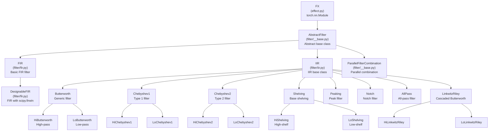
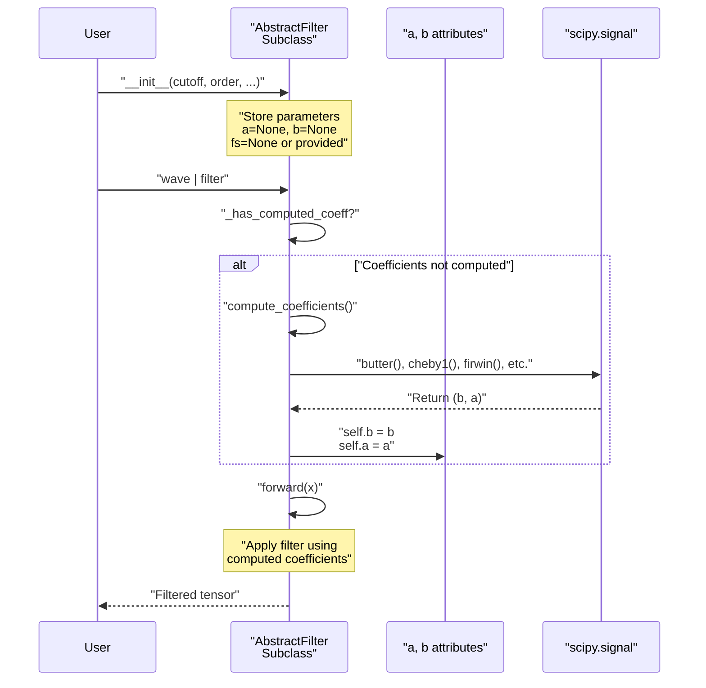
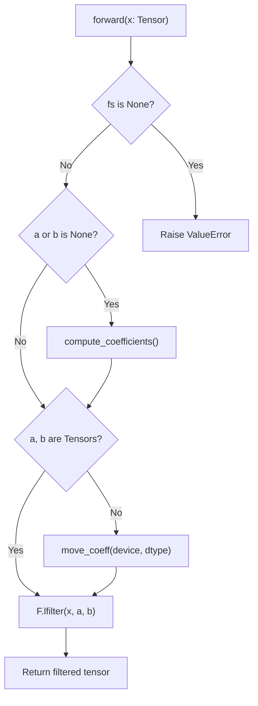
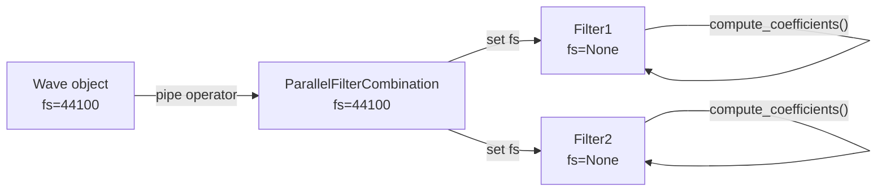
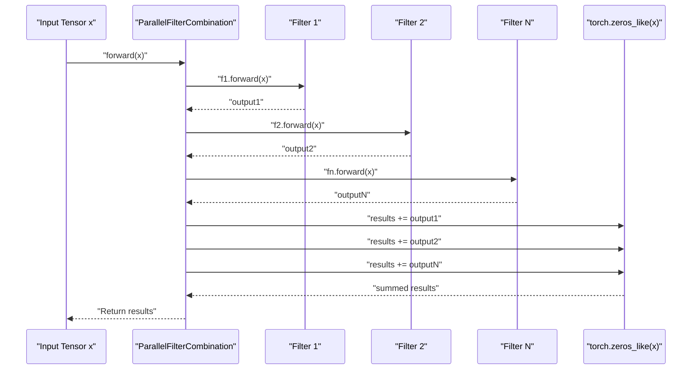
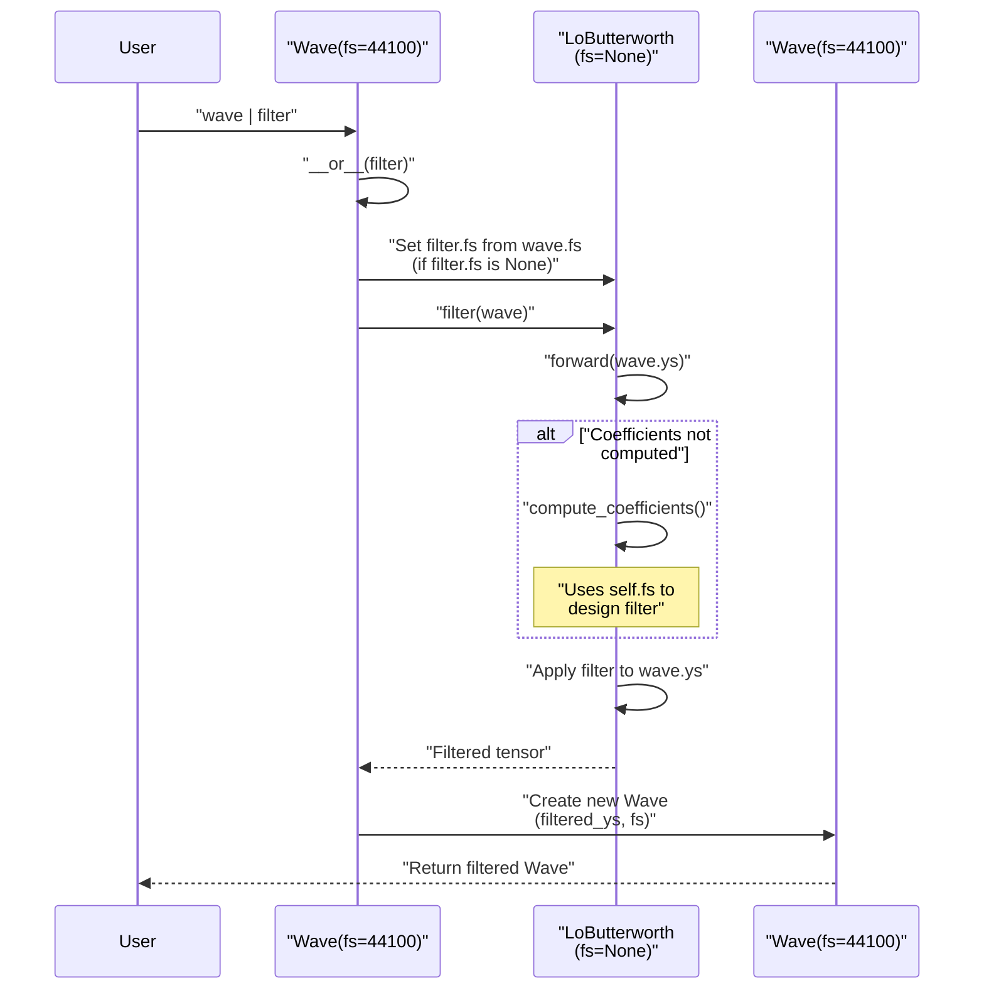

# 4 Filters

# Filters

<details>
<summary>Relevant source files</summary>

The following files were used as context for generating this wiki page:

- [src/torchfx/filter/__base.py](src/torchfx/filter/__base.py)
- [src/torchfx/filter/fir.py](src/torchfx/filter/fir.py)
- [src/torchfx/filter/iir.py](src/torchfx/filter/iir.py)

</details>


## Purpose and Scope

This document describes the filter system in torchfx, which provides frequency-domain audio processing capabilities. Filters are specialized audio effects that modify the frequency content of signals by attenuating or amplifying specific frequency ranges.

The filter module implements two main categories of digital filters: **IIR (Infinite Impulse Response)** and **FIR (Finite Impulse Response)** filters. All filters inherit from the `AbstractFilter` base class and integrate seamlessly with the torchfx pipeline operator.

For general audio effects (gain, reverb, delay, normalization), see [Effects](#3). For information on creating custom filters, see [Creating Custom Filters](#4.4). For specific IIR filter implementations, see [IIR Filters](#4.1). For FIR filter implementations, see [FIR Filters](#4.2).

**Sources:** [src/torchfx/filter/__base.py:1-108](), [src/torchfx/filter/iir.py:1-20](), [src/torchfx/filter/fir.py:1-15]()

## Filter Architecture

The filter system is organized as a class hierarchy with `AbstractFilter` as the base class. All filters inherit from both `AbstractFilter` and the `FX` base class, making them compatible with PyTorch's `nn.Module` system and the torchfx pipeline operator.

### Filter Class Hierarchy



**Sources:** [src/torchfx/filter/__base.py:11-41](), [src/torchfx/filter/iir.py:19-68](), [src/torchfx/filter/fir.py:15-137]()

## AbstractFilter Base Class

The `AbstractFilter` class defines the interface for all filters in torchfx. It inherits from `FX` (which inherits from `torch.nn.Module`) and provides the foundational structure for filter implementations.

### Core Interface

| Method/Property | Purpose | Implementation |
|----------------|---------|----------------|
| `compute_coefficients()` | Abstract method to compute filter coefficients (a, b) | Must be implemented by subclasses |
| `_has_computed_coeff` | Property checking if coefficients have been computed | Checks for existence of non-None `a` and `b` attributes |
| `__add__()` | Operator overload for parallel filter combination | Returns `ParallelFilterCombination` instance |
| `forward()` | Apply filter to input tensor | Inherited from `IIR` or `FIR` subclasses |

The `AbstractFilter` class enforces a lazy coefficient computation pattern: coefficients are computed on first use rather than at initialization. This allows filters to be constructed without a sampling rate, which can be provided later through the pipeline.

### Coefficient Computation Pattern



**Sources:** [src/torchfx/filter/__base.py:11-41](), [src/torchfx/filter/iir.py:52-66]()

## IIR vs FIR Filters

The filter module provides both IIR and FIR filter implementations, each with different characteristics and use cases.

### Comparison Table

| Characteristic | IIR Filters | FIR Filters |
|---------------|-------------|-------------|
| **Base Class** | `IIR` [iir.py:19-67]() | `FIR` [fir.py:15-79]() |
| **Coefficients** | `a` (denominator) and `b` (numerator) | `b` only (a=[1.0]) |
| **Impulse Response** | Infinite (recursive feedback) | Finite (non-recursive) |
| **Phase Response** | Non-linear phase | Can have linear phase |
| **Computational Efficiency** | More efficient (fewer taps) | Less efficient (more taps) |
| **Stability** | Can be unstable if poorly designed | Always stable |
| **Implementation** | `torchaudio.functional.lfilter()` | `torch.nn.functional.conv1d()` |
| **SciPy Design** | `butter()`, `cheby1()`, `cheby2()`, `iirnotch()`, `iirpeak()` | `firwin()` |

### Filter Application Methods

**IIR Filters** use `torchaudio.functional.lfilter()` for recursive filtering:

```
y[n] = (b[0]*x[n] + b[1]*x[n-1] + ... + b[M]*x[n-M]
        - a[1]*y[n-1] - ... - a[N]*y[n-N]) / a[0]
```

Implementation: [src/torchfx/filter/iir.py:52-66]()

**FIR Filters** use `torch.nn.functional.conv1d()` for convolution-based filtering:

```
y[n] = b[0]*x[n] + b[1]*x[n-1] + ... + b[K]*x[n-K]
```

Implementation: [src/torchfx/filter/fir.py:36-78]()

**Sources:** [src/torchfx/filter/iir.py:19-67](), [src/torchfx/filter/fir.py:15-79]()

## Coefficient Computation and Device Management

### IIR Coefficient Management

IIR filters store coefficients as `a` and `b` attributes, which can be:
- `None` (not yet computed)
- `Sequence[float]` (computed but not moved to device)
- `Tensor` (computed and moved to device)

The `move_coeff()` method handles device and dtype conversion:

```python
def move_coeff(self, device: Device, dtype: dtype = torch.float32) -> None:
    """Move the filter coefficients to the specified device and dtype."""
    self.a = torch.as_tensor(self.a, device=device, dtype=dtype)
    self.b = torch.as_tensor(self.b, device=device, dtype=dtype)
```

Implementation: [src/torchfx/filter/iir.py:47-50]()

### Forward Pass Logic



**Sources:** [src/torchfx/filter/iir.py:52-66](), [src/torchfx/filter/iir.py:47-50]()

### FIR Coefficient Storage

FIR filters store coefficients in a registered buffer, which automatically handles device management:

```python
def __init__(self, b: ArrayLike) -> None:
    super().__init__()
    # Flip the kernel for causal convolution (like lfilter)
    b_tensor = torch.tensor(b, dtype=torch.float32).flip(0)
    self.a = [1.0]  # FIR filter denominator is always 1
    self.register_buffer("kernel", b_tensor[None, None, :])  # [1, 1, K]
```

The `register_buffer()` method ensures the kernel automatically moves to the correct device when the module is moved.

Implementation: [src/torchfx/filter/fir.py:22-27]()

**Sources:** [src/torchfx/filter/fir.py:15-79]()

## Sampling Rate (fs) Management

All filters require a sampling rate (`fs`) to compute coefficients properly. The `fs` attribute can be provided:

1. **At construction time**: `filter = LoButterworth(1000, fs=44100)`
2. **Through the pipeline**: When a `Wave` object with `fs` attribute passes through the filter
3. **Via ParallelFilterCombination**: When filters are combined with `+`, the `fs` is propagated

### Sampling Rate Propagation



The `ParallelFilterCombination` class has a special `fs` setter that propagates the sampling rate to all child filters:

```python
@fs.setter
def fs(self, value: int | None) -> None:
    self._fs = value
    if value is not None:
        for f in self.filters:
            if hasattr(f, "fs") and f.fs is None:
                f.fs = value
```

Implementation: [src/torchfx/filter/__base.py:87-93]()

**Sources:** [src/torchfx/filter/__base.py:74-93](), [src/torchfx/filter/iir.py:42-45]()

## ParallelFilterCombination

The `ParallelFilterCombination` class enables parallel composition of multiple filters using the `+` operator. The output is the sum of all filter outputs.

### Usage Pattern

```python
lowpass = fx_filter.LoButterworth(1000, order=2)
highpass = fx_filter.HiButterworth(200, order=2)
combined_filter = lowpass + highpass
result = wave | combined_filter
```

### Operator Overloading

The `AbstractFilter` class implements `__add__()` and `__radd__()` to support the `+` operator:

```python
def __add__(self, other: "AbstractFilter") -> "ParallelFilterCombination":
    assert isinstance(other, AbstractFilter), "Can only add AbstractFilter instances"
    return ParallelFilterCombination(self, other)
```

Implementation: [src/torchfx/filter/__base.py:34-40]()

### Parallel Execution Flow



### Implementation Details

The `ParallelFilterCombination.forward()` method:

```python
@override
@torch.no_grad()
def forward(self, x: Tensor) -> Tensor:
    outputs = [f.forward(x) for f in self.filters]
    results = torch.zeros_like(x)
    for t in outputs:
        results += t
    return results
```

Implementation: [src/torchfx/filter/__base.py:101-107]()

**Key Properties:**
- All filters receive the same input tensor
- Outputs are summed element-wise
- Coefficients are computed for all filters via `compute_coefficients()`
- The `_has_computed_coeff` property checks all child filters

**Sources:** [src/torchfx/filter/__base.py:43-107]()

## Multi-Channel Processing

Both IIR and FIR filters support multi-channel audio processing with different tensor shape conventions.

### Supported Tensor Shapes

| Shape | Description | Example |
|-------|-------------|---------|
| `[T]` | Single-channel, unbatched | Mono audio |
| `[C, T]` | Multi-channel, unbatched | Stereo or multi-track |
| `[B, C, T]` | Batched multi-channel | Multiple audio files |

Where:
- `T` = time dimension (samples)
- `C` = channel dimension
- `B` = batch dimension

### FIR Multi-Channel Implementation

FIR filters use grouped convolution to process channels independently:

```python
# Expand kernel to match number of channels
kernel_exp = kernel.expand(CHANNELS, 1, -1)  # [C, 1, K]

# Apply convolution with groups = C (same kernel per channel, repeated for batch)
y = nn.functional.conv1d(x_padded, kernel_exp.repeat(BATCHES, 1, 1), groups=CHANNELS)
```

Implementation: [src/torchfx/filter/fir.py:44-78]()

### IIR Multi-Channel Implementation

IIR filters use `torchaudio.functional.lfilter()`, which automatically handles multi-channel processing:

```python
return F.lfilter(x, self.a, self.b)  # Handles [T], [C, T], [B, C, T] automatically
```

Implementation: [src/torchfx/filter/iir.py:66]()

**Sources:** [src/torchfx/filter/fir.py:36-78](), [src/torchfx/filter/iir.py:52-66]()

## Integration with Pipeline Operator

Filters integrate with the torchfx pipeline through the `Wave` class's `__or__()` operator. The pipeline handles automatic sampling rate configuration and coefficient computation.

### Pipeline Flow with Filters



### Automatic Configuration

When a filter is used in a pipeline without an explicit `fs`, the sampling rate is automatically inferred from the `Wave` object. This is handled by the `FX` base class's `__call__()` method, which checks for an `fs` attribute on the input.

**Sources:** [src/torchfx/filter/__base.py:11-41](), [src/torchfx/effect.py]()

## Filter Categories Summary

### IIR Filter Types

| Filter Type | Classes | Cutoff Type | Use Case |
|------------|---------|-------------|----------|
| **Butterworth** | `Butterworth`, `HiButterworth`, `LoButterworth` | Single | Maximally flat passband |
| **Chebyshev Type I** | `Chebyshev1`, `HiChebyshev1`, `LoChebyshev1` | Single | Ripple in passband, steeper rolloff |
| **Chebyshev Type II** | `Chebyshev2`, `HiChebyshev2`, `LoChebyshev2` | Single | Ripple in stopband |
| **Shelving** | `Shelving`, `HiShelving`, `LoShelving` | Single | Boost/cut high or low frequencies |
| **Peaking** | `Peaking` | Single | Boost/cut at specific frequency |
| **Notch** | `Notch` | Single | Remove specific frequency |
| **All-Pass** | `AllPass` | Single | Phase modification without amplitude change |
| **Linkwitz-Riley** | `LinkwitzRiley`, `HiLinkwitzRiley`, `LoLinkwitzRiley` | Single | Crossover filters (-6 dB at cutoff) |

### FIR Filter Types

| Filter Type | Class | Design Method | Use Case |
|------------|-------|---------------|----------|
| **Basic FIR** | `FIR` | Pre-computed coefficients | Custom filter designs |
| **Designable FIR** | `DesignableFIR` | `scipy.signal.firwin()` | Window-based FIR design |

**Sources:** [src/torchfx/filter/iir.py:69-481](), [src/torchfx/filter/fir.py:15-137]()