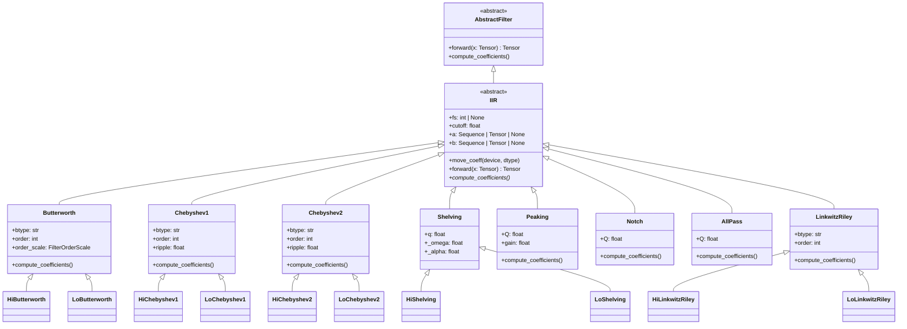
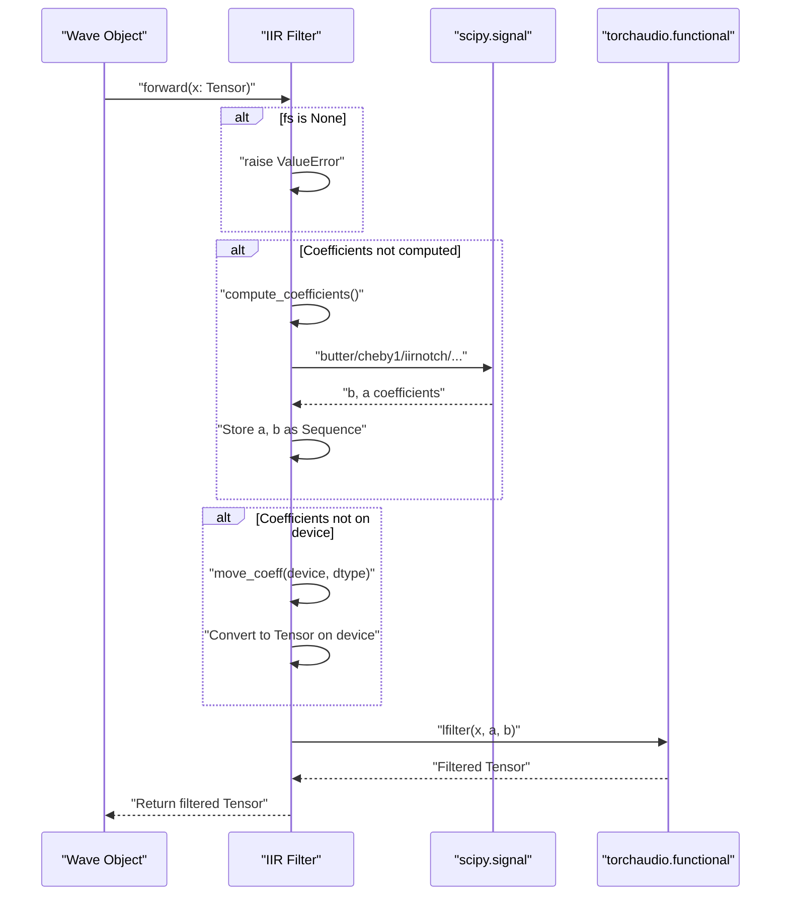
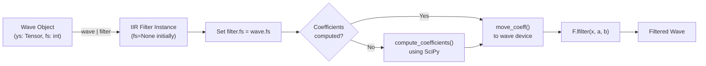

# 4.1 IIR Filters

# IIR Filters

<details>
<summary>Relevant source files</summary>

The following files were used as context for generating this wiki page:

- [README.md](README.md)
- [examples/series_and_parallel_filters.py](examples/series_and_parallel_filters.py)
- [src/torchfx/filter/iir.py](src/torchfx/filter/iir.py)

</details>


## Purpose and Scope

This page documents the IIR (Infinite Impulse Response) filter implementations in torchfx. IIR filters are recursive digital filters that provide efficient frequency-domain transformations with minimal computational overhead. This page covers the `IIR` base class and all its concrete implementations including Butterworth, Chebyshev, Shelving, Peaking, Notch, AllPass, and Linkwitz-Riley filters.

For general filter concepts and the `AbstractFilter` base class, see [Filters](#4). For FIR filter implementations, see [FIR Filters](#4.2). For combining filters in parallel, see [Parallel Filter Combination](#4.3).

**Sources**: [src/torchfx/filter/iir.py:1-482]()

## Architecture Overview

All IIR filters in torchfx inherit from the `IIR` abstract base class, which itself inherits from `AbstractFilter`. The design uses lazy coefficient computation: filter coefficients are calculated only when the filter is first applied to audio data, using the sampling rate from the input signal.

### IIR Filter Class Hierarchy



**Sources**: [src/torchfx/filter/iir.py:19-482](), [src/torchfx/filter/__base.py]()

## IIR Base Class

The `IIR` class at [src/torchfx/filter/iir.py:19-67]() provides the foundation for all IIR filter implementations. It defines the interface for coefficient storage and the filtering operation.

### Key Attributes

| Attribute | Type | Description |
|-----------|------|-------------|
| `fs` | `int \| None` | Sampling frequency in Hz, initially `None` until set from input signal |
| `cutoff` | `float` | Cutoff frequency in Hz |
| `a` | `Sequence[float] \| Tensor \| None` | Denominator coefficients (feedback) |
| `b` | `Sequence[float] \| Tensor \| None` | Numerator coefficients (feedforward) |

### Coefficient Management

The `IIR.forward()` method at [src/torchfx/filter/iir.py:52-66]() implements lazy coefficient computation:

1. Checks if `fs` is set (raises `ValueError` if not)
2. Computes coefficients if `a` or `b` are `None`
3. Moves coefficients to the input tensor's device if needed
4. Applies the filter using `torchaudio.functional.lfilter`

The `move_coeff()` method at [src/torchfx/filter/iir.py:47-50]() converts coefficient sequences to PyTorch tensors on the appropriate device.

**Sources**: [src/torchfx/filter/iir.py:19-67]()

## Coefficient Computation Flow



**Sources**: [src/torchfx/filter/iir.py:52-67]()

## Filter Implementations

### Butterworth Filters

The `Butterworth` class at [src/torchfx/filter/iir.py:69-96]() implements maximally flat magnitude response filters. Butterworth filters have no ripple in the passband or stopband, providing smooth frequency response.

**Parameters:**

| Parameter | Type | Default | Description |
|-----------|------|---------|-------------|
| `btype` | `str` | - | Filter type: `"lowpass"`, `"highpass"`, `"bandpass"`, or `"bandstop"` |
| `cutoff` | `float` | - | Cutoff frequency in Hz |
| `order` | `int` | `4` | Filter order (higher = steeper rolloff) |
| `order_scale` | `FilterOrderScale` | `"linear"` | Scale mode: `"linear"` or `"db"` (if `"db"`, order divided by 6) |
| `fs` | `int \| None` | `None` | Sampling frequency in Hz |

The coefficient computation at [src/torchfx/filter/iir.py:89-95]() uses `scipy.signal.butter`, normalizing the cutoff frequency to the Nyquist frequency (`0.5 * fs`).

**Convenience Classes:**
- `HiButterworth` at [src/torchfx/filter/iir.py:216-226](): High-pass filter with default order 5
- `LoButterworth` at [src/torchfx/filter/iir.py:229-239](): Low-pass filter with default order 5

**Usage Example:**

```python
import torchfx as fx

# Create low-pass filter at 1000 Hz with 4th order
lpf = fx.filter.LoButterworth(cutoff=1000, order=4)

# Apply to audio (fs will be extracted from Wave)
filtered = wave | lpf
```

**Sources**: [src/torchfx/filter/iir.py:69-239](), [README.md:41-44](), [examples/series_and_parallel_filters.py:17-18]()

### Chebyshev Filters

Chebyshev filters provide steeper rolloff than Butterworth filters at the cost of ripple in either the passband (Type 1) or stopband (Type 2).

#### Chebyshev Type 1

The `Chebyshev1` class at [src/torchfx/filter/iir.py:98-131]() implements filters with ripple in the passband but monotonic stopband.

**Parameters:**

| Parameter | Type | Default | Description |
|-----------|------|---------|-------------|
| `btype` | `str` | - | Filter type: `"lowpass"`, `"highpass"`, `"bandpass"`, or `"bandstop"` |
| `cutoff` | `float` | - | Cutoff frequency in Hz |
| `order` | `int` | `4` | Filter order |
| `ripple` | `float` | `0.1` | Maximum passband ripple in dB |
| `fs` | `int \| None` | `None` | Sampling frequency in Hz |

Coefficient computation at [src/torchfx/filter/iir.py:119-130]() uses `scipy.signal.cheby1`.

**Convenience Classes:**
- `HiChebyshev1` at [src/torchfx/filter/iir.py:164-174](): High-pass variant
- `LoChebyshev1` at [src/torchfx/filter/iir.py:177-187](): Low-pass variant

#### Chebyshev Type 2

The `Chebyshev2` class at [src/torchfx/filter/iir.py:133-162]() implements filters with ripple in the stopband but monotonic passband.

**Parameters:** Same as Type 1, but `ripple` specifies stopband attenuation.

**Convenience Classes:**
- `HiChebyshev2` at [src/torchfx/filter/iir.py:190-200](): High-pass variant
- `LoChebyshev2` at [src/torchfx/filter/iir.py:203-213](): Low-pass variant

**Sources**: [src/torchfx/filter/iir.py:98-213](), [examples/series_and_parallel_filters.py:18]()

### Shelving Filters

The `Shelving` base class at [src/torchfx/filter/iir.py:242-270]() provides common functionality for shelving filters, which boost or cut frequencies above or below a cutoff.

**Key Properties:**
- `_omega` at [src/torchfx/filter/iir.py:261-265](): Angular frequency `2π * cutoff / fs`
- `_alpha` at [src/torchfx/filter/iir.py:267-269](): Filter parameter `sin(ω) / (2Q)`

#### High Shelving

The `HiShelving` class at [src/torchfx/filter/iir.py:272-306]() boosts or cuts high frequencies above the cutoff.

**Parameters:**

| Parameter | Type | Default | Description |
|-----------|------|---------|-------------|
| `cutoff` | `float` | - | Transition frequency in Hz |
| `q` | `float` | - | Q factor (controls transition steepness) |
| `gain` | `float` | - | Gain amount (linear or dB depending on `gain_scale`) |
| `gain_scale` | `FilterOrderScale` | `"linear"` | Gain interpretation: `"linear"` or `"db"` |
| `fs` | `int \| None` | `None` | Sampling frequency in Hz |

The coefficient computation at [src/torchfx/filter/iir.py:290-305]() implements the standard biquad shelving filter equations.

#### Low Shelving

The `LoShelving` class at [src/torchfx/filter/iir.py:308-317]() is currently a placeholder without implementation.

**Sources**: [src/torchfx/filter/iir.py:242-317](), [README.md:44]()

### Peaking Filter

The `Peaking` class at [src/torchfx/filter/iir.py:320-347]() implements a parametric EQ peak/notch filter that boosts or cuts a narrow frequency band.

**Parameters:**

| Parameter | Type | Description |
|-----------|------|-------------|
| `cutoff` | `float` | Center frequency in Hz |
| `Q` | `float` | Q factor (bandwidth = `cutoff / Q`) |
| `gain` | `float` | Peak gain (linear or dB) |
| `gain_scale` | `FilterOrderScale` | Gain interpretation mode |
| `fs` | `int \| None` | Sampling frequency in Hz |

Coefficient computation at [src/torchfx/filter/iir.py:340-346]() uses `scipy.signal.iirpeak`.

**Sources**: [src/torchfx/filter/iir.py:320-347]()

### Notch Filter

The `Notch` class at [src/torchfx/filter/iir.py:349-368]() creates a narrow rejection band at a specific frequency, useful for removing tonal interference like 60 Hz hum.

**Parameters:**

| Parameter | Type | Description |
|-----------|------|-------------|
| `cutoff` | `float` | Notch center frequency in Hz |
| `Q` | `float` | Q factor (notch width = `cutoff / Q`) |
| `fs` | `int \| None` | Sampling frequency in Hz |

Coefficient computation at [src/torchfx/filter/iir.py:362-368]() uses `scipy.signal.iirnotch`.

**Sources**: [src/torchfx/filter/iir.py:349-368]()

### AllPass Filter

The `AllPass` class at [src/torchfx/filter/iir.py:371-390]() provides unity magnitude response at all frequencies but introduces frequency-dependent phase shift. Useful for phase correction and creating reverb effects.

**Parameters:**

| Parameter | Type | Description |
|-----------|------|-------------|
| `cutoff` | `float` | Center frequency in Hz |
| `Q` | `float` | Q factor |
| `fs` | `int \| None` | Sampling frequency in Hz |

Coefficient computation at [src/torchfx/filter/iir.py:384-390]() uses `scipy.signal.iirpeak`.

**Sources**: [src/torchfx/filter/iir.py:371-390]()

### Linkwitz-Riley Filters

The `LinkwitzRiley` class at [src/torchfx/filter/iir.py:393-456]() implements filters designed for crossover networks. These filters are created by cascading two identical Butterworth filters, resulting in -6 dB gain at the cutoff frequency and complementary magnitude responses.

**Key Characteristics:**
- Order must be an even positive integer (validated at [src/torchfx/filter/iir.py:428-429]())
- Achieved by cascading two Butterworth filters of half the order
- Provides flat summed magnitude response when combining high-pass and low-pass sections

**Parameters:**

| Parameter | Type | Default | Description |
|-----------|------|---------|-------------|
| `btype` | `str` | - | Filter type: `"lowpass"` or `"highpass"` |
| `cutoff` | `float` | - | Crossover frequency in Hz |
| `order` | `int` | `4` | Filter order (must be even) |
| `order_scale` | `FilterOrderScale` | `"linear"` | Scale mode |
| `fs` | `int \| None` | `None` | Sampling frequency in Hz |

Coefficient computation at [src/torchfx/filter/iir.py:436-455]() creates a Butterworth filter of half the order, then cascades it by convolving the coefficients with themselves using `numpy.convolve`.

**Convenience Classes:**
- `HiLinkwitzRiley` at [src/torchfx/filter/iir.py:458-468](): High-pass variant
- `LoLinkwitzRiley` at [src/torchfx/filter/iir.py:471-481](): Low-pass variant

**Sources**: [src/torchfx/filter/iir.py:393-481]()

## Filter Coefficient Design

All IIR filter implementations in torchfx delegate coefficient computation to SciPy's `scipy.signal` module. The following table maps filter classes to their underlying SciPy functions:

| Filter Class | SciPy Function | File Reference |
|--------------|----------------|----------------|
| `Butterworth` | `scipy.signal.butter` | [src/torchfx/filter/iir.py:93]() |
| `Chebyshev1` | `scipy.signal.cheby1` | [src/torchfx/filter/iir.py:123-128]() |
| `Chebyshev2` | `scipy.signal.cheby2` | [src/torchfx/filter/iir.py:154-159]() |
| `HiShelving` | Manual biquad equations | [src/torchfx/filter/iir.py:291-305]() |
| `Peaking` | `scipy.signal.iirpeak` | [src/torchfx/filter/iir.py:344]() |
| `Notch` | `scipy.signal.iirnotch` | [src/torchfx/filter/iir.py:366]() |
| `AllPass` | `scipy.signal.iirpeak` | [src/torchfx/filter/iir.py:388]() |
| `LinkwitzRiley` | `scipy.signal.butter` + `numpy.convolve` | [src/torchfx/filter/iir.py:451-455]() |

The computed coefficients are stored as Python sequences initially, then converted to PyTorch tensors and moved to the appropriate device during the first `forward()` call.

**Sources**: [src/torchfx/filter/iir.py:1-482]()

## Integration with Wave Processing



The diagram above shows how IIR filters integrate with the Wave processing pipeline. Key points:

1. The pipe operator triggers `filter.configure(wave)` (inherited from `AbstractFilter`)
2. This sets `filter.fs = wave.fs` to enable coefficient computation
3. On first `forward()` call, coefficients are computed from filter parameters
4. Coefficients are automatically moved to the input tensor's device
5. Filtering is performed using `torchaudio.functional.lfilter`

**Sources**: [src/torchfx/filter/iir.py:52-66](), [src/torchfx/filter/__base.py]()

## Usage Patterns

### Basic Filtering

```python
import torchfx as fx

# Load audio
wave = fx.Wave.from_file("input.wav")

# Apply single filter
filtered = wave | fx.filter.LoButterworth(cutoff=1000, order=4)

# Save result
filtered.save("output.wav")
```

### Chaining Filters in Series

```python
# Chain multiple filters using the pipe operator
result = (
    wave
    | fx.filter.LoButterworth(cutoff=100, order=2)
    | fx.filter.HiShelving(cutoff=2000, q=0.7, gain=6.0, gain_scale="db")
)
```

**Sources**: [examples/series_and_parallel_filters.py:16-20]()

### Combining Filters in Parallel

```python
# Parallel combination using + operator
parallel_filter = (
    fx.filter.HiButterworth(2000, order=2) 
    + fx.filter.HiChebyshev1(2000, order=2)
)

result = wave | fx.filter.LoButterworth(100, order=2) | parallel_filter
```

**Sources**: [examples/series_and_parallel_filters.py:16-20]()

### GPU Acceleration

```python
import torch

# Move wave to GPU
wave_gpu = wave.to("cuda" if torch.cuda.is_available() else "cpu")

# Filters automatically process on GPU
result = wave_gpu | fx.filter.LoButterworth(1000)

# Move back to CPU for saving
result.ys.cpu()
```

The filter coefficients are automatically moved to match the input tensor's device during the first `forward()` call via `move_coeff()` at [src/torchfx/filter/iir.py:64]().

**Sources**: [src/torchfx/filter/iir.py:47-66](), [examples/series_and_parallel_filters.py:14]()

## Parameter Reference

### Common Parameters

All IIR filters accept these common parameters:

| Parameter | Type | Description |
|-----------|------|-------------|
| `cutoff` | `float` | Frequency specification in Hz (cutoff, center, or transition frequency) |
| `fs` | `int \| None` | Sampling frequency in Hz. If `None`, extracted from input Wave |

### Filter-Specific Parameters

| Filter Type | Specific Parameters | Description |
|-------------|---------------------|-------------|
| Butterworth/Chebyshev/Linkwitz-Riley | `order: int` | Filter order (steepness of rolloff) |
| Butterworth/Linkwitz-Riley | `order_scale: FilterOrderScale` | `"linear"` or `"db"` scaling mode |
| Chebyshev | `ripple: float` | Passband/stopband ripple in dB |
| Shelving/Peaking | `q` or `Q: float` | Quality factor (bandwidth control) |
| Shelving/Peaking | `gain: float` | Boost/cut amount |
| Shelving/Peaking | `gain_scale: FilterOrderScale` | Gain interpretation: `"linear"` or `"db"` |

**Sources**: [src/torchfx/filter/iir.py:19-482]()

## Implementation Notes

### Error Handling

The `IIR.forward()` method raises `ValueError` with message `"Sample rate of the filter could not be None."` (defined at [src/torchfx/filter/iir.py:16]()) if `fs` is not set before filtering. This typically indicates that `configure()` was not called, which should happen automatically via the pipe operator.

### Coefficient Storage

Coefficients are stored in three stages:
1. **Uncomputed**: `a` and `b` are `None` after initialization
2. **Computed**: After `compute_coefficients()`, stored as Python sequences (lists/arrays)
3. **Tensorized**: After `move_coeff()`, converted to PyTorch tensors on target device

This lazy evaluation pattern minimizes memory usage when filters are instantiated but not used.

### Frequency Normalization

All SciPy-based filters normalize cutoff frequencies to the Nyquist frequency (`0.5 * fs`) before coefficient computation. For example, a 1000 Hz cutoff at 44100 Hz sampling rate becomes `1000 / (0.5 * 44100) ≈ 0.0454`.

**Sources**: [src/torchfx/filter/iir.py:19-67](), [src/torchfx/filter/iir.py:93](), [src/torchfx/filter/iir.py:126]()

## Performance Considerations

IIR filters are computationally efficient due to their recursive structure. Key performance characteristics:

- **Coefficient Computation**: One-time cost using SciPy (CPU-bound)
- **Filtering Operation**: Uses `torchaudio.functional.lfilter`, which supports GPU acceleration
- **Memory**: O(order) memory for coefficients, O(order) state for recursive computation
- **Latency**: Minimal - suitable for real-time applications

For performance comparisons between different filter implementations, see the benchmarking suite at [benchmark/iir_bench.py]().

**Sources**: [src/torchfx/filter/iir.py:66](), [benchmark/iir_bench.py]()