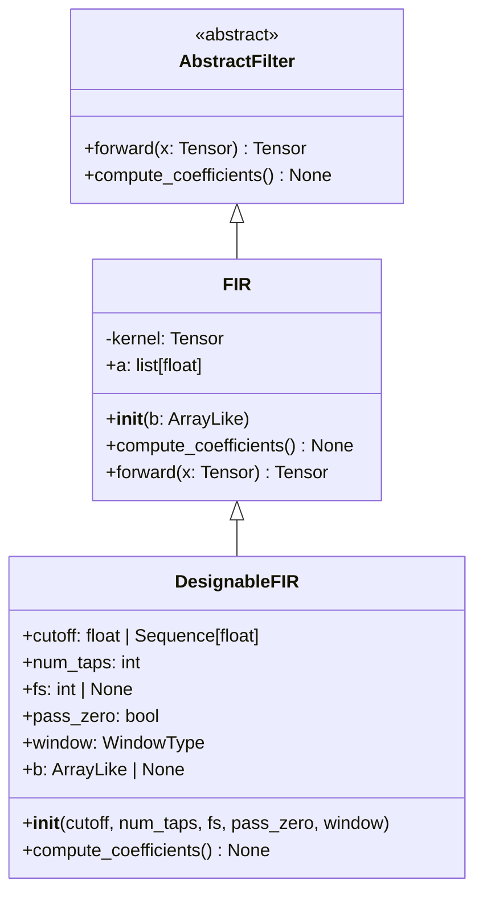
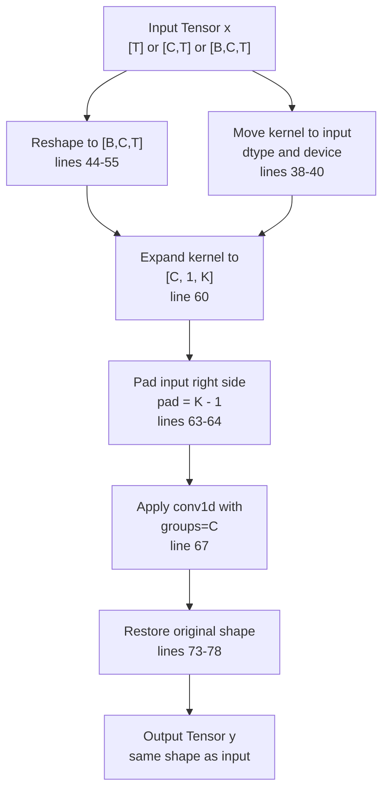
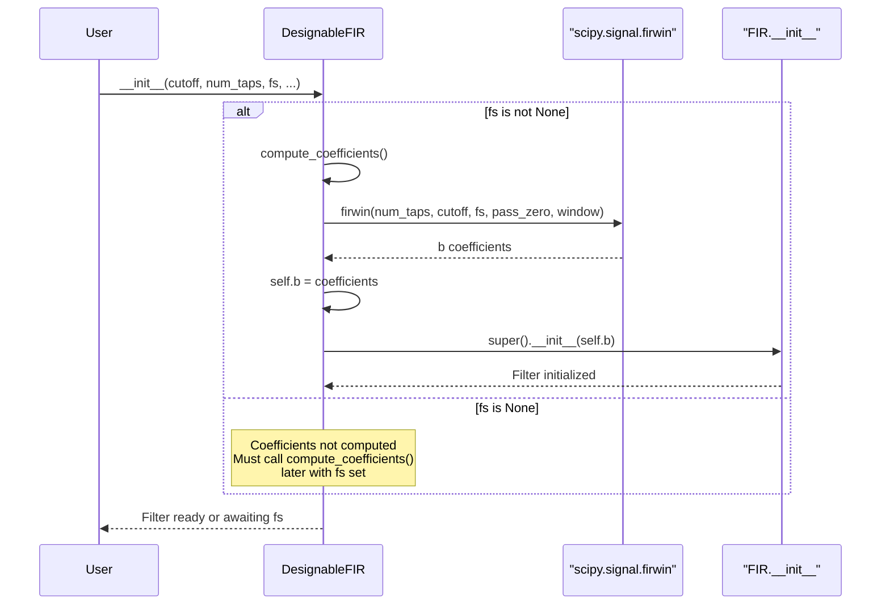
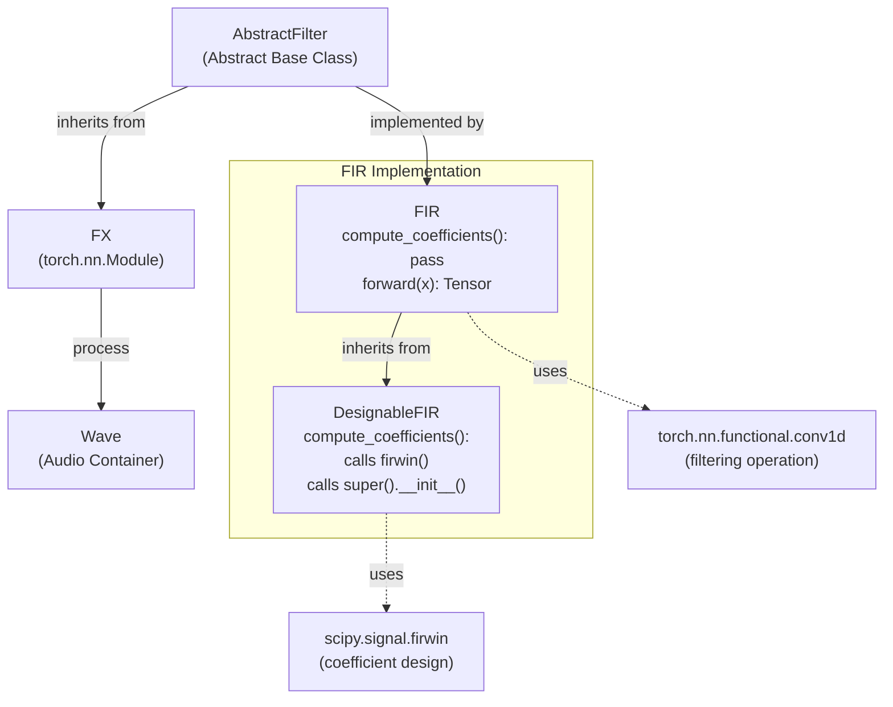

# 4.2 FIR Filters

# FIR Filters

<details>
<summary>Relevant source files</summary>

The following files were used as context for generating this wiki page:

- [src/torchfx/filter/fir.py](src/torchfx/filter/fir.py)

</details>


## Purpose and Scope

This document covers the FIR (Finite Impulse Response) filter implementations in torchfx. FIR filters are digital filters that have a finite-duration impulse response, characterized by having no feedback (denominator coefficients are always 1). This page documents the `FIR` and `DesignableFIR` classes, their implementation using PyTorch's convolution operations, and usage patterns.

For IIR (Infinite Impulse Response) filters, see [IIR Filters](#4.1). For combining filters in parallel, see [Parallel Filter Combination](#4.3). For creating custom filter implementations, see [Creating Custom Filters](#4.4).

**Sources**: [src/torchfx/filter/fir.py:1-137]()

---

## Overview

The torchfx library provides two FIR filter classes:

| Class | Purpose | Coefficient Source |
|-------|---------|-------------------|
| `FIR` | Basic FIR filter | User-provided coefficients (NumPy array or array-like) |
| `DesignableFIR` | FIR filter with automatic design | Computed using `scipy.signal.firwin` based on filter specifications |

Both classes inherit from `AbstractFilter` and implement efficient filtering using PyTorch's `conv1d` operation. The filtering is performed without gradients (`@torch.no_grad()`) as these filters are designed for audio processing, not neural network training.

**Sources**: [src/torchfx/filter/fir.py:15-137]()

---

## Class Hierarchy



**Diagram: FIR Filter Class Hierarchy**

This diagram shows the inheritance structure where `FIR` implements the base filtering operation and `DesignableFIR` adds automatic coefficient design capabilities.

**Sources**: [src/torchfx/filter/fir.py:15-137](), [src/torchfx/filter/__base.py]()

---

## FIR Class

The `FIR` class [src/torchfx/filter/fir.py:15-79]() implements a basic FIR filter using pre-computed coefficients.

### Initialization

The constructor accepts a coefficient array `b` and processes it for efficient convolution:

```python
def __init__(self, b: ArrayLike) -> None
```

Key implementation details:
- Coefficients are flipped using `.flip(0)` for causal convolution [src/torchfx/filter/fir.py:25]()
- The kernel is stored as a registered buffer with shape `[1, 1, K]` where K is the number of taps [src/torchfx/filter/fir.py:27]()
- The denominator coefficient `a` is set to `[1.0]` (no feedback) [src/torchfx/filter/fir.py:26]()

### Tensor Shape Support

The `FIR` filter supports multiple tensor shapes:

| Input Shape | Description | Example Use Case |
|------------|-------------|------------------|
| `[T]` | Single-channel signal | Mono audio |
| `[C, T]` | Multi-channel signal | Stereo or multi-track audio |
| `[B, C, T]` | Batched multi-channel | Batch processing |

The filter automatically handles shape transformations internally and returns the output in the original shape [src/torchfx/filter/fir.py:42-78]().

### Forward Pass Implementation



**Diagram: FIR Forward Pass Data Flow**

The forward pass uses grouped convolution where each channel is filtered independently with the same kernel. Padding on the right side maintains the original signal length.

**Sources**: [src/torchfx/filter/fir.py:36-78]()

---

## DesignableFIR Class

The `DesignableFIR` class [src/torchfx/filter/fir.py:81-137]() extends `FIR` by automatically designing filter coefficients using SciPy's `firwin` function.

### Constructor Parameters

```python
def __init__(
    self,
    cutoff: float | Sequence[float],
    num_taps: int,
    fs: int | None = None,
    pass_zero: bool = True,
    window: WindowType = "hamming",
) -> None
```

| Parameter | Type | Description |
|-----------|------|-------------|
| `cutoff` | `float \| Sequence[float]` | Cutoff frequency(ies) in Hz. Single value for lowpass/highpass, two values for bandpass/bandstop |
| `num_taps` | `int` | Number of filter taps (filter order). Determines frequency resolution |
| `fs` | `int \| None` | Sampling frequency in Hz. If `None`, coefficients are not computed during initialization |
| `pass_zero` | `bool` | If `True`, creates lowpass filter. If `False`, creates highpass filter |
| `window` | `WindowType` | Window function for FIR design (e.g., "hamming", "hann", "blackman") |

**Sources**: [src/torchfx/filter/fir.py:101-114]()

### Coefficient Computation

The `compute_coefficients()` method [src/torchfx/filter/fir.py:122-136]() uses SciPy's `firwin` function:



**Diagram: DesignableFIR Initialization Sequence**

The filter can be initialized in two modes: with immediate coefficient computation (when `fs` is provided) or with deferred computation (when `fs=None`).

**Sources**: [src/torchfx/filter/fir.py:101-136]()

---

## Usage Examples

### Basic FIR Filter with Custom Coefficients

```python
import torch
from torchfx.filter import FIR

# Define custom FIR coefficients (e.g., simple moving average)
coefficients = [0.2, 0.2, 0.2, 0.2, 0.2]

# Create filter
fir_filter = FIR(b=coefficients)

# Apply to audio signal
signal = torch.randn(44100)  # 1 second at 44.1 kHz
filtered = fir_filter(signal)
```

### DesignableFIR for Lowpass Filtering

```python
from torchfx.filter import DesignableFIR

# Design a lowpass filter with cutoff at 5 kHz
lowpass = DesignableFIR(
    cutoff=5000.0,
    num_taps=101,
    fs=44100,
    pass_zero=True,  # Lowpass
    window="hamming"
)

# Apply to stereo signal [2, T]
stereo_signal = torch.randn(2, 44100)
filtered_stereo = lowpass(stereo_signal)
```

### DesignableFIR for Bandpass Filtering

```python
# Design a bandpass filter (200 Hz - 3000 Hz)
bandpass = DesignableFIR(
    cutoff=[200.0, 3000.0],  # Two cutoff frequencies
    num_taps=201,
    fs=44100,
    pass_zero=False,  # Pass everything except DC (bandpass behavior)
    window="blackman"
)

filtered = bandpass(signal)
```

**Sources**: [src/torchfx/filter/fir.py:15-137]()

---

## Implementation Details

### Convolution-Based Filtering

FIR filtering is implemented using PyTorch's `conv1d` operation [src/torchfx/filter/fir.py:67](). This approach provides several advantages:

1. **GPU Acceleration**: Convolution operations are highly optimized on GPUs
2. **Batch Processing**: Multiple signals can be processed simultaneously
3. **Multi-channel Support**: Grouped convolution applies the same filter to each channel independently

### Kernel Buffer Registration

The filter kernel is registered as a PyTorch buffer [src/torchfx/filter/fir.py:27]():
```python
self.register_buffer("kernel", b_tensor[None, None, :])  # [1, 1, K]
```

Benefits of using `register_buffer`:
- Automatically moves with the module when `.to(device)` is called
- Included in state dict for saving/loading
- Not treated as a trainable parameter

### Padding Strategy

The implementation uses right-side padding [src/torchfx/filter/fir.py:63-64]():
```python
pad = int(kernel.shape[-1] - 1)  # K - 1
x_padded = nn.functional.pad(x, (pad, 0))  # pad right only
```

This padding strategy:
- Maintains the original signal length
- Ensures causal filtering (no future samples affect past output)
- Matches the behavior of `scipy.signal.lfilter`

### No-Gradient Context

All forward passes execute under `@torch.no_grad()` [src/torchfx/filter/fir.py:36]() because:
- FIR filters have fixed coefficients (not learned parameters)
- Reduces memory usage during audio processing
- Improves computational efficiency

**Sources**: [src/torchfx/filter/fir.py:15-79]()

---

## Filter Design Considerations

### Number of Taps

The `num_taps` parameter controls the filter's frequency resolution and computational cost:

| Taps | Frequency Resolution | Latency | Computational Cost |
|------|---------------------|---------|-------------------|
| 51-101 | Moderate | Low | Low |
| 101-201 | Good | Moderate | Moderate |
| 201-501 | Excellent | High | High |

Higher tap counts provide sharper frequency transitions but increase processing latency and computational requirements.

### Window Functions

The `window` parameter affects the filter's frequency response characteristics:

| Window Type | Main Lobe Width | Side Lobe Attenuation | Use Case |
|------------|-----------------|----------------------|-----------|
| `"hamming"` | Moderate | Good (-43 dB) | General purpose (default) |
| `"hann"` | Moderate | Moderate (-31 dB) | Smooth transitions |
| `"blackman"` | Wide | Excellent (-58 dB) | High stopband attenuation |
| `"kaiser"` | Adjustable | Adjustable | Customizable tradeoff |

**Sources**: [src/torchfx/filter/fir.py:81-137]()

---

## Integration with AbstractFilter



**Diagram: FIR Filter Integration in torchfx Architecture**

FIR filters integrate seamlessly with the torchfx pipeline through the `AbstractFilter` base class, allowing them to be chained with other effects using the pipe operator (`|`).

**Sources**: [src/torchfx/filter/fir.py:15-137](), [src/torchfx/filter/__base.py]()

---

## Performance Characteristics

### Computational Complexity

FIR filtering using convolution has complexity:
- **Time Complexity**: O(N × K) where N is signal length and K is number of taps
- **Space Complexity**: O(K) for kernel storage plus O(N) for padded input

### GPU vs CPU

FIR filters benefit significantly from GPU acceleration:
- Small signals (< 1000 samples): CPU may be faster due to transfer overhead
- Medium-large signals (> 10000 samples): GPU provides substantial speedup
- Batch processing: GPU advantage increases with batch size

**Sources**: [src/torchfx/filter/fir.py:36-78](), benchmark files referenced in high-level diagrams

---

## Related Classes and Methods

- **AbstractFilter**: Base class defining the filter interface [src/torchfx/filter/__base.py]()
- **ParallelFilterCombination**: For combining FIR filters in parallel, see [Parallel Filter Combination](#4.3)
- **Wave.pipe**: For chaining FIR filters with other effects, see [Pipeline Operator](#2.3)
- **WindowType**: Type alias for supported window functions [src/torchfx/typing.py]()

**Sources**: [src/torchfx/filter/fir.py:1-137](), [src/torchfx/filter/__base.py](), [src/torchfx/typing.py]()