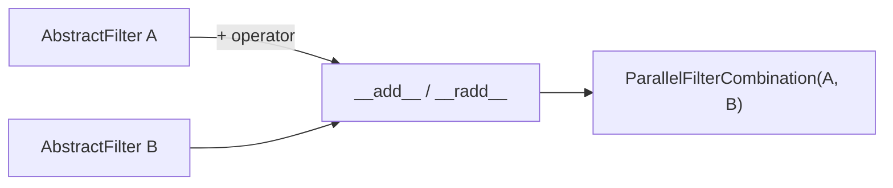
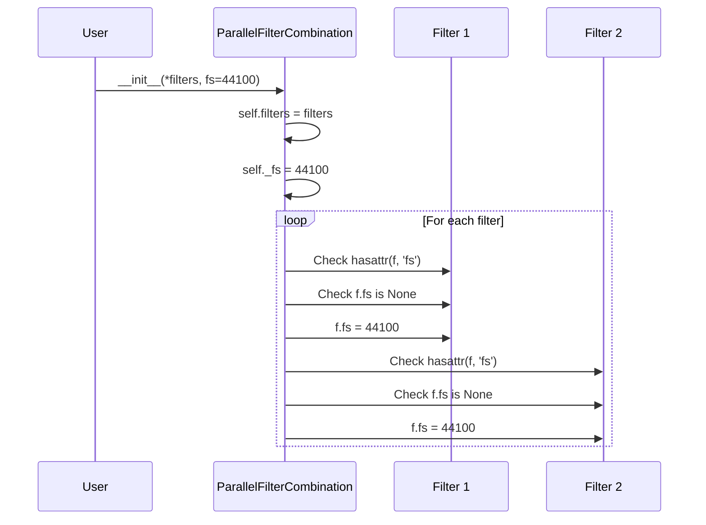
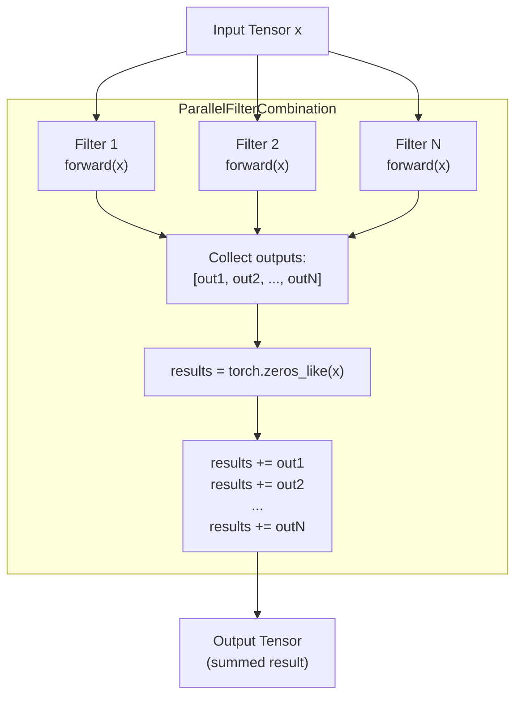
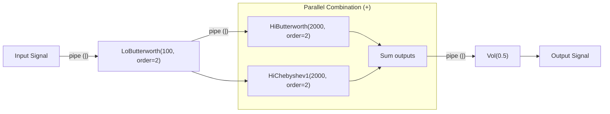
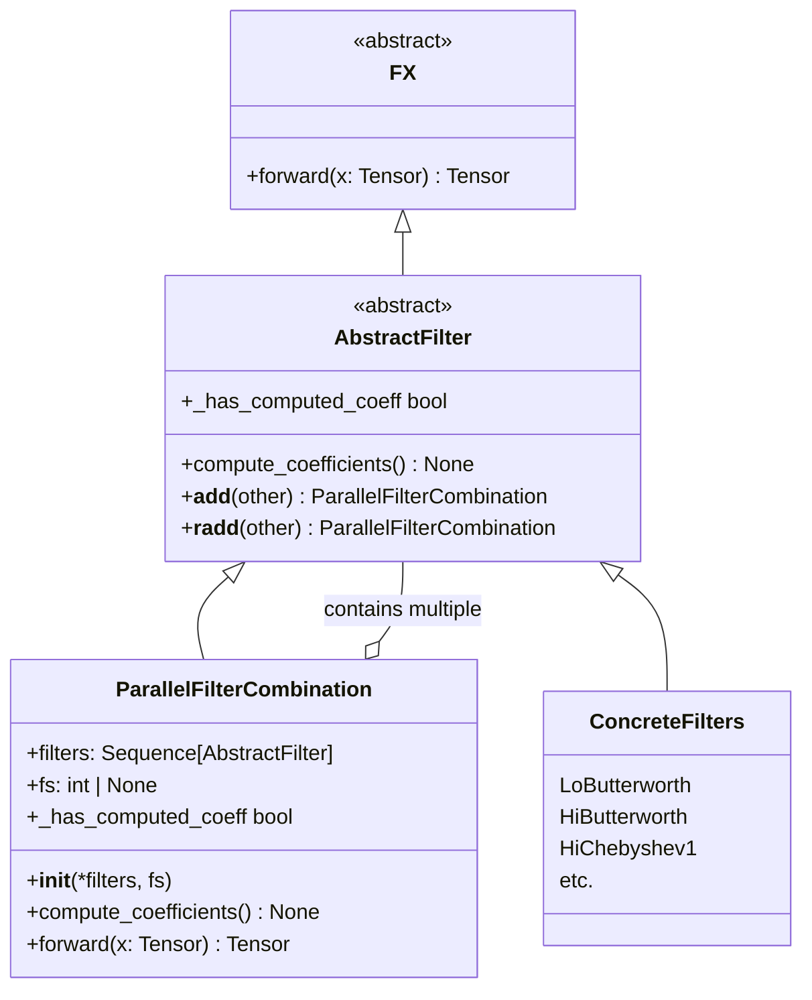

# 4.3 Parallel Filter Combination

# Parallel Filter Combination

<details>
<summary>Relevant source files</summary>

The following files were used as context for generating this wiki page:

- [README.md](README.md)
- [examples/series_and_parallel_filters.py](examples/series_and_parallel_filters.py)
- [src/torchfx/filter/__base.py](src/torchfx/filter/__base.py)

</details>


## Purpose and Scope

This document describes the parallel filter combination system in torchfx, which allows multiple filters to be applied to the same input signal with their outputs summed together. Parallel combination is achieved using the `+` operator and the `ParallelFilterCombination` class.

For information about chaining filters in series (sequential processing), see [Pipeline Operator](#2.3). For general filter concepts and the base filter class, see [Filters](#4).

---

## Overview

Parallel filter combination enables multiple filters to process the same input signal simultaneously, with the final output being the sum of all individual filter outputs. This is useful for creating complex frequency responses, such as band-pass filters from high-pass and low-pass combinations, or for splitting signals into multiple frequency bands.

The parallel combination system provides:
- Operator overloading (`+`) for intuitive filter combination syntax
- Automatic sampling frequency propagation to all child filters
- Lazy coefficient computation that respects the computation state of each filter
- GPU-compatible tensor operations for efficient parallel processing

**Sources**: [src/torchfx/filter/__base.py:43-107]()

---

## The + Operator

The `AbstractFilter` class implements the `__add__` and `__radd__` magic methods to enable filter combination using the `+` operator. When two filters are combined with `+`, a `ParallelFilterCombination` instance is created that wraps both filters.

```python
lowpass + highpass  # Creates ParallelFilterCombination(lowpass, highpass)
```

The operator implementation validates that both operands are instances of `AbstractFilter` and raises an assertion error otherwise.

**Operator Implementation Diagram**



**Sources**: [src/torchfx/filter/__base.py:34-40]()

---

## ParallelFilterCombination Class

The `ParallelFilterCombination` class [src/torchfx/filter/__base.py:43-107]() is a concrete implementation of `AbstractFilter` that manages multiple child filters and combines their outputs through summation.

### Class Structure

| Property/Method | Type | Description |
|----------------|------|-------------|
| `filters` | `Sequence[AbstractFilter]` | Tuple of child filters to be applied in parallel |
| `fs` | `int \| None` | Sampling frequency, propagated to all child filters |
| `_has_computed_coeff` | `bool` (property) | Returns `True` only if all child filters have computed coefficients |
| `compute_coefficients()` | method | Triggers coefficient computation for all child filters |
| `forward(x)` | method | Applies all filters and sums their outputs |

**Sources**: [src/torchfx/filter/__base.py:43-107]()

---

## Constructor and Initialization

The `ParallelFilterCombination` constructor accepts a variable number of `AbstractFilter` instances and an optional sampling frequency:

```python
def __init__(self, *filters: AbstractFilter, fs: int | None = None) -> None
```

### Constructor Behavior

1. **Filter Storage**: All provided filters are stored in the `filters` tuple [src/torchfx/filter/__base.py:77]()
2. **Sampling Frequency Assignment**: If `fs` is provided, it is immediately set on the instance [src/torchfx/filter/__base.py:76]()
3. **Frequency Propagation**: For each child filter that has an `fs` attribute and its value is `None`, the constructor sets it to the provided `fs` value [src/torchfx/filter/__base.py:78-81]()

This initialization ensures that all child filters receive the sampling frequency needed for coefficient computation, even if they were instantiated without it.

**Initialization Flow Diagram**



**Sources**: [src/torchfx/filter/__base.py:74-81]()

---

## Sampling Frequency Management

The `fs` property implements custom getter and setter logic to ensure sampling frequency consistency across all child filters.

### Property Implementation

The `fs` property [src/torchfx/filter/__base.py:83-93]() uses a private `_fs` attribute for storage and implements a setter that propagates the value:

```python
@property
def fs(self) -> int | None:
    return self._fs

@fs.setter
def fs(self, value: int | None) -> None:
    self._fs = value
    if value is not None:
        for f in self.filters:
            if hasattr(f, "fs") and f.fs is None:
                f.fs = value
```

### Propagation Rules

The setter only updates child filters if:
1. The new value is not `None`
2. The child filter has an `fs` attribute
3. The child filter's current `fs` value is `None`

This prevents overwriting explicitly set sampling frequencies on child filters while ensuring filters without a frequency receive one.

**Sources**: [src/torchfx/filter/__base.py:83-93]()

---

## Coefficient Computation

The `compute_coefficients()` method [src/torchfx/filter/__base.py:95-98]() delegates coefficient computation to each child filter:

```python
@override
def compute_coefficients(self) -> None:
    for f in self.filters:
        f.compute_coefficients()
```

The `_has_computed_coeff` property [src/torchfx/filter/__base.py:69-72]() checks whether all child filters have computed their coefficients:

```python
@property
@override
def _has_computed_coeff(self) -> bool:
    return all(f._has_computed_coeff for f in self.filters)
```

This ensures that the entire parallel combination is ready for processing only when all constituent filters are ready.

**Sources**: [src/torchfx/filter/__base.py:69-72](), [src/torchfx/filter/__base.py:95-98]()

---

## Forward Pass and Output Summation

The `forward()` method [src/torchfx/filter/__base.py:100-107]() implements the core parallel processing logic:

```python
@override
@torch.no_grad()
def forward(self, x: Tensor) -> Tensor:
    outputs = [f.forward(x) for f in self.filters]
    results = torch.zeros_like(x)
    for t in outputs:
        results += t
    return results
```

### Processing Steps

1. **Parallel Application**: Each filter in `self.filters` processes the input tensor `x` independently [src/torchfx/filter/__base.py:103]()
2. **Output Collection**: Filter outputs are collected in a list
3. **Zero Initialization**: A result tensor initialized to zeros with the same shape and device as the input [src/torchfx/filter/__base.py:104]()
4. **Summation**: Each filter output is added to the result tensor [src/torchfx/filter/__base.py:105-106]()
5. **Return**: The summed result is returned [src/torchfx/filter/__base.py:107]()

The method is decorated with `@torch.no_grad()` to disable gradient computation, as filters are typically used in inference mode.

**Parallel Processing Flow**



**Sources**: [src/torchfx/filter/__base.py:100-107]()

---

## Usage Examples

### Basic Parallel Combination

Combining two filters using the `+` operator:

```python
import torchfx as fx

lowpass = fx.filter.LoButterworth(1000, order=2)
highpass = fx.filter.HiButterworth(200, order=2)
combined_filter = lowpass + highpass

wave = fx.Wave.from_file("path/to/file.wav")
result = wave | combined_filter
```

This example is taken directly from the docstring [src/torchfx/filter/__base.py:56-63]().

### Series and Parallel Combined

From the example script [examples/series_and_parallel_filters.py:1-22](), filters can be combined in both series (using `|`) and parallel (using `+`):

```python
result = (signal
    | fx.filter.LoButterworth(100, order=2)
    | fx.filter.HiButterworth(2000, order=2) + fx.filter.HiChebyshev1(2000, order=2)
    | T.Vol(0.5)
)
```

In this example:
1. The signal is first processed by a low-pass Butterworth filter (series)
2. Then two high-pass filters (Butterworth and Chebyshev1) are applied in parallel and their outputs summed
3. Finally, the volume is adjusted (series)

**Processing Architecture Diagram**



**Sources**: [examples/series_and_parallel_filters.py:16-20](), [src/torchfx/filter/__base.py:56-63]()

---

## Implementation Architecture

### Class Hierarchy

The `ParallelFilterCombination` class fits into the filter hierarchy as follows:



**Sources**: [src/torchfx/filter/__base.py:11-107]()

---

## Technical Considerations

### Device Compatibility

The `forward()` method uses `torch.zeros_like(x)` to initialize the result tensor [src/torchfx/filter/__base.py:104](). This ensures the result tensor is created on the same device (CPU or CUDA) as the input tensor, maintaining device consistency throughout the parallel processing pipeline.

### Gradient Computation

The `@torch.no_grad()` decorator [src/torchfx/filter/__base.py:101]() disables gradient computation during the forward pass. This is appropriate for filter operations which are typically used in inference mode and do not require backpropagation.

### Memory Efficiency

The implementation collects all filter outputs in a list before summation [src/torchfx/filter/__base.py:103](). For a large number of filters or long audio signals, this may consume significant memory. An alternative in-place accumulation approach could reduce memory usage at the cost of code clarity.

### Coefficient Computation Timing

Coefficient computation is handled lazily through the `_has_computed_coeff` property check. The actual timing of when coefficients are computed depends on the calling code and is not enforced by `ParallelFilterCombination` itself. Filters typically compute coefficients on first use or when the sampling frequency is set.

**Sources**: [src/torchfx/filter/__base.py:100-107](), [src/torchfx/filter/__base.py:69-72]()