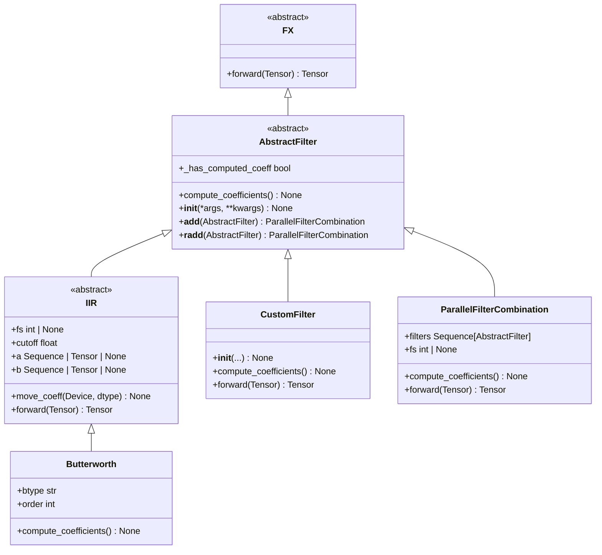
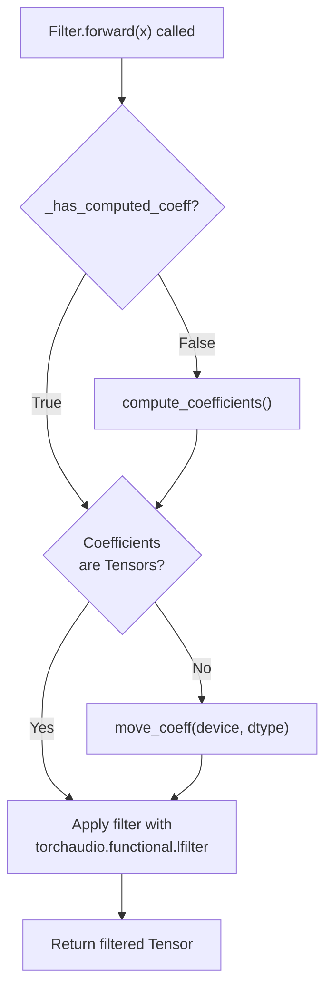
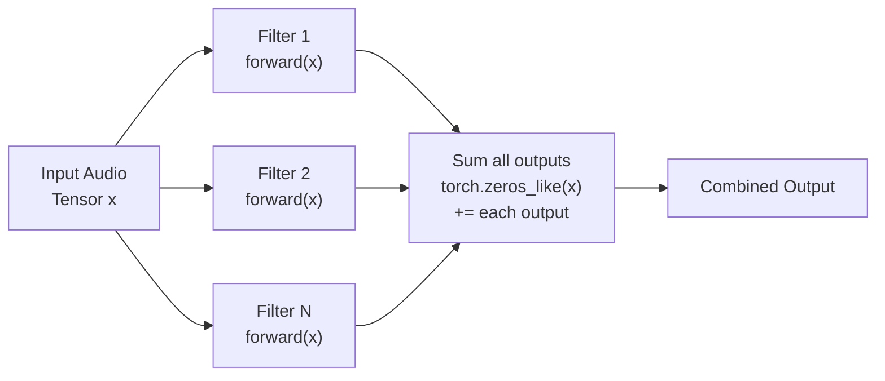
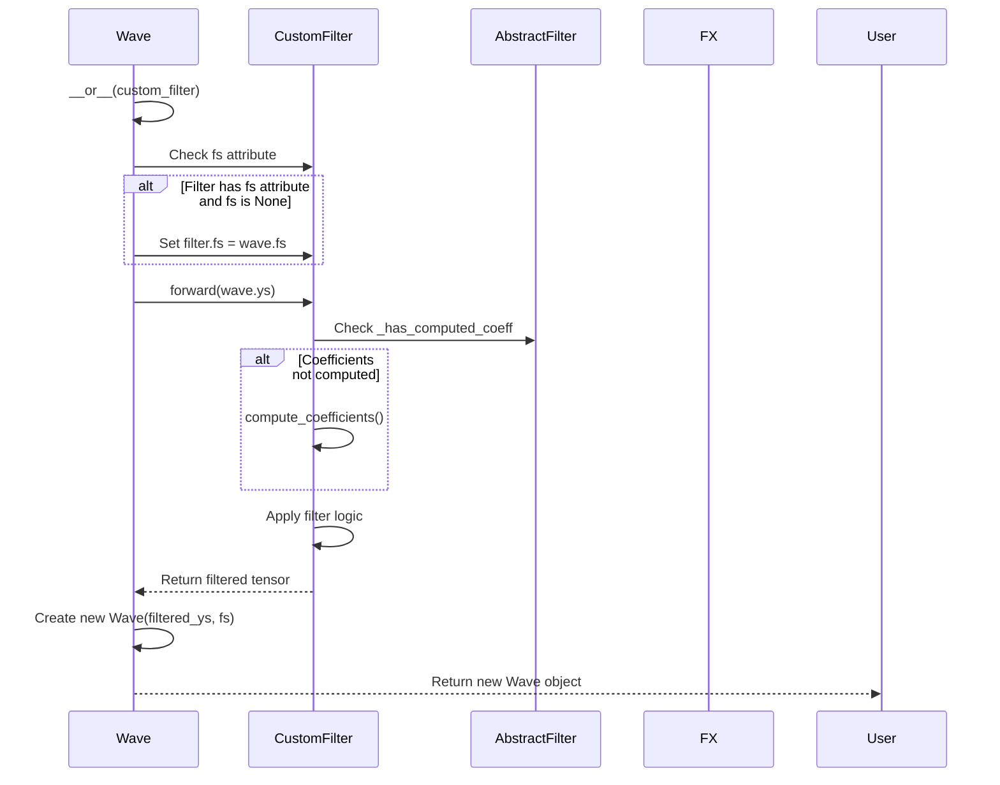

# 4.4 Creating Custom Filters

# Creating Custom Filters

<details>
<summary>Relevant source files</summary>

The following files were used as context for generating this wiki page:

- [src/torchfx/filter/__base.py](src/torchfx/filter/__base.py)
- [src/torchfx/filter/iir.py](src/torchfx/filter/iir.py)

</details>


## Purpose and Scope

This document provides a comprehensive guide for implementing custom filters in torchfx by subclassing the `AbstractFilter` base class. It covers the required methods, optional features, and integration patterns for creating filters that seamlessly work with the torchfx pipeline system.

For information about using existing filter implementations, see [IIR Filters](#4.1) and [FIR Filters](#4.2). For combining filters in parallel, see [Parallel Filter Combination](#4.3). For creating custom effects (non-filter audio processors), see [Creating Custom Effects](#3.5).

**Sources**: [src/torchfx/filter/__base.py:1-108]()

---

## The AbstractFilter Base Class

The `AbstractFilter` class serves as the foundation for all filter implementations in torchfx. It inherits from `FX` (which in turn inherits from `torch.nn.Module`), making all filters compatible with PyTorch's neural network ecosystem.

### Class Hierarchy



**Sources**: [src/torchfx/filter/__base.py:11-41](), [src/torchfx/filter/iir.py:19-67]()

---

## Required Implementation Components

Every custom filter must implement two abstract methods defined in `AbstractFilter`:

### The __init__ Method

The `__init__` method must call `super().__init__()` to properly initialize the parent `FX` class. This is where you define filter parameters and initialize coefficient storage.

```python
# Pattern from AbstractFilter
@abc.abstractmethod
def __init__(self, *args, **kwargs) -> None:
    super().__init__(*args, **kwargs)
```

**Key Requirements**:
- Must call `super().__init__()` 
- Should initialize all filter parameters (cutoff frequencies, Q factors, etc.)
- Should initialize coefficient attributes (`a`, `b`, or custom coefficients) to `None`
- If the filter requires sampling frequency, should accept `fs` parameter

**Sources**: [src/torchfx/filter/__base.py:25-27]()

### The compute_coefficients Method

The `compute_coefficients` method is where filter-specific coefficient computation occurs. This method is called automatically when needed (typically before the first `forward` pass).

```python
# Pattern from AbstractFilter
@abc.abstractmethod
def compute_coefficients(self) -> None:
    """Compute the filter coefficients."""
    pass
```

**Key Requirements**:
- Must compute all necessary filter coefficients
- Should set coefficient attributes (e.g., `self.a` and `self.b`)
- Should verify that required parameters (like `fs`) are not `None`
- Typically uses SciPy or custom algorithms for coefficient design

**Sources**: [src/torchfx/filter/__base.py:29-32]()

---

## Filter Coefficient Management

The `AbstractFilter` class provides a property `_has_computed_coeff` to track whether coefficients have been computed. This property checks for the existence and non-None values of `a` and `b` attributes.



**Implementation Pattern**:

| Stage | Purpose | Example from IIR |
|-------|---------|------------------|
| Initialization | Set coefficients to `None` | `self.a = None; self.b = None` |
| Coefficient Computation | Calculate filter coefficients | Uses `scipy.signal.butter()` |
| Device Management | Move coefficients to GPU/CPU | `torch.as_tensor(self.a, device=device)` |
| Application | Apply filter to audio | `F.lfilter(x, self.a, self.b)` |

**Sources**: [src/torchfx/filter/__base.py:19-23](), [src/torchfx/filter/iir.py:47-66]()

---

## Complete Implementation Example: Custom Bandpass Filter

Here is a step-by-step example of implementing a custom bandpass filter using the Butterworth design:

### Step 1: Define the Class Structure

```python
class CustomBandpass(AbstractFilter):
    """Custom bandpass filter using Butterworth design.
    
    Parameters
    ----------
    low_cutoff : float
        Lower cutoff frequency in Hz
    high_cutoff : float
        Upper cutoff frequency in Hz
    order : int
        Filter order (default: 4)
    fs : int | None
        Sampling frequency in Hz
    """
    
    def __init__(
        self,
        low_cutoff: float,
        high_cutoff: float,
        order: int = 4,
        fs: int | None = None,
    ) -> None:
        super().__init__()
        self.low_cutoff = low_cutoff
        self.high_cutoff = high_cutoff
        self.order = order
        self.fs = fs
        # Initialize coefficient storage
        self.a = None
        self.b = None
```

### Step 2: Implement Coefficient Computation

```python
    def compute_coefficients(self) -> None:
        """Compute bandpass Butterworth coefficients."""
        from scipy.signal import butter
        
        # Verify sampling frequency is set
        if self.fs is None:
            raise ValueError("Sampling frequency must be set before computing coefficients")
        
        # Normalize frequencies to Nyquist
        nyquist = 0.5 * self.fs
        low_norm = self.low_cutoff / nyquist
        high_norm = self.high_cutoff / nyquist
        
        # Compute Butterworth bandpass coefficients
        self.b, self.a = butter(
            self.order,
            [low_norm, high_norm],
            btype='bandpass'
        )
```

### Step 3: Implement the Forward Method

```python
    @torch.no_grad()
    def forward(self, x: torch.Tensor) -> torch.Tensor:
        """Apply the bandpass filter to input tensor.
        
        Parameters
        ----------
        x : torch.Tensor
            Input audio tensor
            
        Returns
        -------
        torch.Tensor
            Filtered audio tensor
        """
        # Get device and dtype from input
        device = x.device
        dtype = x.dtype
        
        # Compute coefficients if not already computed
        if self.a is None or self.b is None:
            self.compute_coefficients()
        
        # Convert coefficients to tensors if needed
        if not isinstance(self.a, torch.Tensor):
            self.a = torch.as_tensor(self.a, device=device, dtype=dtype)
            self.b = torch.as_tensor(self.b, device=device, dtype=dtype)
        
        # Apply IIR filter using torchaudio
        from torchaudio.functional import lfilter
        return lfilter(x, self.a, self.b)
```

**Sources**: [src/torchfx/filter/iir.py:69-95](), [src/torchfx/filter/iir.py:42-66]()

---

## Implementation Patterns

### Pattern 1: IIR Filter with SciPy Design

For filters that use SciPy for coefficient design:

```mermaid
sequenceDiagram
    participant User
    participant CustomFilter
    participant scipy
    participant torch
    participant torchaudio
    
    User->>CustomFilter: __init__(cutoff, order, fs=None)
    CustomFilter->>CustomFilter: Store parameters
    CustomFilter->>CustomFilter: Set a=None, b=None
    
    User->>CustomFilter: forward(audio_tensor)
    CustomFilter->>CustomFilter: Check _has_computed_coeff
    
    alt Coefficients not computed
        CustomFilter->>scipy: butter/cheby1/iirpeak(params)
        scipy-->>CustomFilter: Return (b, a) arrays
        CustomFilter->>CustomFilter: self.a = a; self.b = b
    end
    
    CustomFilter->>torch: as_tensor(a, device, dtype)
    CustomFilter->>torch: as_tensor(b, device, dtype)
    torch-->>CustomFilter: Tensor coefficients
    
    CustomFilter->>torchaudio: lfilter(x, a, b)
    torchaudio-->>CustomFilter: Filtered tensor
    CustomFilter-->>User: Return filtered tensor
```

**Key Methods to Use**:
- `scipy.signal.butter()` - Butterworth filter design
- `scipy.signal.cheby1()` / `scipy.signal.cheby2()` - Chebyshev filter design
- `scipy.signal.iirpeak()` - Peaking filter design
- `scipy.signal.iirnotch()` - Notch filter design
- `torchaudio.functional.lfilter()` - Apply IIR filter

**Sources**: [src/torchfx/filter/iir.py:89-95](), [src/torchfx/filter/iir.py:119-130](), [src/torchfx/filter/iir.py:340-346]()

### Pattern 2: Custom Coefficient Computation

For filters with custom coefficient calculations (like shelving filters):

| Component | Implementation Detail |
|-----------|----------------------|
| Properties | Define helper properties for intermediate calculations (`_omega`, `_alpha`) |
| Coefficient Computation | Use NumPy/mathematical formulas directly |
| Normalization | Normalize coefficients by dividing by `a0` |

Example from `HiShelving`:

```python
# Helper properties
@property
def _omega(self) -> float:
    return 2 * np.pi * self.cutoff / self.fs

@property
def _alpha(self) -> float:
    return float(np.sin(self._omega) / (2 * self.q))

# Coefficient computation using formulas
def compute_coefficients(self) -> None:
    A = self.gain
    b0 = A * ((A + 1) + (A - 1) * np.cos(self._omega) + 2 * np.sqrt(A) * self._alpha)
    b1 = -2 * A * ((A - 1) + (A + 1) * np.cos(self._omega))
    b2 = A * ((A + 1) + (A - 1) * np.cos(self._omega) + 2 * np.sqrt(A) * self._alpha)
    
    a0 = (A + 1) - (A - 1) * np.cos(self._omega) + 2 * np.sqrt(A) * self._alpha
    a1 = 2 * ((A - 1) - (A + 1) * np.cos(self._omega))
    a2 = (A + 1) - (A - 1) * np.cos(self._omega) - 2 * np.sqrt(A) * self._alpha
    
    # Normalize by a0
    self.b = [b0 / a0, b1 / a0, b2 / a0]
    self.a = [1.0, a1 / a0, a2 / a0]
```

**Sources**: [src/torchfx/filter/iir.py:261-305]()

### Pattern 3: Cascaded Filters

For filters that cascade multiple filter stages:

```python
# Example from LinkwitzRiley
def compute_coefficients(self) -> None:
    """Cascade two Butterworth filters."""
    butter_order = self.order // 2
    
    # Get base Butterworth coefficients
    b_butter, a_butter = butter(
        butter_order,
        self.cutoff / (0.5 * self.fs),
        btype=self.btype
    )
    
    # Cascade by convolving coefficients
    self.b = np.convolve(b_butter, b_butter)
    self.a = np.convolve(a_butter, a_butter)
```

**Sources**: [src/torchfx/filter/iir.py:436-455]()

---

## Advanced Features

### Sampling Frequency Management

Filters typically require a sampling frequency (`fs`) to compute coefficients. The `fs` parameter can be:

1. **Set at initialization**: `filter = CustomFilter(cutoff=1000, fs=44100)`
2. **Set later**: `filter.fs = 44100`
3. **Automatically set by Wave**: When using the pipe operator, `Wave` automatically sets `fs` if it's `None`

**Best Practice Pattern**:

```python
def __init__(self, cutoff: float, fs: int | None = None) -> None:
    super().__init__()
    self.cutoff = cutoff
    self.fs = fs  # Allow None for later configuration
    
def compute_coefficients(self) -> None:
    if self.fs is None:
        raise ValueError("Sample rate must be set before computing coefficients")
    # Proceed with coefficient computation
```

**Sources**: [src/torchfx/filter/iir.py:42-45](), [src/torchfx/filter/__base.py:83-93]()

### Device and Dtype Management

The `move_coeff` method (pattern from `IIR` class) handles moving coefficients to the appropriate device and dtype:

```python
def move_coeff(self, device: Device, dtype: torch.dtype = torch.float32) -> None:
    """Move the filter coefficients to the specified device and dtype."""
    self.a = torch.as_tensor(self.a, device=device, dtype=dtype)
    self.b = torch.as_tensor(self.b, device=device, dtype=dtype)
```

This method should be called in `forward()` before applying the filter:

```python
def forward(self, x: torch.Tensor) -> torch.Tensor:
    # ... coefficient computation ...
    
    # Ensure coefficients match input tensor's device and dtype
    if not isinstance(self.a, torch.Tensor):
        self.move_coeff(x.device, x.dtype)
    
    return apply_filter(x, self.a, self.b)
```

**Sources**: [src/torchfx/filter/iir.py:47-50](), [src/torchfx/filter/iir.py:53-66]()

### Parallel Combination Support

The `AbstractFilter` base class automatically provides support for parallel filter combination through operator overloading:



**Usage Example**:

```python
# The + operator is defined in AbstractFilter
lowpass = CustomBandpass(100, 1000, fs=44100)
highpass = CustomBandpass(5000, 10000, fs=44100)

# Automatically creates ParallelFilterCombination
parallel = lowpass + highpass

# Use in pipeline
result = wave | parallel
```

**Sources**: [src/torchfx/filter/__base.py:34-40](), [src/torchfx/filter/__base.py:43-107]()

---

## Integration with the Pipeline System

Custom filters automatically integrate with the torchfx pipeline system through inheritance from `AbstractFilter` and `FX`:



**Key Integration Points**:

| Feature | Implementation | Benefit |
|---------|---------------|---------|
| Pipe Operator (`\|`) | Inherited from `FX` | Enables `wave \| custom_filter` syntax |
| Automatic `fs` Setting | Handled by `Wave.__or__` | No need to manually set sampling frequency |
| Coefficient Caching | `_has_computed_coeff` property | Coefficients computed only once |
| Parallel Combination | `__add__` and `__radd__` methods | Enables `filter1 + filter2` syntax |
| PyTorch Compatibility | Inherits from `torch.nn.Module` | Works with `nn.Sequential`, `.to(device)`, etc. |

**Sources**: [src/torchfx/filter/__base.py:11-41]()

---

## Complete Example: Custom Resonant Filter

Here is a complete, production-ready example of a custom resonant filter:

```python
from collections.abc import Sequence
import numpy as np
import torch
from torch import Tensor
from torchaudio.functional import lfilter

from torchfx.filter.__base import AbstractFilter

class ResonantFilter(AbstractFilter):
    """Custom resonant filter with adjustable resonance.
    
    This filter combines a lowpass characteristic with a resonant peak
    at the cutoff frequency, controlled by the resonance parameter.
    
    Parameters
    ----------
    cutoff : float
        Center frequency of resonance in Hz
    resonance : float
        Resonance amount (0.0 to 1.0). Higher values create sharper peak.
    fs : int | None
        Sampling frequency in Hz
        
    Attributes
    ----------
    a : Sequence[float] | Tensor | None
        Denominator coefficients
    b : Sequence[float] | Tensor | None
        Numerator coefficients
    """
    
    def __init__(
        self,
        cutoff: float,
        resonance: float = 0.5,
        fs: int | None = None,
    ) -> None:
        super().__init__()
        self.cutoff = cutoff
        self.resonance = np.clip(resonance, 0.0, 0.99)  # Stability constraint
        self.fs = fs
        self.a: Sequence[float] | Tensor | None = None
        self.b: Sequence[float] | Tensor | None = None
    
    def compute_coefficients(self) -> None:
        """Compute resonant filter coefficients."""
        if self.fs is None:
            raise ValueError("Sampling frequency must be set")
        
        # Normalized frequency
        omega = 2.0 * np.pi * self.cutoff / self.fs
        
        # Quality factor from resonance parameter
        Q = 1.0 / (1.0 - self.resonance)
        
        # Compute coefficients using biquad formulas
        alpha = np.sin(omega) / (2.0 * Q)
        cos_omega = np.cos(omega)
        
        # Lowpass with resonance
        b0 = (1.0 - cos_omega) / 2.0
        b1 = 1.0 - cos_omega
        b2 = (1.0 - cos_omega) / 2.0
        
        a0 = 1.0 + alpha
        a1 = -2.0 * cos_omega
        a2 = 1.0 - alpha
        
        # Normalize
        self.b = [b0 / a0, b1 / a0, b2 / a0]
        self.a = [1.0, a1 / a0, a2 / a0]
    
    def move_coeff(self, device: torch.device, dtype: torch.dtype) -> None:
        """Move coefficients to specified device and dtype."""
        self.a = torch.as_tensor(self.a, device=device, dtype=dtype)
        self.b = torch.as_tensor(self.b, device=device, dtype=dtype)
    
    @torch.no_grad()
    def forward(self, x: Tensor) -> Tensor:
        """Apply resonant filter to input tensor."""
        if self.fs is None:
            raise ValueError("Sampling frequency must be set")
        
        # Compute coefficients if needed
        if self.a is None or self.b is None:
            self.compute_coefficients()
        
        # Ensure coefficients are tensors on correct device
        if not isinstance(self.a, Tensor):
            self.move_coeff(x.device, x.dtype)
        
        # Apply filter
        return lfilter(x, self.a, self.b)

# Usage example
if __name__ == "__main__":
    from torchfx import Wave
    
    # Create filter
    resonant = ResonantFilter(cutoff=1000, resonance=0.8, fs=44100)
    
    # Load audio and apply filter
    wave = Wave.from_file("input.wav")
    filtered = wave | resonant
    
    # Can also combine with other filters
    from torchfx.filter import HiButterworth
    highpass = HiButterworth(100, fs=44100)
    
    # Series: highpass then resonant
    result = wave | highpass | resonant
    
    # Parallel: sum of both filters
    parallel = highpass + resonant
    result = wave | parallel
```

**Sources**: [src/torchfx/filter/iir.py:19-67](), [src/torchfx/filter/__base.py:11-41]()

---

## Validation and Testing

When implementing a custom filter, consider these validation strategies:

### Coefficient Validation

```python
def compute_coefficients(self) -> None:
    # ... compute coefficients ...
    
    # Validate stability (for IIR filters)
    if self.a is not None:
        roots = np.roots(self.a)
        if np.any(np.abs(roots) >= 1.0):
            raise ValueError("Filter is unstable (poles outside unit circle)")
```

### Frequency Response Verification

```python
def plot_frequency_response(self) -> None:
    """Plot the filter's frequency response for debugging."""
    from scipy.signal import freqz
    import matplotlib.pyplot as plt
    
    if self.a is None or self.b is None:
        self.compute_coefficients()
    
    w, h = freqz(self.b, self.a, worN=2000, fs=self.fs)
    
    plt.figure(figsize=(10, 6))
    plt.subplot(2, 1, 1)
    plt.plot(w, 20 * np.log10(abs(h)))
    plt.title('Frequency Response')
    plt.ylabel('Magnitude [dB]')
    plt.grid(True)
    
    plt.subplot(2, 1, 2)
    plt.plot(w, np.angle(h))
    plt.ylabel('Phase [radians]')
    plt.xlabel('Frequency [Hz]')
    plt.grid(True)
    plt.show()
```

### Unit Testing Pattern

```python
def test_custom_filter():
    """Test custom filter implementation."""
    import torch
    from torchfx import Wave
    
    # Create test signal
    duration = 1.0
    fs = 44100
    t = torch.linspace(0, duration, int(fs * duration))
    signal = torch.sin(2 * torch.pi * 440 * t)  # 440 Hz tone
    
    wave = Wave(signal.unsqueeze(0), fs)
    
    # Create and apply filter
    filt = ResonantFilter(cutoff=440, resonance=0.5, fs=fs)
    result = wave | filt
    
    # Verify output shape
    assert result.ys.shape == wave.ys.shape
    
    # Verify output is different from input
    assert not torch.allclose(result.ys, wave.ys)
    
    # Verify coefficients were computed
    assert filt.a is not None
    assert filt.b is not None
```

**Sources**: [src/torchfx/filter/iir.py:89-95]()

---

## Summary

Creating custom filters in torchfx requires:

1. **Subclass `AbstractFilter`**: Inherit from the abstract base class
2. **Implement `__init__`**: Call `super().__init__()` and initialize parameters
3. **Implement `compute_coefficients`**: Define filter coefficient computation logic
4. **Implement `forward`**: Apply the filter to input tensors
5. **Handle device/dtype**: Ensure coefficients match input tensor characteristics
6. **Support `fs` parameter**: Allow sampling frequency to be set at initialization or later

The resulting filter automatically integrates with:
- The pipe operator (`|`) for series filtering
- The addition operator (`+`) for parallel combination  
- PyTorch's device management (`.to(device)`)
- The broader torchfx ecosystem

**Sources**: [src/torchfx/filter/__base.py:1-108](), [src/torchfx/filter/iir.py:1-482]()