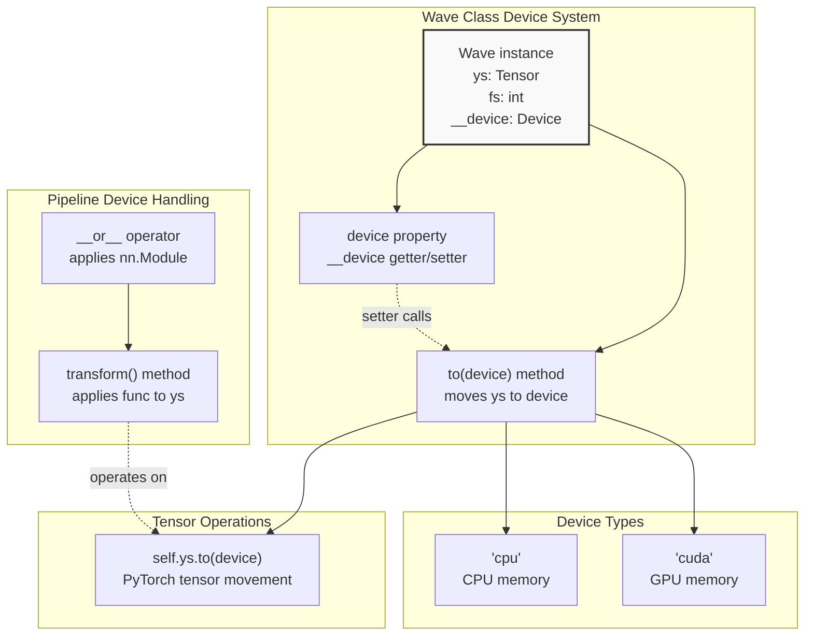
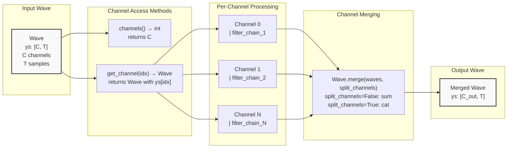
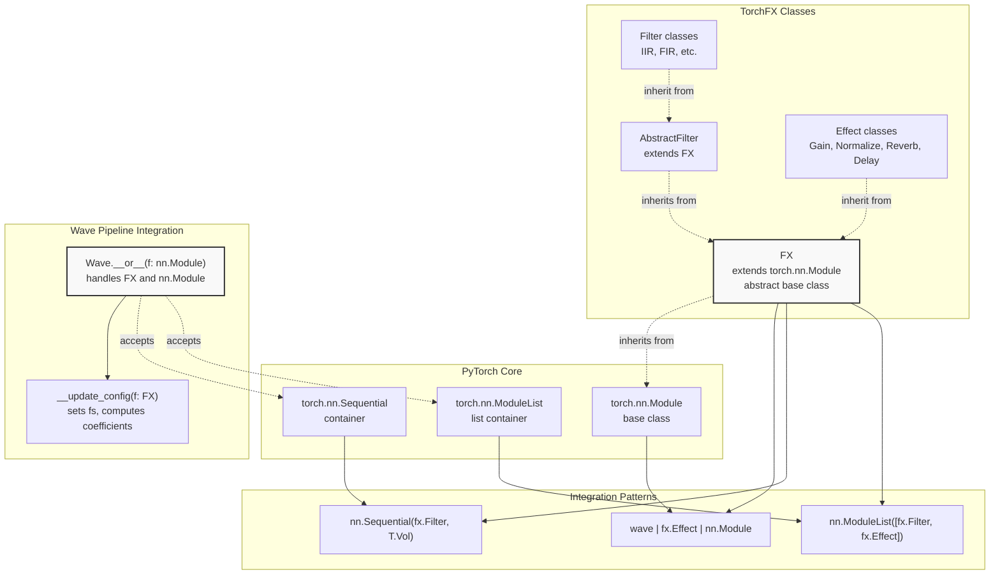
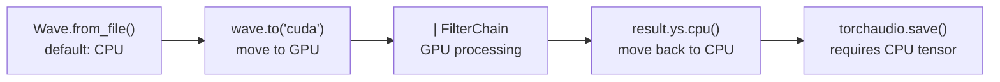
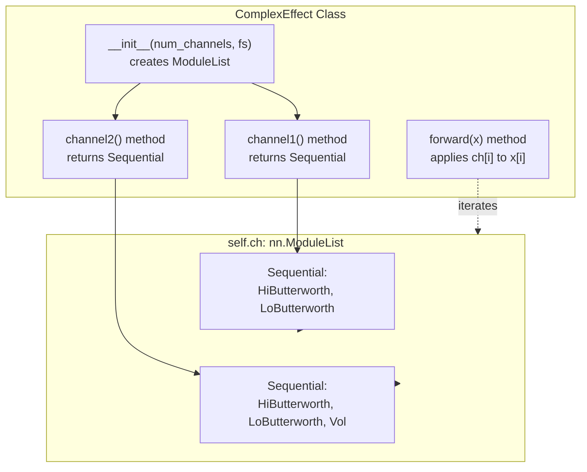

# 5 Advanced Usage

# Advanced Usage

<details>
<summary>Relevant source files</summary>

The following files were used as context for generating this wiki page:

- [README.md](README.md)
- [examples/multi_channel_effect.py](examples/multi_channel_effect.py)
- [examples/series_and_parallel_filters.py](examples/series_and_parallel_filters.py)
- [src/torchfx/wave.py](src/torchfx/wave.py)

</details>


This page covers advanced usage patterns in torchfx including GPU acceleration, multi-channel audio processing, and integration with the broader PyTorch ecosystem. These topics extend beyond basic filter and effect application to address performance optimization, complex audio routing, and interoperability with PyTorch neural networks.

For specific implementation details, see:
- Multi-channel processing techniques: [Multi-Channel Processing](#5.1)
- GPU acceleration and device management: [GPU Acceleration](#5.2)
- Using torchfx with PyTorch nn.Module: [PyTorch Integration](#5.3)

## Overview of Advanced Features

TorchFX provides three primary advanced capabilities that distinguish it from traditional audio DSP libraries:

| Feature | Core Mechanism | Primary Classes |
|---------|---------------|-----------------|
| **GPU Acceleration** | Device-aware tensor operations | `Wave.to()`, `Wave.device` |
| **Multi-Channel Processing** | Per-channel and merged operations | `Wave.get_channel()`, `Wave.merge()`, `Wave.channels()` |
| **PyTorch Integration** | nn.Module inheritance | `FX`, `AbstractFilter` |

These features work together to enable high-performance, flexible audio processing pipelines that can leverage GPU hardware and integrate seamlessly with machine learning workflows.

**Sources:** [src/torchfx/wave.py:28-292](), [README.md:8-14]()

## Device Management Architecture



**Device Management Flow in Wave Class**

The `Wave` class maintains device state through a private `__device` field [src/torchfx/wave.py:42]() that tracks whether the audio tensor resides in CPU or GPU memory. The `to()` method [src/torchfx/wave.py:65-86]() handles device transfers by moving the underlying tensor and updating the device state. The `device` property [src/torchfx/wave.py:49-63]() provides both getter and setter access, with the setter automatically invoking `to()`.

When audio processing pipelines execute via the `__or__` operator [src/torchfx/wave.py:135-174](), the pipeline operations automatically respect the device location of the input tensor. The `transform()` method [src/torchfx/wave.py:88-107]() applies transformations to `self.ys` while preserving device placement.

**Sources:** [src/torchfx/wave.py:42-86](), [examples/series_and_parallel_filters.py:14]()

## Multi-Channel Processing System



**Multi-Channel Processing Pattern**

The `Wave` class represents multi-channel audio as a 2D tensor with shape `[channels, samples]` [src/torchfx/wave.py:3-7](). The `channels()` method [src/torchfx/wave.py:188-197]() returns the number of channels, while `get_channel()` [src/torchfx/wave.py:199-218]() extracts individual channels as new `Wave` objects.

For independent per-channel processing, a common pattern involves:
1. Extracting channels with `get_channel()`
2. Applying different processing chains to each channel
3. Recombining with `Wave.merge()`

The `merge()` class method [src/torchfx/wave.py:244-291]() supports two combination modes controlled by the `split_channels` parameter:
- `split_channels=False`: Sums channels element-wise (mixing)
- `split_channels=True`: Concatenates channels dimension-wise (stacking)

**Sources:** [src/torchfx/wave.py:188-291](), [examples/multi_channel_effect.py:1-75]()

## PyTorch Ecosystem Integration Points



**PyTorch Module Compatibility**

All torchfx effects and filters inherit from `torch.nn.Module` through the `FX` base class, enabling full compatibility with PyTorch's module system. The `Wave.__or__()` operator [src/torchfx/wave.py:135-174]() accepts any `nn.Module`, not just torchfx classes.

When a module is applied via the pipe operator, the `__or__` implementation:
1. Checks if the module is an instance of `FX` or contains `FX` submodules
2. Calls `__update_config()` [src/torchfx/wave.py:176-182]() to set the sampling frequency
3. For filters, triggers coefficient computation if not already computed
4. Invokes the module's `forward()` method via `transform()`

This design allows mixing torchfx modules with standard PyTorch modules like `torchaudio.transforms.Vol` [examples/multi_channel_effect.py:39]() or custom `nn.Module` implementations.

**Sources:** [src/torchfx/wave.py:135-182](), [examples/multi_channel_effect.py:14-49]()

## Advanced Pipeline Patterns

### Pattern 1: Device-Aware Pipeline



GPU-accelerated processing requires explicit device transfers before and after the pipeline. The pattern in [examples/series_and_parallel_filters.py:13-22]() demonstrates:
1. Load audio (defaults to CPU)
2. Transfer to GPU with conditional device selection
3. Process through pipeline (operations execute on GPU)
4. Transfer result back to CPU for file I/O

### Pattern 2: Custom Multi-Channel Effect



The multi-channel effect pattern in [examples/multi_channel_effect.py:14-49]() shows how to:
1. Subclass `FX` to create custom effects
2. Use `nn.ModuleList` to store per-channel processing chains
3. Define separate processing for each channel in dedicated methods
4. Implement `forward()` to apply channel-specific processing

### Pattern 3: Parallel Filter Combination

The parallel filter pattern combines multiple filters that process the same input independently, then sums their outputs. This uses the `+` operator between filter instances [examples/series_and_parallel_filters.py:18]():

```
signal | filter1 + filter2 | next_stage
```

This creates a `ParallelFilterCombination` that applies both filters and sums results before passing to `next_stage`.

**Sources:** [examples/series_and_parallel_filters.py:1-22](), [examples/multi_channel_effect.py:14-49]()

## Performance Considerations

| Consideration | Implementation Detail | Location |
|--------------|----------------------|----------|
| **Device Transfer Overhead** | Minimize CPU↔GPU transfers; keep pipeline on GPU | [src/torchfx/wave.py:65-86]() |
| **Coefficient Computation** | Filters compute coefficients once on first use | [src/torchfx/wave.py:181-182]() |
| **Channel Processing** | Independent channels enable parallel GPU execution | [src/torchfx/wave.py:188-218]() |
| **Tensor Operations** | All operations use PyTorch tensors for GPU compatibility | [src/torchfx/wave.py:40-46]() |

The `__update_config()` method [src/torchfx/wave.py:176-182]() optimizes pipeline initialization by computing filter coefficients only once, before first use. The `_has_computed_coeff` flag prevents redundant computation in subsequent pipeline executions.

For multi-channel audio, processing each channel independently allows PyTorch's automatic parallelization to distribute work across GPU cores, significantly improving throughput compared to sequential channel processing.

**Sources:** [src/torchfx/wave.py:65-86](), [src/torchfx/wave.py:176-182](), [examples/series_and_parallel_filters.py:13-14]()