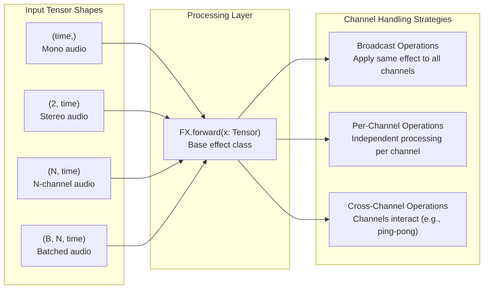
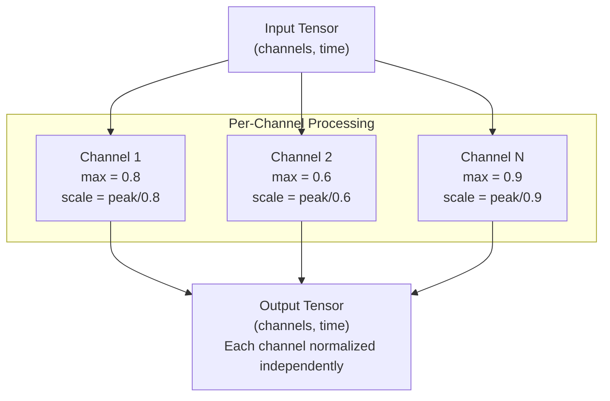
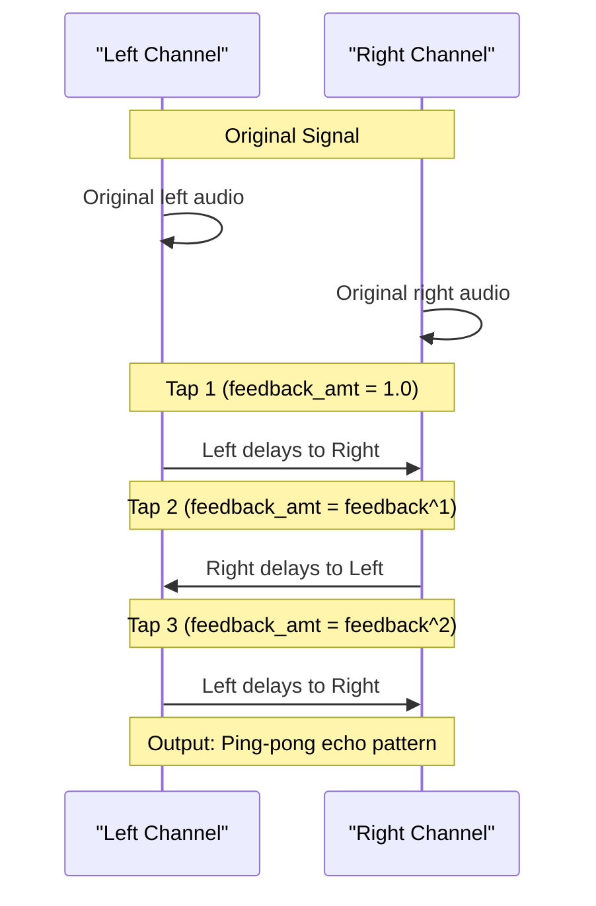
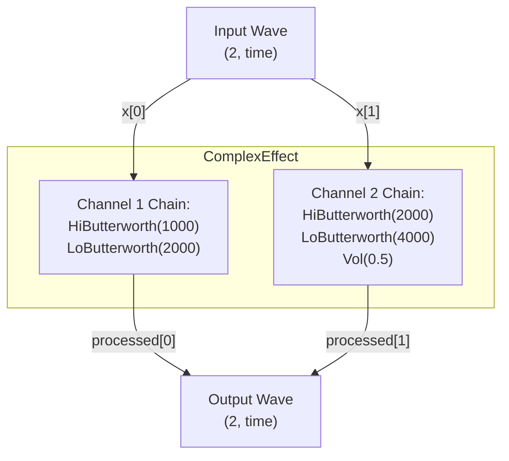
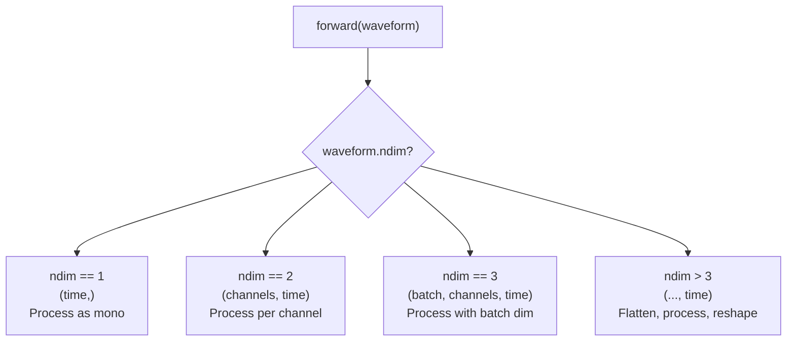

# 5.1 Multi-Channel Processing

# Multi-Channel Processing

<details>
<summary>Relevant source files</summary>

The following files were used as context for generating this wiki page:

- [examples/multi_channel_effect.py](examples/multi_channel_effect.py)
- [src/torchfx/effect.py](src/torchfx/effect.py)

</details>


This document covers multi-channel audio processing in torchfx, including tensor shape conventions, built-in multi-channel strategies, and patterns for creating custom effects that process channels independently or with channel-aware algorithms. For general effect creation, see [Creating Custom Effects](#3.5). For stereo-specific device placement and GPU usage, see [GPU Acceleration](#5.2).

## Tensor Shape Conventions

TorchFX follows standard PyTorch audio tensor conventions where the last dimension represents time and earlier dimensions represent channels and/or batches.

| Shape | Description | Example Use Case |
|-------|-------------|------------------|
| `(time,)` | Single-channel (mono) audio | Mono microphone recording |
| `(channels, time)` | Multi-channel audio | Stereo (2 channels), 5.1 surround (6 channels) |
| `(batch, channels, time)` | Batched multi-channel audio | Neural network training with multiple samples |
| `(..., time)` | Arbitrary leading dimensions | General tensor processing |

All effects inheriting from `FX` [src/torchfx/effect.py:15-30]() accept tensors with these shapes. Effects broadcast operations across all dimensions except the time dimension by default, unless they implement channel-specific logic.

**Sources:** [src/torchfx/effect.py:73-94](), [examples/multi_channel_effect.py:42-48]()



**Sources:** [src/torchfx/effect.py:15-30](), [src/torchfx/effect.py:231-261]()

## Built-in Multi-Channel Strategies

### PerChannelNormalizationStrategy

The `PerChannelNormalizationStrategy` [src/torchfx/effect.py:231-261]() normalizes each channel independently to its own peak value, rather than normalizing all channels to a shared global peak.



**Implementation details:**
- For 2D tensors `(channels, time)`: computes max per channel along `dim=1` [src/torchfx/effect.py:254-255]()
- For 3D tensors `(batch, channels, time)`: computes max per channel along `dim=2` [src/torchfx/effect.py:257-258]()
- Uses `keepdim=True` to maintain broadcasting compatibility [src/torchfx/effect.py:254-258]()

**Usage:**
```python
from torchfx import Wave
from torchfx.effect import Normalize, PerChannelNormalizationStrategy

wave = Wave.from_file("stereo_audio.wav")  # (2, time)
strategy = PerChannelNormalizationStrategy()
normalize = Normalize(peak=1.0, strategy=strategy)
normalized = wave | normalize  # Each channel normalized to its own peak
```

**Sources:** [src/torchfx/effect.py:231-261]()

### Delay Strategies

The `Delay` effect [src/torchfx/effect.py:494-714]() supports multiple processing strategies for multi-channel audio.

#### MonoDelayStrategy

`MonoDelayStrategy` [src/torchfx/effect.py:359-420]() applies identical delay processing to all channels independently. Each channel receives the same delay time and feedback pattern.

**Processing logic:**
- Single channel `(time,)`: creates delayed copy with multiple taps [src/torchfx/effect.py:378-391]()
- Multi-channel `(channels, time)`: processes each channel independently in a loop [src/torchfx/effect.py:394-409]()
- Higher dimensions: flattens to 2D, processes, then reshapes [src/torchfx/effect.py:412-419]()

**Sources:** [src/torchfx/effect.py:359-420]()

#### PingPongDelayStrategy

`PingPongDelayStrategy` [src/torchfx/effect.py:422-492]() creates alternating delays between left and right stereo channels, where:
- Odd taps: left channel delays into right channel
- Even taps: right channel delays into left channel



**Fallback behavior:** If the input is not stereo (not exactly 2 channels), `PingPongDelayStrategy` automatically falls back to `MonoDelayStrategy` [src/torchfx/effect.py:433-435]().

**Usage:**
```python
from torchfx import Wave
from torchfx.effect import Delay, PingPongDelayStrategy

wave = Wave.from_file("stereo_audio.wav")  # Must be stereo (2, time)
delay = Delay(
    bpm=120,
    delay_time="1/8",
    feedback=0.5,
    mix=0.4,
    strategy=PingPongDelayStrategy()
)
result = wave | delay  # Ping-pong delay between L/R channels
```

**Sources:** [src/torchfx/effect.py:422-492](), [src/torchfx/effect.py:494-714]()

## Creating Custom Multi-Channel Effects

To create custom multi-channel effects, subclass `FX` [src/torchfx/effect.py:15-30]() and implement channel-specific logic in the `forward` method.

### Pattern 1: Independent Per-Channel Processing

The example `ComplexEffect` [examples/multi_channel_effect.py:14-48]() demonstrates independent processing chains for each channel:



**Key implementation details:**

1. **Store per-channel processing chains** in `nn.ModuleList` [examples/multi_channel_effect.py:22-27]()
2. **Accept `fs` parameter** and pass it to filters that require sample rate [examples/multi_channel_effect.py:18-19](), [examples/multi_channel_effect.py:31-32]()
3. **Process each channel independently** in a loop [examples/multi_channel_effect.py:46-47]()
4. **Validate `fs` is set** before processing [examples/multi_channel_effect.py:43-44]()

**Complete example structure:**
```python
class ComplexEffect(FX):
    def __init__(self, num_channels: int, fs: int | None = None):
        super().__init__()
        self.num_channels = num_channels
        self.fs = fs
        self.ch = nn.ModuleList([
            self.channel1(),
            self.channel2(),
        ])
    
    def channel1(self):
        return nn.Sequential(
            HiButterworth(1000, fs=self.fs),
            LoButterworth(2000, fs=self.fs),
        )
    
    def channel2(self):
        return nn.Sequential(
            HiButterworth(2000, fs=self.fs),
            LoButterworth(4000, fs=self.fs),
            T.Vol(0.5),
        )
    
    def forward(self, x: Tensor) -> Tensor:
        if self.fs is None:
            raise ValueError("Sampling frequency (fs) must be set.")
        
        for i in range(self.num_channels):
            x[i] = self.ch[i](x[i])
        return x
```

**Sources:** [examples/multi_channel_effect.py:14-48]()

### Pattern 2: Dimensionality-Agnostic Processing

For effects that should work with any number of dimensions, implement dimension detection:



**Example from `MonoDelayStrategy`:**
- 1D case: process single channel [src/torchfx/effect.py:376-391]()
- 2D case: loop over channels [src/torchfx/effect.py:393-409]()
- 3D+ case: flatten to 2D, process, reshape [src/torchfx/effect.py:411-419]()

**Sources:** [src/torchfx/effect.py:359-420]()

### Pattern 3: Cross-Channel Interaction

For effects where channels interact (like ping-pong delay), access multiple channels explicitly:

```python
def forward(self, waveform: Tensor) -> Tensor:
    if waveform.ndim < 2 or waveform.size(-2) != 2:
        # Fallback for non-stereo
        return self.fallback_strategy(waveform)
    
    # Access specific channels
    left = waveform[..., 0, :]   # Left channel
    right = waveform[..., 1, :]  # Right channel
    
    # Cross-channel processing
    output_left = process_with_feedback_from_right(left, right)
    output_right = process_with_feedback_from_left(right, left)
    
    return torch.stack([output_left, output_right], dim=-2)
```

**Sources:** [src/torchfx/effect.py:443-465](), [src/torchfx/effect.py:467-491]()

## Channel-Specific Processing Patterns

### Validating Channel Count

Many effects expect specific channel configurations:

```python
def forward(self, waveform: Tensor) -> Tensor:
    assert waveform.ndim >= 2, "Waveform must have at least 2 dimensions (channels, time)."
    
    if waveform.size(-2) != self.expected_channels:
        raise ValueError(f"Expected {self.expected_channels} channels, got {waveform.size(-2)}")
```

**Example:** `PerChannelNormalizationStrategy` requires at least 2D tensors [src/torchfx/effect.py:249]()

**Sources:** [src/torchfx/effect.py:249]()

### Preserving Output Length

When processing extends the audio length (e.g., delay with taps), ensure all channels have consistent output length:

```python
# Calculate required output length
original_length = waveform.size(-1)
max_delay_samples = delay_samples * taps
output_length = original_length + max_delay_samples

# Create output tensor with extended length
output = torch.zeros(
    waveform.size(0), output_length,
    dtype=waveform.dtype, device=waveform.device
)
```

**Sources:** [src/torchfx/effect.py:371-373](), [src/torchfx/effect.py:395-397]()

### Using `keepdim` for Broadcasting

When computing statistics per channel, use `keepdim=True` to maintain dimensions for broadcasting:

```python
# Correct: keepdim=True allows broadcasting
max_per_channel = torch.max(torch.abs(waveform), dim=1, keepdim=True).values
normalized = waveform / max_per_channel * peak

# Incorrect: would require manual unsqueezing
max_per_channel = torch.max(torch.abs(waveform), dim=1).values  # Wrong!
```

**Sources:** [src/torchfx/effect.py:254-255](), [src/torchfx/effect.py:257-258]()

## Integration with Wave Pipeline

When using custom multi-channel effects with the `Wave` pipeline operator (`|`), the `fs` parameter can be automatically configured:

```python
# Create effect without fs
fx = ComplexEffect(num_channels=2, fs=None)

# Wave automatically sets fs via __update_config
wave = Wave.from_file("stereo_audio.wav")
result = wave | fx  # fx.fs is automatically set to wave.fs
```

The `Wave` class calls `__update_config` on effects that have an `fs` attribute, automatically setting the sample rate before processing. See [Wave Class](#2.1) for details on automatic configuration.

**Sources:** [examples/multi_channel_effect.py:70-71]()

## Summary

Multi-channel processing in torchfx follows these principles:

| Principle | Implementation |
|-----------|----------------|
| **Tensor conventions** | Last dimension is time, earlier dimensions are channels/batches |
| **Default behavior** | Broadcast operations unless channel-specific logic is implemented |
| **Strategy pattern** | Use strategy classes (e.g., `DelayStrategy`) for pluggable channel behavior |
| **Dimension handling** | Detect and handle 1D, 2D, 3D+ tensors appropriately |
| **Cross-channel effects** | Explicitly access channels via indexing for interaction patterns |
| **Sample rate** | Store `fs` attribute for automatic configuration via `Wave` pipeline |

**Sources:** [src/torchfx/effect.py:15-30](), [src/torchfx/effect.py:231-261](), [src/torchfx/effect.py:359-420](), [src/torchfx/effect.py:422-492](), [examples/multi_channel_effect.py:14-48]()