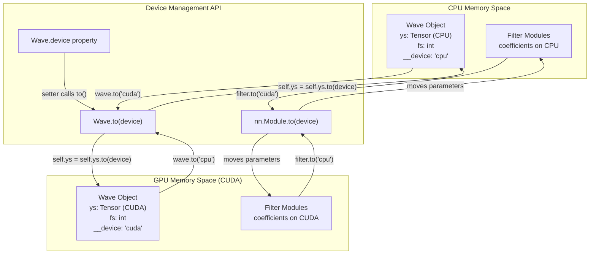
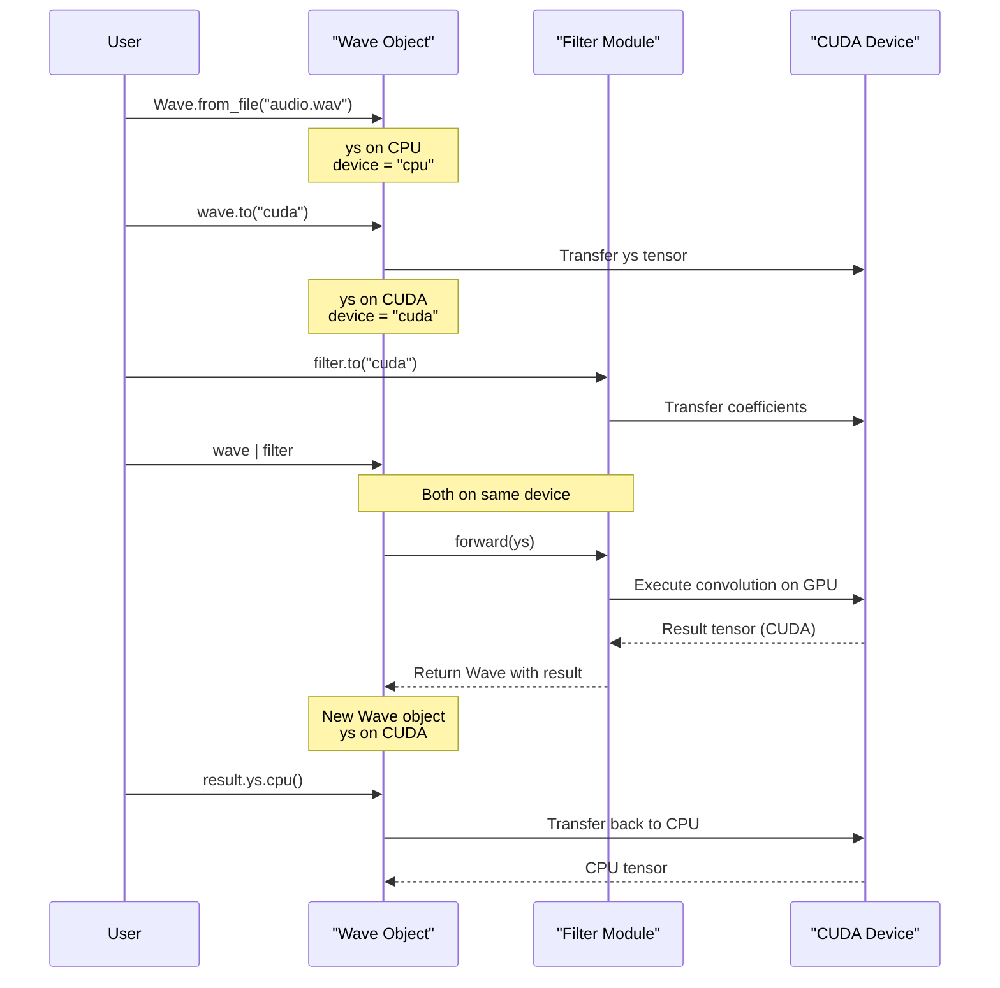
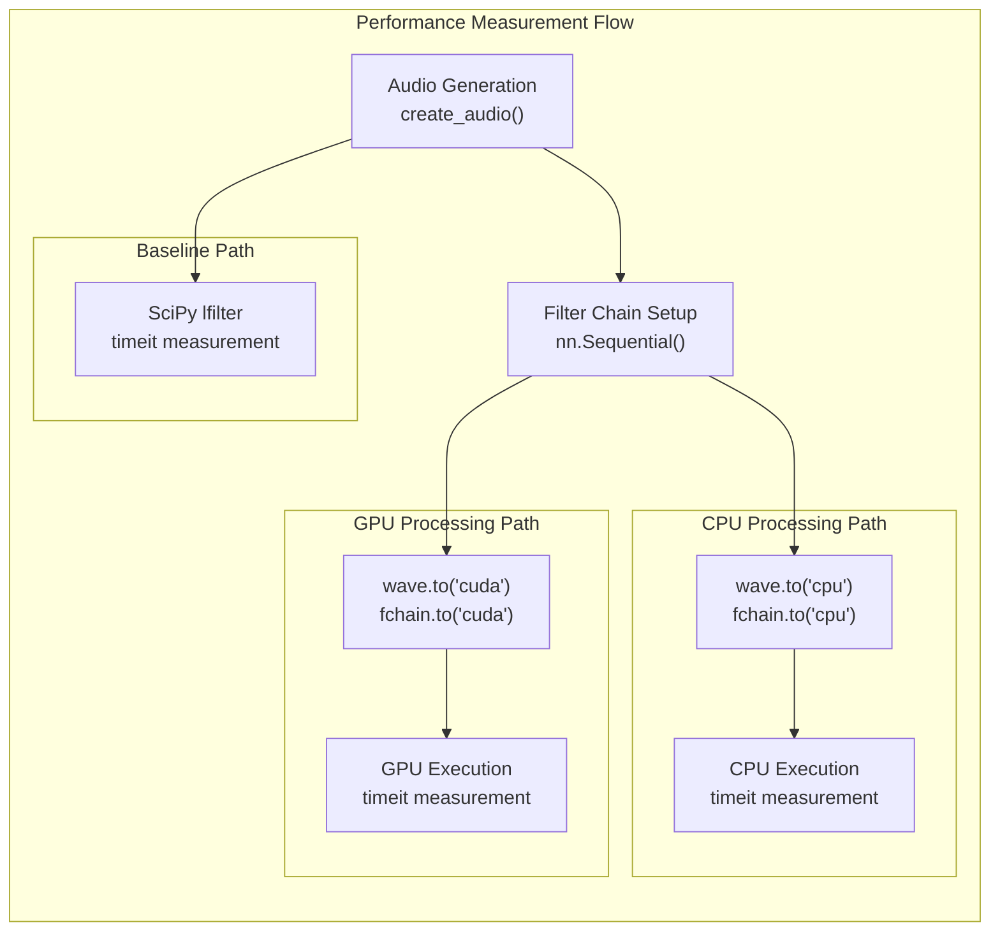
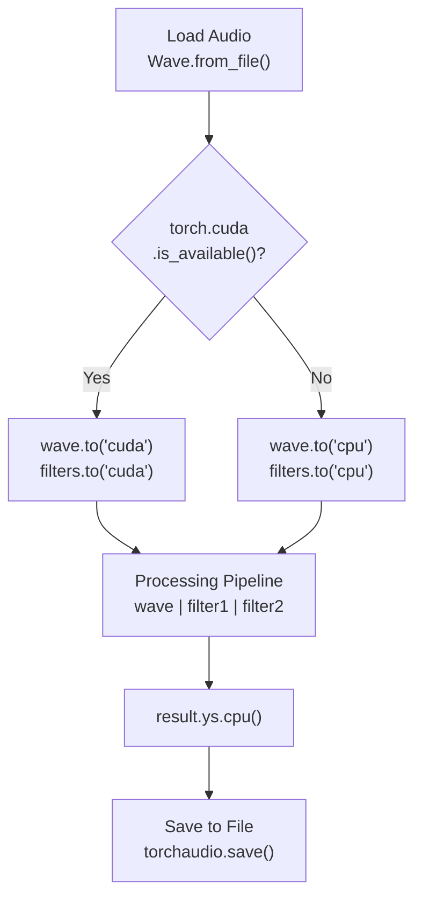

# 5.2 GPU Acceleration

# GPU Acceleration

<details>
<summary>Relevant source files</summary>

The following files were used as context for generating this wiki page:

- [README.md](README.md)
- [benchmark/fir_bench.py](benchmark/fir_bench.py)
- [examples/series_and_parallel_filters.py](examples/series_and_parallel_filters.py)
- [src/torchfx/wave.py](src/torchfx/wave.py)

</details>


This page explains how to leverage GPU acceleration in torchfx for real-time audio processing. It covers device management for `Wave` objects, filters, effects, and performance considerations when using CUDA-enabled GPUs.

For information about the core `Wave` class structure and methods, see [2.1](#2.1). For details on filter and effect implementations, see [3](#3) and [4](#4).

---

## Device Management Overview

TorchFX leverages PyTorch's device management system to enable GPU acceleration for audio processing. All audio data and filter coefficients can be moved between CPU and GPU memory using standard PyTorch device APIs.

### Device Transfer Architecture



**Sources**: [src/torchfx/wave.py:44-86](), [benchmark/fir_bench.py:60-65]()

---

## Moving Wave Objects to GPU

The `Wave` class provides two methods for device management: the `to()` method and the `device` property setter.

### The `to()` Method

The primary method for moving a `Wave` object between devices is `Wave.to(device)`, which returns the modified `Wave` object for method chaining:

| Method Signature | Return Type | Description |
|-----------------|-------------|-------------|
| `Wave.to(device: Device)` | `Self` | Moves the Wave object to the specified device |

The `Device` type accepts string literals `"cpu"` or `"cuda"`.

**Implementation Details**: The `to()` method [src/torchfx/wave.py:65-86]() performs two operations:
1. Updates the private `__device` field to track the current device
2. Moves the underlying `ys` tensor using PyTorch's `Tensor.to(device)` method

```python
# Example from documentation
wave = Wave.from_file("path/to/file.wav")
wave.to("cuda")  # Move to GPU
```

### The `device` Property

The `device` property [src/torchfx/wave.py:49-63]() provides both getter and setter functionality:

- **Getter**: Returns the current device location as a `Device` string
- **Setter**: Internally calls `to()` to move the object

```python
# Reading current device
current_device = wave.device  # Returns "cpu" or "cuda"

# Setting device via property
wave.device = "cuda"  # Equivalent to wave.to("cuda")
```

**Sources**: [src/torchfx/wave.py:44-86]()

---

## Filter and Effect Device Management

All filters and effects in torchfx inherit from `torch.nn.Module`, enabling standard PyTorch device management for their parameters and buffers.

### Module Device Transfer

Filters store their coefficients as PyTorch tensors or buffers. To enable GPU-accelerated filtering, these coefficients must be moved to the GPU:

```python
# Moving a single filter
filter = fx.filter.LoButterworth(cutoff=1000, order=4)
filter.compute_coefficients()  # Compute on CPU first
filter.to("cuda")  # Move coefficients to GPU

# Moving a Sequential chain
filter_chain = nn.Sequential(
    fx.filter.LoButterworth(cutoff=1000),
    fx.filter.HiButterworth(cutoff=5000),
    fx.filter.Normalize()
)
filter_chain.to("cuda")  # Moves all modules in the chain
```

### Device Coordination in Processing Pipelines



**Sources**: [src/torchfx/wave.py:135-174](), [benchmark/fir_bench.py:49-66]()

---

## Automatic Device Propagation

When using the pipe operator (`|`), device management is handled automatically by the `Wave.__or__()` method:

### Pipeline Operator Device Handling

The pipeline operator [src/torchfx/wave.py:135-174]() performs the following steps:

1. **Type Validation**: Ensures the operand is an `nn.Module`
2. **Configuration Update**: Sets `fs` attribute for `FX` instances if not already set
3. **Coefficient Computation**: Triggers `compute_coefficients()` for filters if needed
4. **Transform Application**: Calls the module's `forward()` method with the current tensor

The key point is that **device compatibility is the user's responsibility**. The tensor passed to `forward()` maintains its current device, and the module must be on the same device to avoid runtime errors.

| Device State | Wave Device | Module Device | Result |
|--------------|-------------|---------------|---------|
| Compatible | `"cuda"` | `"cuda"` | ✓ Processing on GPU |
| Compatible | `"cpu"` | `"cpu"` | ✓ Processing on CPU |
| Incompatible | `"cuda"` | `"cpu"` | ✗ Runtime error |
| Incompatible | `"cpu"` | `"cuda"` | ✗ Runtime error |

**Sources**: [src/torchfx/wave.py:135-183]()

---

## Performance Considerations

GPU acceleration provides significant performance benefits for audio processing, particularly for long audio files and complex filter chains.

### When GPU Acceleration is Beneficial

Based on benchmark data [benchmark/fir_bench.py](), GPU acceleration provides measurable speedups in the following scenarios:

| Scenario | GPU Advantage | Reason |
|----------|---------------|---------|
| Long audio (>60 seconds) | High | Amortizes data transfer overhead |
| Multiple channels (≥4) | High | Parallel processing across channels |
| Complex filter chains (≥3 filters) | Medium-High | Accumulated compute savings |
| Short audio (<5 seconds) | Low | Data transfer overhead dominates |
| Single channel, simple processing | Low-Medium | Insufficient parallelism |

### Benchmark Architecture



**Sources**: [benchmark/fir_bench.py:40-84]()

### Data Transfer Overhead

Moving data between CPU and GPU incurs overhead from PCIe bus transfers. The cost structure is:

| Operation | Cost | Location in Code |
|-----------|------|------------------|
| `Wave.to("cuda")` | ~O(n) where n is sample count | [src/torchfx/wave.py:85]() |
| `nn.Module.to("cuda")` | ~O(p) where p is parameter count | PyTorch internal |
| `Tensor.cpu()` | ~O(n) where n is tensor size | PyTorch internal |

**Optimization Strategy**: Minimize device transfers by:
1. Loading and moving to GPU once at the start
2. Performing all processing on GPU
3. Moving back to CPU only for final I/O

### Memory Considerations

GPU memory is typically limited compared to system RAM. Key considerations:

| Constraint | Typical Limit | Mitigation Strategy |
|------------|---------------|---------------------|
| GPU VRAM capacity | 4-24 GB (consumer GPUs) | Process audio in chunks |
| Audio file size | Limited by VRAM | Stream processing for very long files |
| Filter coefficient storage | Usually negligible | Pre-compute coefficients before GPU transfer |

**Sources**: [benchmark/fir_bench.py]()

---

## Best Practices

### Conditional Device Selection

Production code should handle systems without CUDA support gracefully. The standard pattern from [examples/series_and_parallel_filters.py:14]():

```python
import torch

# Conditional device selection
device = "cuda" if torch.cuda.is_available() else "cpu"
signal = signal.to(device)
```

This pattern:
- Checks for CUDA availability at runtime
- Falls back to CPU if CUDA is unavailable
- Enables cross-platform compatibility

### CPU Transfer for I/O Operations

File I/O operations require CPU tensors. The pattern from [examples/series_and_parallel_filters.py:22]():

```python
# Process on GPU
result = signal | filter_chain

# Save to file (requires CPU)
torchaudio.save("output.wav", result.ys.cpu(), signal.fs)
```

The `Tensor.cpu()` method creates a copy on CPU without modifying the original GPU tensor.

### Complete Processing Pipeline Pattern



**Implementation Example**:

```python
# Complete workflow with proper device management
import torch
import torchfx as fx
import torchaudio

# Load audio
wave = fx.Wave.from_file("input.wav")

# Configure processing chain
filter_chain = torch.nn.Sequential(
    fx.filter.LoButterworth(cutoff=100, order=2),
    fx.filter.HiButterworth(cutoff=2000, order=2),
    fx.effect.Reverb(delay=0.05, decay=0.5)
)

# Move to GPU if available
if torch.cuda.is_available():
    wave = wave.to("cuda")
    filter_chain = filter_chain.to("cuda")

# Process on appropriate device
result = wave | filter_chain

# Save (automatically moves to CPU)
torchaudio.save("output.wav", result.ys.cpu(), wave.fs)
```

**Sources**: [examples/series_and_parallel_filters.py:13-22](), [benchmark/fir_bench.py:60-66]()

---

## Device State Management Table

The following table summarizes device management operations and their effects:

| Operation | Effect on `Wave.ys` | Effect on `Wave.__device` | Returns |
|-----------|---------------------|---------------------------|---------|
| `Wave.to("cuda")` | Moves tensor to GPU | Sets to `"cuda"` | Same `Wave` instance |
| `Wave.to("cpu")` | Moves tensor to CPU | Sets to `"cpu"` | Same `Wave` instance |
| `wave.device = "cuda"` | Moves tensor to GPU | Sets to `"cuda"` | None (setter) |
| `wave.device` | No effect | No effect | Current device string |
| `wave.ys.cpu()` | No effect (creates new tensor) | No effect | CPU tensor |
| `wave.ys.cuda()` | No effect (creates new tensor) | No effect | CUDA tensor |
| `wave \| filter` | Creates new `Wave` with transformed tensor | Inherits from result tensor | New `Wave` instance |

**Note**: The `transform()` method [src/torchfx/wave.py:88-107]() creates a new `Wave` object. The device of the new object is determined by the device of the resulting tensor from the transformation function.

**Sources**: [src/torchfx/wave.py:44-107]()