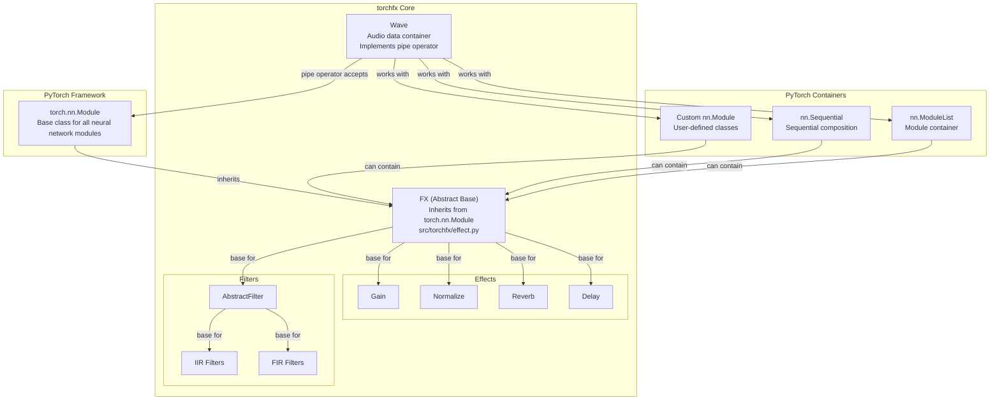
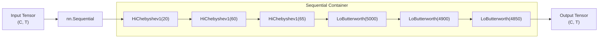
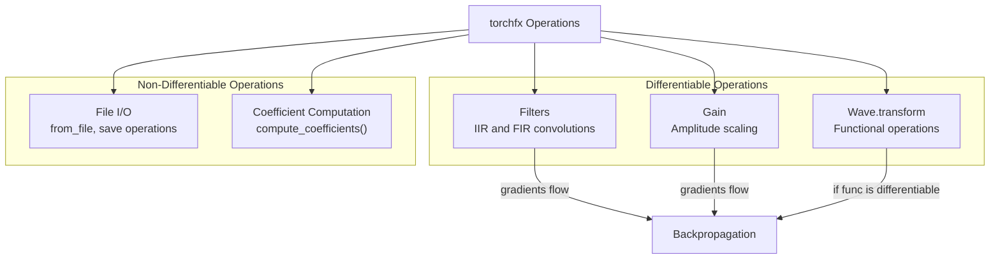
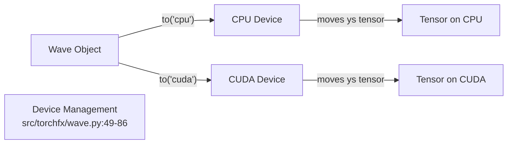

# 5.3 PyTorch Integration

# PyTorch Integration

<details>
<summary>Relevant source files</summary>

The following files were used as context for generating this wiki page:

- [README.md](README.md)
- [benchmark/api_bench.py](benchmark/api_bench.py)
- [examples/series_and_parallel_filters.py](examples/series_and_parallel_filters.py)
- [src/torchfx/wave.py](src/torchfx/wave.py)

</details>


This page explains how torchfx integrates with PyTorch's neural network framework. It covers using torchfx effects and filters as `torch.nn.Module` components, composing them with PyTorch's `nn.Sequential`, gradient computation, and integration with other PyTorch libraries.

For information about GPU acceleration and device management, see [5.2](#5.2). For multi-channel processing patterns, see [5.1](#5.1).

## Overview

All torchfx audio effects and filters are implemented as subclasses of `torch.nn.Module`, making them fully compatible with PyTorch's neural network ecosystem. This design enables:

- Seamless composition with other PyTorch modules
- Integration into neural network training pipelines
- Automatic gradient computation for differentiable operations
- Device management through PyTorch's standard API
- Compatibility with PyTorch utilities like `nn.Sequential` and `nn.ModuleList`

**Sources**: [src/torchfx/wave.py:20](), [README.md:14]()

## Core Integration Architecture

The following diagram illustrates how torchfx components integrate with PyTorch's module system:



**Sources**: [src/torchfx/wave.py:135-174](), [src/torchfx/effect.py](), [README.md:50]()

## Wave Pipe Operator with nn.Module

The `Wave` class implements the pipe operator (`|`) to accept any `torch.nn.Module`, not just torchfx-specific effects and filters. This design choice enables integration with the entire PyTorch ecosystem.

### Implementation Details

The pipe operator is implemented in [src/torchfx/wave.py:135-174]():

| Step | Action | Code Reference |
|------|--------|----------------|
| 1. Type validation | Checks if right operand is `nn.Module` | Line 163-164 |
| 2. FX configuration | Updates `fs` and computes coefficients for FX instances | Line 166-172, 176-182 |
| 3. Sequential handling | Recursively configures FX instances in Sequential/ModuleList | Line 169-172 |
| 4. Forward pass | Applies module's forward method to audio tensor | Line 174 |

### Usage Patterns

The pipe operator works with any module that implements a `forward` method accepting and returning tensors:

```python
# Works with torchfx filters
wave | fx.filter.LoButterworth(1000)

# Works with torch.nn.Sequential
wave | nn.Sequential(
    fx.filter.HiButterworth(1000),
    fx.filter.LoButterworth(2000)
)

# Works with any custom nn.Module
class CustomModule(nn.Module):
    def forward(self, x: Tensor) -> Tensor:
        return x * 0.5

wave | CustomModule()
```

**Sources**: [src/torchfx/wave.py:135-174](), [README.md:40-50]()

## Using nn.Sequential

torchfx filters and effects can be composed using `torch.nn.Sequential`, providing an alternative to the pipe operator for creating processing chains.

### Sequential Composition Pattern



### Code Example

The benchmark demonstrates three equivalent approaches:

| Approach | Implementation | Line Reference |
|----------|----------------|----------------|
| Custom Module | Define a class with filters as attributes | [benchmark/api_bench.py:28-46]() |
| Sequential | Use `nn.Sequential` with filter instances | [benchmark/api_bench.py:53-62]() |
| Pipe Operator | Chain filters using `\|` operator | [benchmark/api_bench.py:65-74]() |

**Sequential Example**:
```python
fchain = Sequential(
    HiChebyshev1(20, fs=signal.fs),
    HiChebyshev1(60, fs=signal.fs),
    HiChebyshev1(65, fs=signal.fs),
    LoButterworth(5000, fs=signal.fs),
    LoButterworth(4900, fs=signal.fs),
    LoButterworth(4850, fs=signal.fs),
)
output = fchain(signal.ys)
```

**Sources**: [benchmark/api_bench.py:53-62]()

## Creating Custom Neural Network Modules

torchfx filters and effects can be embedded in custom `nn.Module` classes to create reusable processing blocks.

### Pattern: Filter Chain Module

The following pattern from [benchmark/api_bench.py:28-46]() demonstrates a custom module that encapsulates multiple torchfx filters:

```python
class FilterChain(nn.Module):
    def __init__(self, fs):
        super().__init__()
        self.f1 = HiChebyshev1(20, fs=fs)
        self.f2 = HiChebyshev1(60, fs=fs)
        self.f3 = HiChebyshev1(65, fs=fs)
        self.f4 = LoButterworth(5000, fs=fs)
        self.f5 = LoButterworth(4900, fs=fs)
        self.f6 = LoButterworth(4850, fs=fs)

    def forward(self, x):
        x = self.f1(x)
        x = self.f2(x)
        x = self.f3(x)
        x = self.f4(x)
        x = self.f5(x)
        x = self.f6(x)
        return x
```

### Key Characteristics

| Property | Behavior |
|----------|----------|
| Module registration | Filters assigned as attributes are automatically registered by PyTorch |
| Parameter tracking | Filter coefficients become part of the module's parameters |
| Device management | Calling `.to(device)` on the parent module moves all child filters |
| State dict | Filter states are included in `state_dict()` for serialization |

**Sources**: [benchmark/api_bench.py:28-50]()

## Gradient Computation and Differentiability

torchfx operations maintain gradient flow, enabling their use in differentiable audio processing and neural network training.

### Differentiability Status



### Gradient Flow Through Processing Chain

When using torchfx modules in a training pipeline:

1. **Forward Pass**: Audio tensors flow through filter convolutions and effects
2. **Backward Pass**: Gradients flow back through differentiable operations
3. **Parameter Updates**: Filter coefficients remain fixed; gradients flow to upstream parameters

**Note**: Filter coefficients are computed from design parameters (cutoff frequency, order) using non-differentiable SciPy functions. The coefficients themselves do not receive gradients during backpropagation.

**Sources**: [src/torchfx/wave.py:88-107](), [src/torchfx/wave.py:135-174]()

## Device Management Integration

torchfx integrates with PyTorch's device management system, enabling seamless GPU acceleration.

### Wave Device Management

The `Wave` class implements PyTorch-style device management:



### Implementation Details

| Method | Behavior | Line Reference |
|--------|----------|----------------|
| `Wave.to(device)` | Moves audio tensor to specified device | [src/torchfx/wave.py:65-86]() |
| `Wave.device` property | Returns current device location | [src/torchfx/wave.py:49-59]() |
| `Wave.device` setter | Moves to device via `to()` method | [src/torchfx/wave.py:61-63]() |

### FX Module Device Synchronization

When a `Wave` is piped through an FX module, device synchronization is automatic:

1. Wave is on a device (CPU or CUDA)
2. FX module's `forward` is called with the wave's tensor
3. If the FX module has learnable parameters, they should be on the same device
4. Output tensor remains on the same device as input

**Sources**: [src/torchfx/wave.py:49-86](), [examples/series_and_parallel_filters.py:14]()

## Integration with PyTorch Ecosystem

torchfx modules can be mixed with other PyTorch libraries in the same processing pipeline.

### Mixing with torchaudio.transforms

The example in [examples/series_and_parallel_filters.py:16-20]() demonstrates mixing torchfx filters with torchaudio transforms:

```python
result = (signal
    | fx.filter.LoButterworth(100, order=2)
    | fx.filter.HiButterworth(2000, order=2) + fx.filter.HiChebyshev1(2000, order=2)
    | T.Vol(0.5)  # torchaudio.transforms.Vol
)
```

### Compatible PyTorch Libraries

| Library | Integration Pattern | Use Cases |
|---------|---------------------|-----------|
| `torchaudio.transforms` | Direct pipe operator usage | Spectrogram, MFCC, resampling, volume |
| `torch.nn` | Compose in Sequential or custom modules | Neural network layers, activations |
| Custom nn.Modules | Pipe operator or Sequential | User-defined processing blocks |

### Module Compatibility Requirements

Any `nn.Module` is compatible with torchfx's pipe operator if it:

1. Implements a `forward` method
2. Accepts a tensor as input: `(channels, time)` for audio
3. Returns a tensor of the same or compatible shape
4. Operates on the same device as the input

**Sources**: [examples/series_and_parallel_filters.py:16-20](), [src/torchfx/wave.py:135-174]()

## Integration Summary

The following table summarizes torchfx's PyTorch integration capabilities:

| Feature | Capability | Implementation |
|---------|-----------|----------------|
| Module Inheritance | All effects/filters are `nn.Module` | [FX base class](#2.2) |
| Sequential Composition | Works with `nn.Sequential` | [benchmark/api_bench.py:53-62]() |
| Custom Modules | Can be embedded in user classes | [benchmark/api_bench.py:28-46]() |
| Pipe Operator | Accepts any `nn.Module` | [src/torchfx/wave.py:135-174]() |
| Device Management | Integrates with `.to(device)` | [src/torchfx/wave.py:65-86]() |
| Gradient Flow | Maintains differentiability | Tensor operations throughout |
| Library Mixing | Works with torchaudio, custom modules | [examples/series_and_parallel_filters.py:19]() |

**Sources**: [src/torchfx/wave.py](), [benchmark/api_bench.py](), [examples/series_and_parallel_filters.py]()