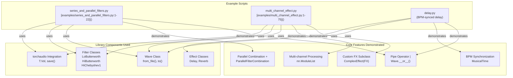
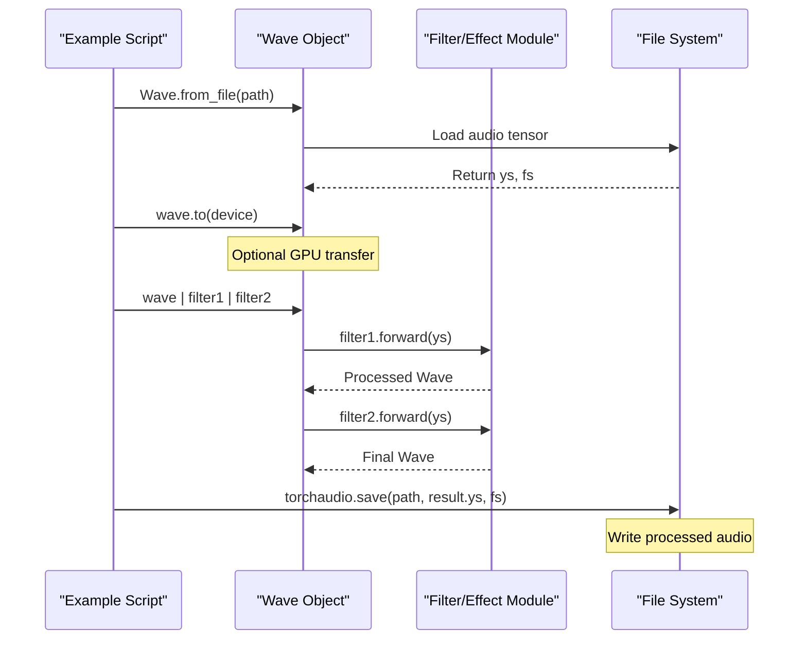
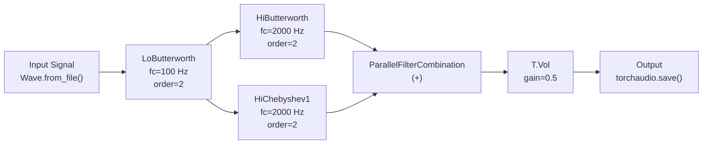
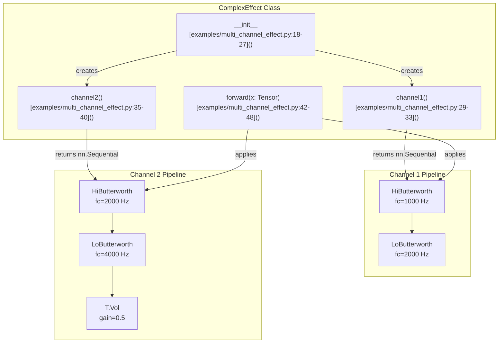

# 6 Examples

# Examples

<details>
<summary>Relevant source files</summary>

The following files were used as context for generating this wiki page:

- [README.md](README.md)
- [examples/multi_channel_effect.py](examples/multi_channel_effect.py)
- [examples/series_and_parallel_filters.py](examples/series_and_parallel_filters.py)

</details>


This page provides comprehensive working examples demonstrating common use cases and advanced patterns in torchfx. Each example shows complete, executable code from the [examples/]() directory that illustrates key library features including filter chaining, parallel filter combination, multi-channel processing, and BPM-synchronized effects.

For detailed API documentation of the classes and methods used in these examples, see [API Reference](#8). For conceptual background on the Wave class and pipeline operator, see [Core Concepts](#2).

## Available Examples

The torchfx repository includes several example scripts that demonstrate different usage patterns. The table below summarizes the available examples and their key features:

| Example File | Primary Concept | Key Classes Used | Complexity |
|--------------|----------------|------------------|------------|
| `series_and_parallel_filters.py` | Filter chaining and parallel combination | `Wave`, `LoButterworth`, `HiButterworth`, `HiChebyshev1` | Basic |
| `multi_channel_effect.py` | Custom multi-channel effect | `FX`, `ComplexEffect`, `HiButterworth`, `LoButterworth` | Intermediate |
| `delay.py` | BPM-synchronized delay | `Wave`, `Delay`, `MusicalTime` | Intermediate |

**Sources**: [examples/series_and_parallel_filters.py](), [examples/multi_channel_effect.py](), [README.md:32-50]()

## Example Architecture Overview

The following diagram illustrates how the example scripts relate to different library features and processing patterns:



**Sources**: [examples/series_and_parallel_filters.py](), [examples/multi_channel_effect.py](), [README.md]()

## Basic Pipeline Construction Pattern

All torchfx examples follow a common pattern for constructing audio processing pipelines:

1. **Load Audio**: Create a `Wave` object from an audio file using `Wave.from_file()`
2. **Device Transfer** (optional): Move the Wave to GPU using `.to("cuda")`
3. **Apply Pipeline**: Chain filters and effects using the pipe operator `|`
4. **Save Output**: Write the processed audio using `torchaudio.save()`

The following sequence diagram shows the execution flow common to all examples:



**Sources**: [examples/series_and_parallel_filters.py:13-22](), [examples/multi_channel_effect.py:66-74](), [README.md:36-50]()

## Series and Parallel Filter Combination

The [examples/series_and_parallel_filters.py]() demonstrates combining filters in series and parallel to create a multi-path processing circuit. This example implements the following signal flow:

```
Input -> LoButterworth(100 Hz) -> [ HiButterworth(2000 Hz) + HiChebyshev1(2000 Hz) ] -> Vol(0.5) -> Output
```

### Circuit Topology



### Key Implementation Details

The parallel filter combination is achieved using the `+` operator between filter instances [examples/series_and_parallel_filters.py:18]():

```python
fx.filter.HiButterworth(2000, order=2) + fx.filter.HiChebyshev1(2000, order=2)
```

This creates a `ParallelFilterCombination` object that processes the input through both filters and sums their outputs. The entire pipeline uses the pipe operator for series connections:

```python
result = (signal
    | fx.filter.LoButterworth(100, order=2)
    | fx.filter.HiButterworth(2000, order=2) + fx.filter.HiChebyshev1(2000, order=2)
    | T.Vol(0.5)
)
```

### Device Management

The example includes device detection and automatic GPU utilization [examples/series_and_parallel_filters.py:14]():

```python
signal = signal.to("cuda" if torch.cuda.is_available() else "cpu")
```

**Sources**: [examples/series_and_parallel_filters.py:1-22](), [README.md:36-50]()

## Multi-Channel Effect Example

The [examples/multi_channel_effect.py]() demonstrates creating a custom effect that processes multiple audio channels independently with different processing chains. This pattern is useful for stereo effects, surround sound processing, or any scenario requiring per-channel processing.

### ComplexEffect Class Architecture



### Implementation Pattern

The `ComplexEffect` class extends the `FX` base class [examples/multi_channel_effect.py:14]():

```python
class ComplexEffect(FX):
    ch: nn.ModuleList
    fs: int | None
```

Key design patterns used:

1. **Channel-specific processing chains**: Each channel has a separate `nn.Sequential` containing its processing modules [examples/multi_channel_effect.py:22-27]()
2. **ModuleList storage**: The channel processors are stored in `nn.ModuleList` for proper PyTorch module registration
3. **Iterative processing**: The forward method iterates over channels, applying the appropriate processor [examples/multi_channel_effect.py:46-47]()

### Per-Channel Processing Loop

The forward method applies channel-specific processing:

```python
def forward(self, x: Tensor) -> Tensor:
    for i in range(self.num_channels):
        x[i] = self.ch[i](x[i])
    return x
```

This pattern allows different filter characteristics and gain adjustments per channel. For example:
- **Channel 1**: Bandpass filter (1000 Hz - 2000 Hz)
- **Channel 2**: Bandpass filter (2000 Hz - 4000 Hz) with 50% volume reduction

### Integration with torchaudio

The example integrates torchaudio's `Vol` transform directly into the processing chain [examples/multi_channel_effect.py:39](), demonstrating compatibility with the broader PyTorch audio ecosystem.

**Sources**: [examples/multi_channel_effect.py:1-75]()

## BPM-Synced Delay Usage

While not provided in the repository files, the delay example demonstrates using the `Delay` effect with BPM synchronization and musical time divisions. This pattern is particularly useful for music production workflows where effects need to sync with tempo.

### Typical Usage Pattern

The `Delay` effect accepts `MusicalTime` specifications for delay length:

```python
from torchfx import Wave
from torchfx.effect import Delay
from torchfx.typing import MusicalTime

wave = Wave.from_file("audio.wav")
delayed = wave | Delay(
    delay=MusicalTime(beats=1, bpm=120),  # 1 beat delay at 120 BPM
    feedback=0.5,
    mix=0.3
)
```

### Musical Time Divisions

The `MusicalTime` type supports various musical divisions:

| Time Division | Description | Example at 120 BPM |
|---------------|-------------|-------------------|
| Whole note | 4 beats | 2000 ms |
| Half note | 2 beats | 1000 ms |
| Quarter note | 1 beat | 500 ms |
| Eighth note | 0.5 beats | 250 ms |
| Sixteenth note | 0.25 beats | 125 ms |

### Delay Strategies

The `Delay` effect supports multiple processing strategies:

- **Mono**: Single delay line applied equally to all channels
- **Ping-pong**: Stereo delay alternating between left and right channels
- **Multi-tap**: Multiple delay taps with independent timing

For detailed information on delay implementation and strategies, see [Delay](#3.4).

**Sources**: [README.md:36-50]()

## Command-Line Usage

Both multi-channel and series/parallel examples support command-line execution with argument parsing:

```bash
# Multi-channel effect
python examples/multi_channel_effect.py input.wav output.wav

# Series and parallel filters
python examples/series_and_parallel_filters.py
```

The multi-channel example includes an argparse-based interface [examples/multi_channel_effect.py:52-59]() for specifying input and output files, while the series/parallel example uses hardcoded paths.

**Sources**: [examples/multi_channel_effect.py:51-74](), [examples/series_and_parallel_filters.py:13-22]()

## Common Patterns Summary

The following table summarizes common patterns demonstrated across all examples:

| Pattern | Syntax | Example Files | Purpose |
|---------|--------|---------------|---------|
| Series chaining | `wave \| fx1 \| fx2` | All examples | Sequential processing |
| Parallel combination | `fx1 + fx2` | series_and_parallel_filters.py | Multi-path processing |
| Custom FX creation | `class MyFX(FX)` | multi_channel_effect.py | Domain-specific effects |
| Device transfer | `wave.to("cuda")` | series_and_parallel_filters.py | GPU acceleration |
| File I/O | `Wave.from_file()`, `torchaudio.save()` | All examples | Loading/saving audio |
| torchaudio integration | `\| T.Vol(0.5)` | Both examples | Using torchaudio transforms |

**Sources**: [examples/series_and_parallel_filters.py](), [examples/multi_channel_effect.py](), [README.md]()