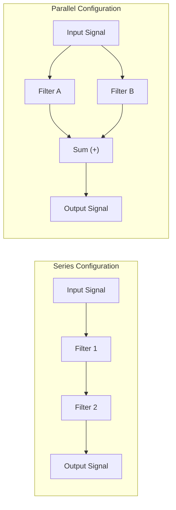
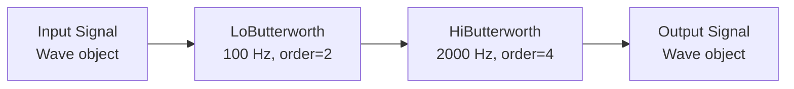
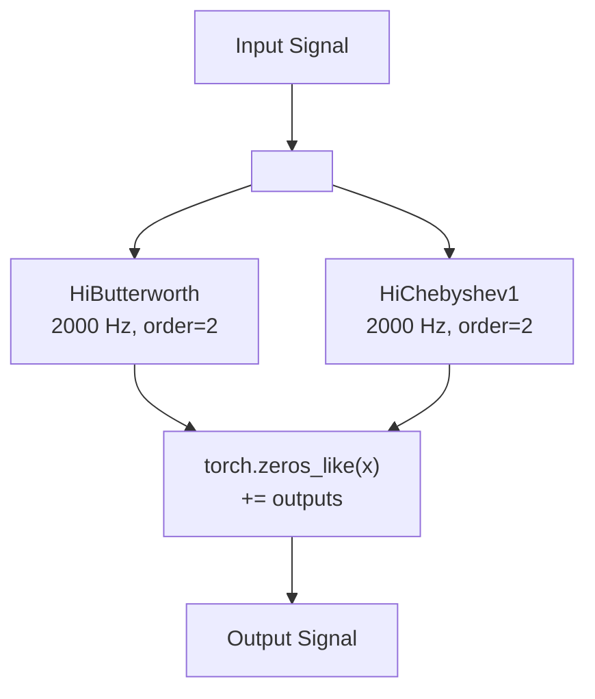
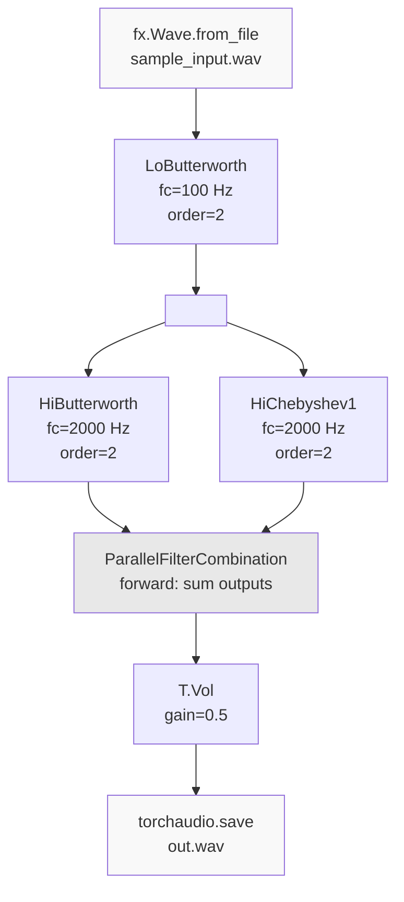
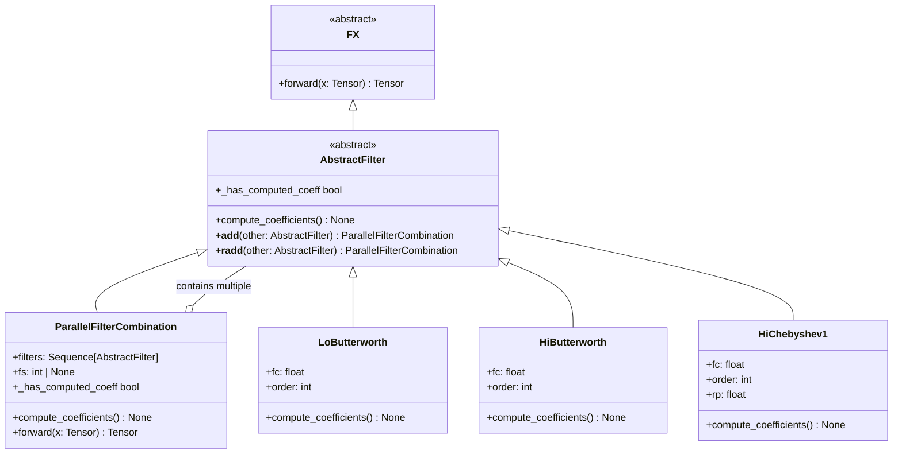

# 6.1 Series and Parallel Filters

# Series and Parallel Filters

<details>
<summary>Relevant source files</summary>

The following files were used as context for generating this wiki page:

- [README.md](README.md)
- [examples/series_and_parallel_filters.py](examples/series_and_parallel_filters.py)
- [src/torchfx/filter/__base.py](src/torchfx/filter/__base.py)

</details>


This document demonstrates how to combine filters in series and parallel configurations using torchfx. Series combinations chain filters sequentially using the pipe operator (`|`), while parallel combinations sum multiple filter outputs using the addition operator (`+`). This page focuses on practical examples and usage patterns. For details on filter implementation, see [IIR Filters](#4.1) and [FIR Filters](#4.2). For the underlying base class architecture, see [FX Base Class](#2.2).

**Sources**: [examples/series_and_parallel_filters.py:1-22]()

## Series and Parallel Concepts

Filters can be combined in two fundamental ways:

| Configuration | Operator | Behavior | Class/Method |
|---------------|----------|----------|--------------|
| **Series** | `\|` (pipe) | Sequential processing - output of one filter becomes input to next | `Wave.__or__` |
| **Parallel** | `+` (addition) | Simultaneous processing - outputs are summed together | `AbstractFilter.__add__`, `ParallelFilterCombination` |

### Signal Flow Comparison



**Sources**: [src/torchfx/filter/__base.py:34-40](), [examples/series_and_parallel_filters.py:3-6]()

## Series Filters

Series filter combinations are created using the pipe operator (`|`). Each filter in the series processes the output of the previous stage sequentially.

### Usage Pattern

```python
# Chain filters in series
result = signal | filter1 | filter2 | filter3
```

When filters are chained in series:
1. The `Wave` object flows through each filter sequentially
2. Each filter's `forward()` method processes the current signal tensor
3. A new `Wave` object is returned at each stage with the transformed audio data
4. The sampling rate (`fs`) is automatically propagated through the pipeline

### Example: Lowpass to Highpass

```python
import torchfx as fx

signal = fx.Wave.from_file("input.wav")

# Apply lowpass followed by highpass
result = (signal 
    | fx.filter.LoButterworth(100, order=2)
    | fx.filter.HiButterworth(2000, order=4)
)
```

This creates the following signal flow:



**Sources**: [examples/series_and_parallel_filters.py:16-20](), [README.md:41-46]()

## Parallel Filters

Parallel filter combinations are created using the addition operator (`+`). The `ParallelFilterCombination` class sums the outputs of all filters.

### Implementation

The `AbstractFilter` class implements the `__add__` and `__radd__` methods to support parallel combinations:

[src/torchfx/filter/__base.py:34-40]()

When filters are added:
1. A `ParallelFilterCombination` instance is created containing both filters
2. The forward pass computes each filter's output independently
3. Outputs are summed element-wise: `result = filter1(x) + filter2(x)`

### ParallelFilterCombination Class

The `ParallelFilterCombination` class [src/torchfx/filter/__base.py:43-107]() handles parallel filter processing:

| Attribute | Type | Description |
|-----------|------|-------------|
| `filters` | `Sequence[AbstractFilter]` | Collection of filters to apply in parallel |
| `fs` | `int \| None` | Sampling frequency, automatically propagated to all child filters |

Key behaviors:
- **Coefficient computation**: Calls `compute_coefficients()` on each filter [src/torchfx/filter/__base.py:96-98]()
- **Forward pass**: Applies all filters independently and sums results [src/torchfx/filter/__base.py:101-107]()
- **Sampling rate propagation**: Setting `fs` updates all child filters that have an `fs` attribute [src/torchfx/filter/__base.py:88-93]()

### Example: Two Highpass Filters in Parallel

```python
import torchfx as fx

signal = fx.Wave.from_file("input.wav")

# Combine two different highpass filters in parallel
parallel_hp = fx.filter.HiButterworth(2000, order=2) + fx.filter.HiChebyshev1(2000, order=2)

result = signal | parallel_hp
```



**Sources**: [src/torchfx/filter/__base.py:43-107](), [examples/series_and_parallel_filters.py:18]()

## Combining Series and Parallel

Series and parallel configurations can be combined in the same pipeline by using parentheses or breaking the chain into multiple lines. The pipe operator has lower precedence than addition, allowing intuitive combinations.

### Example: Complete Circuit

The example in [examples/series_and_parallel_filters.py:1-22]() demonstrates a complex circuit:

```
                                                 |-> HiButterworth (2000 Hz, order=4) - |
Input -> LoButterworth (100 Hz, order=2) -------|                                        | (+) -> Vol(0.5) -> Output
                                                 |-> HiChebyshev1  (2000 Hz, order=2) - |
```

Implementation:

```python
result = (signal
    | fx.filter.LoButterworth(100, order=2)
    | fx.filter.HiButterworth(2000, order=2) + fx.filter.HiChebyshev1(2000, order=2)
    | T.Vol(0.5)
)
```

### Signal Flow Diagram



**Sources**: [examples/series_and_parallel_filters.py:3-20]()

## Execution Flow

### Coefficient Computation

Filters automatically compute coefficients on first use. For `ParallelFilterCombination`:

1. The `_has_computed_coeff` property checks all child filters [src/torchfx/filter/__base.py:70-72]()
2. `compute_coefficients()` is called on each child filter [src/torchfx/filter/__base.py:96-98]()
3. Coefficients are computed lazily when the first audio sample is processed

### Forward Pass Details

The `ParallelFilterCombination.forward()` method [src/torchfx/filter/__base.py:101-107]():

```python
@torch.no_grad()
def forward(self, x: Tensor) -> Tensor:
    outputs = [f.forward(x) for f in self.filters]
    results = torch.zeros_like(x)
    for t in outputs:
        results += t
    return results
```

This implementation:
- Applies each filter independently to the input tensor
- Creates a zero tensor with the same shape as input
- Accumulates all filter outputs via element-wise addition
- Uses `@torch.no_grad()` for efficiency (no gradient tracking needed for inference)

**Sources**: [src/torchfx/filter/__base.py:101-107]()

## Device Management

Both series and parallel configurations work seamlessly with GPU acceleration. The `Wave` object can be moved to CUDA before processing:

```python
signal = fx.Wave.from_file("input.wav")
signal = signal.to("cuda" if torch.cuda.is_available() else "cpu")

result = (signal
    | fx.filter.LoButterworth(100, order=2)
    | fx.filter.HiButterworth(2000, order=2) + fx.filter.HiChebyshev1(2000, order=2)
)

# Move back to CPU for saving
torchaudio.save("output.wav", result.ys.cpu(), signal.fs)
```

The device is automatically propagated through all filter stages because:
- Filters inherit from `torch.nn.Module`
- Filter coefficients and state are stored as tensors
- The `Wave` object's tensor (`ys`) carries the device information

**Sources**: [examples/series_and_parallel_filters.py:13-14](), [examples/series_and_parallel_filters.py:22]()

## Class Relationship Diagram



**Sources**: [src/torchfx/filter/__base.py:11-107]()

## Best Practices

### Operator Precedence

Be aware of Python operator precedence when combining series and parallel operations:

```python
# Addition has higher precedence than pipe
result = signal | filter1 + filter2 | filter3  # Creates: signal | (filter1 + filter2) | filter3

# Use explicit parentheses for clarity
result = signal | (filter1 + filter2) | filter3

# Break into multiple lines for complex circuits
parallel_section = filter1 + filter2 + filter3
result = signal | lowpass | parallel_section | highpass
```

### Sampling Rate Management

When creating `ParallelFilterCombination` manually, you can set the sampling rate explicitly:

```python
# Set fs when creating the combination
parallel = fx.filter.ParallelFilterCombination(
    fx.filter.HiButterworth(2000, order=2),
    fx.filter.HiChebyshev1(2000, order=2),
    fs=44100
)
```

The `fs` property automatically propagates to all child filters that have an `fs` attribute [src/torchfx/filter/__base.py:88-93]().

### Mixing with Other torch.nn.Module Effects

Since filters inherit from `torch.nn.Module`, they can be mixed with other PyTorch modules in the pipeline:

```python
import torchaudio.transforms as T

result = (signal
    | fx.filter.LoButterworth(100, order=2)
    | fx.filter.HiButterworth(2000, order=2) + fx.filter.HiChebyshev1(2000, order=2)
    | T.Vol(0.5)  # torchaudio volume transform
    | fx.effect.Reverb()  # torchfx reverb effect
)
```

**Sources**: [examples/series_and_parallel_filters.py:16-20]()