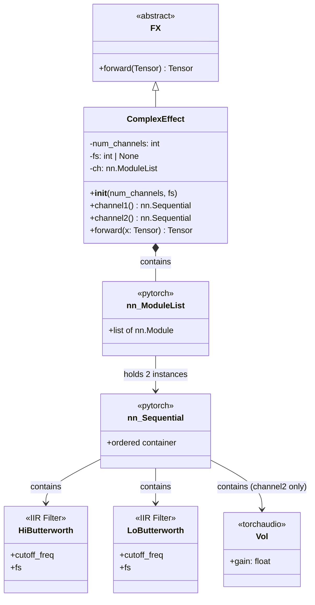
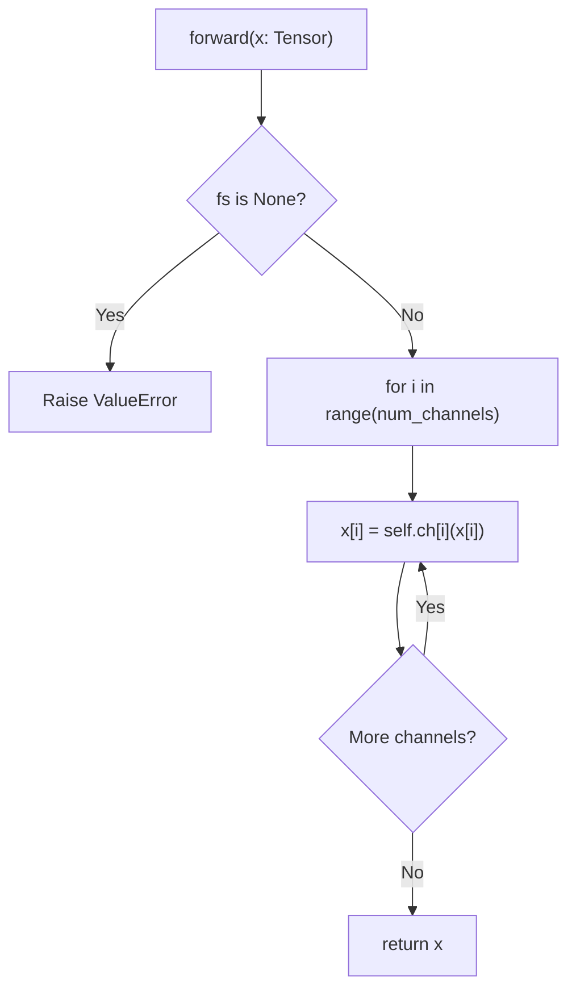
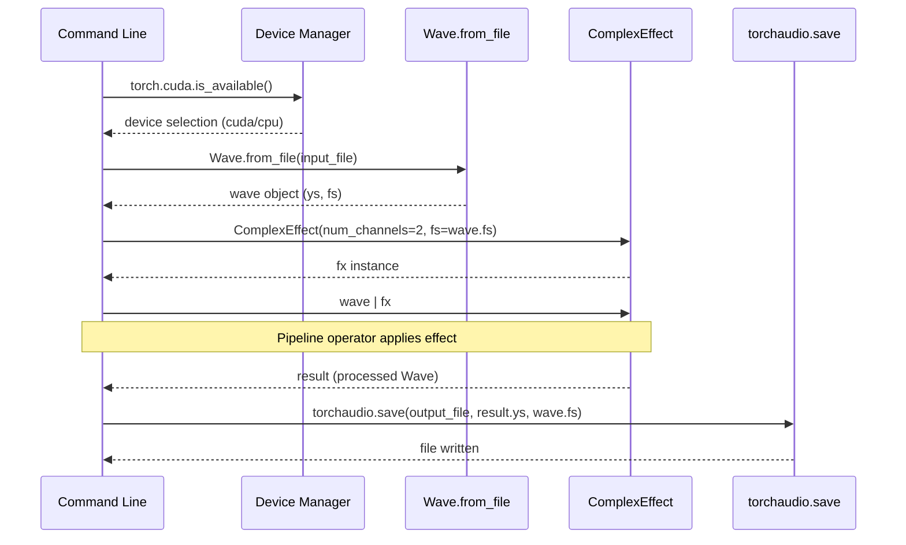
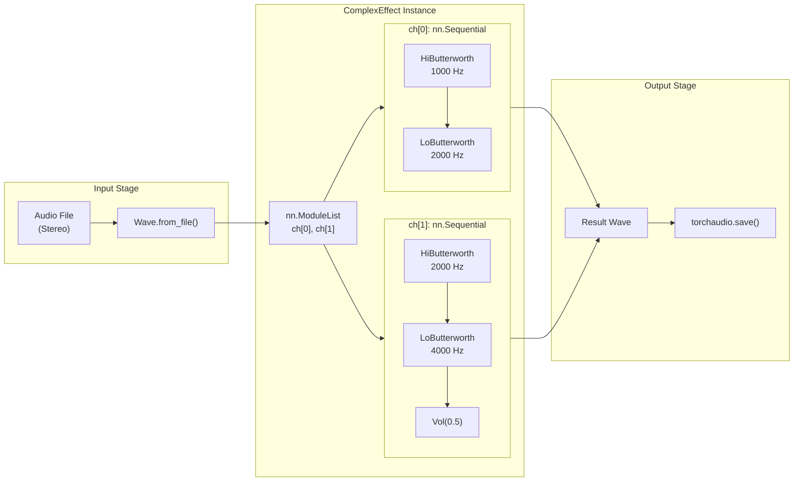

# 6.2 Multi-Channel Effect Example

# Multi-Channel Effect Example

Relevant source files

The following files were used as context for generating this wiki page:

- [examples/multi_channel_effect.py](examples/multi_channel_effect.py)

## Purpose and Scope

This document explains the multi-channel effect example provided in [examples/multi_channel_effect.py:1-75](). This example demonstrates how to create custom audio effects that apply different processing chains to individual channels of a multi-channel audio file. The example showcases advanced patterns including per-channel filter configuration, integration with both torchfx and torchaudio transforms, and proper device management.

For general information about multi-channel processing concepts, see [Multi-Channel Processing](#5.1). For details on creating custom effects, see [Creating Custom Effects](#3.5).

**Sources:** [examples/multi_channel_effect.py:1-75]()

## Overview

The example implements a `ComplexEffect` class that applies distinct filter chains to each channel of a stereo audio file. Channel 1 receives a bandpass filter configuration (1000-2000 Hz), while Channel 2 receives a different bandpass configuration (2000-4000 Hz) with additional volume reduction. This demonstrates how torchfx effects can be composed with PyTorch's `nn.Sequential` and `nn.ModuleList` to create sophisticated multi-channel processors.

**Sources:** [examples/multi_channel_effect.py:2-3](), [examples/multi_channel_effect.py:14-49]()

## ComplexEffect Class Architecture

The `ComplexEffect` class inherits from `FX` [examples/multi_channel_effect.py:14](), making it compatible with the torchfx pipeline operator. The class maintains three key attributes:

| Attribute | Type | Purpose |
|-----------|------|---------|
| `num_channels` | `int` | Number of audio channels to process |
| `fs` | `int \| None` | Sampling frequency, required for filter coefficient computation |
| `ch` | `nn.ModuleList` | Container holding per-channel processing chains |

The `nn.ModuleList` [examples/multi_channel_effect.py:22-27]() properly registers the per-channel processing chains with PyTorch's module system, enabling correct parameter tracking and device management.

**Sources:** [examples/multi_channel_effect.py:14-27]()

## Per-Channel Processing Chain Configuration

```mermaid
graph TB
    subgraph Channel_1["Channel 1 Processing Chain"]
        CH1_Input["Input Signal<br/>Channel 1"]
        HiButter1["HiButterworth<br/>cutoff=1000 Hz<br/>fs=wave.fs"]
        LoButter1["LoButterworth<br/>cutoff=2000 Hz<br/>fs=wave.fs"]
        CH1_Output["Output Signal<br/>Bandpass: 1000-2000 Hz"]
        
        CH1_Input --> HiButter1
        HiButter1 --> LoButter1
        LoButter1 --> CH1_Output
    end
    
    subgraph Channel_2["Channel 2 Processing Chain"]
        CH2_Input["Input Signal<br/>Channel 2"]
        HiButter2["HiButterworth<br/>cutoff=2000 Hz<br/>fs=wave.fs"]
        LoButter2["LoButterworth<br/>cutoff=4000 Hz<br/>fs=wave.fs"]
        Vol2["torchaudio.transforms.Vol<br/>gain=0.5"]
        CH2_Output["Output Signal<br/>Bandpass: 2000-4000 Hz<br/>Volume reduced"]
        
        CH2_Input --> HiButter2
        HiButter2 --> LoButter2
        LoButter2 --> Vol2
        Vol2 --> CH2_Output
    end
```

Each channel's processing chain is defined by a factory method that returns an `nn.Sequential` container:

### Channel 1 Configuration

The `channel1()` method [examples/multi_channel_effect.py:29-33]() creates a bandpass filter by chaining:
- `HiButterworth(1000, fs=self.fs)` - High-pass filter removing frequencies below 1000 Hz
- `LoButterworth(2000, fs=self.fs)` - Low-pass filter removing frequencies above 2000 Hz

This combination allows only frequencies in the 1000-2000 Hz range to pass through.

### Channel 2 Configuration

The `channel2()` method [examples/multi_channel_effect.py:35-40]() creates a different bandpass configuration with additional processing:
- `HiButterworth(2000, fs=self.fs)` - High-pass filter at 2000 Hz
- `LoButterworth(4000, fs=self.fs)` - Low-pass filter at 4000 Hz  
- `T.Vol(0.5)` - Volume reduction to 50% using torchaudio's `Vol` transform

This demonstrates integration between torchfx filters and torchaudio transforms within the same processing chain.

**Sources:** [examples/multi_channel_effect.py:29-40]()

## Forward Method Implementation

The `forward()` method [examples/multi_channel_effect.py:42-48]() implements the channel-specific processing logic:

1. **Validation** [examples/multi_channel_effect.py:43-44](): Ensures `fs` is set, as it's required for filter coefficient computation
2. **Channel Iteration** [examples/multi_channel_effect.py:46-47](): Loops through each channel index
3. **Per-Channel Processing**: Applies the corresponding sequential chain to each channel: `x[i] = self.ch[i](x[i])`

The method modifies the input tensor in-place, applying the appropriate processing chain from `self.ch` to each channel independently. This demonstrates that torchfx effects can process channels with complete independence while maintaining the overall tensor structure.

**Sources:** [examples/multi_channel_effect.py:42-48]()

## Command-Line Interface

The example includes a complete command-line interface for practical usage:

| Argument | Type | Description |
|----------|------|-------------|
| `input_file` | `str` | Path to input audio file |
| `output_file` | `str` | Path for processed audio output |

**Sources:** [examples/multi_channel_effect.py:52-59]()

### Execution Workflow

The workflow [examples/multi_channel_effect.py:51-74]() demonstrates:

1. **Device Detection** [examples/multi_channel_effect.py:62-63](): Automatically selects CUDA if available, otherwise CPU
2. **Audio Loading** [examples/multi_channel_effect.py:66](): Uses `Wave.from_file()` to load the input audio
3. **Effect Initialization** [examples/multi_channel_effect.py:70](): Creates `ComplexEffect` with the source file's sampling rate
4. **Pipeline Application** [examples/multi_channel_effect.py:71](): Uses the pipe operator (`|`) to apply the effect
5. **Output Saving** [examples/multi_channel_effect.py:74](): Writes processed audio using `torchaudio.save()`

Note that device transfer (line 67) is commented out in the example, but could be enabled by uncommenting `wave.to(device)`.

**Sources:** [examples/multi_channel_effect.py:51-74]()

## Complete System Integration

**Sources:** [examples/multi_channel_effect.py:1-75]()

## Key Concepts Demonstrated

This example illustrates several important patterns for torchfx development:

### Module Composition Pattern

The use of `nn.ModuleList` [examples/multi_channel_effect.py:22-27]() to hold per-channel chains demonstrates proper PyTorch module composition. This ensures:
- All submodules are registered with PyTorch's parameter system
- Device transfers (`to('cuda')`) propagate to all filters
- The effect can be saved/loaded using PyTorch's state dict mechanism

### Heterogeneous Transform Integration

Channel 2 [examples/multi_channel_effect.py:35-40]() demonstrates mixing torchfx filters (`HiButterworth`, `LoButterworth`) with torchaudio transforms (`T.Vol`). Both types work within `nn.Sequential` because they implement compatible `forward()` methods accepting and returning tensors.

### Lazy Filter Configuration

The filters are initialized with `fs=self.fs` [examples/multi_channel_effect.py:31-32, 37-38](), which may be `None` during construction. The actual sampling rate is set when instantiating the effect [examples/multi_channel_effect.py:70](). This pattern allows filter coefficient computation to be deferred until the sampling rate is known.

### Pipeline Operator Compatibility

Despite its complex internal structure, `ComplexEffect` integrates seamlessly with the torchfx pipeline operator [examples/multi_channel_effect.py:71]() because it:
- Inherits from `FX` [examples/multi_channel_effect.py:14]()
- Implements `forward(x: Tensor) -> Tensor` [examples/multi_channel_effect.py:42]()
- Operates on the tensor representation of audio (`Wave.ys`)

**Sources:** [examples/multi_channel_effect.py:14-49]()