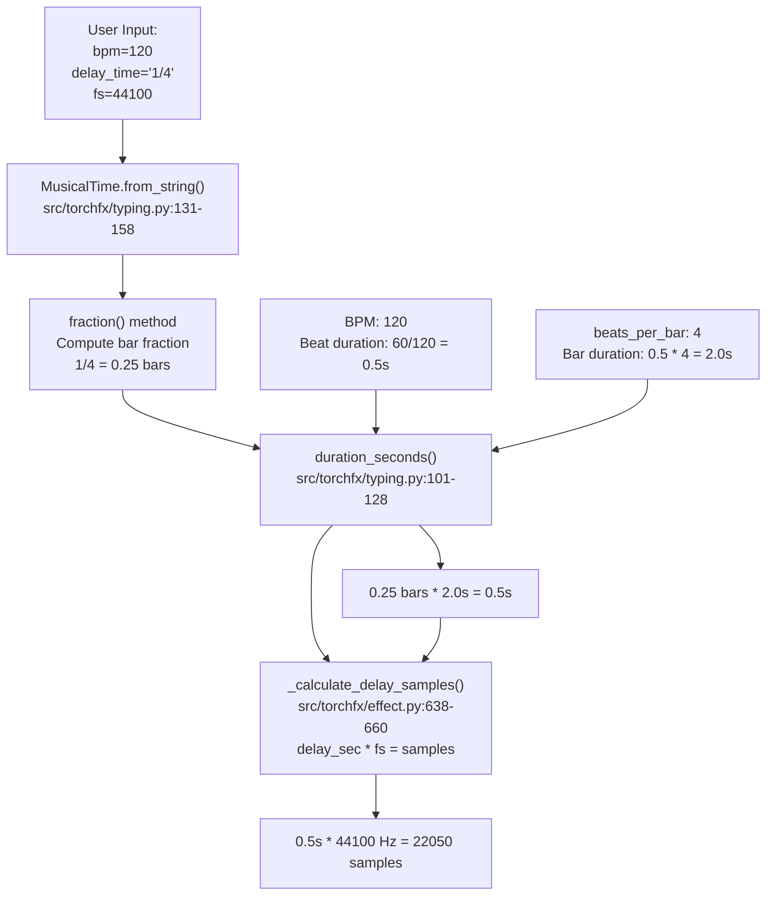
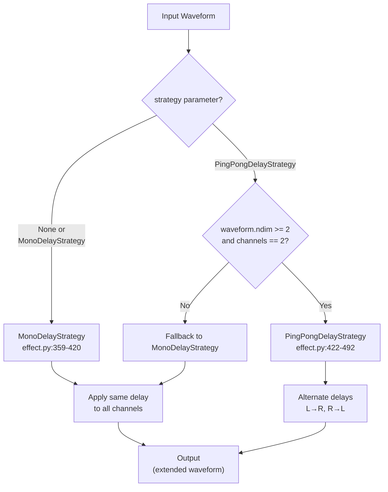
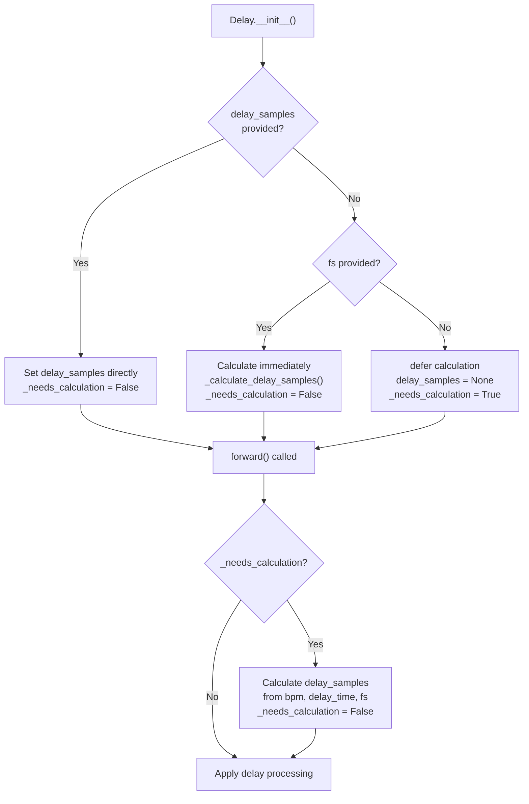

# 6.3 BPM-Synced Delay Example

# BPM-Synced Delay Example

<details>
<summary>Relevant source files</summary>

The following files were used as context for generating this wiki page:

- [.gitignore](.gitignore)
- [.vscode/settings.json](.vscode/settings.json)
- [src/torchfx/effect.py](src/torchfx/effect.py)
- [src/torchfx/typing.py](src/torchfx/typing.py)

</details>


This page demonstrates how to use the `Delay` effect with BPM synchronization and musical time divisions. The example shows how to create tempo-synced delays that automatically calculate delay times based on musical notation (e.g., 1/4 notes, 1/8 notes) rather than fixed sample counts.

For general information about the Delay effect and its parameters, see [Delay](#3.4). For details on the `MusicalTime` type system, see [Type System](#2.4).

## Purpose and Scope

This example covers:
- Converting BPM and musical time divisions into sample-accurate delays
- Using the `Delay` effect with automatic sample rate inference from `Wave` objects
- Working with delay taps and feedback for multiple echoes
- Applying different delay strategies (mono vs ping-pong)
- Combining BPM-synced delays with the pipeline operator

## BPM-to-Samples Conversion Flow

The following diagram illustrates how the `Delay` effect converts musical time specifications into sample-accurate delay times:



**Sources**: [src/torchfx/effect.py:638-660](), [src/torchfx/typing.py:101-128]()

## Basic Usage Patterns

### Pattern 1: Automatic Sample Rate Inference

When using the pipeline operator with a `Wave` object, the sample rate is automatically inferred:

```python
import torchfx as fx

# Load audio file
wave = fx.Wave.from_file("audio.wav")

# Create delay with BPM sync - fs is automatically inferred
delay = fx.effect.Delay(
    bpm=128,           # 128 BPM
    delay_time='1/8',  # Eighth note delay
    feedback=0.3,      # 30% feedback for echoes
    mix=0.2,           # 20% wet signal
    taps=3             # 3 echoes
)

# Apply using pipeline operator
delayed_wave = wave | delay
```

The `Wave` class automatically sets the `fs` attribute on the `Delay` effect when using the pipe operator. This is handled by the `Wave.__update_config` method which sets the sample rate before calling `forward()`.

**Sources**: [src/torchfx/effect.py:590-636](), [src/torchfx/wave.py]() (Wave pipeline implementation)

### Pattern 2: Explicit Sample Rate

When working directly with tensors, provide the sample rate explicitly:

```python
import torch
import torchfx as fx

# Create or load waveform tensor
waveform = torch.randn(2, 44100)  # Stereo, 1 second at 44.1kHz

# Create delay with explicit fs
delay = fx.effect.Delay(
    bpm=128,
    delay_time='1/8',
    fs=44100,          # Explicit sample rate
    feedback=0.3,
    mix=0.2
)

# Apply directly to tensor
delayed_waveform = delay(waveform)
```

**Sources**: [src/torchfx/effect.py:590-636]()

### Pattern 3: Direct Sample Specification

For non-musical delays or precise control, specify samples directly:

```python
import torchfx as fx

# Delay by exact number of samples (no BPM needed)
delay = fx.effect.Delay(
    delay_samples=2205,  # 50ms at 44.1kHz
    feedback=0.4,
    mix=0.3,
    taps=4
)

# No fs or bpm required when using delay_samples
delayed = delay(waveform)
```

**Sources**: [src/torchfx/effect.py:607-611]()

## Musical Time Division Reference

The `delay_time` parameter accepts musical notation strings following the format `n/d[modifier]`:

| Notation | Description | Bar Fraction | At 120 BPM (4/4) |
|----------|-------------|--------------|------------------|
| `1/4` | Quarter note | 0.25 bars | 0.5 seconds |
| `1/8` | Eighth note | 0.125 bars | 0.25 seconds |
| `1/16` | Sixteenth note | 0.0625 bars | 0.125 seconds |
| `1/4d` | Dotted quarter | 0.375 bars | 0.75 seconds |
| `1/8d` | Dotted eighth | 0.1875 bars | 0.375 seconds |
| `1/8t` | Eighth triplet | 0.0833 bars | 0.1667 seconds |
| `3/16` | Three sixteenths | 0.1875 bars | 0.375 seconds |

The modifier values are defined in `MusicalTime._modifier_values`:
- `""` (none): multiply by 1.0
- `"d"` (dotted): multiply by 1.5
- `"t"` (triplet): multiply by 1/3

**Sources**: [src/torchfx/typing.py:73-99]()

## Delay Processing Flow

The following diagram shows how the `Delay` effect processes audio through its forward pass:

```mermaid
sequenceDiagram
    participant User
    participant Delay["Delay.forward()<br/>effect.py:685-714"]
    participant Calc["_calculate_delay_samples()<br/>effect.py:638-660"]
    participant Strategy["DelayStrategy.apply_delay()<br/>effect.py:334-356"]
    participant Extend["_extend_waveform()<br/>effect.py:662-681"]
    
    User->>Delay: forward(waveform)
    
    alt Lazy calculation needed
        Note over Delay: _needs_calculation == True
        Delay->>Calc: Calculate delay_samples<br/>from bpm, delay_time, fs
        Calc-->>Delay: delay_samples (int)
        Note over Delay: _needs_calculation = False
    end
    
    Delay->>Strategy: apply_delay(waveform,<br/>delay_samples, taps, feedback)
    Note over Strategy: Create delayed signal<br/>with multiple taps
    Strategy-->>Delay: delayed (extended Tensor)
    
    Delay->>Extend: Extend original to match<br/>delayed length
    Extend-->>Delay: extended_waveform
    
    Note over Delay: Mix: (1-mix)*original + mix*delayed
    Delay-->>User: output (extended Tensor)
```

**Sources**: [src/torchfx/effect.py:685-714](), [src/torchfx/effect.py:638-660](), [src/torchfx/effect.py:662-681]()

## Delay Strategies

### MonoDelayStrategy

The `MonoDelayStrategy` applies the same delay to all channels, creating multiple taps with exponential feedback decay:

```python
import torchfx as fx

# Default strategy is MonoDelayStrategy
delay = fx.effect.Delay(
    bpm=120,
    delay_time='1/4',
    fs=44100,
    feedback=0.5,
    taps=4,
    strategy=fx.effect.MonoDelayStrategy()  # Explicit, but optional
)

waveform = torch.randn(2, 44100)
delayed = delay(waveform)
```

**Tap Amplitude Calculation**:
- Tap 1: amplitude = 1.0 (always full strength)
- Tap 2: amplitude = feedback^1
- Tap 3: amplitude = feedback^2
- Tap n: amplitude = feedback^(n-1)

**Output Length**: `original_length + (delay_samples * taps)`

**Sources**: [src/torchfx/effect.py:359-420]()

### PingPongDelayStrategy

The `PingPongDelayStrategy` alternates delays between left and right channels for stereo effects:

```python
import torchfx as fx

# Ping-pong delay requires stereo input
delay = fx.effect.Delay(
    bpm=120,
    delay_time='1/8',
    fs=44100,
    feedback=0.6,
    taps=6,
    strategy=fx.effect.PingPongDelayStrategy()
)

# Must be stereo (2 channels)
stereo_waveform = torch.randn(2, 44100)
delayed = delay(stereo_waveform)
```

**Ping-Pong Behavior**:
- Odd taps (1, 3, 5, ...): Left channel delays to right channel
- Even taps (2, 4, 6, ...): Right channel delays to left channel

If the input is not stereo (exactly 2 channels), `PingPongDelayStrategy` automatically falls back to `MonoDelayStrategy`.

**Sources**: [src/torchfx/effect.py:422-492]()

## Strategy Selection Diagram



**Sources**: [src/torchfx/effect.py:325-492](), [src/torchfx/effect.py:635]()

## Complete Example with Multiple Effects

Combining BPM-synced delay with other effects in a processing chain:

```python
import torchfx as fx

# Load audio
wave = fx.Wave.from_file("audio.wav")

# Create processing chain with BPM-synced delay
from torchfx.filter import Butterworth

# High-pass filter
hpf = Butterworth(cutoff=100, filter_type="high", order=4)

# Quarter note delay at 140 BPM
delay = fx.effect.Delay(
    bpm=140,
    delay_time='1/4',
    feedback=0.4,
    mix=0.3,
    taps=3,
    strategy=fx.effect.PingPongDelayStrategy()
)

# Reverb for ambience
reverb = fx.effect.Reverb(delay=2205, decay=0.6, mix=0.2)

# Apply chain using pipeline operator
processed = wave | hpf | delay | reverb

# Save result
import torchaudio
torchaudio.save("output.wav", processed.ys, processed.fs)
```

**Sources**: [src/torchfx/effect.py:494-715](), [src/torchfx/wave.py]()

## Tap and Feedback Example

Understanding how taps and feedback create rhythmic echo patterns:

```python
import torchfx as fx
import torch

# Create a simple impulse for demonstration
impulse = torch.zeros(1, 44100)
impulse[0, 0] = 1.0

# Eighth note delay with multiple taps
delay = fx.effect.Delay(
    bpm=120,
    delay_time='1/8',      # 0.25s at 120 BPM
    fs=44100,
    feedback=0.7,          # 70% feedback
    mix=1.0,               # 100% wet (delay only)
    taps=4                 # 4 echoes
)

delayed = delay(impulse)

# Result timing at 120 BPM, 1/8 note = 0.25s = 11025 samples:
# Tap 1 (11025 samples):  amplitude = 1.0
# Tap 2 (22050 samples):  amplitude = 0.7^1 = 0.7
# Tap 3 (33075 samples):  amplitude = 0.7^2 = 0.49
# Tap 4 (44100 samples):  amplitude = 0.7^3 = 0.343
```

**Mathematical Relationship**:

For tap `n` at delay time `t`:
```
position = n * delay_samples
amplitude = feedback^(n-1)  for n > 1
amplitude = 1.0             for n = 1
```

**Sources**: [src/torchfx/effect.py:494-636]()

## Lazy vs Eager Calculation

The `Delay` effect supports two calculation modes based on when `fs` is available:



**When to use each pattern**:

| Pattern | Use Case | Example |
|---------|----------|---------|
| Direct samples | Fixed delay time | `Delay(delay_samples=2205)` |
| Eager calculation | Tensor processing with known fs | `Delay(bpm=120, delay_time='1/4', fs=44100)` |
| Lazy calculation | Wave pipeline with auto fs | `wave \| Delay(bpm=120, delay_time='1/4')` |

**Sources**: [src/torchfx/effect.py:607-626](), [src/torchfx/effect.py:694-704]()

## Common Tempo and Note Division Combinations

Useful BPM and time division combinations for musical applications:

| Genre | Typical BPM | Common Delays | Example Use |
|-------|-------------|---------------|-------------|
| House | 120-130 | `1/8`, `1/16` | Rhythmic vocal delays |
| Techno | 125-135 | `1/16`, `1/32` | Fast percussion echoes |
| Dubstep | 140 | `1/4d`, `1/8t` | Syncopated delays |
| Hip-Hop | 80-110 | `1/4`, `1/8` | Vocal doubling |
| Ambient | 60-90 | `1/2`, `1/4d` | Long atmospheric delays |

**Example: Classic dubstep delay**:
```python
# Dotted eighth at 140 BPM creates syncopated rhythm
delay = fx.effect.Delay(
    bpm=140,
    delay_time='1/8d',     # Dotted eighth = 0.1875 bars
    feedback=0.5,
    mix=0.4,
    taps=3,
    strategy=fx.effect.PingPongDelayStrategy()
)
```

**Sources**: [src/torchfx/effect.py:494-715](), [src/torchfx/typing.py:49-159]()

## Error Handling and Validation

The `Delay` effect performs validation at initialization and runtime:

**Initialization Validation** [src/torchfx/effect.py:607-635]():
- If `delay_samples` not provided, `bpm` is required
- `bpm` must be > 0
- `fs` must be > 0 if provided
- `feedback` must be in [0, 0.95]
- `mix` must be in [0, 1]
- `taps` must be >= 1

**Runtime Validation** [src/torchfx/effect.py:695-702]():
- If lazy calculation needed, `fs` must be set
- `fs` must be > 0
- `bpm` must be set for BPM-synced delay

**Musical Time Validation** [src/torchfx/typing.py:131-158]():
- Format must match `n/d[modifier]` pattern
- `modifier` must be `""`, `"d"`, or `"t"`

Example error scenarios:

```python
# Error: BPM required when delay_samples not provided
delay = fx.effect.Delay(delay_time='1/4')  # AssertionError

# Error: feedback out of range
delay = fx.effect.Delay(delay_samples=1000, feedback=1.2)  # AssertionError

# Error: invalid musical time format
delay = fx.effect.Delay(bpm=120, delay_time='invalid', fs=44100)  # ValueError

# Error: fs required for lazy calculation without Wave pipeline
delay = fx.effect.Delay(bpm=120, delay_time='1/4')
delayed = delay(waveform)  # AssertionError at forward()
```

**Sources**: [src/torchfx/effect.py:607-635](), [src/torchfx/effect.py:695-704](), [src/torchfx/typing.py:131-158]()