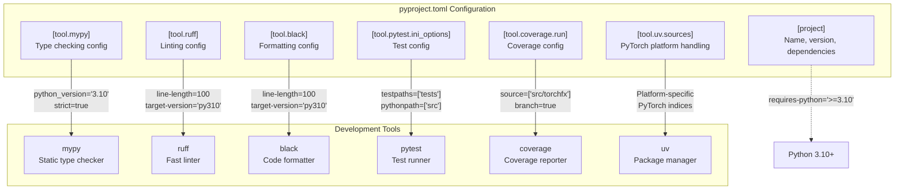
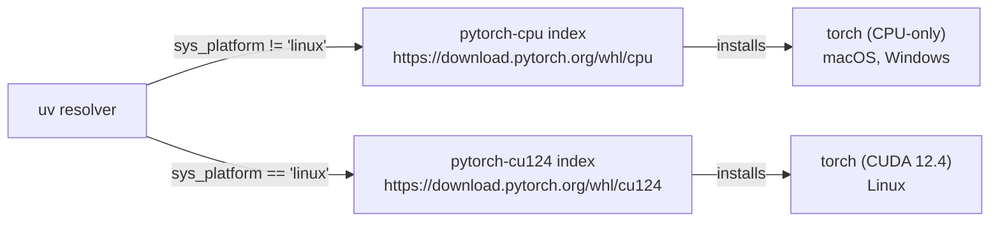
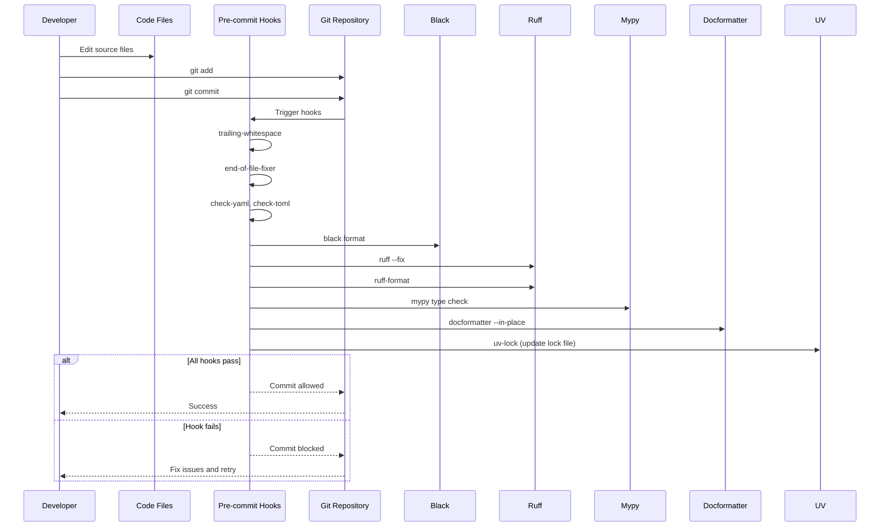
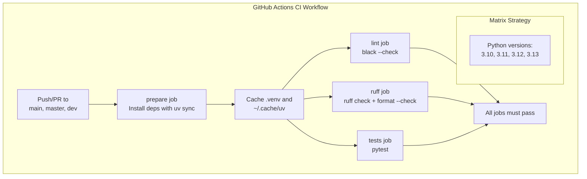
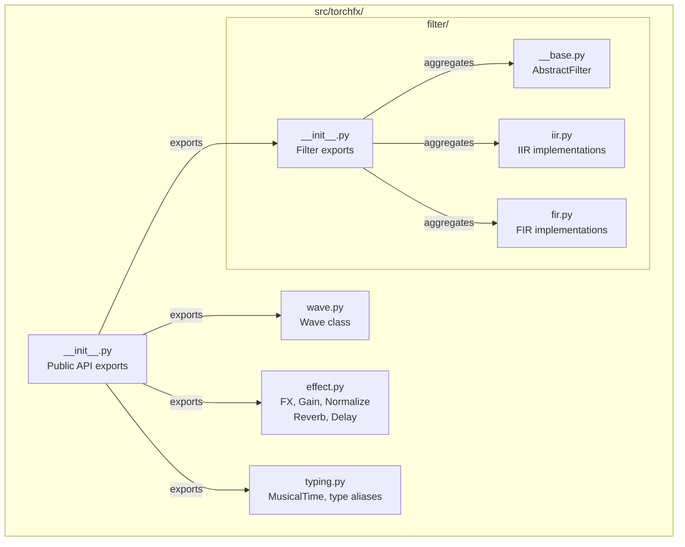

# 7 Development Guide

# Development Guide

<details>
<summary>Relevant source files</summary>

The following files were used as context for generating this wiki page:

- [.github/workflows/ci.yml](.github/workflows/ci.yml)
- [.pre-commit-config.yaml](.pre-commit-config.yaml)
- [pyproject.toml](pyproject.toml)
- [src/torchfx/__init__.py](src/torchfx/__init__.py)

</details>


This guide is for developers who want to contribute to torchfx or understand its internal architecture and development infrastructure. It covers the development environment setup, tooling, workflow, and quality assurance processes.

For information about using torchfx in your projects, see [Quick Start](#1.1). For detailed API documentation, see [API Reference](#8).

## Prerequisites

To contribute to torchfx, you need:

- **Python 3.10 or higher** - The project targets Python 3.10+ as specified in [pyproject.toml:10]()
- **uv package manager** - Fast dependency resolution and environment management
- **Git** - Version control and pre-commit hook management
- **CUDA toolkit** (optional) - For GPU development on Linux systems

## Development Environment Setup

The project uses `uv` for dependency management, which provides fast, reproducible builds with locked dependencies.

**Clone and Setup:**

```bash
# Clone the repository
git clone https://github.com/matteospanio/torchfx.git
cd torchfx

# Install uv if not already installed
pip install uv

# Create virtual environment and install dependencies
uv sync --all-groups

# Install pre-commit hooks
pre-commit install
```

The `uv sync --all-groups` command installs all dependency groups defined in [pyproject.toml:139-155](), including development tools, documentation builders, and optional CLI dependencies.

**Sources:** [pyproject.toml:10-18](), [pyproject.toml:139-155]()

## Development Tools

### Tool Configuration Matrix

The project uses multiple tools for code quality, type safety, and testing, all configured through `pyproject.toml`:

| Tool | Purpose | Configuration | Key Settings |
|------|---------|---------------|--------------|
| **mypy** | Static type checking | [pyproject.toml:70-92]() | Strict mode, Python 3.10 target |
| **ruff** | Linting and formatting | [pyproject.toml:94-104]() | Line length 100, py310 target |
| **black** | Code formatting | [pyproject.toml:106-119]() | Line length 100, LF line endings |
| **pytest** | Unit and integration testing | [pyproject.toml:125-129]() | Strict markers, source in `src/` |
| **coverage** | Code coverage reporting | [pyproject.toml:121-123]() | Tracks `src/torchfx` branch coverage |
| **docformatter** | Docstring formatting | [pyproject.toml:131-133]() | Recursive, black-compatible |



**Sources:** [pyproject.toml:70-133]()

### Platform-Specific PyTorch Handling

The project uses conditional PyTorch installation based on the target platform, configured in [pyproject.toml:50-68]():



This ensures Linux systems get GPU-accelerated PyTorch by default, while macOS and Windows get CPU-only versions.

**Sources:** [pyproject.toml:50-68]()

## Development Workflow

### Local Development Cycle



**Sources:** [.pre-commit-config.yaml:1-61]()

### Pre-commit Hook Configuration

The `.pre-commit-config.yaml` defines eight hooks that run automatically before each commit:

| Hook | Repository | Purpose | Files Affected |
|------|-----------|---------|----------------|
| trailing-whitespace | pre-commit-hooks | Remove trailing whitespace | All files |
| end-of-file-fixer | pre-commit-hooks | Ensure newline at EOF | All files |
| check-yaml | pre-commit-hooks | Validate YAML syntax | `*.yaml`, `*.yml` |
| check-toml | pre-commit-hooks | Validate TOML syntax | `*.toml` |
| check-docstring-first | pre-commit-hooks | Ensure docstrings come first | `*.py` |
| black | psf/black | Format code | `src/`, `tests/` |
| ruff | astral-sh/ruff-pre-commit | Lint and format | `src/` (excluding tests) |
| mypy | local | Type check | `src/` (excluding tests) |
| docformatter | PyCQA/docformatter | Format docstrings | All Python files |
| uv-lock | astral-sh/uv-pre-commit | Update lock file | When dependencies change |

The configuration excludes `scripts/`, `benchmark/`, `examples/`, and `docs/` from hook execution ([.pre-commit-config.yaml:58-60]()), focusing quality checks on core library code.

**Sources:** [.pre-commit-config.yaml:4-60]()

### Continuous Integration Pipeline



The CI pipeline defined in [.github/workflows/ci.yml:1-147]() runs in parallel across four Python versions. Each job:

1. **prepare** - Installs dependencies using `uv sync --all-groups` and caches the virtual environment
2. **lint** - Runs `black --check` to verify formatting
3. **ruff** - Runs `ruff check` and `ruff format --check` for linting
4. **tests** - Executes the test suite with `pytest`

The cache key is based on the Python version and a hash of `pyproject.toml` and `uv.lock`, ensuring reproducible builds.

**Sources:** [.github/workflows/ci.yml:1-147]()

## Package Structure

The torchfx package follows a standard Python package layout with clear module separation:



The public API is controlled through [src/torchfx/__init__.py:1-7](), which explicitly exports:
- `Wave` class from `wave.py`
- `FX` base class from `effect.py`
- `effect`, `filter`, and `typing` modules

This design allows users to import either specific classes (`from torchfx import Wave`) or entire modules (`import torchfx.filter`).

**Sources:** [src/torchfx/__init__.py:1-7]()

## Build System

The project uses **hatchling** as its build backend, specified in [pyproject.toml:135-137](). To build distribution packages:

```bash
# Build wheel and sdist
uv build

# Output: dist/torchfx-0.2.1-py3-none-any.whl
#         dist/torchfx-0.2.1.tar.gz
```

The package metadata includes:
- **Name**: torchfx
- **Version**: 0.2.1
- **Requires Python**: >=3.10
- **License**: GPL-3.0
- **Entry Point**: `torchfx` CLI command via [pyproject.toml:42-43]()

**Sources:** [pyproject.toml:1-48](), [pyproject.toml:135-137]()

## Dependency Groups

Dependencies are organized into groups for different use cases:

| Group | Dependencies | Purpose |
|-------|-------------|---------|
| **Core** | torch, torchaudio, numpy, scipy, soundfile | Required for library functionality |
| **cli** | typer | Optional CLI interface (not yet implemented) |
| **dev** | black, mypy, pytest, ruff, coverage, scalene | Development and testing tools |
| **docs** | sphinx, sphinx-immaterial | Documentation generation |

Install specific groups:
```bash
# Only core dependencies
uv sync

# Core + development tools
uv sync --group dev

# All dependencies
uv sync --all-groups
```

**Sources:** [pyproject.toml:11-18](), [pyproject.toml:139-155]()

## Code Quality Standards

### Type Checking with mypy

The project enforces **strict mode** type checking with the following requirements:

- All function parameters and return types must be annotated
- No implicit `Optional` types
- Warnings for unused ignores, redundant casts, and unused configs
- Explicit package bases with `mypy_path = "src"`

The configuration allows ignoring missing imports for `torchaudio` and internal modules ([pyproject.toml:86-92]()).

### Linting with ruff

Ruff enforces multiple rule sets:
- **E, F**: pycodestyle errors and Pyflakes
- **I**: isort import sorting
- **N**: pep8-naming conventions
- **UP**: pyupgrade modernizations
- **B**: flake8-bugbear bug detection
- **A**: flake8-builtins shadowing prevention
- **C4**: flake8-comprehensions
- **SIM**: flake8-simplify
- **TID**: flake8-tidy-imports
- **ARG**: flake8-unused-arguments

Specific ignores: E501 (line length, handled by black), N803/N806/N812 (variable naming for mathematical operations).

**Sources:** [pyproject.toml:70-104]()

## Related Documentation

For detailed information on specific development topics, see:

- **[Project Structure](#7.1)** - Detailed repository organization and module architecture
- **[Build and Dependencies](#7.2)** - Deep dive into `hatchling`, `uv`, and dependency management
- **[Development Workflow](#7.3)** - Comprehensive pre-commit and CI/CD documentation
- **[Testing](#7.4)** - Test infrastructure, organization, and coverage
- **[Benchmarking](#7.5)** - Performance measurement and optimization
- **[Documentation](#7.6)** - Sphinx setup and documentation deployment

**Sources:** [pyproject.toml:1-156](), [.pre-commit-config.yaml:1-61](), [.github/workflows/ci.yml:1-147](), [src/torchfx/__init__.py:1-7]()