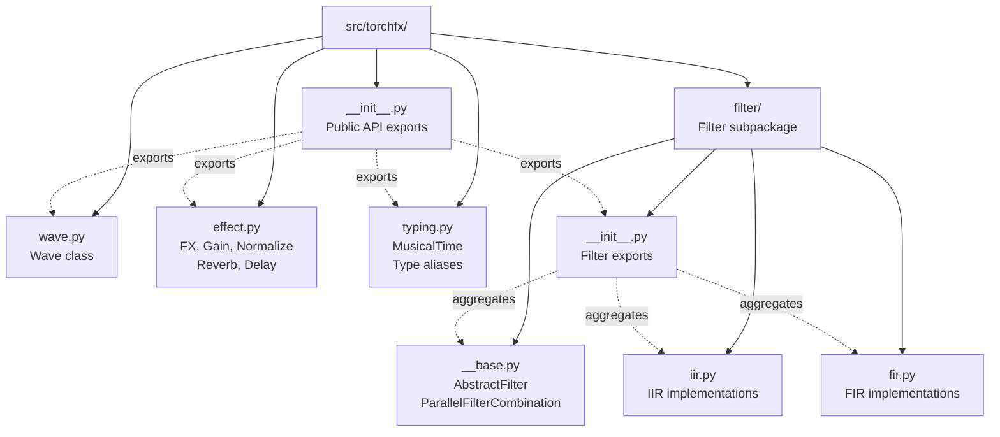
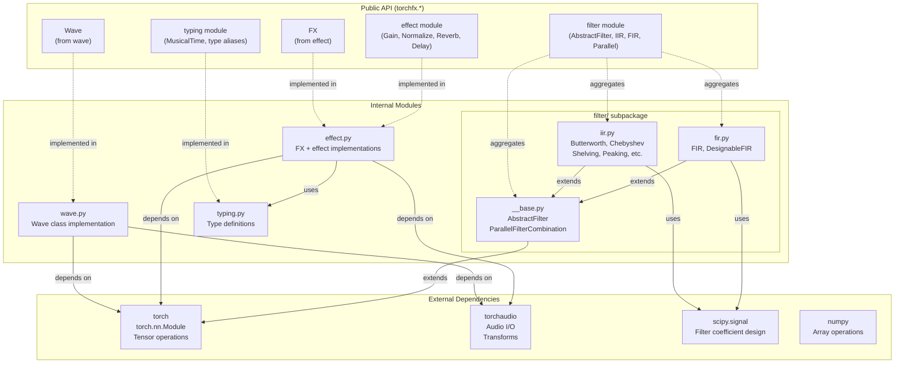
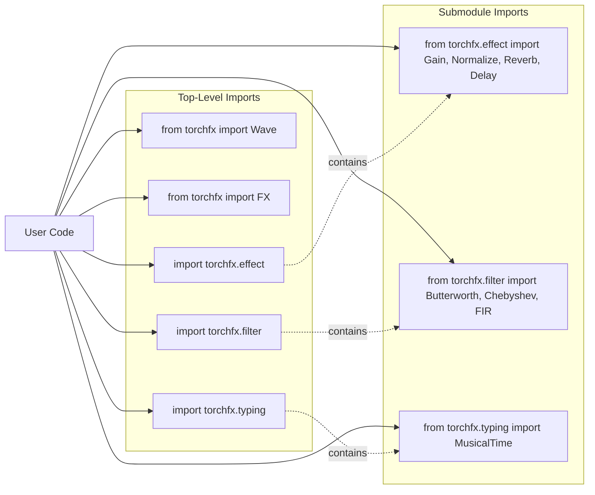

# 7.1 Project Structure

# Project Structure

<details>
<summary>Relevant source files</summary>

The following files were used as context for generating this wiki page:

- [pyproject.toml](pyproject.toml)
- [src/torchfx/__init__.py](src/torchfx/__init__.py)

</details>


## Purpose and Scope

This document provides a comprehensive overview of the torchfx repository structure, including the organization of source code modules, supporting infrastructure, and configuration files. It is intended for developers who want to contribute to the project or understand how the codebase is organized.

For information about the build system and dependency management, see [Build and Dependencies](#7.2). For the development workflow including CI/CD and code quality tools, see [Development Workflow](#7.3).

---

## Repository Layout

The torchfx repository follows a standard Python package structure with clear separation between source code, tests, documentation, and supporting tools.

### Root Directory Structure

```mermaid
graph TB
    Root["Repository Root"]
    
    Root --> Src["src/<br/>Source code"]
    Root --> Tests["tests/<br/>Test suite"]
    Root --> Docs["docs/<br/>Sphinx documentation"]
    Root --> Examples["examples/<br/>Usage examples"]
    Root --> Benchmark["benchmark/<br/>Performance tests"]
    Root --> CLI["cli/<br/>Command-line interface"]
    
    Root --> PyProject["pyproject.toml<br/>Project configuration"]
    Root --> UVLock["uv.lock<br/>Locked dependencies"]
    Root --> PreCommit[".pre-commit-config.yaml<br/>Code quality hooks"]
    Root --> GitHub[".github/<br/>CI/CD workflows"]
    Root --> README["README.md<br/>Project overview"]
    Root --> License["LICENSE<br/>GPLv3"]
    Root --> Changelog["CHANGELOG<br/>Version history"]
    
    Src --> TorchFX["torchfx/<br/>Main package"]
    Tests --> TestEffects["test_effects.py<br/>Effect tests"]
    Docs --> Source["source/<br/>Documentation source"]
    Examples --> Ex1["series_and_parallel_filters.py"]
    Examples --> Ex2["multi_channel_effect.py"]
    Examples --> Ex3["delay.py"]
    Benchmark --> B1["api_bench.py"]
    Benchmark --> B2["fir_bench.py"]
    Benchmark --> B3["iir_bench.py"]
    CLI --> Main["__main__.py<br/>CLI entry point"]
    
    GitHub --> CIWorkflow["workflows/ci.yml"]
    GitHub --> DocsWorkflow["workflows/docs.yml"]
```



**Sources:** pyproject.toml:1-156, README.md (referenced in diagrams)

### Directory Purpose Summary

| Directory | Purpose | Key Contents |
|-----------|---------|--------------|
| `src/torchfx/` | Main library package | Core modules: wave, effect, filter, typing |
| `tests/` | Test suite | Unit and integration tests |
| `docs/` | Documentation | Sphinx source files and configuration |
| `examples/` | Usage examples | Practical demonstrations of library features |
| `benchmark/` | Performance tests | GPU vs CPU performance comparisons |
| `cli/` | Command-line interface | CLI implementation (placeholder) |
| `.github/workflows/` | CI/CD pipelines | GitHub Actions workflow definitions |

**Sources:** pyproject.toml:42-48, pyproject.toml:125-129

---

## Source Package Structure

The main library is organized in `src/torchfx/` as a standard Python package. The package structure is designed for modularity, with clear separation between core functionality and specialized modules.

### Package Layout Diagram



**Sources:** src/torchfx/__init__.py:1-8

### Module Organization

The package exposes a clean public API through [src/torchfx/__init__.py:1-8]():

```
torchfx/
├── __init__.py          # Public API gateway
├── wave.py              # Wave data container
├── effect.py            # Effects and FX base class
├── typing.py            # Custom type definitions
└── filter/              # Filter subpackage
    ├── __init__.py      # Filter module exports
    ├── __base.py        # Abstract base classes
    ├── iir.py           # IIR filter implementations
    └── fir.py           # FIR filter implementations
```

**Sources:** src/torchfx/__init__.py:1-8

---

## Module Dependencies and Public API

The following diagram illustrates the dependency relationships between modules and what classes/functions are exposed in the public API.



**Sources:** src/torchfx/__init__.py:1-8, pyproject.toml:11-18

### Public API Exports

The public API is explicitly controlled through `__all__` declarations:

| Export | Source Module | Description |
|--------|---------------|-------------|
| `Wave` | `torchfx.wave` | Audio data container class |
| `FX` | `torchfx.effect` | Abstract base class for all effects/filters |
| `effect` | `torchfx.effect` | Module containing effect implementations |
| `filter` | `torchfx.filter` | Subpackage containing filter implementations |
| `typing` | `torchfx.typing` | Module with custom type definitions |

**Sources:** src/torchfx/__init__.py:7

---

## Core Module Breakdown

### wave.py - Audio Data Container

The `wave.py` module contains the `Wave` class, which is the primary data structure for audio in torchfx. It encapsulates:
- Audio tensor data (`ys: torch.Tensor`)
- Sample rate (`fs: int`)
- Device management methods
- File I/O functionality
- Pipe operator support for chaining effects

**Sources:** Referenced in src/torchfx/__init__.py:5

### effect.py - Effects and Base Class

The `effect.py` module contains:
- `FX`: Abstract base class inheriting from `torch.nn.Module`
- `Gain`: Amplitude adjustment effect
- `Normalize`: Audio normalization with multiple strategies
- `Reverb`: Reverberation effect
- `Delay`: BPM-synchronized delay effect

All effects support the pipe operator (`|`) for chaining.

**Sources:** src/torchfx/__init__.py:1,4

### typing.py - Type System

The `typing.py` module defines custom types for audio DSP:
- `MusicalTime`: Type for BPM-synchronized timing
- Type aliases for audio parameters (e.g., `Decibel`, `Second`)
- Annotations for improved type safety

**Sources:** src/torchfx/__init__.py:3

### filter/ - Filter Subpackage

The filter subpackage is organized into three main files:

#### __base.py - Abstract Interfaces

Contains:
- `AbstractFilter`: Base class for all filters
- `ParallelFilterCombination`: Combines multiple filters in parallel (supports `+` operator)

#### iir.py - IIR Filter Implementations

Contains specific IIR filter types:
- Butterworth filters (lowpass, highpass, bandpass, bandstop)
- Chebyshev filters (Type I and Type II)
- Shelving filters (lowshelf, highshelf)
- Peaking filters
- Notch filters
- AllPass filters
- Linkwitz-Riley crossover filters

#### fir.py - FIR Filter Implementations

Contains:
- `FIR`: Basic FIR filter with coefficient input
- `DesignableFIR`: FIR filter with automatic coefficient design

**Sources:** src/torchfx/__init__.py:2, pyproject.toml:13-14 (scipy dependency)

---

## Supporting Infrastructure

### Examples Directory

The `examples/` directory contains practical demonstrations:

| File | Purpose |
|------|---------|
| `series_and_parallel_filters.py` | Demonstrates filter chaining (`\|`) and parallel combination (`+`) |
| `multi_channel_effect.py` | Shows custom multi-channel effect implementation |
| `delay.py` | Demonstrates BPM-synchronized delay with musical timing |

**Sources:** Referenced in high-level diagrams

### Tests Directory

The `tests/` directory contains the test suite:

| File | Purpose |
|------|---------|
| `test_effects.py` | Unit and integration tests for effects |
| Additional test files | Tests for filters, Wave class, etc. |

Test configuration is specified in [pyproject.toml:125-129]():
- Test discovery in `tests/` directory
- Python path includes `src/` for imports
- Coverage reporting targets `src/torchfx`

**Sources:** pyproject.toml:125-129, pyproject.toml:121-123

### Documentation Directory

The `docs/` directory contains Sphinx documentation:

```
docs/
├── source/
│   ├── api.rst          # API reference
│   ├── conf.py          # Sphinx configuration
│   └── ...              # Other documentation pages
├── Makefile             # Build automation
└── make.bat             # Windows build script
```

Documentation is automatically built and deployed to GitHub Pages via [.github/workflows/docs.yml]().

**Sources:** pyproject.toml:152-155 (docs dependencies)

### Benchmark Directory

The `benchmark/` directory contains performance measurement scripts:

| File | Purpose |
|------|---------|
| `api_bench.py` | Compares different API patterns (FilterChain, Sequential, pipe operator) |
| `fir_bench.py` | Measures FIR filter performance (GPU vs CPU vs SciPy) |
| `iir_bench.py` | Measures IIR filter performance (GPU vs CPU vs SciPy) |
| `draw3.py` | Visualizes benchmark results as PNG images |

**Sources:** Referenced in high-level diagrams

### CLI Directory

The `cli/` directory contains the command-line interface:

```
cli/
└── __main__.py          # CLI entry point
```

The CLI is configured as a project script in [pyproject.toml:42-43]():
```
[project.scripts]
torchfx = "cli.__main__:main"
```

Currently serves as a placeholder for future CLI functionality.

**Sources:** pyproject.toml:42-43

---

## Configuration Files

### pyproject.toml - Central Configuration Hub

The [pyproject.toml:1-156]() file serves as the central configuration for the entire project:

#### Project Metadata ([pyproject.toml:1-48]())
- Name, version, description
- License (GPLv3) and authors
- Python version requirement (>=3.10)
- Dependencies and classifiers
- Project URLs (repository, documentation, changelog)

#### Tool Configurations

| Tool | Purpose | Configuration Lines |
|------|---------|---------------------|
| `uv` | Package manager with PyTorch source configuration | [pyproject.toml:50-68]() |
| `mypy` | Type checking with strict mode | [pyproject.toml:70-92]() |
| `ruff` | Fast Python linter and formatter | [pyproject.toml:94-104]() |
| `black` | Code formatting | [pyproject.toml:106-119]() |
| `coverage` | Test coverage measurement | [pyproject.toml:121-123]() |
| `pytest` | Testing framework | [pyproject.toml:125-129]() |
| `docformatter` | Docstring formatting | [pyproject.toml:131-133]() |

#### Build System ([pyproject.toml:135-137]())
- Uses `hatchling` as the build backend
- Generates wheel packages for distribution

#### Dependency Groups ([pyproject.toml:139-155]())
- `cli`: Optional CLI dependencies (typer)
- `dev`: Development tools (black, mypy, pytest, ruff, etc.)
- `docs`: Documentation tools (sphinx, sphinx-immaterial)

**Sources:** pyproject.toml:1-156

### uv.lock - Dependency Lock File

The `uv.lock` file provides:
- Complete dependency resolution with exact versions
- Reproducible builds across environments
- Platform-specific dependency tracking

Generated and managed by the `uv` package manager.

**Sources:** Referenced in high-level diagrams

### .pre-commit-config.yaml - Code Quality Hooks

Configures pre-commit hooks that run before each commit:
- Type checking with `mypy`
- Linting with `ruff`
- Formatting with `black`
- Docstring formatting with `docformatter`

**Sources:** Referenced in high-level diagrams

### .github/workflows/ - CI/CD Configuration

Contains GitHub Actions workflow definitions:

| Workflow | Purpose | File |
|----------|---------|------|
| CI | Runs tests, linting, and type checking in parallel across Python 3.10-3.13 | `ci.yml` |
| Docs | Builds Sphinx documentation and deploys to GitHub Pages | `docs.yml` |

**Sources:** Referenced in high-level diagrams

---

## Package Distribution

The project is configured for distribution as a Python package:

### Build Artifacts

- **Wheel package**: `torchfx-*.whl` built using hatchling
- **Source distribution**: Generated from project source
- **Documentation site**: Deployed to GitHub Pages at https://matteospanio.github.io/torchfx/

### Installation Points

The package can be installed via:
- PyPI: `pip install torchfx`
- From source: `pip install -e .` for development
- With extras: `pip install torchfx[cli]` for CLI support

**Sources:** pyproject.toml:1-3, pyproject.toml:135-137, pyproject.toml:45-47

---

## Module Import Hierarchy

The following diagram shows how modules can be imported and the recommended import patterns:



**Sources:** src/torchfx/__init__.py:1-8

### Recommended Import Patterns

```python
# Core classes
from torchfx import Wave, FX

# Module imports for namespace organization
import torchfx.effect as effect
import torchfx.filter as filter
import torchfx.typing

# Direct class imports
from torchfx.effect import Gain, Normalize
from torchfx.filter import Butterworth, FIR
from torchfx.typing import MusicalTime
```

**Sources:** src/torchfx/__init__.py:1-8