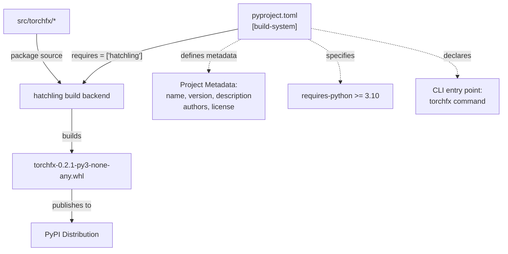
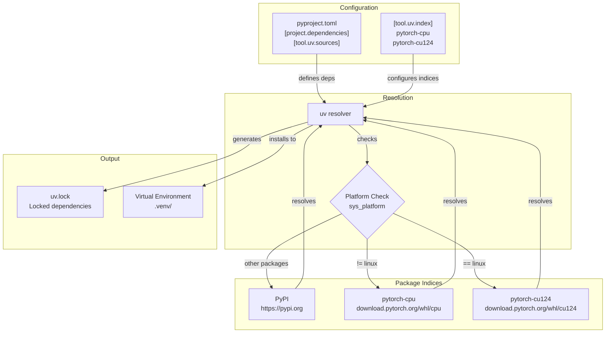
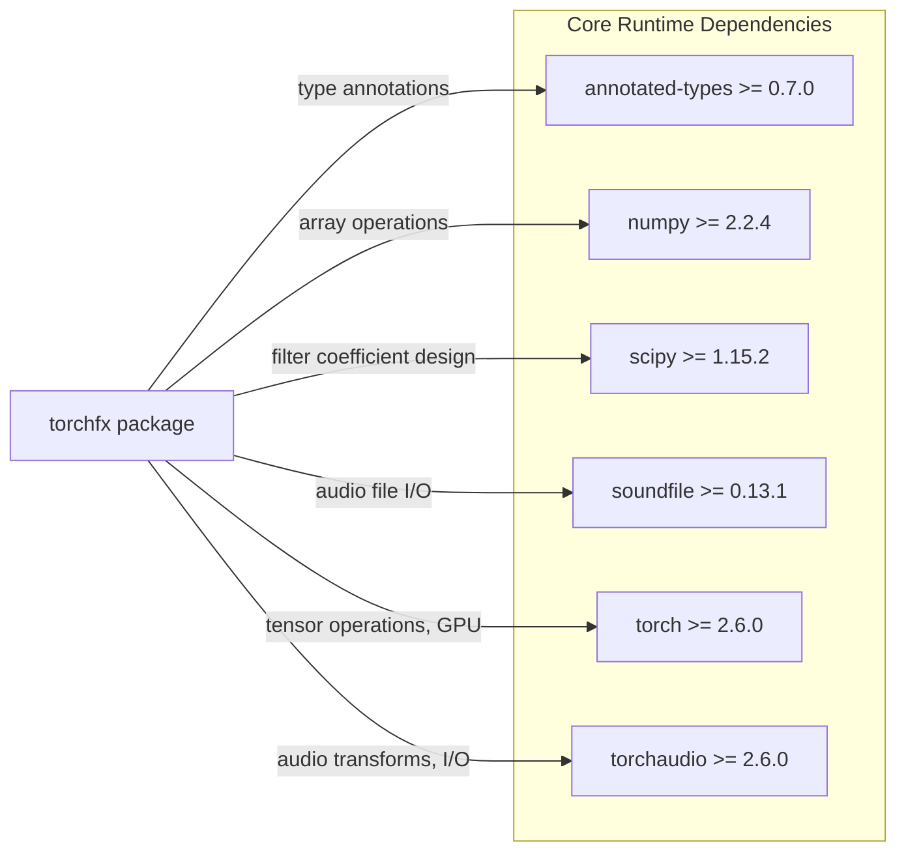
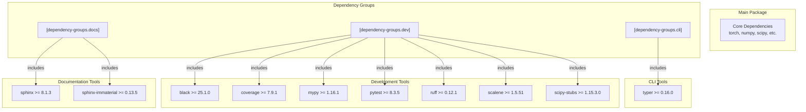
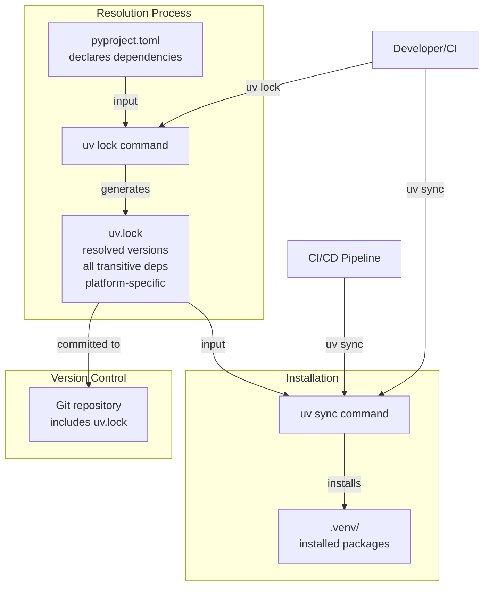
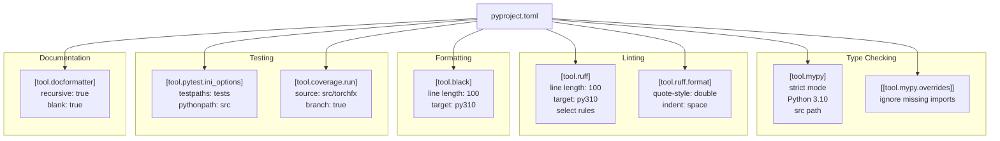

# 7.2 Build and Dependencies

# Build and Dependencies

<details>
<summary>Relevant source files</summary>

The following files were used as context for generating this wiki page:

- [pyproject.toml](pyproject.toml)
- [uv.lock](uv.lock)

</details>


## Purpose and Scope

This page documents the build system and dependency management infrastructure for torchfx. It covers the build backend configuration, core and development dependencies, platform-specific dependency resolution, and tool configurations. 

For information about the development workflow and CI/CD pipeline, see [Development Workflow](#7.3). For details on testing infrastructure, see [Testing](#7.4).

---

## Build System Overview

torchfx uses **hatchling** as its build backend, configured through `pyproject.toml`. The build system is standards-compliant, following PEP 517 and PEP 518 specifications.



**Build System Configuration**

The build system is configured in [pyproject.toml:135-137]():

- **Build backend**: `hatchling.build` 
- **Build requirements**: `hatchling` package
- **Package structure**: Standard `src` layout with source in `src/torchfx/`

**Project Metadata**

Project metadata is defined in [pyproject.toml:1-48]():

| Metadata Field | Value | Purpose |
|---------------|-------|---------|
| `name` | `torchfx` | Package identifier on PyPI |
| `version` | `0.2.1` | Semantic versioning string |
| `requires-python` | `>=3.10` | Minimum Python version |
| `authors` | Matteo Spanio | Package maintainer |
| `license` | GPLv3 | Open source license |

**CLI Entry Point**

The package defines a command-line entry point in [pyproject.toml:42-43]():
- Command: `torchfx`
- Module: `cli.__main__:main`

**Sources**: [pyproject.toml:1-48](), [pyproject.toml:135-137]()

---

## Dependency Management with uv

torchfx uses **uv** as its dependency manager, which provides fast, deterministic dependency resolution with lock file support.

### Dependency Resolution Architecture



### Platform-Specific PyTorch Resolution

torchfx implements platform-specific PyTorch dependency resolution to optimize for available hardware:

**Configuration in [pyproject.toml:50-68]()**:

```toml
[tool.uv.sources]
torch = [
  { index = "pytorch-cpu", marker = "sys_platform != 'linux'" },
  { index = "pytorch-cu124", marker = "sys_platform == 'linux'" },
]

[[tool.uv.index]]
name = "pytorch-cpu"
url = "https://download.pytorch.org/whl/cpu"
explicit = true

[[tool.uv.index]]
name = "pytorch-cu124"
url = "https://download.pytorch.org/whl/cu124"
explicit = true
```

**Resolution Logic**:

| Platform | PyTorch Source | Index URL | Rationale |
|----------|---------------|-----------|-----------|
| Linux | `pytorch-cu124` | `download.pytorch.org/whl/cu124` | CUDA 12.4 GPU support |
| macOS, Windows | `pytorch-cpu` | `download.pytorch.org/whl/cpu` | CPU-only, smaller package |

This approach ensures:
- Linux users automatically get CUDA-enabled PyTorch for GPU acceleration
- Non-Linux users get smaller CPU-only builds
- Consistent behavior across development and deployment

**Sources**: [pyproject.toml:50-68]()

---

## Core Dependencies

torchfx has six core runtime dependencies defined in [pyproject.toml:11-18]():



### Dependency Purposes

| Package | Minimum Version | Purpose | Used In |
|---------|----------------|---------|---------|
| `annotated-types` | 0.7.0 | Type annotation support | `torchfx.typing` module |
| `numpy` | 2.2.4 | Array operations, type conversions | `Wave` class, filters |
| `scipy` | 1.15.2 | IIR/FIR filter coefficient design | `torchfx.filter.iir`, `torchfx.filter.fir` |
| `soundfile` | 0.13.1 | Audio file I/O (WAV, FLAC, etc.) | `Wave.from_file()`, file writing |
| `torch` | 2.6.0 | Tensor operations, GPU acceleration, autograd | All modules |
| `torchaudio` | 2.6.0 | Audio I/O, audio transforms | `Wave` class, effects |

**Version Constraints**:
- All dependencies use minimum version specifiers (`>=`)
- PyTorch 2.6.0+ required for latest tensor operations
- NumPy 2.2.4+ provides performance improvements
- SciPy 1.15.2+ includes updated signal processing algorithms

**Sources**: [pyproject.toml:11-18]()

---

## Development Dependencies

torchfx organizes development dependencies into three **dependency groups** using PEP 735 syntax in [pyproject.toml:139-156]():

### Dependency Groups Structure



### CLI Group

**Configuration**: [pyproject.toml:140-142]()

| Package | Version | Purpose |
|---------|---------|---------|
| `typer` | >= 0.16.0 | Command-line interface framework |

Used for building the `torchfx` CLI command defined in [pyproject.toml:42-43]().

### Dev Group

**Configuration**: [pyproject.toml:143-151]()

| Package | Version | Purpose |
|---------|---------|---------|
| `black` | >= 25.1.0 | Code formatting |
| `coverage` | >= 7.9.1 | Test coverage measurement |
| `mypy` | >= 1.16.1 | Static type checking |
| `pytest` | >= 8.3.5 | Testing framework |
| `ruff` | >= 0.12.1 | Fast Python linter |
| `scalene` | >= 1.5.51 | CPU/GPU/memory profiler |
| `scipy-stubs` | >= 1.15.3.0 | Type stubs for SciPy |

These tools are configured in the same `pyproject.toml` file (see [Tool Configuration](#tool-configuration) section).

### Docs Group

**Configuration**: [pyproject.toml:152-155]()

| Package | Version | Purpose |
|---------|---------|---------|
| `sphinx` | >= 8.1.3 | Documentation generator |
| `sphinx-immaterial` | >= 0.13.5 | Material Design theme for Sphinx |

Used to build API documentation deployed to GitHub Pages. See [Documentation](#7.6) for details.

**Sources**: [pyproject.toml:139-156]()

---

## Lock File System

torchfx uses `uv.lock` for deterministic dependency resolution:



### Lock File Characteristics

**Purpose**: `uv.lock` provides:
1. **Deterministic builds**: Exact versions for all dependencies
2. **Transitive dependency tracking**: Complete dependency tree
3. **Platform-specific resolution**: Separate resolutions for different platforms
4. **Hash verification**: Package integrity checks
5. **Reproducibility**: Identical environments across machines

**Workflow**:
1. Developer modifies `pyproject.toml`
2. Run `uv lock` to update `uv.lock`
3. Commit both files to version control
4. CI and other developers run `uv sync` to install exact versions

**Sources**: Diagram 3 from high-level systems architecture

---

## Tool Configuration

`pyproject.toml` serves as the central configuration file for all development tools. Each tool has a dedicated `[tool.X]` section.

### Tool Configuration Map



### MyPy Configuration

**Location**: [pyproject.toml:70-92]()

**Key Settings**:

| Setting | Value | Purpose |
|---------|-------|---------|
| `python_version` | `"3.10"` | Target Python version |
| `strict` | `true` | Enable all strict checks |
| `mypy_path` | `"src"` | Source path for imports |
| `disallow_untyped_defs` | `true` | Require type annotations |
| `warn_unused_ignores` | `true` | Warn about unnecessary ignores |

**Overrides**: [pyproject.toml:86-92]()
- Ignores missing imports for `torchfx.*`, `cli.*`, `torchaudio.*` modules

### Ruff Configuration

**Location**: [pyproject.toml:94-104]()

**Key Settings**:

| Setting | Value | Purpose |
|---------|-------|---------|
| `line-length` | `100` | Maximum line length |
| `target-version` | `"py310"` | Target Python 3.10 |
| `src` | `["src"]` | Source directories |

**Selected Rules**: `E`, `F`, `I`, `N`, `UP`, `B`, `A`, `C4`, `SIM`, `TID`, `ARG`
- `E`: pycodestyle errors
- `F`: pyflakes
- `I`: isort (import sorting)
- `N`: pep8-naming
- `UP`: pyupgrade
- `B`: flake8-bugbear
- `A`: flake8-builtins
- `C4`: flake8-comprehensions
- `SIM`: flake8-simplify
- `TID`: flake8-tidy-imports
- `ARG`: flake8-unused-arguments

**Ignored Rules**: `E501`, `N803`, `N806`, `N812` (line length, argument naming)

### Black Configuration

**Location**: [pyproject.toml:106-119]()

**Key Settings**:

| Setting | Value | Purpose |
|---------|-------|---------|
| `line-length` | `100` | Match ruff configuration |
| `target-version` | `["py310"]` | Python 3.10 compatibility |
| `skip-string-normalization` | `false` | Normalize quotes |

### Pytest Configuration

**Location**: [pyproject.toml:125-129]()

**Key Settings**:

| Setting | Value | Purpose |
|---------|-------|---------|
| `minversion` | `"7.0"` | Minimum pytest version |
| `testpaths` | `["tests"]` | Test directory location |
| `pythonpath` | `["src"]` | Add src to Python path |
| `addopts` | `"--strict-markers --tb=short"` | Strict mode, short tracebacks |

### Coverage Configuration

**Location**: [pyproject.toml:121-123]()

**Key Settings**:

| Setting | Value | Purpose |
|---------|-------|---------|
| `source` | `["src/torchfx"]` | Coverage target directory |
| `branch` | `true` | Enable branch coverage |

**Sources**: [pyproject.toml:70-133]()

---

## Build Commands

Common build and dependency management commands using `uv`:

### Installation Commands

| Command | Purpose |
|---------|---------|
| `uv sync` | Install dependencies from `uv.lock` |
| `uv sync --dev` | Install with development dependencies |
| `uv sync --group docs` | Install with documentation dependencies |
| `uv sync --all-groups` | Install all dependency groups |

### Dependency Management

| Command | Purpose |
|---------|---------|
| `uv lock` | Update `uv.lock` from `pyproject.toml` |
| `uv add <package>` | Add a new dependency |
| `uv add --group dev <package>` | Add to dev dependency group |
| `uv remove <package>` | Remove a dependency |

### Build and Distribution

| Command | Purpose |
|---------|---------|
| `uv build` | Build wheel and source distribution |
| `uv publish` | Publish to PyPI |

### Running Commands

| Command | Purpose |
|---------|---------|
| `uv run pytest` | Run tests |
| `uv run mypy src` | Run type checking |
| `uv run ruff check src` | Run linting |
| `uv run black src` | Run formatting |

**Sources**: Standard uv command patterns

---

## Summary

The torchfx build and dependency system provides:

1. **Standards-compliant build**: Uses hatchling backend with PEP 517/518 compliance
2. **Fast dependency resolution**: uv package manager with lock file support
3. **Platform-specific optimization**: Automatic CPU/GPU PyTorch selection based on platform
4. **Organized development tools**: Dependency groups for CLI, development, and documentation
5. **Centralized configuration**: All tool configurations in `pyproject.toml`
6. **Reproducible builds**: Lock file ensures consistent environments across machines

This infrastructure ensures efficient development, reliable CI/CD, and consistent deployments across different platforms.

**Sources**: [pyproject.toml:1-156]()