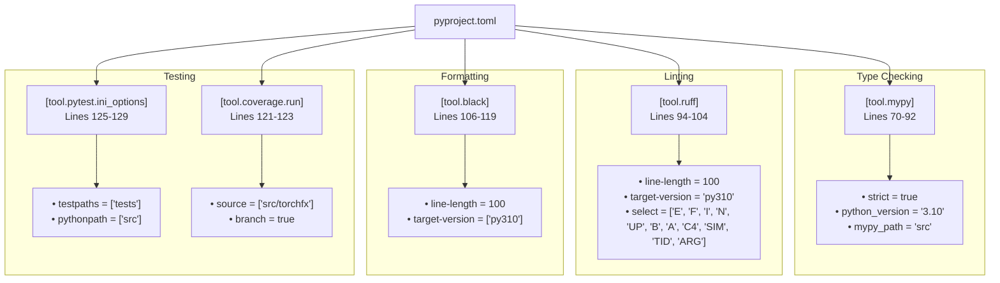
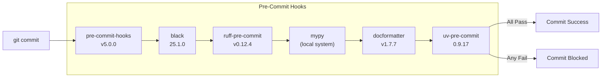
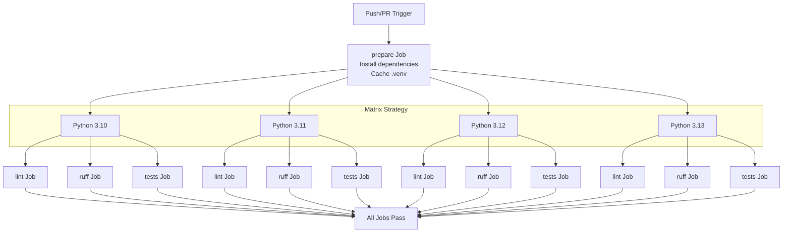
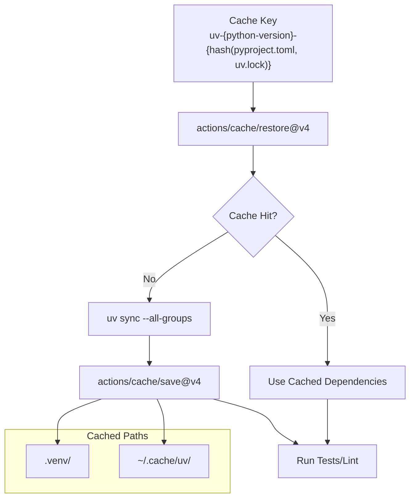
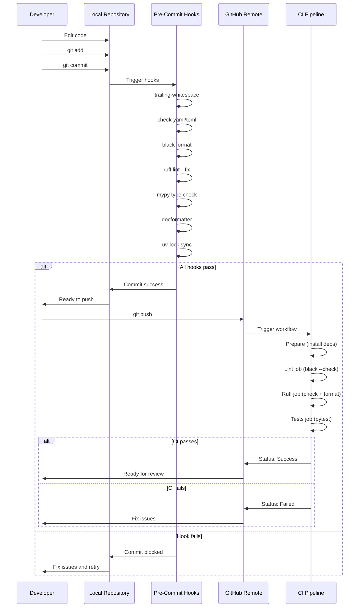

# 7.3 Development Workflow

# Development Workflow

<details>
<summary>Relevant source files</summary>

The following files were used as context for generating this wiki page:

- [.github/workflows/ci.yml](.github/workflows/ci.yml)
- [.pre-commit-config.yaml](.pre-commit-config.yaml)
- [pyproject.toml](pyproject.toml)

</details>


This document describes the development workflow for contributing to torchfx, including local development setup, pre-commit hooks, continuous integration, and code quality enforcement. For information about the project structure and organization, see [Project Structure](#7.1). For details on dependency management and build configuration, see [Build and Dependencies](#7.2). For testing infrastructure, see [Testing](#7.4).

## Overview

The torchfx development workflow enforces code quality through multiple layers: local pre-commit hooks that run before code is committed, and a CI/CD pipeline that validates all changes on GitHub Actions. This multi-gate approach ensures that code meets quality standards before it reaches the main branch.

The workflow supports Python 3.10 through 3.13, with matrix testing across all supported versions to ensure compatibility.

**Sources:** [pyproject.toml:10](), [.github/workflows/ci.yml]()

## Development Environment Setup

### Installing Development Dependencies

Development dependencies are organized into three groups in [pyproject.toml:139-156]():

| Dependency Group | Purpose | Key Tools |
|-----------------|---------|-----------|
| `dev` | Core development tools | mypy, pytest, black, ruff, coverage, scalene |
| `docs` | Documentation building | sphinx, sphinx-immaterial |
| `cli` | Command-line interface | typer |

To install all development dependencies:

```bash
uv sync --all-groups
```

This command installs the main package dependencies plus all development tool dependencies defined in the `[dependency-groups]` section.

**Sources:** [pyproject.toml:139-156]()

### Tool Configuration

All development tools are configured centrally in `pyproject.toml`:



**Sources:** [pyproject.toml:70-129]()

## Pre-Commit Hook System

The pre-commit hook system provides immediate feedback during development, catching issues before they are committed to version control.

### Hook Configuration

Pre-commit hooks are defined in [.pre-commit-config.yaml](). The configuration uses multiple repositories to run different quality checks:



### Hook Execution Order

The hooks execute in the following sequence:

1. **Basic Checks** [.pre-commit-config.yaml:4-13]()
   - `trailing-whitespace`: Removes trailing whitespace
   - `end-of-file-fixer`: Ensures files end with newline
   - `check-yaml`: Validates YAML syntax
   - `check-added-large-files`: Prevents committing large files (except `.ipynb`)
   - `check-toml`: Validates TOML syntax
   - `check-docstring-first`: Ensures docstrings come before code

2. **Black Formatting** [.pre-commit-config.yaml:15-21]()
   - Automatically formats code according to Black style
   - Runs on all Python files during pre-commit stage

3. **Ruff Linting and Formatting** [.pre-commit-config.yaml:23-33]()
   - `ruff` with `--fix`: Automatically fixes linting issues
   - `ruff-format`: Checks code formatting
   - Both exclude `tests/` directory

4. **MyPy Type Checking** [.pre-commit-config.yaml:35-43]()
   - Runs as a local hook using system mypy installation
   - Uses configuration from `pyproject.toml`
   - Excludes `tests/` directory
   - Entry point: `mypy` command

5. **Docstring Formatting** [.pre-commit-config.yaml:45-50]()
   - Formats docstrings using `docformatter`
   - Arguments: `--in-place`, `--config ./pyproject.toml`, `--black`

6. **UV Lock File Update** [.pre-commit-config.yaml:52-56]()
   - Ensures `uv.lock` is synchronized with `pyproject.toml`
   - Runs `uv-lock` hook

### File Exclusions

The pre-commit configuration excludes certain directories [.pre-commit-config.yaml:58-60]():

```
exclude: ^(scripts/|benchmark/|examples/|docs/)
files: ^(?!scripts/)
```

This means hooks do not run on:
- `scripts/` directory
- `benchmark/` directory
- `examples/` directory
- `docs/` directory

**Sources:** [.pre-commit-config.yaml]()

## CI/CD Pipeline

The continuous integration pipeline runs on GitHub Actions and is triggered on pushes to `main`/`master` branches and pull requests to `main`/`master`/`dev` branches [.github/workflows/ci.yml:3-7]().

### Pipeline Architecture



### Job Definitions

#### Prepare Job

The `prepare` job [.github/workflows/ci.yml:10-48]() sets up the environment for subsequent jobs:

| Step | Action | Purpose |
|------|--------|---------|
| Checkout code | `actions/checkout@v4` | Clone repository |
| Set up Python | `actions/setup-python@v5` | Install Python version |
| Install uv | `pip install uv` | Install dependency manager |
| Restore cache | `actions/cache/restore@v4` | Restore `.venv` and `~/.cache/uv` |
| Install dependencies | `uv sync --all-groups` | Install all dependencies |
| Save cache | `actions/cache/save@v4` | Cache dependencies for reuse |

**Cache Key Format:** `uv-${{ matrix.python-version }}-${{ hashFiles('pyproject.toml', 'uv.lock') }}`

This cache strategy ensures that dependencies are only reinstalled when `pyproject.toml` or `uv.lock` changes.

#### Lint Job

The `lint` job [.github/workflows/ci.yml:50-81]() checks code formatting with Black:

```bash
uv run black --check src tests
```

This job:
- Depends on `prepare` job completion
- Runs on `ubuntu-latest`
- Uses `fail-fast: false` to allow all matrix jobs to complete
- Restores dependency cache
- Checks formatting without modifying files

#### Ruff Job

The `ruff` job [.github/workflows/ci.yml:82-115]() performs linting and format checking:

```bash
uv run ruff check src
uv run ruff format --check src tests
```

This job:
- Depends on `prepare` job completion
- Runs linting with `ruff check` on `src/` directory
- Verifies formatting with `ruff format --check` on `src/` and `tests/`
- Uses `fail-fast: false` strategy

#### Tests Job

The `tests` job [.github/workflows/ci.yml:116-147]() executes the test suite:

```bash
uv run pytest
```

This job:
- Depends on `prepare` job completion
- Runs all tests in `tests/` directory (configured in [pyproject.toml:128]())
- Uses pytest configuration from [pyproject.toml:125-129]()
- Executes across all Python versions in matrix

**Sources:** [.github/workflows/ci.yml]()

## Code Quality Gates

The development workflow enforces quality through multiple gates at different stages:

```mermaid
graph LR
    LocalDev["Local Development"]
    PreCommit["Pre-Commit Hooks"]
    Push["git push"]
    CI["CI Pipeline"]
    Review["Code Review"]
    Merge["Merge to Main"]
    
    subgraph "Local Quality Checks"
        PreCommit1["Basic Checks"]
        PreCommit2["Black Format"]
        PreCommit3["Ruff Lint + Fix"]
        PreCommit4["MyPy Type Check"]
        PreCommit5["Docformatter"]
        PreCommit6["UV Lock Sync"]
    end
    
    subgraph "CI Quality Checks"
        CI1["Black Check"]
        CI2["Ruff Check"]
        CI3["Ruff Format Check"]
        CI4["Pytest Tests"]
        CI5["Matrix: Py 3.10-3.13"]
    end
    
    LocalDev -->|"git commit"| PreCommit
    PreCommit --> PreCommit1
    PreCommit1 --> PreCommit2
    PreCommit2 --> PreCommit3
    PreCommit3 --> PreCommit4
    PreCommit4 --> PreCommit5
    PreCommit5 --> PreCommit6
    
    PreCommit6 -->|"Success"| Push
    PreCommit6 -->|"Failure"| LocalDev
    
    Push --> CI
    CI --> CI1
    CI1 --> CI2
    CI2 --> CI3
    CI3 --> CI4
    CI4 --> CI5
    
    CI5 -->|"Success"| Review
    CI5 -->|"Failure"| LocalDev
    
    Review -->|"Approved"| Merge
    Review -->|"Changes Requested"| LocalDev
```



### Quality Check Comparison

| Check | Pre-Commit | CI Pipeline | Notes |
|-------|-----------|-------------|-------|
| Trailing whitespace | ✓ | - | Fixed automatically |
| YAML/TOML syntax | ✓ | - | Validation only |
| Black formatting | ✓ (auto-fix) | ✓ (check) | CI enforces consistency |
| Ruff linting | ✓ (fix) | ✓ (check) | Some issues auto-fixed |
| Ruff formatting | ✓ | ✓ | Additional format checks |
| MyPy type checking | ✓ | - | Local only, excludes tests |
| Docstring formatting | ✓ (in-place) | - | Local only |
| UV lock sync | ✓ | - | Ensures lock file current |
| Pytest tests | - | ✓ | CI only, all Python versions |

**Sources:** [.pre-commit-config.yaml](), [.github/workflows/ci.yml]()

## Tool-Specific Configurations

### MyPy Configuration

The MyPy configuration [pyproject.toml:70-92]() enforces strict type checking:

- **Strict mode enabled** (`strict = true`)
- **Target version:** Python 3.10
- **Key settings:**
  - `check_untyped_defs = true`
  - `disallow_untyped_calls = true`
  - `disallow_untyped_defs = true`
  - `disallow_incomplete_defs = true`
  - `warn_unused_ignores = true`
  - `warn_return_any = true`
  - `warn_redundant_casts = true`

**Module overrides** [pyproject.toml:86-92]():
- Ignores missing imports for: `torchfx.*`, `cli.*`, `torchaudio.*`

### Ruff Configuration

Ruff configuration [pyproject.toml:94-104]() includes:

**Selected rule categories:**
- `E`: pycodestyle errors
- `F`: Pyflakes
- `I`: isort (import sorting)
- `N`: pep8-naming
- `UP`: pyupgrade
- `B`: flake8-bugbear
- `A`: flake8-builtins
- `C4`: flake8-comprehensions
- `SIM`: flake8-simplify
- `TID`: flake8-tidy-imports
- `ARG`: flake8-unused-arguments

**Ignored rules:**
- `E501`: Line too long (handled by formatter)
- `N803`: Argument name should be lowercase
- `N806`: Variable should be lowercase
- `N812`: Lowercase imported as non-lowercase

### Black Configuration

Black formatting [pyproject.toml:106-119]() settings:

- **Line length:** 100 characters
- **Target version:** Python 3.10
- **String normalization:** Enabled
- **Excluded paths:** `.git`, `.mypy_cache`, `.venv`, `build`, `dist`

### Pytest Configuration

Pytest settings [pyproject.toml:125-129]():

- **Minimum version:** 7.0
- **Test paths:** `tests/` directory
- **Python path:** `src/` (for imports)
- **Additional options:** `--strict-markers --tb=short`

**Sources:** [pyproject.toml:70-129]()

## Dependency Caching Strategy

The CI pipeline uses GitHub Actions caching to speed up builds:



**Cache invalidation triggers:**
1. Changes to `pyproject.toml`
2. Changes to `uv.lock`
3. Different Python version in matrix

This strategy significantly reduces CI execution time by reusing installed dependencies across workflow runs.

**Sources:** [.github/workflows/ci.yml:29-48]()

## Development Workflow Sequence

A typical development workflow follows this sequence:



**Sources:** [.pre-commit-config.yaml](), [.github/workflows/ci.yml]()

## Running Quality Checks Manually

Developers can run quality checks manually without committing:

### Type Checking
```bash
uv run mypy --config-file pyproject.toml src
```

### Linting
```bash
uv run ruff check src
```

### Formatting Check
```bash
uv run black --check src tests
uv run ruff format --check src tests
```

### Formatting (in-place)
```bash
uv run black src tests
uv run ruff format src tests
```

### Run All Tests
```bash
uv run pytest
```

### Run Tests with Coverage
```bash
uv run coverage run -m pytest
uv run coverage report
```

**Sources:** [pyproject.toml:70-129](), [.github/workflows/ci.yml:79-146]()

## Platform-Specific Considerations

The CI pipeline runs exclusively on `ubuntu-latest` [.github/workflows/ci.yml:12](), but the project supports cross-platform development. Platform-specific PyTorch installation is handled through the dependency configuration in [pyproject.toml:50-68]():

- **Linux:** Uses `pytorch-cu124` index (CUDA 12.4 support)
- **macOS/Windows:** Uses `pytorch-cpu` index (CPU-only)

This configuration ensures that:
1. Linux CI runners get CUDA-enabled PyTorch
2. Local development on macOS/Windows uses CPU-only PyTorch
3. All functionality remains testable across platforms

**Sources:** [pyproject.toml:50-68](), [.github/workflows/ci.yml:12]()