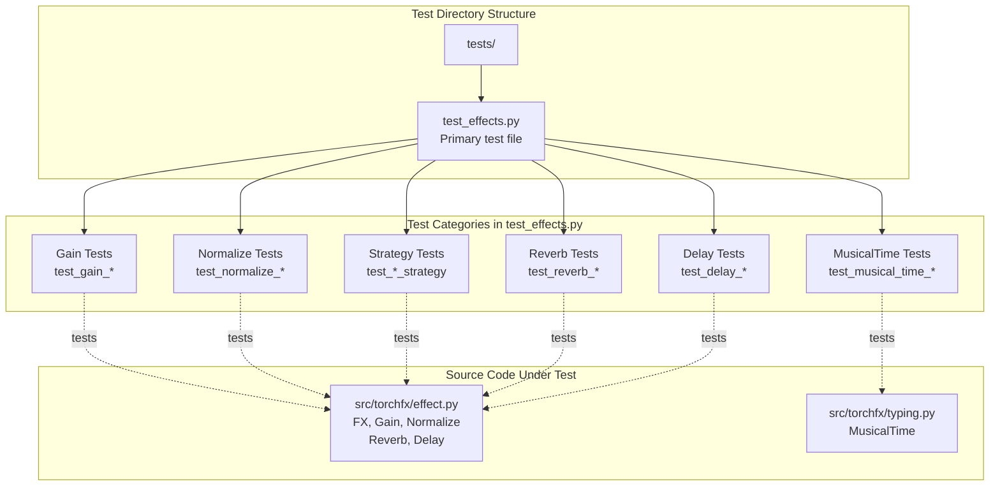
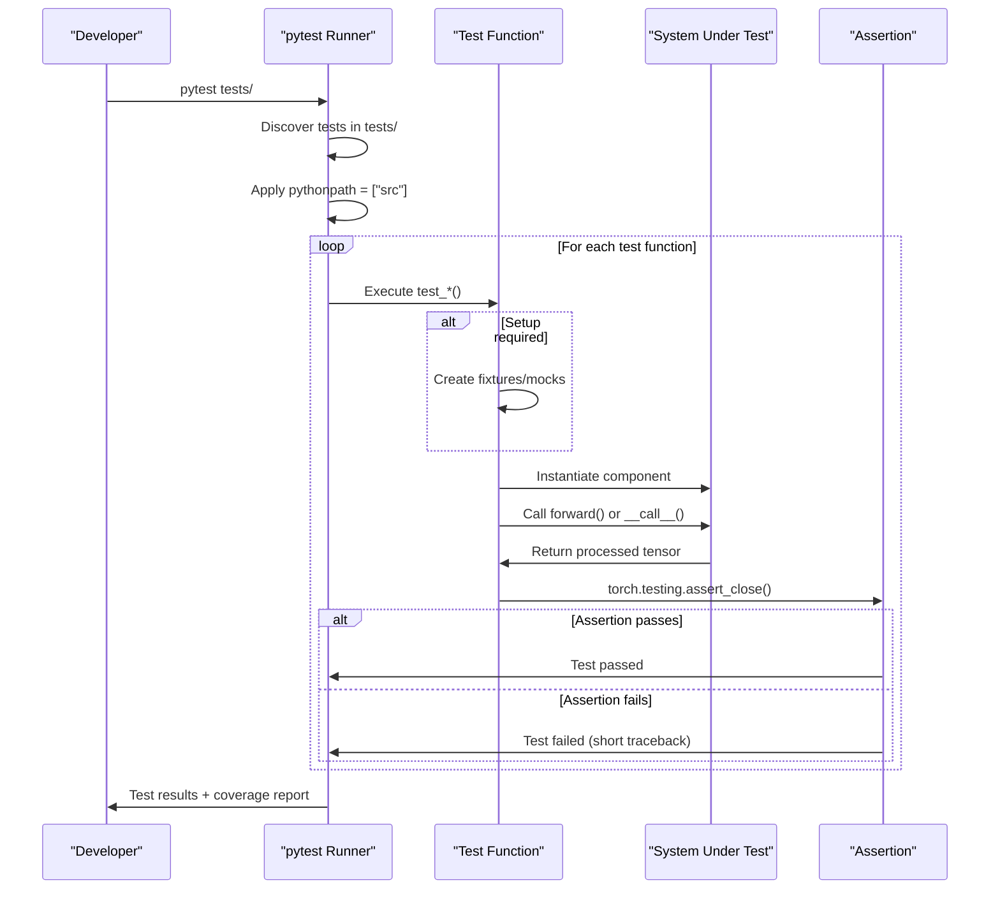
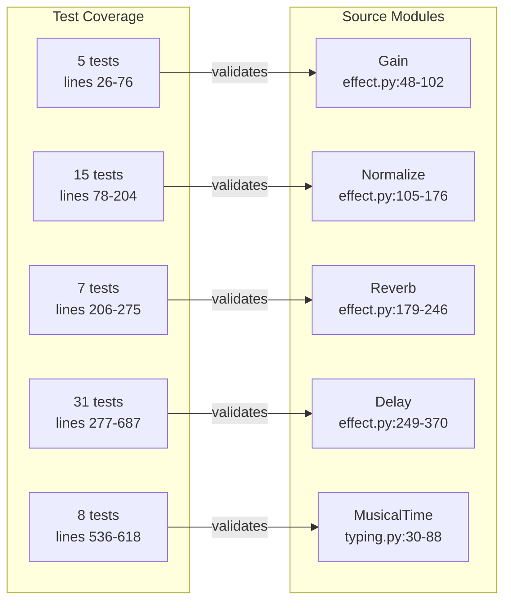

# 7.4 Testing

# Testing

<details>
<summary>Relevant source files</summary>

The following files were used as context for generating this wiki page:

- [pyproject.toml](pyproject.toml)
- [tests/test_effects.py](tests/test_effects.py)

</details>


This page documents the testing infrastructure in torchfx, including test organization, test patterns, coverage configuration, and how to run tests. Testing focuses on validating the correctness of audio effects, filters, and the core Wave class through unit and integration tests using pytest.

For information about the broader CI/CD pipeline and quality gates, see [Development Workflow](#7.3). For performance testing, see [Benchmarking](#7.5).

## Overview

The torchfx testing infrastructure uses pytest as the test runner with coverage reporting enabled. Tests are organized in the `tests/` directory and primarily focus on validating the behavior of audio effects, filters, normalization strategies, and musical time calculations. The test suite includes unit tests for individual components, integration tests for pipeline workflows, and parametrized tests for boundary conditions.

**Sources:** [pyproject.toml:125-129](), [tests/test_effects.py:1-687]()

## Test Infrastructure Configuration

### Pytest Configuration

The pytest configuration is defined in `pyproject.toml` and specifies the test environment:

| Configuration | Value | Purpose |
|---------------|-------|---------|
| `minversion` | `"7.0"` | Minimum pytest version required |
| `addopts` | `"--strict-markers --tb=short"` | Strict marker validation and short tracebacks |
| `testpaths` | `["tests"]` | Directory containing test files |
| `pythonpath` | `["src"]` | Python path for importing torchfx modules |

The `--strict-markers` option ensures that only registered markers are used, preventing typos in test decorators. The `--tb=short` option provides concise traceback output for faster debugging.

**Sources:** [pyproject.toml:125-129]()

### Coverage Configuration

Coverage reporting is configured to track code execution in the torchfx library:

| Configuration | Value | Purpose |
|---------------|-------|---------|
| `source` | `["src/torchfx"]` | Source directory to measure coverage |
| `branch` | `true` | Enable branch coverage analysis |

Branch coverage ensures that both `True` and `False` branches of conditional statements are tested, providing more thorough coverage metrics than simple line coverage.

**Sources:** [pyproject.toml:121-123]()

## Test Organization



**Diagram: Test Organization and Coverage**

Tests are organized by the component they validate, with clear naming conventions that make it easy to identify which functionality is being tested.

**Sources:** [tests/test_effects.py:1-687]()

### Test File Structure

The primary test file is `tests/test_effects.py`, which contains all tests for the effect system. Tests are grouped by the component they validate:

| Test Group | Line Range | Component Tested |
|------------|------------|------------------|
| Gain tests | 26-76 | `Gain` effect with amplitude/dB/power modes |
| Normalize tests | 78-204 | `Normalize` effect and strategy pattern |
| Reverb tests | 206-275 | `Reverb` effect with feedback delay network |
| Delay tests | 277-687 | `Delay` effect including BPM synchronization |
| MusicalTime tests | 536-618 | `MusicalTime` parsing and calculations |

**Sources:** [tests/test_effects.py:1-687]()

### Naming Conventions

Test functions follow a consistent naming pattern:

- `test_<component>_<scenario>`: Tests a specific scenario for a component
- `test_<component>_invalid_<parameter>`: Tests validation and error handling
- `test_<strategy>_strategy`: Tests strategy pattern implementations

Examples:
- `test_gain_amplitude()` - Tests gain in amplitude mode
- `test_normalize_invalid_peak()` - Tests peak validation in Normalize
- `test_peak_normalization_strategy()` - Tests PeakNormalizationStrategy

**Sources:** [tests/test_effects.py:26-687]()

## Test Execution Flow



**Diagram: Test Execution Workflow**

The test runner discovers tests, applies the Python path configuration, executes each test function, and reports results with coverage metrics.

**Sources:** [pyproject.toml:125-129](), [tests/test_effects.py:1-687]()

## Test Types and Patterns

### Unit Tests

Unit tests validate individual components in isolation. They test a single method or behavior with known inputs and expected outputs.

**Example: Basic Gain Test**
```python
def test_gain_amplitude():
    waveform = torch.tensor([0.1, -0.2, 0.3])
    gain = Gain(gain=2.0, gain_type="amplitude")
    out = gain(waveform)
    torch.testing.assert_close(out, waveform * 2.0)
```

This test validates that `Gain` with `gain_type="amplitude"` multiplies the waveform by the gain factor.

**Sources:** [tests/test_effects.py:26-30]()

### Integration Tests

Integration tests validate the interaction between multiple components, such as pipeline chaining or multi-channel processing.

**Example: Wave Pipeline Integration**
```python
def test_delay_lazy_fs_inference_with_wave():
    from torchfx import Wave

    delay = Delay(bpm=120, delay_time="1/8", feedback=0.3, mix=0.2)
    assert delay.fs is None

    wave = Wave(torch.randn(2, 44100), fs=44100)
    _ = wave | delay

    assert delay.fs == 44100
    assert delay.delay_samples == 11025
```

This test validates that the `Delay` effect automatically infers the sampling rate when used in a Wave pipeline.

**Sources:** [tests/test_effects.py:513-524]()

### Parametrized Tests

Parametrized tests run the same test logic with multiple input values, reducing code duplication and improving coverage.

**Example: Parametrized Invalid Parameter Tests**
```python
@pytest.mark.parametrize("delay", [0, -1])
def test_reverb_invalid_delay(delay):
    with pytest.raises(AssertionError):
        Reverb(delay=delay, decay=0.5, mix=0.5)
```

This test validates that `Reverb` rejects invalid delay values (0 and negative numbers).

**Sources:** [tests/test_effects.py:259-262]()

### Strategy Pattern Tests

The test suite extensively validates the strategy pattern used in effects like `Normalize` and `Delay`. These tests verify that custom strategies can be injected and that built-in strategies behave correctly.

**Example: Custom Strategy Injection**
```python
class DummyStrategy(NormalizationStrategy):
    def __call__(self, waveform, peak):
        return waveform * 0 + peak

def test_normalize_custom_strategy():
    waveform = torch.tensor([0.2, -0.5, 0.4])
    norm = Normalize(peak=2.0, strategy=DummyStrategy())
    out = norm(waveform)
    torch.testing.assert_close(out, torch.full_like(waveform, 2.0))
```

This test demonstrates that custom normalization strategies can be implemented and used with the `Normalize` effect.

**Sources:** [tests/test_effects.py:21-89]()

### Mocking with Monkeypatch

Some tests use pytest's `monkeypatch` fixture to replace external dependencies, allowing validation of internal logic without side effects.

**Example: Mocking torchaudio.functional.gain**
```python
def test_gain_db(monkeypatch):
    waveform = torch.tensor([0.1, -0.2, 0.3])
    called = {}

    def fake_gain(waveform, gain):
        called["args"] = (waveform, gain)
        return waveform + gain

    monkeypatch.setattr("torchaudio.functional.gain", fake_gain)
    gain = Gain(gain=6.0, gain_type="db")
    out = gain(waveform)
    assert torch.allclose(out, waveform + 6.0)
    assert called["args"][1] == 6.0
```

This test validates that `Gain` calls `torchaudio.functional.gain` with the correct parameters when using dB mode.

**Sources:** [tests/test_effects.py:33-45]()

## Test Categories Overview

The following table summarizes the test categories and their coverage:

| Category | Test Count | Lines | Key Validations |
|----------|-----------|-------|-----------------|
| Gain | 5 tests | 26-76 | Amplitude/dB/power modes, clamping, validation |
| Normalize | 15 tests | 78-204 | Peak/RMS/percentile/per-channel strategies |
| Reverb | 7 tests | 206-275 | Feedback delay, mix, multichannel processing |
| Delay | 31 tests | 277-687 | BPM sync, taps, feedback, strategies, validation |
| MusicalTime | 8 tests | 536-618 | String parsing, modifiers, duration calculation |

**Sources:** [tests/test_effects.py:1-687]()

## Running Tests

### Basic Test Execution

To run all tests:
```bash
pytest tests/
```

To run tests with coverage:
```bash
pytest tests/ --cov=src/torchfx --cov-report=html
```

To run a specific test file:
```bash
pytest tests/test_effects.py
```

To run a specific test function:
```bash
pytest tests/test_effects.py::test_gain_amplitude
```

### Verbose Output

For detailed output showing each test name:
```bash
pytest tests/ -v
```

For even more detailed output including print statements:
```bash
pytest tests/ -vv -s
```

### Filtering Tests

Run tests matching a pattern:
```bash
pytest tests/ -k "gain"  # Runs all tests with "gain" in the name
```

Run tests with specific markers (requires marker registration):
```bash
pytest tests/ -m "slow"  # Run only slow tests
```

**Sources:** [pyproject.toml:125-129]()

## Assertion Patterns

The test suite uses several assertion patterns for validating PyTorch tensor operations:

### torch.testing.assert_close

The primary assertion method for tensor comparisons:
```python
torch.testing.assert_close(actual, expected)
```

This method checks for element-wise closeness with appropriate tolerances for floating-point comparisons.

**Example:**
```python
def test_peak_normalization_strategy():
    waveform = torch.tensor([0.2, -0.5, 0.4])
    strat = PeakNormalizationStrategy()
    out = strat(waveform, 2.0)
    torch.testing.assert_close(out, waveform / 0.5 * 2.0)
```

**Sources:** [tests/test_effects.py:110-114]()

### pytest.approx

For scalar comparisons with tolerance:
```python
assert value.item() == pytest.approx(expected, abs=1e-5)
```

**Example:**
```python
def test_delay_basic():
    waveform = torch.tensor([1.0, 0.0, 0.0, 0.0, 0.0])
    delay = Delay(delay_samples=2, feedback=0.0, mix=1.0, taps=1)
    out = delay(waveform)
    assert out[2].item() == pytest.approx(1.0, abs=1e-5)
```

**Sources:** [tests/test_effects.py:278-291]()

### torch.allclose

For boolean comparisons with tolerance:
```python
assert torch.allclose(actual, expected, atol=1e-5)
```

**Example:**
```python
def test_delay_mix_zero():
    waveform = torch.randn(10)
    delay = Delay(delay_samples=3, feedback=0.5, mix=0.0)
    out = delay(waveform)
    assert torch.allclose(out[10:], torch.zeros(out.size(0) - 10), atol=1e-5)
```

**Sources:** [tests/test_effects.py:319-328]()

### pytest.raises

For validating exception handling:
```python
with pytest.raises(ExceptionType):
    # Code that should raise exception
```

**Example:**
```python
def test_gain_invalid_gain_type():
    with pytest.raises(ValueError):
        Gain(gain=-1.0, gain_type="amplitude")
```

**Sources:** [tests/test_effects.py:71-75]()

## Test Coverage Mapping



**Diagram: Test Coverage Mapping to Source Code**

Each test group comprehensively validates its corresponding source module, including normal operation, edge cases, error handling, and integration scenarios.

**Sources:** [tests/test_effects.py:1-687]()

## Key Test Scenarios

### Multi-Channel Processing Tests

Tests validate that effects handle multi-channel (stereo, multi-track) audio correctly:

```python
def test_reverb_multichannel():
    waveform = torch.tensor([[1.0, 2.0, 3.0, 4.0], [0.5, 1.5, 2.5, 3.5]])
    reverb = Reverb(delay=2, decay=0.5, mix=1.0)
    out = reverb(waveform)
    # Validates independent channel processing
```

**Sources:** [tests/test_effects.py:240-256]()

### BPM Synchronization Tests

Tests validate musical time calculations for delay effects:

```python
def test_delay_bpm_synced():
    waveform = torch.randn(2, 44100)
    delay = Delay(bpm=120, delay_time="1/8", fs=44100, feedback=0.3, mix=0.2)
    # 120 BPM = 0.5 seconds per beat
    # 1/8 note = 0.25 seconds = 11025 samples at 44.1kHz
    assert delay.delay_samples == 11025
```

**Sources:** [tests/test_effects.py:381-392]()

### Strategy Pattern Extensibility Tests

Tests validate that custom strategies can be implemented and injected:

```python
def test_delay_strategy_extensibility():
    class DoubleStrategy(DelayStrategy):
        def apply_delay(self, waveform, delay_samples, taps, feedback):
            return waveform * 2

    waveform = torch.ones(5)
    delay = Delay(delay_samples=10, feedback=0.5, mix=0.5, strategy=DoubleStrategy())
    out = delay(waveform)
    assert torch.allclose(out[:5], torch.ones(5) * 1.5, atol=1e-5)
```

**Sources:** [tests/test_effects.py:644-656]()

### Lazy Initialization Tests

Tests validate that effects with deferred initialization (like sample rate inference) work correctly:

```python
def test_delay_lazy_fs_inference_error():
    delay = Delay(bpm=120, delay_time="1/8", feedback=0.3, mix=0.2)
    waveform = torch.randn(2, 44100)
    
    with pytest.raises(AssertionError, match="Sample rate \\(fs\\) is required"):
        delay(waveform)
```

**Sources:** [tests/test_effects.py:527-533]()

## Coverage Analysis

The test suite achieves comprehensive coverage through:

1. **Normal Operation**: Tests validate expected behavior with typical inputs
2. **Edge Cases**: Tests cover boundary conditions (zero values, empty tensors, short waveforms)
3. **Invalid Inputs**: Tests verify proper validation and error messages
4. **Multi-dimensional Inputs**: Tests validate 1D (mono), 2D (multi-channel), and 3D (batched) tensors
5. **Strategy Patterns**: Tests ensure extensibility points work correctly

**Coverage Targets:**
- Line coverage: Track which lines are executed
- Branch coverage: Track both true/false branches of conditionals
- Strategy pattern coverage: Validate all built-in and custom strategies

To generate a coverage report:
```bash
pytest tests/ --cov=src/torchfx --cov-report=term-missing
```

This shows which lines are not covered by tests.

**Sources:** [pyproject.toml:121-123](), [tests/test_effects.py:1-687]()