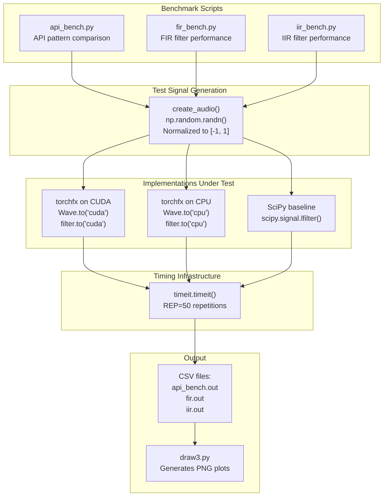
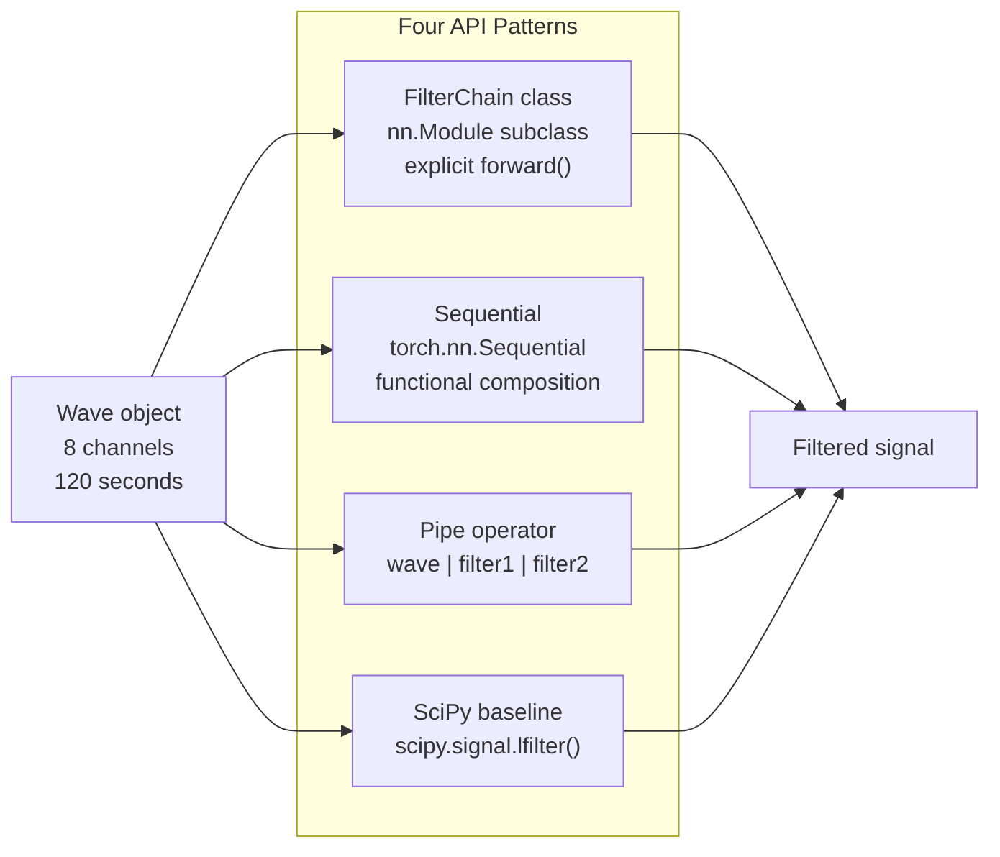
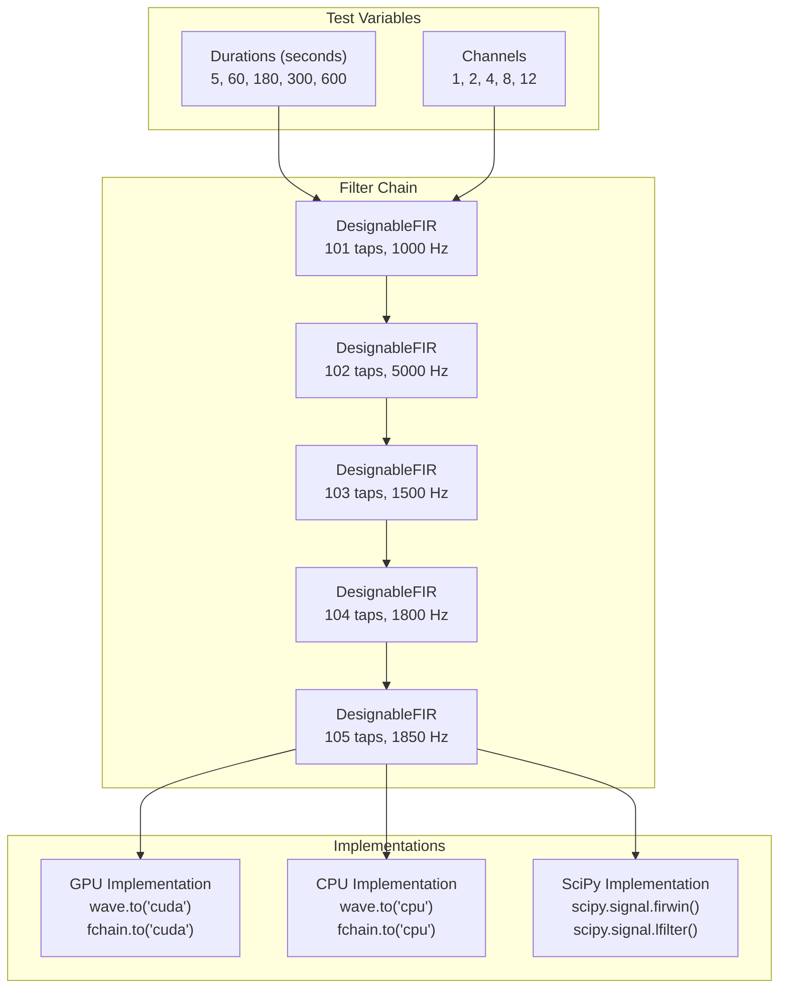

# 7.5 Benchmarking

# Benchmarking

<details>
<summary>Relevant source files</summary>

The following files were used as context for generating this wiki page:

- [benchmark/api_bench.py](benchmark/api_bench.py)
- [benchmark/fir_bench.py](benchmark/fir_bench.py)
- [benchmark/iir_bench.py](benchmark/iir_bench.py)

</details>


This page documents the benchmarking suite used to measure and compare the performance of torchfx audio processing operations. The benchmarking infrastructure evaluates three key aspects: API ergonomics and performance across different usage patterns, FIR filter performance, and IIR filter performance. All benchmarks compare torchfx implementations (both GPU and CPU) against SciPy baselines to validate performance characteristics.

For information about the testing infrastructure, see [Testing](#7.4). For details on GPU acceleration usage, see [GPU Acceleration](#5.2).

## Overview

The benchmarking suite consists of three independent scripts located in the `benchmark/` directory:

| Script | Purpose | Comparisons |
|--------|---------|-------------|
| `api_bench.py` | API pattern comparison | FilterChain class, Sequential, pipe operator, SciPy |
| `fir_bench.py` | FIR filter performance | GPU vs CPU vs SciPy across varying durations and channels |
| `iir_bench.py` | IIR filter performance | GPU vs CPU vs SciPy across varying durations and channels |

All benchmarks use Python's `timeit` module for precise timing measurements and output results in CSV format for post-processing and visualization.

**Sources**: [benchmark/api_bench.py:1-114](), [benchmark/fir_bench.py:1-85](), [benchmark/iir_bench.py:1-90]()

## Benchmark Architecture



**Sources**: [benchmark/api_bench.py:1-114](), [benchmark/fir_bench.py:1-85](), [benchmark/iir_bench.py:1-90]()

## Common Infrastructure

All benchmark scripts share a common infrastructure for test signal generation and timing measurement.

### Test Signal Generation

Each benchmark uses the `create_audio()` function to generate synthetic test signals:

[benchmark/api_bench.py:19-24]()
[benchmark/fir_bench.py:14-19]()
[benchmark/iir_bench.py:14-19]()

The function creates multi-channel random noise signals normalized to the range [-1, 1] using NumPy's random number generator.

### Timing Methodology

All benchmarks use Python's `timeit.timeit()` function with `REP = 50` repetitions to obtain stable timing measurements. The final reported time is the average over all repetitions:

```python
time = timeit.timeit(lambda: function_under_test(), number=REP)
average_time = time / REP
```

### Standard Parameters

| Parameter | Value | Description |
|-----------|-------|-------------|
| `SAMPLE_RATE` | 44100 Hz | Standard CD-quality sampling rate |
| `REP` | 50 | Number of timing repetitions for averaging |
| `DURATION` | Varies | Audio duration in seconds (benchmark-specific) |
| `NUM_CHANNELS` | Varies | Number of audio channels (benchmark-specific) |

**Sources**: [benchmark/api_bench.py:12-15](), [benchmark/fir_bench.py:10-11](), [benchmark/iir_bench.py:10-11]()

## API Benchmark

The API benchmark [benchmark/api_bench.py]() compares different approaches to chaining filters, evaluating both ergonomics and performance.

### Tested Implementations



#### FilterChain Class Pattern

Implements a custom `FilterChain` class inheriting from `nn.Module`:

[benchmark/api_bench.py:28-45]()

This pattern represents traditional PyTorch module composition with explicit `forward()` method implementation.

#### Sequential Pattern

Uses PyTorch's `nn.Sequential` for functional composition:

[benchmark/api_bench.py:53-62]()

This pattern leverages PyTorch's built-in sequential container.

#### Pipe Operator Pattern

Uses torchfx's pipe operator for functional chaining:

[benchmark/api_bench.py:65-74]()

This pattern demonstrates torchfx's idiomatic API where filters automatically configure themselves based on the input `Wave` object's sampling rate.

#### SciPy Baseline

Pure NumPy/SciPy implementation for comparison:

[benchmark/api_bench.py:77-91]()

This baseline uses `scipy.signal.butter()`, `scipy.signal.cheby1()`, and `scipy.signal.lfilter()` for coefficient design and filtering.

### Filter Configuration

All patterns apply the same six filters in series:

| Filter | Type | Cutoff Frequency | Purpose |
|--------|------|------------------|---------|
| HiChebyshev1 | High-pass | 20 Hz | Remove subsonic content |
| HiChebyshev1 | High-pass | 60 Hz | Remove hum |
| HiChebyshev1 | High-pass | 65 Hz | Additional hum removal |
| LoButterworth | Low-pass | 5000 Hz | Anti-aliasing |
| LoButterworth | Low-pass | 4900 Hz | Transition band shaping |
| LoButterworth | Low-pass | 4850 Hz | Final rolloff |

### Test Parameters

- **Duration**: 120 seconds (2 minutes)
- **Channels**: 8
- **Sample Rate**: 44100 Hz
- **Repetitions**: 50

### Output Format

The benchmark outputs CSV data with the following columns:

```csv
filter_chain,sequential,pipe,scipy
<class_time>,<seq_time>,<pipe_time>,<scipy_time>
```

Each time value represents the average execution time in seconds.

**Sources**: [benchmark/api_bench.py:1-114]()

## FIR Filter Benchmark

The FIR filter benchmark [benchmark/fir_bench.py]() evaluates the performance of FIR filter implementations across different audio durations and channel counts, comparing GPU, CPU, and SciPy implementations.

### Test Matrix



### Filter Configuration

The benchmark applies five `DesignableFIR` filters in series, each with slightly different parameters:

[benchmark/fir_bench.py:49-55]()

Note that filter coefficients are pre-computed before timing begins:

[benchmark/fir_bench.py:57-58]()

### Implementation Functions

#### GPU FIR Function

[benchmark/fir_bench.py:22-23]()

Processes audio on GPU using the pipe operator.

#### CPU FIR Function

[benchmark/fir_bench.py:26-27]()

Processes audio on CPU using the pipe operator.

#### SciPy FIR Function

[benchmark/fir_bench.py:30-37]()

Uses `scipy.signal.lfilter()` for baseline comparison.

### Test Execution Flow

For each combination of duration and channel count:

1. Generate test signal with `create_audio()`
2. Create `Wave` object from signal
3. Build filter chain with `nn.Sequential`
4. Pre-compute all filter coefficients
5. Move to GPU, time GPU execution
6. Move to CPU, time CPU execution
7. Design SciPy coefficients with `firwin()`, time SciPy execution

[benchmark/fir_bench.py:40-79]()

### Output Format

The benchmark outputs CSV data with the following format:

```csv
time,channels,gpu,cpu,scipy
<duration>,<num_channels>,<gpu_time>,<cpu_time>,<scipy_time>
```

This generates 25 data points (5 durations × 5 channel counts) for analysis.

**Sources**: [benchmark/fir_bench.py:1-85]()

## IIR Filter Benchmark

The IIR filter benchmark [benchmark/iir_bench.py]() evaluates the performance of IIR filter implementations, similar to the FIR benchmark but with different filter types and characteristics.

### Test Matrix

The benchmark tests across the following dimensions:

| Dimension | Values |
|-----------|--------|
| Durations | 1, 5, 180, 300, 600 seconds |
| Channels | 1, 2, 4, 8, 12 |
| Implementations | GPU, CPU, SciPy |

### Filter Configuration

The benchmark applies four IIR filters in series:

[benchmark/iir_bench.py:47-52]()

| Filter | Type | Cutoff | Order | Purpose |
|--------|------|--------|-------|---------|
| `HiButterworth` | High-pass | 1000 Hz | 2 | Remove low frequencies |
| `LoButterworth` | Low-pass | 5000 Hz | 2 | Remove high frequencies |
| `HiChebyshev1` | High-pass | 1500 Hz | 2 | Additional high-pass |
| `LoChebyshev1` | Low-pass | 1800 Hz | 2 | Additional low-pass |

### Implementation Details

```mermaid
graph TB
    subgraph "GPU Execution Path"
        GPU_Wave["Wave.to('cuda')"]
        GPU_Chain["fchain.to('cuda')"]
        GPU_Coeff["f.compute_coefficients()<br/>f.move_coeff('cuda')<br/>for each filter"]
        GPU_Execute["fchain(wave.ys)"]
        
        GPU_Wave --> GPU_Chain
        GPU_Chain --> GPU_Coeff
        GPU_Coeff --> GPU_Execute
    end
    
    subgraph "CPU Execution Path"
        CPU_Wave["Wave.to('cpu')"]
        CPU_Chain["fchain.to('cpu')"]
        CPU_Coeff["f.move_coeff('cpu')<br/>for each filter"]
        CPU_Execute["fchain(wave.ys)"]
        
        CPU_Wave --> CPU_Chain
        CPU_Chain --> CPU_Coeff
        CPU_Coeff --> CPU_Execute
    end
    
    subgraph "SciPy Execution Path"
        SciPy_Design["butter() / cheby1()<br/>Design filter coefficients"]
        SciPy_Filter["lfilter()<br/>Apply filters"]
        
        SciPy_Design --> SciPy_Filter
    end
```



#### GPU Filter Function

[benchmark/iir_bench.py:22-23]()

Critically, IIR filters require moving both the filter module and filter coefficients to GPU:

[benchmark/iir_bench.py:54-59]()

#### CPU Filter Function

[benchmark/iir_bench.py:26-27]()

Coefficients must be explicitly moved back to CPU:

[benchmark/iir_bench.py:63-68]()

#### SciPy Filter Function

[benchmark/iir_bench.py:30-35]()

Uses `scipy.signal.butter()` and `scipy.signal.cheby1()` for coefficient design:

[benchmark/iir_bench.py:72-75]()

### Output Format

The benchmark outputs CSV data with the following format:

```csv
time,channels,gpu,cpu,scipy
<duration>,<num_channels>,<gpu_time>,<cpu_time>,<scipy_time>
```

This generates 25 data points (5 durations × 5 channel counts) for analysis.

**Sources**: [benchmark/iir_bench.py:1-90]()

## Running Benchmarks

### Prerequisites

Ensure the development environment is set up with all dependencies:

```bash
uv sync
```

For GPU benchmarks, CUDA must be available and PyTorch must be built with CUDA support.

### Execution

Each benchmark script can be run independently:

```bash
# API benchmark
python benchmark/api_bench.py

# FIR filter benchmark
python benchmark/fir_bench.py

# IIR filter benchmark
python benchmark/iir_bench.py
```

### Output Files

Benchmarks write CSV output files:

| Script | Output File |
|--------|-------------|
| `api_bench.py` | `api_bench.out` |
| `fir_bench.py` | `fir.out` |
| `iir_bench.py` | `iir.out` |

[benchmark/api_bench.py:112]()
[benchmark/fir_bench.py:84]()
[benchmark/iir_bench.py:88]()

### GPU Configuration

GPU acceleration can be disabled by commenting out the `.to("cuda")` calls:

```python
# wave.to("cuda")  # Comment to disable GPU
```

[benchmark/api_bench.py:97]()

**Sources**: [benchmark/api_bench.py:111-113](), [benchmark/fir_bench.py:82-84](), [benchmark/iir_bench.py:87-89]()

## Interpreting Results

### Performance Metrics

All timing values are reported in seconds, representing the average execution time over 50 repetitions. Lower values indicate better performance.

### Expected Performance Characteristics

| Scenario | Expected Behavior |
|----------|-------------------|
| Short audio, few channels | CPU may outperform GPU due to transfer overhead |
| Long audio, many channels | GPU should significantly outperform CPU |
| Simple operations | SciPy may be competitive with CPU |
| Complex filter chains | torchfx should show advantages from vectorization |

### API Benchmark Interpretation

The API benchmark compares ergonomics and performance:

- **FilterChain**: Traditional PyTorch pattern, explicit control
- **Sequential**: Standard PyTorch composition, automatic forwarding
- **Pipe operator**: Most ergonomic, automatic configuration
- **SciPy**: CPU-only baseline

Performance differences between the first three patterns should be minimal as they use the same underlying operations. The pipe operator provides automatic sampling rate configuration.

### FIR/IIR Benchmark Interpretation

These benchmarks generate multi-dimensional data:

1. **Duration scaling**: How performance scales with audio length
2. **Channel scaling**: How performance scales with channel count
3. **GPU vs CPU**: When GPU acceleration provides benefits
4. **torchfx vs SciPy**: Overhead of PyTorch abstraction

### Visualization

The `draw3.py` script (mentioned in high-level documentation) can be used to generate PNG plots from the CSV output files for visual analysis of performance trends.

**Sources**: [benchmark/api_bench.py:100-108](), [benchmark/fir_bench.py:40-79](), [benchmark/iir_bench.py:38-84]()

## Benchmark Maintenance

### Adding New Benchmarks

To add a new benchmark:

1. Create a new Python file in the `benchmark/` directory
2. Implement `create_audio()` for test signal generation
3. Use `timeit.timeit()` with `REP=50` for timing
4. Compare against SciPy baseline when applicable
5. Output results in CSV format
6. Document in this wiki page

### Modifying Test Parameters

Common parameters to adjust:

- `SAMPLE_RATE`: Default 44100 Hz
- `REP`: Default 50 repetitions (increase for more stable results)
- `DURATION`: Audio length in seconds
- `NUM_CHANNELS`: Number of audio channels

### Coefficient Pre-computation

For fair comparison, filter coefficients should be pre-computed before timing:

```python
for f in fchain:
    f.compute_coefficients()
```

This ensures timing measures only the filtering operation, not coefficient design.

**Sources**: [benchmark/fir_bench.py:57-58](), [benchmark/iir_bench.py:57-59]()