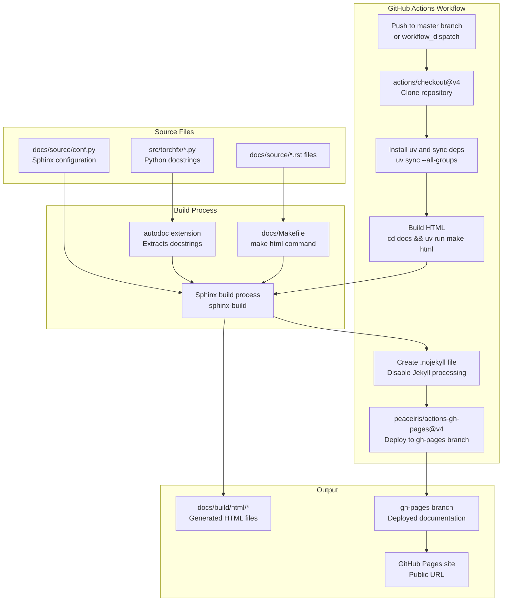
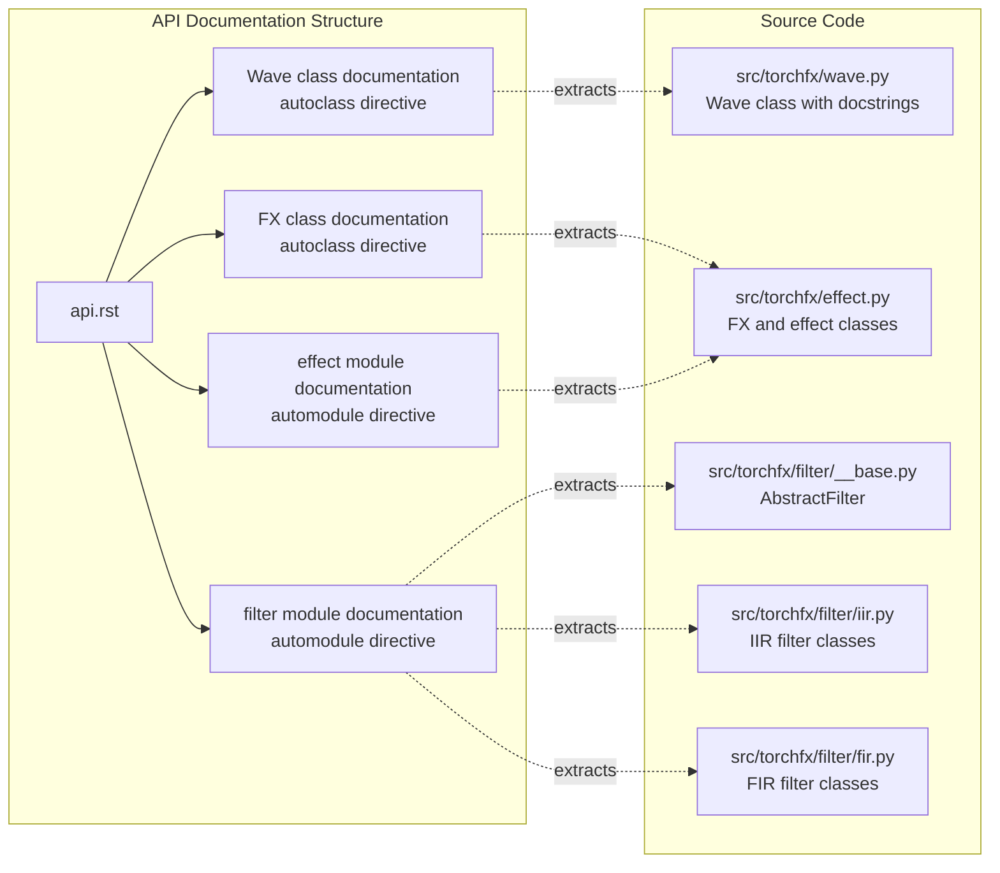
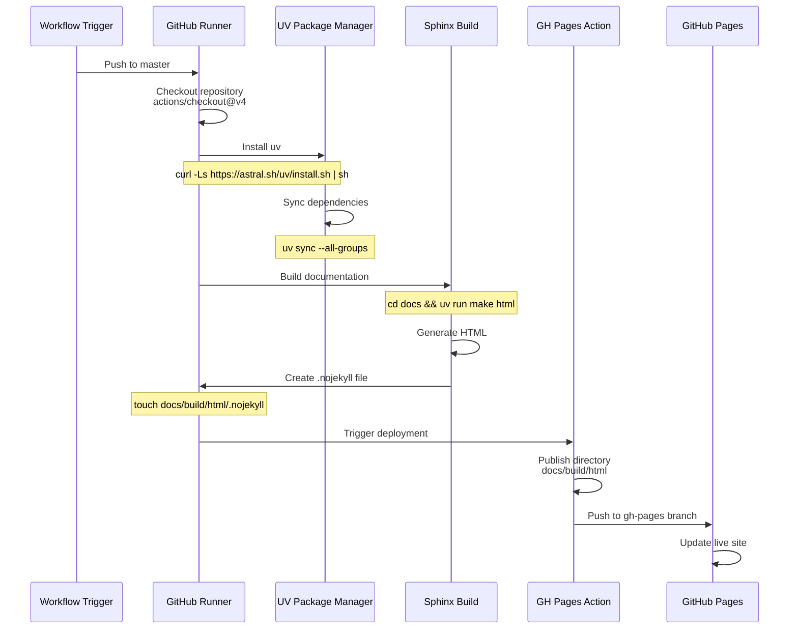

# 7.6 Documentation

# Documentation

<details>
<summary>Relevant source files</summary>

The following files were used as context for generating this wiki page:

- [.github/workflows/docs.yml](.github/workflows/docs.yml)
- [docs/source/api.rst](docs/source/api.rst)

</details>


This page explains how the torchfx documentation is built using Sphinx and deployed to GitHub Pages. It covers the documentation build system, the automated deployment pipeline, API documentation generation, and how to contribute to the documentation.

For information about testing, see [Testing](#7.4). For details on the overall development workflow, see [Development Workflow](#7.3).

## Documentation System Overview

The torchfx project uses **Sphinx** as its documentation generator. Sphinx builds HTML documentation from reStructuredText (.rst) files and automatically extracts API documentation from Python docstrings using the `autodoc` extension.

The documentation system has three main components:

| Component | Location | Purpose |
|-----------|----------|---------|
| Source files | `docs/source/` | reStructuredText files defining documentation structure |
| Build output | `docs/build/html/` | Generated HTML files (git-ignored) |
| Deployed site | GitHub Pages | Publicly accessible documentation at project URL |

The documentation is automatically rebuilt and deployed whenever changes are pushed to the `master` branch via a GitHub Actions workflow.

**Sources:** [.github/workflows/docs.yml:1-34](), [docs/source/api.rst:1-30]()

## Documentation Build and Deployment Pipeline

The following diagram shows the complete flow from source files to the deployed documentation site:



**Documentation Build and Deployment Flow**

The deployment pipeline is defined in [.github/workflows/docs.yml:1-34]() and executes the following steps:

1. **Trigger**: Runs on push to `master` or manual dispatch
2. **Checkout**: Uses `actions/checkout@v4` to clone the repository
3. **Install Dependencies**: Installs `uv` package manager and syncs all dependency groups
4. **Build HTML**: Executes `make html` inside the `docs/` directory using `uv run`
5. **Disable Jekyll**: Creates `.nojekyll` file to prevent GitHub Pages Jekyll processing
6. **Deploy**: Uses `peaceiris/actions-gh-pages@v4` to publish to the `gh-pages` branch

**Sources:** [.github/workflows/docs.yml:1-34]()

## Building Documentation Locally

To build the documentation on your local machine:

```bash
# Navigate to docs directory
cd docs

# Build HTML documentation
uv run make html

# Open the generated documentation
# Output is in docs/build/html/index.html
```

The build process requires the documentation dependencies to be installed. These are included in the project's dependency groups and are automatically available when using `uv sync --all-groups`.

The `Makefile` in the `docs/` directory provides several build targets:

| Target | Command | Purpose |
|--------|---------|---------|
| html | `make html` | Build HTML documentation |
| clean | `make clean` | Remove build artifacts |
| help | `make help` | Show available targets |

**Sources:** [.github/workflows/docs.yml:24-27]()

## API Documentation Structure

The API documentation is defined in [docs/source/api.rst:1-30]() and uses Sphinx's `autodoc` extension to automatically generate documentation from Python docstrings.



**API Documentation Structure and Source Extraction**

The API documentation follows this structure:

### Wave Class Documentation

[docs/source/api.rst:7-10]() uses the `autoclass` directive to document the `Wave` class:

```rst
.. autoclass:: torchfx.Wave
   :members:
   :show-inheritance:
   :exclude-members: __init__, __str__, __repr__, __call__
```

This extracts all public methods and properties from the Wave class, excluding special methods.

### FX Base Class Documentation

[docs/source/api.rst:12-15]() documents the `FX` abstract base class using the same pattern, which all effects and filters inherit from.

### Filter Module Documentation

[docs/source/api.rst:17-22]() uses the `automodule` directive to document all filter classes:

```rst
.. automodule:: torchfx.filter
   :members:
   :show-inheritance:
   :exclude-members: __init__, __str__, __repr__, __call__
```

This automatically includes documentation for:
- `AbstractFilter` base class
- IIR filters (Butterworth, Chebyshev, Shelving, Peaking, Notch, AllPass, LinkwitzRiley)
- FIR filters (FIR, DesignableFIR)
- `ParallelFilterCombination`

### Effect Module Documentation

[docs/source/api.rst:24-29]() documents all built-in effects (Gain, Normalize, Reverb, Delay) using the same `automodule` pattern.

**Sources:** [docs/source/api.rst:1-30]()

## GitHub Actions Workflow Configuration

The deployment workflow is configured in [.github/workflows/docs.yml:1-34](). Key configuration details:

| Configuration | Value | Purpose |
|--------------|-------|---------|
| Workflow name | "Deploy Sphinx documentation to GitHub Pages" | Descriptive name for the workflow |
| Triggers | `push: branches: [master]`, `workflow_dispatch` | Runs on master push or manual trigger |
| Runner | `ubuntu-latest` | Linux environment for build |
| Permissions | `contents: write` | Required to push to gh-pages branch |
| Deployment action | `peaceiris/actions-gh-pages@v4` | Handles GitHub Pages deployment |
| Publish directory | `docs/build/html` | Source directory for deployed files |

### Workflow Steps Breakdown



**Deployment Workflow Execution Sequence**

The `.nojekyll` file created at [.github/workflows/docs.yml:27]() is critical - it prevents GitHub Pages from running Jekyll processing on the HTML files, which could interfere with Sphinx's generated structure.

**Sources:** [.github/workflows/docs.yml:1-34]()

## Writing and Contributing to Documentation

### Adding New Documentation Pages

To add new documentation pages:

1. Create a new `.rst` file in `docs/source/`
2. Reference the new page in the table of contents (typically in `index.rst`)
3. Build locally to verify formatting: `cd docs && uv run make html`
4. Commit and push to trigger automatic deployment

### Docstring Conventions

All public classes, methods, and functions should include docstrings that will be extracted by Sphinx's autodoc extension. The project uses standard Python docstring conventions.

For API documentation to be generated correctly:

- Document all public methods and parameters
- Use type hints in function signatures (extracted automatically)
- Provide clear descriptions of return values
- Include usage examples in docstrings where helpful

### Preview Changes Locally

Before committing documentation changes, always build and preview locally:

```bash
# Build documentation
cd docs && uv run make html

# Open in browser
# docs/build/html/index.html
```

This allows you to verify:
- reStructuredText syntax is correct
- Autodoc extracts API documentation properly
- Links between pages work correctly
- Code examples render correctly

**Sources:** [.github/workflows/docs.yml:24-27](), [docs/source/api.rst:1-30]()

## Documentation Dependencies

Documentation dependencies are managed through the project's `pyproject.toml` file. Key dependencies include:

- **sphinx**: Core documentation generator
- **sphinx-rtd-theme**: ReadTheDocs theme (or alternative theme if configured)
- **sphinx-autodoc**: Automatic API documentation from docstrings
- **sphinx-autoapi**: Enhanced automatic API documentation (if used)

These dependencies are installed automatically when running `uv sync --all-groups` as shown in the workflow at [.github/workflows/docs.yml:20-22]().

**Sources:** [.github/workflows/docs.yml:20-22]()