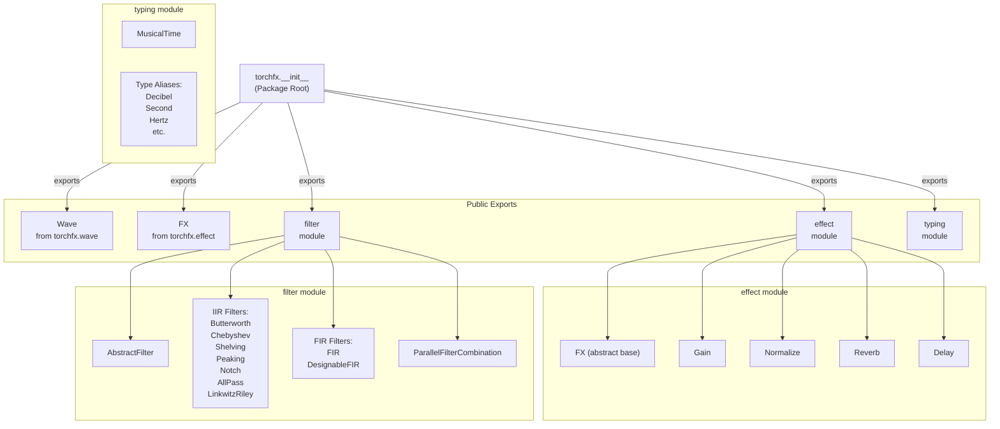
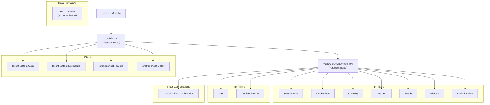
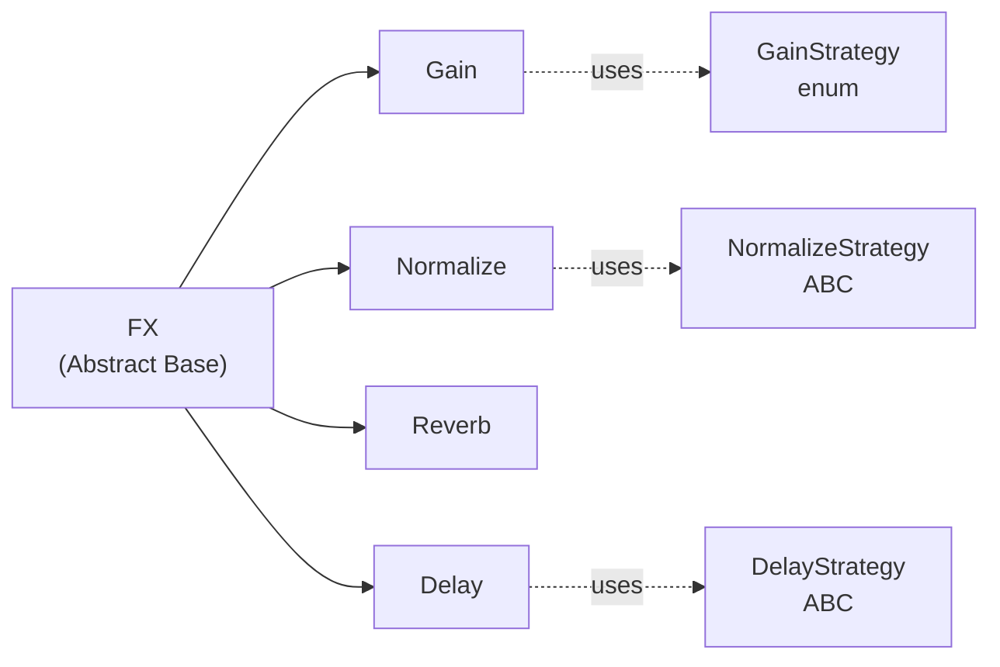
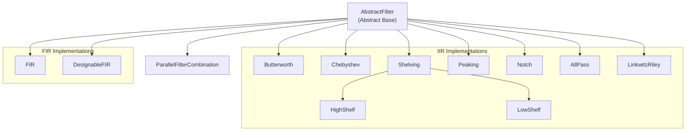

# 8 API Reference

# API Reference

<details>
<summary>Relevant source files</summary>

The following files were used as context for generating this wiki page:

- [docs/source/api.rst](docs/source/api.rst)
- [src/torchfx/__init__.py](src/torchfx/__init__.py)

</details>


## Purpose and Scope

This page provides a complete API reference for all public classes, methods, and functions in the torchfx library. It documents the interfaces exposed through the main package and its submodules.

For conceptual explanations of how these APIs work together, see [Core Concepts](#2). For practical usage examples, see [Examples](#6). For detailed explanations of individual components, see:
- [Wave Class](#2.1)
- [FX Base Class](#2.2)
- [Effects](#3)
- [Filters](#4)
- [Type System](#2.4)

**Sources**: [docs/source/api.rst:1-30]()

---

## Module Organization

The torchfx package exports its public API through a centralized initialization module that aggregates core classes and submodules.



**Sources**: [src/torchfx/__init__.py:1-7](), [docs/source/api.rst:1-30]()

---

## Import Patterns

The library supports multiple import styles depending on usage needs:

| Import Style | Usage | Example |
|-------------|--------|---------|
| Direct class import | Common for core classes | `from torchfx import Wave, FX` |
| Module import | Access all effects/filters | `import torchfx.effect as effect` |
| Submodule import | Specific components | `from torchfx.filter import Butterworth` |
| Full package import | Exploratory work | `import torchfx` |

**Common Import Pattern**:
```python
from torchfx import Wave, FX
from torchfx.filter import Butterworth, HighShelf
from torchfx.effect import Gain, Delay
```

**Sources**: [src/torchfx/__init__.py:1-7]()

---

## Class Hierarchy

The following diagram illustrates the inheritance relationships between the major classes in torchfx:



**Sources**: [src/torchfx/__init__.py:1-7](), [docs/source/api.rst:1-30]()

---

## torchfx.Wave

The `Wave` class is the primary data container for audio in torchfx. It encapsulates audio tensor data and sampling rate information.

### Constructor

| Parameter | Type | Description |
|-----------|------|-------------|
| `ys` | `torch.Tensor` | Audio data tensor of shape `(channels, samples)` or `(samples,)` |
| `fs` | `int` | Sample rate in Hz |

### Properties

| Property | Type | Description |
|----------|------|-------------|
| `ys` | `torch.Tensor` | Audio data tensor |
| `fs` | `int` | Sample rate in Hz |
| `device` | `torch.device` | Current device of the tensor |
| `shape` | `torch.Size` | Shape of the audio tensor |
| `duration` | `float` | Duration in seconds |
| `n_channels` | `int` | Number of audio channels |
| `n_samples` | `int` | Number of samples |

### Class Methods

| Method | Returns | Description |
|--------|---------|-------------|
| `from_file(path: str \| Path)` | `Wave` | Load audio from file using torchaudio |

### Instance Methods

| Method | Returns | Description |
|--------|---------|-------------|
| `to(device: str \| torch.device)` | `Wave` | Move Wave to specified device (CPU/CUDA) |
| `cpu()` | `Wave` | Move Wave to CPU |
| `cuda()` | `Wave` | Move Wave to CUDA device |
| `clone()` | `Wave` | Create a deep copy of the Wave |
| `__or__(other: FX)` | `Wave` | Pipe operator for applying effects: `wave \| effect` |

### Special Methods

| Method | Description |
|--------|-------------|
| `__repr__()` | String representation showing shape and sample rate |
| `__str__()` | Human-readable string representation |

**Sources**: [src/torchfx/wave.py](), [docs/source/api.rst:7-10]()

---

## torchfx.FX

The `FX` class is the abstract base class for all audio effects and filters. It inherits from `torch.nn.Module`, making all effects compatible with PyTorch's training infrastructure.

### Abstract Methods

| Method | Parameters | Returns | Description |
|--------|-----------|---------|-------------|
| `forward(ys: torch.Tensor)` | `ys: torch.Tensor` | `torch.Tensor` | Apply effect to audio tensor (must be implemented by subclasses) |

### Inherited Methods (from torch.nn.Module)

| Method | Returns | Description |
|--------|---------|-------------|
| `to(device)` | `FX` | Move module parameters to device |
| `cpu()` | `FX` | Move module parameters to CPU |
| `cuda()` | `FX` | Move module parameters to CUDA |
| `parameters()` | `Iterator` | Get module parameters |
| `state_dict()` | `dict` | Get module state |
| `load_state_dict(state)` | `None` | Load module state |

### Pipe Operator Support

All `FX` subclasses can be used with the pipe operator through `Wave.__or__()`:

```python
result = wave | effect1 | effect2 | filter1
```

**Sources**: [src/torchfx/effect.py](), [docs/source/api.rst:12-15]()

---

## torchfx.effect Module

The `effect` module contains implementations of time-domain audio effects. All effects inherit from `FX`.



### torchfx.effect.Gain

Applies amplitude scaling with multiple modes.

| Parameter | Type | Default | Description |
|-----------|------|---------|-------------|
| `gain` | `float` | - | Gain amount (interpretation depends on strategy) |
| `strategy` | `GainStrategy` | `GainStrategy.AMPLITUDE` | How to interpret gain value |
| `clamp` | `bool` | `False` | Whether to clamp output to [-1, 1] |

**GainStrategy values**:
- `GainStrategy.AMPLITUDE`: Direct amplitude multiplication
- `GainStrategy.DECIBEL`: Gain in dB (20*log10)
- `GainStrategy.POWER`: Power gain (10*log10)

### torchfx.effect.Normalize

Normalizes audio amplitude using various strategies.

| Parameter | Type | Default | Description |
|-----------|------|---------|-------------|
| `strategy` | `NormalizeStrategy` | - | Normalization strategy to use |
| `target` | `float` | `1.0` | Target level for normalization |

**Available strategies** (see [Normalize](#3.2) for details):
- `Peak`: Normalize by peak amplitude
- `RMS`: Normalize by RMS level
- `Percentile`: Normalize by percentile value
- `PerChannel`: Apply per-channel normalization
- Custom strategies via subclassing

### torchfx.effect.Reverb

Simple reverb effect using feedback delay network.

| Parameter | Type | Default | Description |
|-----------|------|---------|-------------|
| `delay` | `float` | - | Delay time in seconds |
| `decay` | `float` | - | Decay factor (0-1) |
| `mix` | `float` | `0.5` | Dry/wet mix (0=dry, 1=wet) |

### torchfx.effect.Delay

Delay effect with BPM synchronization and multiple strategies.

| Parameter | Type | Default | Description |
|-----------|------|---------|-------------|
| `delay` | `float \| MusicalTime` | - | Delay time (seconds or musical time) |
| `sample_rate` | `int` | - | Sample rate in Hz |
| `feedback` | `float` | `0.0` | Feedback amount (0-1) |
| `mix` | `float` | `0.5` | Dry/wet mix |
| `bpm` | `float \| None` | `None` | Tempo for musical time sync |
| `strategy` | `DelayStrategy` | `MonoDelay()` | Delay routing strategy |

**Available strategies**:
- `MonoDelay`: Simple mono delay
- `PingPongDelay`: Stereo ping-pong delay

**Sources**: [src/torchfx/effect.py](), [docs/source/api.rst:24-29]()

---

## torchfx.filter Module

The `filter` module contains frequency-domain filter implementations. All filters inherit from `AbstractFilter`, which inherits from `FX`.



### torchfx.filter.AbstractFilter

Abstract base class for all filters. Inherits from `FX`.

| Abstract Method | Description |
|----------------|-------------|
| `_compute_coefficients()` | Compute filter coefficients (b, a) or impulse response |
| `forward(ys: torch.Tensor)` | Apply filter to audio (inherited from FX) |

**Operators**:
- `filter1 + filter2`: Creates `ParallelFilterCombination`
- `filter1 | filter2`: Series combination via pipe operator

### IIR Filter Classes

All IIR filters share common parameters for specifying cutoff frequencies and filter characteristics:

| Class | Parameters | Description |
|-------|-----------|-------------|
| `Butterworth` | `order: int, cutoff: float \| tuple, fs: int, btype: str` | Maximally flat passband response |
| `Chebyshev` | `order: int, cutoff: float \| tuple, fs: int, btype: str, rp: float` | Steeper rolloff with passband ripple |
| `HighShelf` | `cutoff: float, fs: int, gain_db: float, q: float` | Boost/cut high frequencies |
| `LowShelf` | `cutoff: float, fs: int, gain_db: float, q: float` | Boost/cut low frequencies |
| `Peaking` | `center: float, fs: int, gain_db: float, q: float` | Boost/cut around center frequency |
| `Notch` | `center: float, fs: int, q: float` | Reject narrow frequency band |
| `AllPass` | `center: float, fs: int, q: float` | Phase shift without amplitude change |
| `LinkwitzRiley` | `order: int, cutoff: float, fs: int, btype: str` | Crossover filter design |

**Common btype values**: `'lowpass'`, `'highpass'`, `'bandpass'`, `'bandstop'`

### FIR Filter Classes

| Class | Parameters | Description |
|-------|-----------|-------------|
| `FIR` | `coefficients: torch.Tensor, sample_rate: int` | Direct FIR filter from coefficients |
| `DesignableFIR` | `numtaps: int, cutoff: float \| list, fs: int, pass_zero: bool` | Auto-designed FIR using scipy.signal.firwin |

### torchfx.filter.ParallelFilterCombination

Combines multiple filters in parallel (sum of outputs).

| Parameter | Type | Description |
|-----------|------|-------------|
| `filters` | `list[AbstractFilter]` | List of filters to combine |

**Creation via operator**:
```python
parallel = filter1 + filter2 + filter3
```

**Sources**: [src/torchfx/filter/__base.py](), [src/torchfx/filter/iir.py](), [src/torchfx/filter/fir.py](), [docs/source/api.rst:17-22]()

---

## torchfx.typing Module

The `typing` module provides type definitions and aliases for audio processing parameters.

### MusicalTime Class

Represents musical time divisions synchronized to BPM.

| Class Variable | Type | Description |
|---------------|------|-------------|
| `WHOLE` | `MusicalTime` | Whole note (1/1) |
| `HALF` | `MusicalTime` | Half note (1/2) |
| `QUARTER` | `MusicalTime` | Quarter note (1/4) |
| `EIGHTH` | `MusicalTime` | Eighth note (1/8) |
| `SIXTEENTH` | `MusicalTime` | Sixteenth note (1/16) |
| `THIRTY_SECOND` | `MusicalTime` | 32nd note (1/32) |
| `DOTTED_HALF` | `MusicalTime` | Dotted half note (3/4) |
| `DOTTED_QUARTER` | `MusicalTime` | Dotted quarter note (3/8) |
| `DOTTED_EIGHTH` | `MusicalTime` | Dotted eighth note (3/16) |
| `TRIPLET_QUARTER` | `MusicalTime` | Quarter note triplet (1/6) |
| `TRIPLET_EIGHTH` | `MusicalTime` | Eighth note triplet (1/12) |

**Methods**:

| Method | Parameters | Returns | Description |
|--------|-----------|---------|-------------|
| `to_seconds(bpm)` | `bpm: float` | `float` | Convert to seconds at given BPM |

### Type Aliases

| Type Alias | Definition | Purpose |
|------------|-----------|---------|
| `Decibel` | `float` | dB values |
| `Second` | `float` | Time in seconds |
| `Hertz` | `float` | Frequency in Hz |
| `Millisecond` | `float` | Time in milliseconds |
| `SampleRate` | `int` | Sample rate in Hz |

**Sources**: [src/torchfx/typing.py]()

---

## API Usage Summary

The following table summarizes typical usage patterns for the main API components:

| Component | Import | Typical Usage |
|-----------|--------|---------------|
| `Wave` | `from torchfx import Wave` | `wave = Wave.from_file("audio.wav")` |
| `Gain` | `from torchfx.effect import Gain` | `result = wave \| Gain(2.0)` |
| `Butterworth` | `from torchfx.filter import Butterworth` | `lpf = Butterworth(4, 1000, 44100, 'lowpass')` |
| `MusicalTime` | `from torchfx.typing import MusicalTime` | `delay_time = MusicalTime.QUARTER` |
| Parallel filters | `from torchfx.filter import ...` | `parallel = filter1 + filter2` |
| Series pipeline | `from torchfx import Wave, FX` | `result = wave \| fx1 \| fx2 \| fx3` |

**Sources**: [src/torchfx/__init__.py:1-7](), [docs/source/api.rst:1-30]()

---

## Complete Public API Exports

The following table lists all symbols exported from the `torchfx` package:

| Symbol | Module | Type | Description |
|--------|--------|------|-------------|
| `Wave` | `torchfx` | class | Audio data container |
| `FX` | `torchfx` | class | Abstract effect base |
| `effect` | `torchfx` | module | Effects submodule |
| `filter` | `torchfx` | module | Filters submodule |
| `typing` | `torchfx` | module | Type definitions submodule |

**Accessing submodule contents**:
```python
import torchfx

# Access through submodules
gain = torchfx.effect.Gain(2.0)
lpf = torchfx.filter.Butterworth(4, 1000, 44100, 'lowpass')
time = torchfx.typing.MusicalTime.QUARTER

# Or import directly
from torchfx.effect import Gain
from torchfx.filter import Butterworth
from torchfx.typing import MusicalTime
```

**Sources**: [src/torchfx/__init__.py:1-7]()