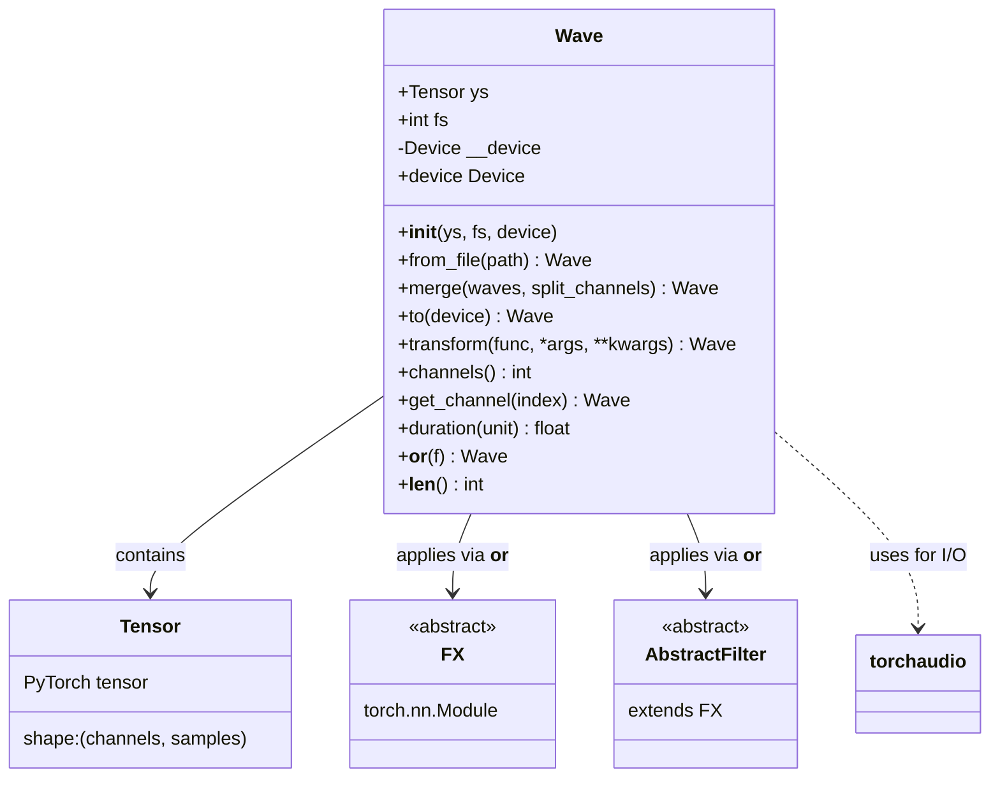
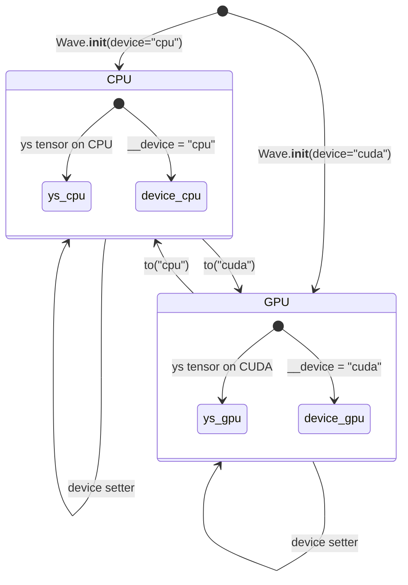
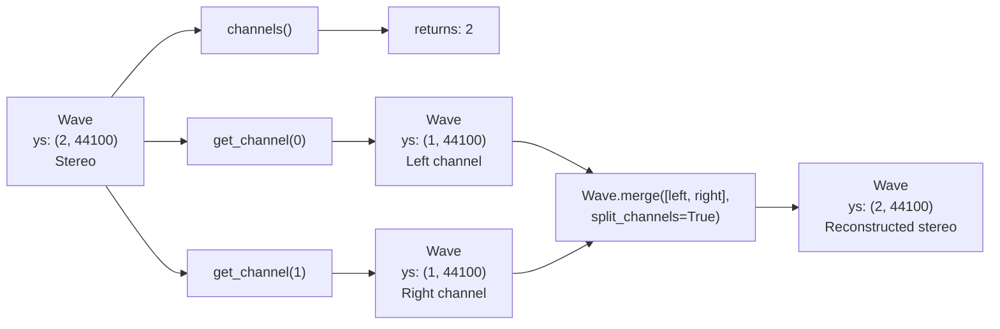
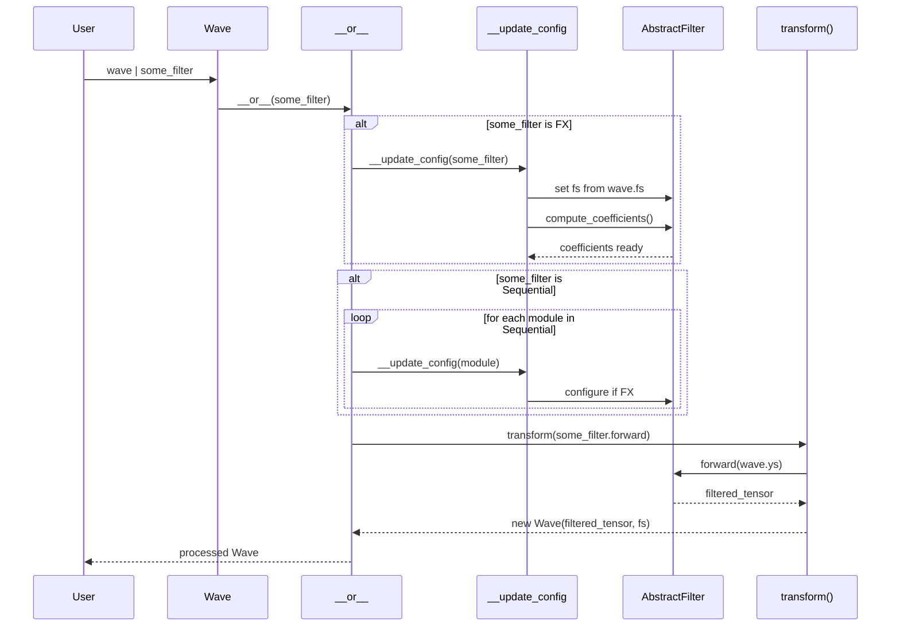
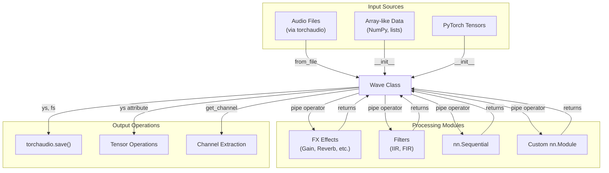

# 8.1 torchfx.Wave

# torchfx.Wave

<details>
<summary>Relevant source files</summary>

The following files were used as context for generating this wiki page:

- [docs/source/api.rst](docs/source/api.rst)
- [src/torchfx/wave.py](src/torchfx/wave.py)

</details>


## Purpose and Scope

This page provides a complete API reference for the `torchfx.Wave` class, which is the core data container for audio signals in torchfx. The Wave class encapsulates a multi-channel audio tensor along with its sampling frequency, and provides methods for device management, file I/O, transformations, and pipeline-based processing.

For information about the broader concepts behind Wave objects and how they fit into the torchfx architecture, see [Core Concepts](#2). For details on the pipeline operator and effect chaining, see [Pipeline Operator](#2.3). For examples of using Wave objects in practice, see [Examples](#6).

**Sources:** [src/torchfx/wave.py:1-292]()

## Overview

The `Wave` class represents a discrete-time waveform as a 2D tensor where the first dimension represents channels and the second dimension represents time samples. It serves as the fundamental data structure that flows through torchfx processing pipelines.

```python
class Wave:
    ys: Tensor      # Audio signal tensor (channels × samples)
    fs: int         # Sampling frequency in Hz
```

The Wave class is designed to:
- Wrap audio tensors with associated metadata (sampling rate)
- Provide PyTorch-compatible device management (CPU/CUDA)
- Enable functional audio transformations
- Support the pipe operator (`|`) for chaining effects and filters
- Integrate seamlessly with `torchaudio` for file I/O

**Sources:** [src/torchfx/wave.py:28-48]()

## Class Structure



**Sources:** [src/torchfx/wave.py:28-292]()

## Construction

### Constructor

```python
Wave(ys: ArrayLike, fs: int, device: Device = "cpu") -> None
```

Creates a Wave object from an array-like object containing audio samples.

**Parameters:**
- `ys`: Array-like object (NumPy array, list, PyTorch tensor) with shape `(channels, samples)`
- `fs`: Sampling frequency in Hz
- `device`: Target device, either `"cpu"` or `"cuda"` (default: `"cpu"`)

**Implementation details:**
- Converts `ys` to a PyTorch tensor if not already
- Automatically moves the tensor to the specified device
- Stores sampling frequency for later use in filters and effects

**Sources:** [src/torchfx/wave.py:44-47]()

### Class Method: from_file

```python
@classmethod
Wave.from_file(path: str | Path, *args, **kwargs) -> Wave
```

Instantiates a Wave object from an audio file using `torchaudio.load`.

**Parameters:**
- `path`: File path to audio file (supports WAV, MP3, FLAC, etc.)
- `*args`, `**kwargs`: Additional arguments passed to `torchaudio.load`

**Returns:** Wave object containing the loaded audio data

**Example:**
```python
wave = Wave.from_file("audio.wav")
```

**Sources:** [src/torchfx/wave.py:109-133]()

### Class Method: merge

```python
@classmethod
Wave.merge(waves: Sequence[Wave], split_channels: bool = False) -> Wave
```

Merges multiple Wave objects into a single Wave.

**Parameters:**
- `waves`: Sequence of Wave objects to merge
- `split_channels`: If `False`, sums channels together. If `True`, concatenates channels

**Returns:** Merged Wave object

**Behavior:**
- All waves must have the same sampling frequency
- When `split_channels=False`: Performs element-wise addition of waveforms (mixing)
- When `split_channels=True`: Concatenates channels along channel dimension

**Raises:**
- `ValueError`: If no waves provided or sampling frequencies mismatch

**Sources:** [src/torchfx/wave.py:244-291]()

## Attributes and Properties

### ys: Tensor

The audio signal tensor with shape `(channels, samples)`. This is a standard PyTorch tensor that can be manipulated using any PyTorch operations.

**Sources:** [src/torchfx/wave.py:40]()

### fs: int

The sampling frequency in Hz (samples per second). This value is used by filters and effects to compute time-domain parameters.

**Sources:** [src/torchfx/wave.py:41]()

### device: Device (property)

A property that returns the current device (`"cpu"` or `"cuda"`) where the Wave's tensor is located. Setting this property moves the Wave to the specified device.

**Getter:** Returns the current device
**Setter:** Moves the Wave to the specified device (equivalent to calling `to()`)

**Example:**
```python
wave.device = "cuda"  # Move to GPU
current_device = wave.device  # Get current device
```

**Sources:** [src/torchfx/wave.py:49-63]()

## Device Management

### Method: to

```python
Wave.to(device: Device) -> Self
```

Moves the Wave object to a specific device.

**Parameters:**
- `device`: Either `"cpu"` or `"cuda"`

**Returns:** Self (for method chaining)

**Implementation:**
- Updates the internal `__device` field
- Moves the `ys` tensor to the target device
- Returns self to enable fluent interface pattern

**Example:**
```python
wave = Wave.from_file("audio.wav")
wave.to("cuda")  # Move to GPU
processed = (wave.to("cuda") | some_filter).to("cpu")  # Chain operations
```

**Sources:** [src/torchfx/wave.py:65-86]()

## Device Management Flow



**Sources:** [src/torchfx/wave.py:44-86]()

## Audio Manipulation

### Method: transform

```python
Wave.transform(func: Callable[..., Tensor], *args, **kwargs) -> Wave
```

Applies a functional transformation to the audio signal tensor.

**Parameters:**
- `func`: Function that takes a tensor and returns a tensor
- `*args`, `**kwargs`: Additional arguments passed to `func`

**Returns:** New Wave object with transformed signal and same sampling frequency

**Use cases:**
- Applying torch/torchaudio transforms
- Performing FFT/IFFT operations
- Custom tensor manipulations
- Functional-style audio processing

**Example:**
```python
# Apply FFT
freq_domain = wave.transform(torch.fft.fft)

# Apply custom function
def normalize_peak(tensor):
    return tensor / tensor.abs().max()
normalized = wave.transform(normalize_peak)
```

**Note:** The `transform` method creates a new Wave object rather than modifying in-place, supporting functional programming patterns.

**Sources:** [src/torchfx/wave.py:88-107]()

## Channel Operations

### Method: channels

```python
Wave.channels() -> int
```

Returns the number of channels in the audio signal.

**Returns:** Integer representing the channel count

**Implementation:** Returns `self.ys.shape[0]` (first dimension of tensor)

**Sources:** [src/torchfx/wave.py:188-197]()

### Method: get_channel

```python
Wave.get_channel(index: int) -> Wave
```

Extracts a specific channel as a new Wave object.

**Parameters:**
- `index`: Zero-based channel index

**Returns:** New Wave object containing only the specified channel

**Example:**
```python
stereo_wave = Wave.from_file("stereo.wav")
left_channel = stereo_wave.get_channel(0)
right_channel = stereo_wave.get_channel(1)
```

**Sources:** [src/torchfx/wave.py:199-218]()

## Channel Operation Structure



**Sources:** [src/torchfx/wave.py:188-218](), [src/torchfx/wave.py:244-291]()

## Pipeline Operator

### Method: __or__

```python
Wave.__or__(f: nn.Module) -> Wave
```

Implements the pipe operator (`|`) for chaining effects and filters.

**Parameters:**
- `f`: A PyTorch `nn.Module` (typically an `FX` subclass or `nn.Sequential`)

**Returns:** New Wave object with the effect/filter applied

**Behavior:**
1. Validates that `f` is an `nn.Module`
2. If `f` is an `FX` instance, automatically configures it:
   - Sets `f.fs` to the Wave's sampling frequency if not already set
   - Computes filter coefficients for `AbstractFilter` instances
3. If `f` is `nn.Sequential` or `nn.ModuleList`, configures each contained `FX` module
4. Applies the module's `forward` method via `transform()`

**Example:**
```python
from torchfx.filter import iir

# Chain filters using pipe operator
result = (wave 
    | iir.HiButterworth(cutoff=1000, order=4)
    | iir.LoButterworth(cutoff=5000, order=4))

# Use with Sequential
chain = nn.Sequential(
    iir.HiButterworth(1000),
    iir.LoButterworth(5000)
)
result = wave | chain
```

**Type checking:** Raises `TypeError` if `f` is not an `nn.Module`

**Sources:** [src/torchfx/wave.py:135-174]()

### Private Method: __update_config

```python
Wave.__update_config(f: FX) -> None
```

Internal helper that configures FX modules before application.

**Behavior:**
- Sets `f.fs` from Wave's sampling frequency if `f.fs` is `None`
- For `AbstractFilter` instances, calls `compute_coefficients()` if not already computed

**Sources:** [src/torchfx/wave.py:176-182]()

## Pipeline Processing Flow



**Sources:** [src/torchfx/wave.py:135-182]()

## Utility Methods

### Method: __len__

```python
Wave.__len__() -> int
```

Returns the number of samples in the Wave.

**Returns:** Integer representing the sample count (second dimension of `ys` tensor)

**Example:**
```python
wave = Wave.from_file("audio.wav")
sample_count = len(wave)  # e.g., 44100 for 1 second at 44.1kHz
```

**Sources:** [src/torchfx/wave.py:184-186]()

### Method: duration

```python
Wave.duration(unit: Literal["sec", "ms"]) -> Second | Millisecond
```

Returns the duration of the audio signal.

**Parameters:**
- `unit`: Either `"sec"` for seconds or `"ms"` for milliseconds

**Returns:** Float representing the duration in the specified unit

**Calculation:** `len(self) / self.fs * (1000 if unit == "ms" else 1)`

**Example:**
```python
wave = Wave.from_file("audio.wav")
duration_sec = wave.duration("sec")   # e.g., 3.5
duration_ms = wave.duration("ms")     # e.g., 3500.0
```

**Sources:** [src/torchfx/wave.py:220-242]()

## Method Categories

The following table categorizes Wave methods by their primary purpose:

| Category | Methods | Description |
|----------|---------|-------------|
| **Construction** | `__init__`, `from_file`, `merge` | Creating Wave objects from various sources |
| **Device Management** | `to`, `device` (property) | Moving Wave objects between CPU and GPU |
| **Transformation** | `transform`, `__or__` | Applying functions and effects to audio |
| **Channel Operations** | `channels`, `get_channel` | Multi-channel audio manipulation |
| **Metadata** | `duration`, `__len__` | Querying Wave properties |
| **Configuration** | `__update_config` (private) | Internal configuration management |

**Sources:** [src/torchfx/wave.py:28-292]()

## Type Annotations

The Wave class uses the following type aliases from `torchfx.typing`:

- `Device`: Type alias for device strings (`"cpu"` or `"cuda"`)
- `Second`: Type alias for time in seconds (float)
- `Millisecond`: Type alias for time in milliseconds (float)

For complete type system documentation, see [Type System](#2.4).

**Sources:** [src/torchfx/wave.py:13-25]()

## Integration Points



**Sources:** [src/torchfx/wave.py:1-292](), [docs/source/api.rst:1-30]()

## Usage Patterns

### Pattern 1: File I/O and Processing

```python
# Load audio
wave = Wave.from_file("input.wav")

# Process on GPU
wave = wave.to("cuda")
processed = wave | some_filter | some_effect

# Save result
torchaudio.save("output.wav", processed.ys.cpu(), processed.fs)
```

### Pattern 2: Multi-channel Processing

```python
# Load stereo file
stereo = Wave.from_file("stereo.wav")

# Process channels independently
left = stereo.get_channel(0) | left_effect
right = stereo.get_channel(1) | right_effect

# Merge back
result = Wave.merge([left, right], split_channels=True)
```

### Pattern 3: Functional Transformation

```python
# Apply custom transformations
normalized = wave.transform(lambda x: x / x.abs().max())
fft_result = wave.transform(torch.fft.fft)
```

**Sources:** [src/torchfx/wave.py:1-292]()

## Implementation Notes

### Tensor Shape Convention

Wave tensors always have shape `(channels, samples)`:
- Mono audio: `(1, N)` where N is sample count
- Stereo audio: `(2, N)`
- Multi-channel: `(C, N)` where C is channel count

This convention is consistent with `torchaudio` and PyTorch audio processing standards.

**Sources:** [src/torchfx/wave.py:3-10]()

### Immutability Pattern

Most Wave methods return new Wave objects rather than modifying in place:
- `transform()` creates a new Wave
- `__or__()` creates a new Wave
- `get_channel()` creates a new Wave

Only device management methods (`to()`, `device` setter) modify the Wave in place while returning self for chaining.

**Sources:** [src/torchfx/wave.py:88-174]()

### Automatic Configuration

The pipe operator automatically configures FX modules:
- Sets sampling frequency if not already set
- Computes filter coefficients before first use
- Works recursively with Sequential containers

This design eliminates boilerplate and prevents common configuration errors.

**Sources:** [src/torchfx/wave.py:176-182]()