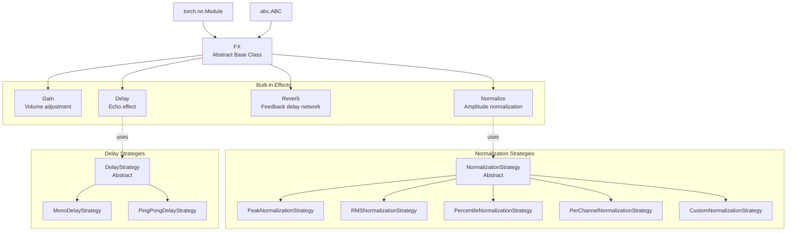
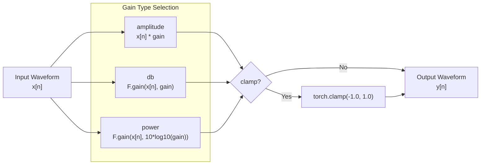
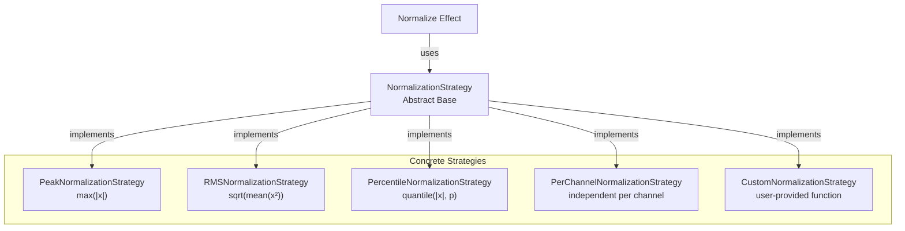
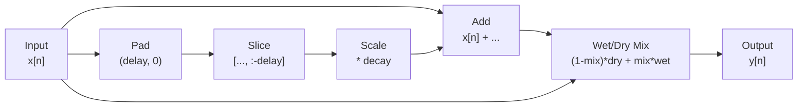
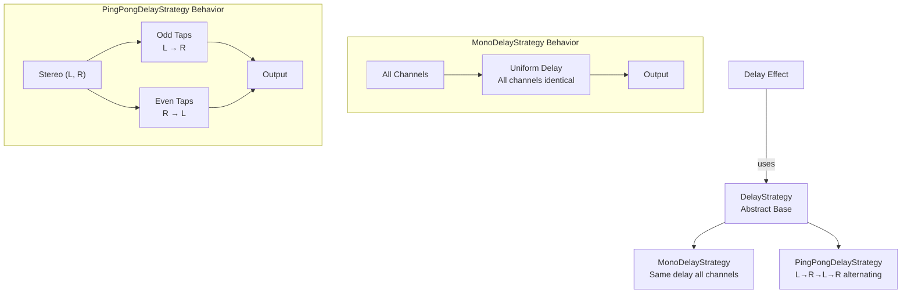
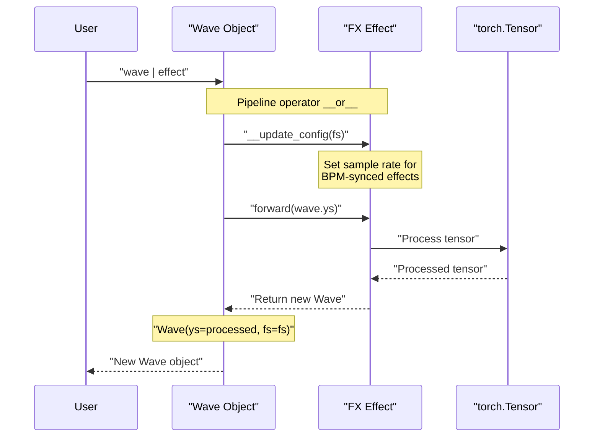

# 8.2 torchfx.FX and Effects

# torchfx.FX and Effects

<details>
<summary>Relevant source files</summary>

The following files were used as context for generating this wiki page:

- [docs/source/api.rst](docs/source/api.rst)
- [src/torchfx/effect.py](src/torchfx/effect.py)

</details>


## Purpose and Scope

This page documents the `FX` abstract base class and all built-in audio effects in torchfx. The `FX` class serves as the foundation for all effects and filters in the library, providing a consistent interface compatible with PyTorch's `nn.Module` system. This page covers:

- The `FX` base class structure and abstract interface
- Built-in effects: `Gain`, `Normalize`, `Reverb`, and `Delay`
- Strategy pattern implementations for extensible effect behavior
- Parameter specifications and usage patterns

For information about the `Wave` class and pipeline operator, see [torchfx.Wave](#8.1). For filter implementations, see [torchfx.filter](#8.3). For creating custom effects, see [Creating Custom Effects](#3.5).

**Sources**: [src/torchfx/effect.py:1-715](), [docs/source/api.rst:1-30]()

---

## Class Hierarchy

The following diagram shows the complete class hierarchy for effects in torchfx:



**Sources**: [src/torchfx/effect.py:15-30](), [src/torchfx/effect.py:32-715]()

---

## FX Abstract Base Class

The `FX` class is the abstract base for all effects and filters in torchfx. It inherits from both `torch.nn.Module` and `abc.ABC`, enabling PyTorch integration while enforcing a consistent interface.

### Class Definition

| Property | Value |
|----------|-------|
| Location | [src/torchfx/effect.py:15-30]() |
| Base Classes | `torch.nn.Module`, `abc.ABC` |
| Abstract Methods | `__init__`, `forward` |

### Interface Requirements

All effect classes must implement:

```python
@abc.abstractmethod
def __init__(self, *args, **kwargs) -> None:
    super().__init__(*args, **kwargs)

@abc.abstractmethod  
def forward(self, x: Tensor) -> Tensor:
    ...
```

The `forward` method receives a tensor of shape `(..., time)` and returns a processed tensor. This signature enables effects to work with:
- Mono audio: `(time,)`
- Stereo audio: `(channels, time)`
- Batched audio: `(batch, channels, time)`

### PyTorch Integration

Because `FX` extends `nn.Module`, all effects are compatible with:
- `torch.nn.Sequential` for chaining
- Device management (`.to(device)`, `.cuda()`, `.cpu()`)
- Parameter and buffer registration
- Gradient computation (when not using `@torch.no_grad()`)

**Sources**: [src/torchfx/effect.py:15-30]()

---

## Gain Effect

The `Gain` effect adjusts the amplitude of audio waveforms with support for multiple gain representations and optional clamping.

### Parameters

| Parameter | Type | Default | Description |
|-----------|------|---------|-------------|
| `gain` | `float` | Required | Gain factor to apply |
| `gain_type` | `str` | `"amplitude"` | Type of gain: `"amplitude"`, `"db"`, or `"power"` |
| `clamp` | `bool` | `False` | Whether to clamp output to `[-1.0, 1.0]` |

### Gain Types

The following diagram illustrates how different gain types transform the input:



### Amplitude Gain

Direct multiplication by the gain factor:

```
y[n] = x[n] * gain
```

Constraint: `gain >= 0` [src/torchfx/effect.py:69-70]()

### Decibel (dB) Gain

Uses `torchaudio.functional.gain` for dB conversion [src/torchfx/effect.py:85-86]():

```
y[n] = x[n] * 10^(gain/20)
```

### Power Gain

Converts power gain to dB internally [src/torchfx/effect.py:88-89]():

```
y[n] = x[n] * 10^(10*log10(gain)/20)
```

Constraint: `gain >= 0` [src/torchfx/effect.py:69-70]()

### Clamping Behavior

When `clamp=True`, the output is constrained to prevent clipping artifacts [src/torchfx/effect.py:91-92]():

```
y[n] = clip(y[n], -1.0, 1.0)
```

**Sources**: [src/torchfx/effect.py:32-95]()

---

## Normalize Effect

The `Normalize` effect adjusts waveform amplitude to a target peak value using pluggable normalization strategies.

### Parameters

| Parameter | Type | Default | Description |
|-----------|------|---------|-------------|
| `peak` | `float` | `1.0` | Target peak value (must be positive) |
| `strategy` | `NormalizationStrategy | Callable | None` | Normalization strategy to use |

If `strategy` is `None`, defaults to `PeakNormalizationStrategy()` [src/torchfx/effect.py:122](). If `strategy` is a callable, it's wrapped in `CustomNormalizationStrategy` [src/torchfx/effect.py:119-120]().

### Strategy Pattern Architecture



### PeakNormalizationStrategy

Normalizes to the absolute maximum value [src/torchfx/effect.py:152-172]():

```
         x[n] * peak / max(|x[n]|), if max(|x[n]|) > 0
y[n] = {
         x[n],                      otherwise
```

### RMSNormalizationStrategy

Normalizes to Root Mean Square energy [src/torchfx/effect.py:174-195]():

```
         x[n] * peak / RMS(x[n]), if RMS(x[n]) > 0
y[n] = {
         x[n],                    otherwise

where RMS(x[n]) = sqrt(mean(x[n]²))
```

### PercentileNormalizationStrategy

Normalizes using a percentile of absolute values [src/torchfx/effect.py:197-229]():

```
         x[n] * peak / P_p(|x[n]|), if P_p(|x[n]|) > 0
y[n] = {
         x[n],                      otherwise

where P_p is the p-th percentile (0 < p ≤ 100)
```

**Parameter**: `percentile` (float, default=99.0) - Percentile value between 0 and 100 [src/torchfx/effect.py:221-223]()

### PerChannelNormalizationStrategy

Normalizes each channel independently to its own peak [src/torchfx/effect.py:231-261]():

```
         x_c[n] * peak / max(|x_c[n]|), if max(|x_c[n]|) > 0
y_c[n] = {
         x_c[n],                        otherwise
```

Supports:
- 2D tensors: `(channels, time)` [src/torchfx/effect.py:253-255]()
- 3D tensors: `(batch, channels, time)` [src/torchfx/effect.py:256-258]()

### CustomNormalizationStrategy

Wraps a user-provided callable for custom normalization logic [src/torchfx/effect.py:141-150]():

```python
def custom_func(waveform: Tensor, peak: float) -> Tensor:
    # Custom normalization logic
    return normalized_waveform

normalize = Normalize(peak=0.8, strategy=custom_func)
```

**Sources**: [src/torchfx/effect.py:97-261]()

---

## Reverb Effect

The `Reverb` effect creates spatial ambiance using a feedback delay network.

### Parameters

| Parameter | Type | Default | Description |
|-----------|------|---------|-------------|
| `delay` | `int` | `4410` | Delay in samples (100ms at 44.1kHz) |
| `decay` | `float` | `0.5` | Feedback decay factor (0 < decay < 1) |
| `mix` | `float` | `0.5` | Wet/dry mix (0=dry, 1=wet) |

### Algorithm

The reverb is computed using a feedback comb filter [src/torchfx/effect.py:268-271]():

```
y[n] = (1 - mix) * x[n] + mix * (x[n] + decay * x[n - delay])
```

### Processing Flow



### Implementation Details

- If `waveform.size(-1) <= delay`, returns input unchanged [src/torchfx/effect.py:311-312]()
- Uses `torch.nn.functional.pad` for delay buffer [src/torchfx/effect.py:315]()
- Operates on arbitrary tensor shapes `(..., time)` [src/torchfx/effect.py:310]()
- Decorated with `@torch.no_grad()` for inference-only operation [src/torchfx/effect.py:308]()

**Sources**: [src/torchfx/effect.py:263-323]()

---

## Delay Effect

The `Delay` effect creates echoes with support for BPM synchronization, multiple taps, and stereo processing strategies.

### Parameters

| Parameter | Type | Default | Description |
|-----------|------|---------|-------------|
| `delay_samples` | `int | None` | `None` | Direct delay time in samples |
| `bpm` | `float | None` | `None` | Beats per minute for BPM-synced delay |
| `delay_time` | `str` | `"1/8"` | Musical time division (e.g., `"1/4"`, `"1/8d"`) |
| `fs` | `int | None` | `None` | Sample rate in Hz (auto-inferred from Wave) |
| `feedback` | `float` | `0.3` | Feedback amount (0-0.95) for taps 2+ |
| `mix` | `float` | `0.2` | Wet/dry mix (0=dry, 1=wet) |
| `taps` | `int` | `3` | Number of delay taps (echoes) |
| `strategy` | `DelayStrategy | None` | `None` | Delay processing strategy |

### Configuration Modes

The delay can be configured in two ways:

**1. Direct Sample Count** [src/torchfx/effect.py:608-611]()
```python
delay = Delay(delay_samples=2205)  # 50ms at 44.1kHz
```

**2. BPM-Synced Musical Time** [src/torchfx/effect.py:613-625]()
```python
delay = Delay(bpm=128, delay_time="1/8", fs=44100)
# Or with Wave pipeline (fs auto-inferred):
delayed = wave | Delay(bpm=128, delay_time="1/8")
```

### Musical Time Divisions

The `delay_time` parameter supports [src/torchfx/effect.py:523-537]():

| Format | Description | Example |
|--------|-------------|---------|
| `n/d` | Basic note division | `"1/4"` (quarter note) |
| `n/d d` | Dotted note (1.5x duration) | `"1/8d"` (dotted eighth) |
| `n/d t` | Triplet (2/3 duration) | `"1/8t"` (eighth triplet) |

Common values:
- `"1/4"` - Quarter note
- `"1/8"` - Eighth note  
- `"1/16"` - Sixteenth note
- `"1/8d"` - Dotted eighth note
- `"1/4d"` - Dotted quarter note

### Algorithm

The delay with multiple taps is computed as [src/torchfx/effect.py:502-506]():

```
delayed[n] = Σ(i=1 to taps) feedback^(i-1) * x[n - i*delay]

y[n] = (1 - mix) * x[n] + mix * delayed[n]
```

Note: First tap always has amplitude 1.0, subsequent taps use feedback scaling [src/torchfx/effect.py:511-512]()

### Delay Processing Strategies



### MonoDelayStrategy

Applies identical delay to all channels [src/torchfx/effect.py:359-420]():

- Supports 1D (mono), 2D (multi-channel), and higher dimensional tensors
- Each tap is delayed by `delay_samples * tap_number`
- First tap has amplitude 1.0, subsequent taps use `feedback^(tap-1)` [src/torchfx/effect.py:382-383]()

### PingPongDelayStrategy

Creates stereo ping-pong effect by alternating channels [src/torchfx/effect.py:422-492]():

- Requires stereo input (2 channels) - falls back to `MonoDelayStrategy` otherwise [src/torchfx/effect.py:433-435]()
- Odd taps: left → right [src/torchfx/effect.py:455-459]()
- Even taps: right → left [src/torchfx/effect.py:460-464]()
- Feedback scaling same as mono: `feedback^(tap-1)` [src/torchfx/effect.py:448-449]()

### Output Length Extension

The delay effect extends the output length to accommodate all delayed echoes [src/torchfx/effect.py:691-693]():

```
output_length = input_length + (delay_samples * taps)
```

The original waveform is zero-padded to match this length before mixing [src/torchfx/effect.py:710]().

### Lazy Parameter Calculation

When using BPM-synced delay without explicit `fs`, the delay samples are calculated lazily [src/torchfx/effect.py:694-704]():

1. `_needs_calculation` flag is set during `__init__` [src/torchfx/effect.py:625]()
2. `Wave.__update_config` sets `fs` when using pipeline operator
3. `forward()` calculates `delay_samples` on first call [src/torchfx/effect.py:703]()

**Sources**: [src/torchfx/effect.py:494-715](), [src/torchfx/effect.py:325-492]()

---

## Effect-Wave Integration

The following diagram shows how effects integrate with Wave objects using the pipeline operator:



### Auto-Configuration

When an effect is used with the pipeline operator, `Wave.__update_config` is called [src/torchfx/effect.py:603]():

- Sets `fs` parameter for effects that need it (e.g., `Delay` with BPM sync)
- Allows effects to defer parameter calculation until processing time
- Enables ergonomic API: `wave | Delay(bpm=120, delay_time="1/4")`

### Device Handling

All effects inherit device management from `nn.Module`:

```python
wave = wave.to("cuda")  # Move Wave to GPU
effect = Gain(gain=0.5).to("cuda")  # Move effect to GPU
result = wave | effect  # Processing on GPU
```

**Sources**: [src/torchfx/effect.py:590-715]()

---

## Usage Summary

### Basic Effect Application

| Pattern | Description |
|---------|-------------|
| `wave \| effect` | Pipeline operator (returns new Wave) |
| `effect(wave.ys)` | Direct call (returns Tensor) |
| `wave \| effect1 \| effect2` | Chained effects |

### Creating Effect Instances

```python
# Gain with clamping
gain = Gain(gain=0.5, gain_type="amplitude", clamp=True)

# Normalize with RMS strategy  
normalize = Normalize(peak=0.8, strategy=RMSNormalizationStrategy())

# Reverb with long decay
reverb = Reverb(delay=8820, decay=0.7, mix=0.4)

# BPM-synced delay with ping-pong
delay = Delay(
    bpm=128,
    delay_time="1/4d",  # Dotted quarter note
    feedback=0.5,
    mix=0.3,
    taps=4,
    strategy=PingPongDelayStrategy()
)
```

### Custom Strategy

```python
# Custom normalization
def my_norm(waveform: Tensor, peak: float) -> Tensor:
    return waveform / waveform.abs().mean() * peak

normalize = Normalize(peak=1.0, strategy=my_norm)
```

**Sources**: [src/torchfx/effect.py:1-715]()