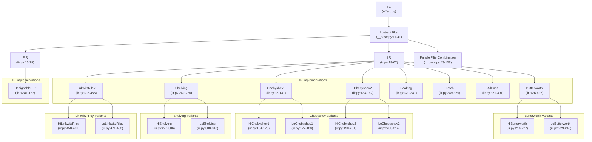
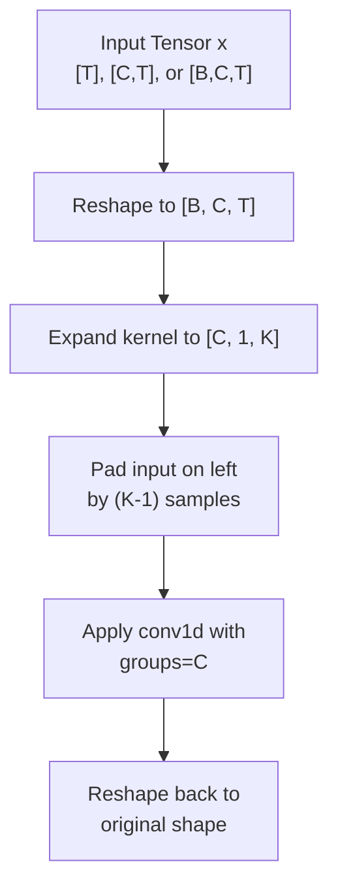
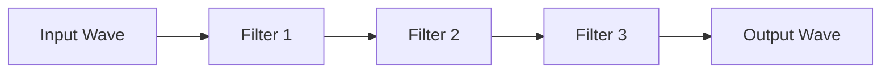
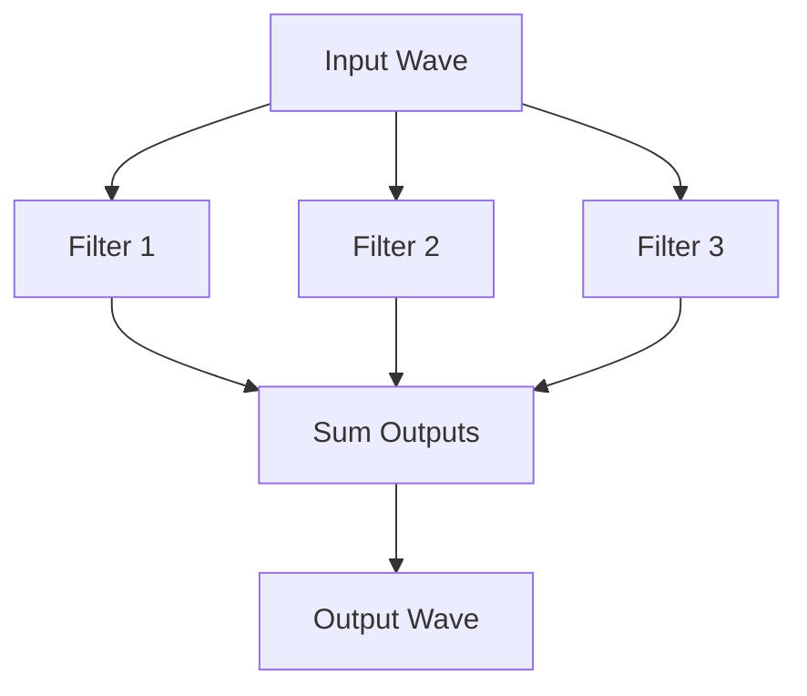
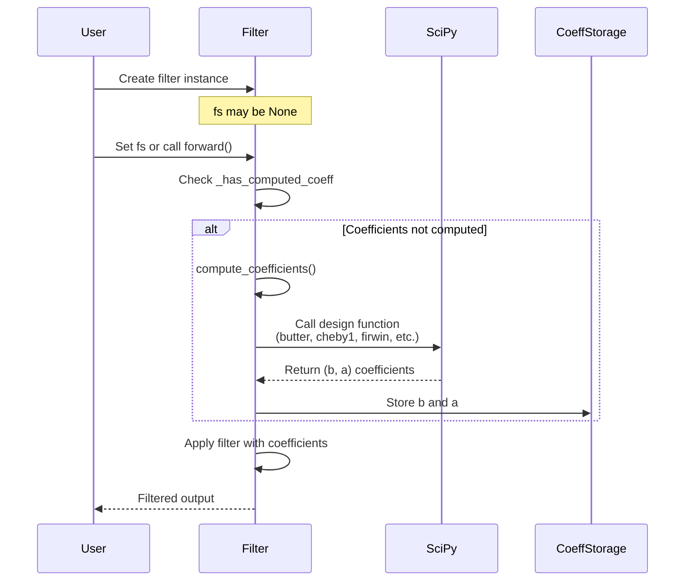
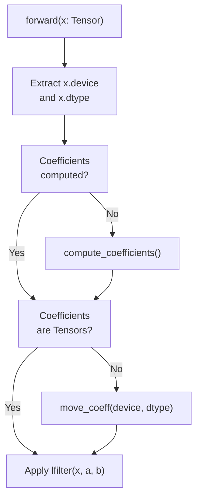

# 8.3 torchfx.filter

# torchfx.filter

<details>
<summary>Relevant source files</summary>

The following files were used as context for generating this wiki page:

- [src/torchfx/filter/__base.py](src/torchfx/filter/__base.py)
- [src/torchfx/filter/fir.py](src/torchfx/filter/fir.py)
- [src/torchfx/filter/iir.py](src/torchfx/filter/iir.py)

</details>


## Purpose and Scope

The `torchfx.filter` module provides frequency-domain audio filtering capabilities for the torchfx library. This module contains implementations of both Infinite Impulse Response (IIR) and Finite Impulse Response (FIR) filters, along with infrastructure for combining filters in series and parallel configurations.

All filter classes inherit from `AbstractFilter`, which itself inherits from the `FX` base class (see [8.2](#8.2) for FX documentation). Filters can be chained using the pipe operator (`|`) for series combinations and the addition operator (`+`) for parallel combinations.

For general information about the FX base class and audio effects, see [8.2](#8.2). For information about the Wave class that filters operate on, see [8.1](#8.1).

**Sources:** [src/torchfx/filter/__base.py:1-108](), [src/torchfx/filter/iir.py:1-20](), [src/torchfx/filter/fir.py:1-15]()

---

## Filter Class Hierarchy

The following diagram illustrates the inheritance structure of all filter classes in the module and maps them to their code locations:



**Sources:** [src/torchfx/filter/__base.py:11-108](), [src/torchfx/filter/iir.py:19-482](), [src/torchfx/filter/fir.py:15-137]()

---

## AbstractFilter

The `AbstractFilter` class is the base class for all filter implementations in torchfx. It inherits from `FX` and provides the interface for filter coefficient computation and parallel filter combination.

### Class Definition

```python
class AbstractFilter(FX, abc.ABC)
```

Defined in: [src/torchfx/filter/__base.py:11-41]()

### Properties

| Property | Type | Description |
|----------|------|-------------|
| `_has_computed_coeff` | `bool` | Read-only property that returns `True` if filter coefficients have been computed |

### Abstract Methods

Subclasses must implement:

- `__init__(*args, **kwargs)` - Constructor
- `compute_coefficients() -> None` - Computes the filter's `a` and `b` coefficients

### Operators

| Operator | Method | Returns | Description |
|----------|--------|---------|-------------|
| `+` | `__add__` | `ParallelFilterCombination` | Combines two filters in parallel |
| `+` | `__radd__` | `ParallelFilterCombination` | Right-hand addition for parallel combination |

### Usage Example

```python
from torchfx import filter as fx_filter

# Create two filters
lowpass = fx_filter.LoButterworth(1000, order=4, fs=44100)
highpass = fx_filter.HiButterworth(200, order=4, fs=44100)

# Combine in parallel using +
parallel_filter = lowpass + highpass
```

**Sources:** [src/torchfx/filter/__base.py:11-41]()

---

## IIR Filter Classes

All IIR filters inherit from the `IIR` base class, which provides common functionality for applying IIR filters using `torchaudio.functional.lfilter`.

### IIR Base Class

The `IIR` class provides the foundation for all IIR filter implementations.

**Class:** `IIR(AbstractFilter)`

Defined in: [src/torchfx/filter/iir.py:19-67]()

#### Attributes

| Attribute | Type | Description |
|-----------|------|-------------|
| `fs` | `int \| None` | Sampling frequency in Hz |
| `cutoff` | `float` | Cutoff frequency in Hz |
| `a` | `Sequence[float] \| Tensor \| None` | Denominator coefficients |
| `b` | `Sequence[float] \| Tensor \| None` | Numerator coefficients |

#### Methods

| Method | Parameters | Returns | Description |
|--------|------------|---------|-------------|
| `move_coeff` | `device: Device, dtype: dtype` | `None` | Moves coefficients to specified device and dtype |
| `forward` | `x: Tensor` | `Tensor` | Applies the filter using `torchaudio.functional.lfilter` |
| `compute_coefficients` | None | `None` | Abstract method to compute filter coefficients |

#### Forward Pass Implementation

The `forward` method [src/torchfx/filter/iir.py:53-66]():
1. Checks that `fs` is not None
2. Computes coefficients if not already computed
3. Moves coefficients to the input tensor's device and dtype
4. Applies the filter using `torchaudio.functional.lfilter`

**Sources:** [src/torchfx/filter/iir.py:19-67]()

### Butterworth Filters

Butterworth filters provide maximally flat frequency response in the passband.

#### Butterworth Base Class

**Class:** `Butterworth(IIR)`

Defined in: [src/torchfx/filter/iir.py:69-96]()

**Constructor Parameters:**

| Parameter | Type | Default | Description |
|-----------|------|---------|-------------|
| `btype` | `str` | Required | Filter type: `"lowpass"`, `"highpass"`, `"bandpass"`, `"bandstop"` |
| `cutoff` | `float` | Required | Cutoff frequency in Hz |
| `order` | `int` | 4 | Filter order |
| `order_scale` | `FilterOrderScale` | `"linear"` | Order scaling: `"linear"` or `"octave"` (divides by 6) |
| `fs` | `int \| None` | None | Sampling frequency |
| `a` | `Sequence[float] \| None` | None | Pre-computed denominator coefficients |
| `b` | `Sequence[float] \| None` | None | Pre-computed numerator coefficients |

**Coefficient Computation:** Uses `scipy.signal.butter` [src/torchfx/filter/iir.py:90-95]()

#### HiButterworth

High-pass Butterworth filter convenience class.

**Class:** `HiButterworth(Butterworth)`

Defined in: [src/torchfx/filter/iir.py:216-227]()

```python
HiButterworth(cutoff, order=5, order_scale="linear", fs=None)
```

Automatically sets `btype="highpass"`.

#### LoButterworth

Low-pass Butterworth filter convenience class.

**Class:** `LoButterworth(Butterworth)`

Defined in: [src/torchfx/filter/iir.py:229-240]()

```python
LoButterworth(cutoff, order=5, order_scale="linear", fs=None)
```

Automatically sets `btype="lowpass"`.

**Sources:** [src/torchfx/filter/iir.py:69-240]()

### Chebyshev Filters

Chebyshev filters trade ripple in the passband (Type 1) or stopband (Type 2) for steeper rolloff.

#### Chebyshev1

**Class:** `Chebyshev1(IIR)`

Defined in: [src/torchfx/filter/iir.py:98-131]()

**Constructor Parameters:**

| Parameter | Type | Default | Description |
|-----------|------|---------|-------------|
| `btype` | `str` | Required | Filter type |
| `cutoff` | `float` | Required | Cutoff frequency in Hz |
| `order` | `int` | 4 | Filter order |
| `ripple` | `float` | 0.1 | Maximum passband ripple in dB |
| `fs` | `int \| None` | None | Sampling frequency |
| `a` | `Sequence[float] \| None` | None | Pre-computed coefficients |
| `b` | `Sequence[float] \| None` | None | Pre-computed coefficients |

**Coefficient Computation:** Uses `scipy.signal.cheby1` [src/torchfx/filter/iir.py:120-130]()

#### Convenience Classes

- `HiChebyshev1(Chebyshev1)` - High-pass Type 1 [src/torchfx/filter/iir.py:164-175]()
- `LoChebyshev1(Chebyshev1)` - Low-pass Type 1 [src/torchfx/filter/iir.py:177-188]()

#### Chebyshev2

**Class:** `Chebyshev2(IIR)`

Defined in: [src/torchfx/filter/iir.py:133-162]()

Similar to Chebyshev1 but with stopband ripple instead of passband ripple.

**Coefficient Computation:** Uses `scipy.signal.cheby2` [src/torchfx/filter/iir.py:151-161]()

#### Convenience Classes

- `HiChebyshev2(Chebyshev2)` - High-pass Type 2 [src/torchfx/filter/iir.py:190-201]()
- `LoChebyshev2(Chebyshev2)` - Low-pass Type 2 [src/torchfx/filter/iir.py:203-214]()

**Sources:** [src/torchfx/filter/iir.py:98-214]()

### Shelving Filters

Shelving filters boost or cut frequencies above (high shelf) or below (low shelf) a cutoff frequency.

#### Shelving Base Class

**Class:** `Shelving(IIR)`

Defined in: [src/torchfx/filter/iir.py:242-270]()

**Constructor Parameters:**

| Parameter | Type | Default | Description |
|-----------|------|---------|-------------|
| `cutoff` | `float` | Required | Cutoff frequency in Hz |
| `q` | `float` | Required | Quality factor |
| `fs` | `int \| None` | None | Sampling frequency |
| `a` | `Sequence[float] \| None` | None | Pre-computed coefficients |
| `b` | `Sequence[float] \| None` | None | Pre-computed coefficients |

**Properties:**
- `_omega` - Angular frequency: `2π * cutoff / fs` [src/torchfx/filter/iir.py:261-265]()
- `_alpha` - Alpha parameter: `sin(omega) / (2 * q)` [src/torchfx/filter/iir.py:267-269]()

#### HiShelving

**Class:** `HiShelving(Shelving)`

Defined in: [src/torchfx/filter/iir.py:272-306]()

High-pass shelving filter with gain control.

**Additional Parameters:**

| Parameter | Type | Default | Description |
|-----------|------|---------|-------------|
| `gain` | `float` | Required | Linear gain or dB gain depending on `gain_scale` |
| `gain_scale` | `FilterOrderScale` | `"linear"` | `"linear"` or `"octave"` (converts dB to linear) |

**Coefficient Computation:** Uses Audio EQ Cookbook formulas [src/torchfx/filter/iir.py:291-305]()

#### LoShelving

**Class:** `LoShelving(Shelving)`

Defined in: [src/torchfx/filter/iir.py:308-318]()

Low-pass shelving filter. **Note:** Currently a placeholder implementation that does not perform filtering.

**Sources:** [src/torchfx/filter/iir.py:242-318]()

### Peaking Filter

Peaking filters boost or cut a narrow band of frequencies around a center frequency.

**Class:** `Peaking(IIR)`

Defined in: [src/torchfx/filter/iir.py:320-347]()

**Constructor Parameters:**

| Parameter | Type | Default | Description |
|-----------|------|---------|-------------|
| `cutoff` | `float` | Required | Center frequency in Hz |
| `Q` | `float` | Required | Quality factor (bandwidth) |
| `gain` | `float` | Required | Linear gain or dB gain depending on `gain_scale` |
| `gain_scale` | `FilterOrderScale` | Required | `"linear"` or `"octave"` |
| `fs` | `int \| None` | None | Sampling frequency |
| `a` | `Sequence[float] \| None` | None | Pre-computed coefficients |
| `b` | `Sequence[float] \| None` | None | Pre-computed coefficients |

**Coefficient Computation:** Uses `scipy.signal.iirpeak` [src/torchfx/filter/iir.py:341-346]()

**Sources:** [src/torchfx/filter/iir.py:320-347]()

### Notch Filter

Notch filters attenuate a narrow band of frequencies around a center frequency.

**Class:** `Notch(IIR)`

Defined in: [src/torchfx/filter/iir.py:349-369]()

**Constructor Parameters:**

| Parameter | Type | Default | Description |
|-----------|------|---------|-------------|
| `cutoff` | `float` | Required | Notch frequency in Hz |
| `Q` | `float` | Required | Quality factor (notch width) |
| `fs` | `int \| None` | None | Sampling frequency |

**Coefficient Computation:** Uses `scipy.signal.iirnotch` [src/torchfx/filter/iir.py:363-368]()

**Sources:** [src/torchfx/filter/iir.py:349-369]()

### AllPass Filter

All-pass filters pass all frequencies with equal gain but introduce frequency-dependent phase shift.

**Class:** `AllPass(IIR)`

Defined in: [src/torchfx/filter/iir.py:371-391]()

**Constructor Parameters:**

| Parameter | Type | Default | Description |
|-----------|------|---------|-------------|
| `cutoff` | `float` | Required | Center frequency in Hz |
| `Q` | `float` | Required | Quality factor |
| `fs` | `int \| None` | None | Sampling frequency |

**Coefficient Computation:** Uses `scipy.signal.iirpeak` [src/torchfx/filter/iir.py:385-390]()

**Sources:** [src/torchfx/filter/iir.py:371-391]()

### Linkwitz-Riley Filters

Linkwitz-Riley filters are created by cascading two identical Butterworth filters, resulting in -6 dB gain at the cutoff frequency. The order must be an even integer.

#### LinkwitzRiley Base Class

**Class:** `LinkwitzRiley(IIR)`

Defined in: [src/torchfx/filter/iir.py:393-456]()

**Constructor Parameters:**

| Parameter | Type | Default | Description |
|-----------|------|---------|-------------|
| `btype` | `str` | Required | Filter type: `"lowpass"` or `"highpass"` |
| `cutoff` | `float` | Required | Cutoff frequency in Hz |
| `order` | `int` | 4 | Filter order (must be positive and even) |
| `order_scale` | `FilterOrderScale` | `"linear"` | Order scaling |
| `fs` | `int \| None` | None | Sampling frequency |

**Coefficient Computation:** [src/torchfx/filter/iir.py:437-455]()
1. Creates Butterworth filter of half the specified order
2. Cascades it with itself by convolving the coefficients

#### Convenience Classes

- `HiLinkwitzRiley(LinkwitzRiley)` - High-pass [src/torchfx/filter/iir.py:458-469]()
- `LoLinkwitzRiley(LinkwitzRiley)` - Low-pass [src/torchfx/filter/iir.py:471-482]()

**Sources:** [src/torchfx/filter/iir.py:393-482]()

---

## FIR Filter Classes

FIR (Finite Impulse Response) filters have no feedback and are always stable. They are implemented using efficient convolution operations.

### FIR Base Class

**Class:** `FIR(AbstractFilter)`

Defined in: [src/torchfx/filter/fir.py:15-79]()

The `FIR` class implements efficient FIR filtering using PyTorch's `conv1d` operation. It supports inputs of shape `[T]`, `[C, T]`, or `[B, C, T]`.

**Constructor Parameters:**

| Parameter | Type | Description |
|-----------|------|-------------|
| `b` | `ArrayLike` | Filter coefficients (numerator) |

#### Implementation Details

The filter implementation [src/torchfx/filter/fir.py:22-78]():

1. Flips the kernel for causal convolution (compatible with `scipy.signal.lfilter`)
2. Stores kernel as a buffer with shape `[1, 1, K]`
3. The denominator `a` is always `[1.0]` for FIR filters

#### Forward Pass

The `forward` method [src/torchfx/filter/fir.py:36-78]():



**Processing Steps:**
1. Converts input to device and dtype
2. Reshapes input to `[B, C, T]` format
3. Expands kernel to match number of channels
4. Pads input on the left to maintain original length
5. Applies grouped convolution
6. Reshapes back to original input shape

**Sources:** [src/torchfx/filter/fir.py:15-79]()

### DesignableFIR

**Class:** `DesignableFIR(FIR)`

Defined in: [src/torchfx/filter/fir.py:81-137]()

A FIR filter that designs its coefficients using `scipy.signal.firwin`. This allows specification of filter characteristics rather than explicit coefficients.

**Constructor Parameters:**

| Parameter | Type | Default | Description |
|-----------|------|---------|-------------|
| `cutoff` | `float \| Sequence[float]` | Required | Cutoff frequency(ies) in Hz |
| `num_taps` | `int` | Required | Number of taps (filter order) |
| `fs` | `int \| None` | None | Sampling frequency in Hz |
| `pass_zero` | `bool` | True | If True: lowpass, if False: highpass |
| `window` | `WindowType` | `"hamming"` | Window type for design |

#### Attributes

| Attribute | Type | Description |
|-----------|------|-------------|
| `cutoff` | `float \| Sequence[float]` | Cutoff frequency(ies) |
| `num_taps` | `int` | Filter order |
| `fs` | `int \| None` | Sampling frequency |
| `pass_zero` | `bool` | Lowpass (True) or highpass (False) |
| `window` | `WindowType` | Window type |
| `b` | `ArrayLike \| None` | Computed filter coefficients |

#### Coefficient Computation

The `compute_coefficients` method [src/torchfx/filter/fir.py:123-136]():
1. Requires that `fs` is not None
2. Calls `scipy.signal.firwin` with the specified parameters
3. Initializes the parent `FIR` class with the computed coefficients

**Sources:** [src/torchfx/filter/fir.py:81-137]()

---

## ParallelFilterCombination

The `ParallelFilterCombination` class combines multiple filters in parallel, summing their outputs.

**Class:** `ParallelFilterCombination(AbstractFilter)`

Defined in: [src/torchfx/filter/__base.py:43-108]()

### Constructor

```python
ParallelFilterCombination(*filters: AbstractFilter, fs: int | None = None)
```

**Parameters:**

| Parameter | Type | Description |
|-----------|------|-------------|
| `*filters` | `AbstractFilter` | Variable number of filters to combine |
| `fs` | `int \| None` | Optional sampling frequency to set on all filters |

### Attributes

| Attribute | Type | Description |
|-----------|------|-------------|
| `filters` | `Sequence[AbstractFilter]` | Tuple of filters being combined |
| `fs` | `int \| None` | Sampling frequency (propagated to all filters) |

### Properties

The `_has_computed_coeff` property [src/torchfx/filter/__base.py:70-72]() returns `True` only if all filters have computed their coefficients.

### Sampling Frequency Propagation

The `fs` setter [src/torchfx/filter/__base.py:87-93]() automatically propagates the sampling frequency to all child filters that have an `fs` attribute and haven't already set it.

### Methods

#### compute_coefficients

```python
def compute_coefficients(self) -> None
```

Calls `compute_coefficients()` on all child filters [src/torchfx/filter/__base.py:96-98]().

#### forward

```python
def forward(self, x: Tensor) -> Tensor
```

The forward pass [src/torchfx/filter/__base.py:101-107]():
1. Applies each filter to the input independently
2. Sums all outputs element-wise
3. Returns the combined result

### Usage Example

```python
from torchfx import filter as fx_filter

# Create filters
lowpass = fx_filter.LoButterworth(1000, order=2)
highpass = fx_filter.HiButterworth(200, order=2)

# Combine in parallel
combined = lowpass + highpass

# Can also use constructor
combined = fx_filter.ParallelFilterCombination(lowpass, highpass, fs=44100)
```

**Sources:** [src/torchfx/filter/__base.py:43-108]()

---

## Filter Combination Patterns

Filters can be combined in two ways: series (sequential) and parallel.

### Series Combination

Filters are chained using the pipe operator (`|`), applying each filter sequentially to the output of the previous filter.



**Example:**

```python
from torchfx import Wave, filter as fx_filter

wave = Wave.from_file("audio.wav")

# Series combination using pipe operator
result = wave | fx_filter.HiButterworth(80, order=4, fs=wave.fs) \
              | fx_filter.LoButterworth(8000, order=4, fs=wave.fs)
```

### Parallel Combination

Filters are combined using the addition operator (`+`), applying all filters independently and summing their outputs.



**Example:**

```python
from torchfx import Wave, filter as fx_filter

wave = Wave.from_file("audio.wav")

# Parallel combination using + operator
lowpass = fx_filter.LoButterworth(1000, order=2, fs=wave.fs)
highpass = fx_filter.HiButterworth(200, order=2, fs=wave.fs)
parallel_filter = lowpass + highpass

result = wave | parallel_filter
```

### Combined Series and Parallel

Filters can be combined in complex topologies by mixing series and parallel operations:

```python
from torchfx import Wave, filter as fx_filter

wave = Wave.from_file("audio.wav")
fs = wave.fs

# Create individual filters
lo1 = fx_filter.LoButterworth(1000, order=4, fs=fs)
hi1 = fx_filter.HiButterworth(200, order=4, fs=fs)
peak = fx_filter.Peaking(500, Q=2.0, gain=6.0, gain_scale="octave", fs=fs)

# Combine: (lo1 + hi1) | peak
result = wave | (lo1 + hi1) | peak
```

**Sources:** [src/torchfx/filter/__base.py:34-40](), [src/torchfx/filter/__base.py:43-108]()

---

## Filter Coefficient Computation

All filters must compute their transfer function coefficients before processing audio. This is handled through the `compute_coefficients` method.

### Computation Flow



### Lazy Computation

Filter coefficients are computed lazily [src/torchfx/filter/iir.py:60-61]():
- If `fs` is provided at construction, coefficients may be computed immediately
- If `fs` is None, computation is deferred until the first `forward()` call
- The `_has_computed_coeff` property checks if coefficients exist [src/torchfx/filter/__base.py:19-23]()

### SciPy Functions Used

| Filter Type | SciPy Function | Location |
|-------------|----------------|----------|
| Butterworth | `scipy.signal.butter` | [iir.py:93]() |
| Chebyshev1 | `scipy.signal.cheby1` | [iir.py:123-128]() |
| Chebyshev2 | `scipy.signal.cheby2` | [iir.py:154-159]() |
| Peaking | `scipy.signal.iirpeak` | [iir.py:344]() |
| Notch | `scipy.signal.iirnotch` | [iir.py:366]() |
| FIR | `scipy.signal.firwin` | [fir.py:126-132]() |
| Shelving | Audio EQ Cookbook formulas | [iir.py:291-305]() |
| Linkwitz-Riley | Butterworth cascade | [iir.py:448-455]() |

**Sources:** [src/torchfx/filter/__base.py:19-32](), [src/torchfx/filter/iir.py:53-66](), [src/torchfx/filter/iir.py:90-95](), [src/torchfx/filter/fir.py:123-136]()

---

## Device and Dtype Handling

Filters automatically adapt to the device and dtype of their input tensors.

### IIR Filter Device Management



**IIR Implementation:** [src/torchfx/filter/iir.py:53-66]()
- Extracts device and dtype from input tensor
- Computes coefficients if needed
- Converts coefficients to tensors and moves to the correct device
- Applies `torchaudio.functional.lfilter`

### FIR Filter Device Management

**FIR Implementation:** [src/torchfx/filter/fir.py:38-40]()
- Stored kernel buffer is moved to input device and dtype
- Convolution operation automatically uses the correct device

### Manual Coefficient Movement

For IIR filters, you can manually move coefficients using the `move_coeff` method [src/torchfx/filter/iir.py:47-50]():

```python
filter = fx_filter.HiButterworth(1000, order=4, fs=44100)
filter.compute_coefficients()
filter.move_coeff(device="cuda", dtype=torch.float32)
```

**Sources:** [src/torchfx/filter/iir.py:47-66](), [src/torchfx/filter/fir.py:36-41]()

---

## Type System Integration

The filter module uses type aliases from the `torchfx.typing` module for consistent parameter specification.

### Type Aliases Used

| Type Alias | Definition | Usage |
|------------|------------|-------|
| `Device` | `str \| torch.device` | Device specification for coefficient storage |
| `FilterOrderScale` | `Literal["linear", "octave"]` | Order/gain scaling mode |
| `WindowType` | Various string literals | FIR window type specification |

For complete type definitions, see [8.4](#8.4).

### FilterOrderScale Behavior

The `FilterOrderScale` type affects parameter interpretation:

**Order Scaling:**
- `"linear"`: Use order value directly
- `"octave"`: Divide order by 6 [src/torchfx/filter/iir.py:85]()

**Gain Scaling:**
- `"linear"`: Use gain value directly
- `"octave"`: Convert from dB: `10 ** (gain / 20)` [src/torchfx/filter/iir.py:288]()

**Sources:** [src/torchfx/filter/iir.py:14](), [src/torchfx/filter/fir.py:12](), [src/torchfx/filter/iir.py:85-88](), [src/torchfx/filter/iir.py:288]()

---

## Complete Filter Class Reference Table

| Class | Type | Key Parameters | Location |
|-------|------|----------------|----------|
| `AbstractFilter` | Base | N/A | [__base.py:11-41]() |
| `ParallelFilterCombination` | Parallel | `*filters`, `fs` | [__base.py:43-108]() |
| `IIR` | Base | `fs` | [iir.py:19-67]() |
| `Butterworth` | IIR | `btype`, `cutoff`, `order`, `fs` | [iir.py:69-96]() |
| `HiButterworth` | IIR | `cutoff`, `order`, `fs` | [iir.py:216-227]() |
| `LoButterworth` | IIR | `cutoff`, `order`, `fs` | [iir.py:229-240]() |
| `Chebyshev1` | IIR | `btype`, `cutoff`, `order`, `ripple`, `fs` | [iir.py:98-131]() |
| `HiChebyshev1` | IIR | `cutoff`, `order`, `ripple`, `fs` | [iir.py:164-175]() |
| `LoChebyshev1` | IIR | `cutoff`, `order`, `ripple`, `fs` | [iir.py:177-188]() |
| `Chebyshev2` | IIR | `btype`, `cutoff`, `order`, `ripple`, `fs` | [iir.py:133-162]() |
| `HiChebyshev2` | IIR | `cutoff`, `order`, `ripple`, `fs` | [iir.py:190-201]() |
| `LoChebyshev2` | IIR | `cutoff`, `order`, `ripple`, `fs` | [iir.py:203-214]() |
| `Shelving` | IIR | `cutoff`, `q`, `fs` | [iir.py:242-270]() |
| `HiShelving` | IIR | `cutoff`, `q`, `gain`, `gain_scale`, `fs` | [iir.py:272-306]() |
| `LoShelving` | IIR | `cutoff`, `q`, `fs` | [iir.py:308-318]() |
| `Peaking` | IIR | `cutoff`, `Q`, `gain`, `gain_scale`, `fs` | [iir.py:320-347]() |
| `Notch` | IIR | `cutoff`, `Q`, `fs` | [iir.py:349-369]() |
| `AllPass` | IIR | `cutoff`, `Q`, `fs` | [iir.py:371-391]() |
| `LinkwitzRiley` | IIR | `btype`, `cutoff`, `order`, `fs` | [iir.py:393-456]() |
| `HiLinkwitzRiley` | IIR | `cutoff`, `order`, `fs` | [iir.py:458-469]() |
| `LoLinkwitzRiley` | IIR | `cutoff`, `order`, `fs` | [iir.py:471-482]() |
| `FIR` | FIR | `b` | [fir.py:15-79]() |
| `DesignableFIR` | FIR | `cutoff`, `num_taps`, `fs`, `pass_zero`, `window` | [fir.py:81-137]() |

**Sources:** [src/torchfx/filter/__base.py:1-108](), [src/torchfx/filter/iir.py:1-482](), [src/torchfx/filter/fir.py:1-137]()