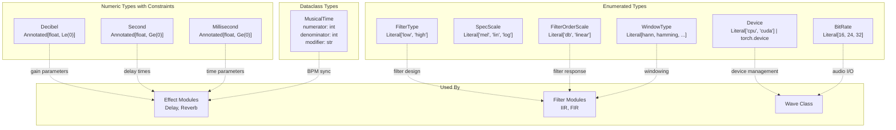
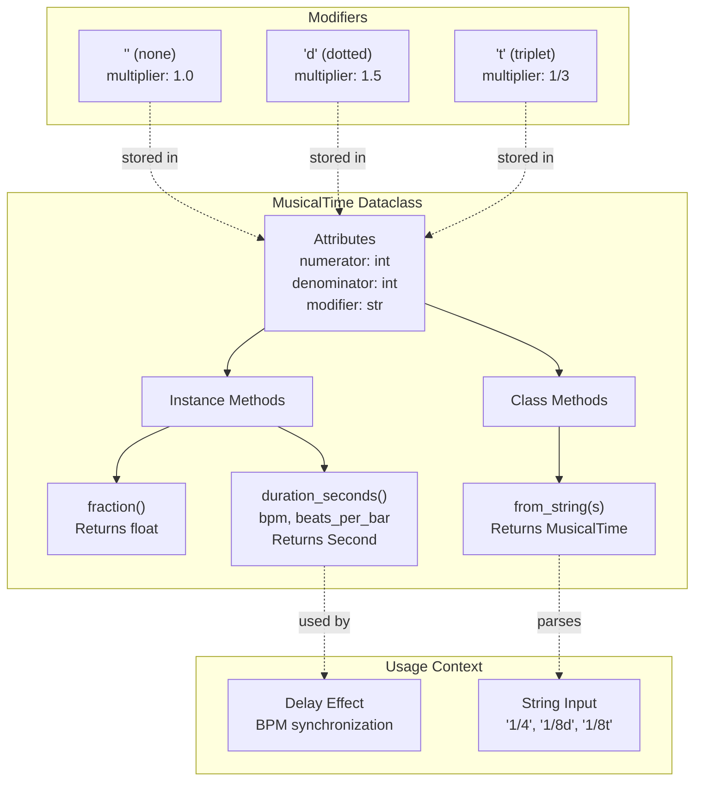
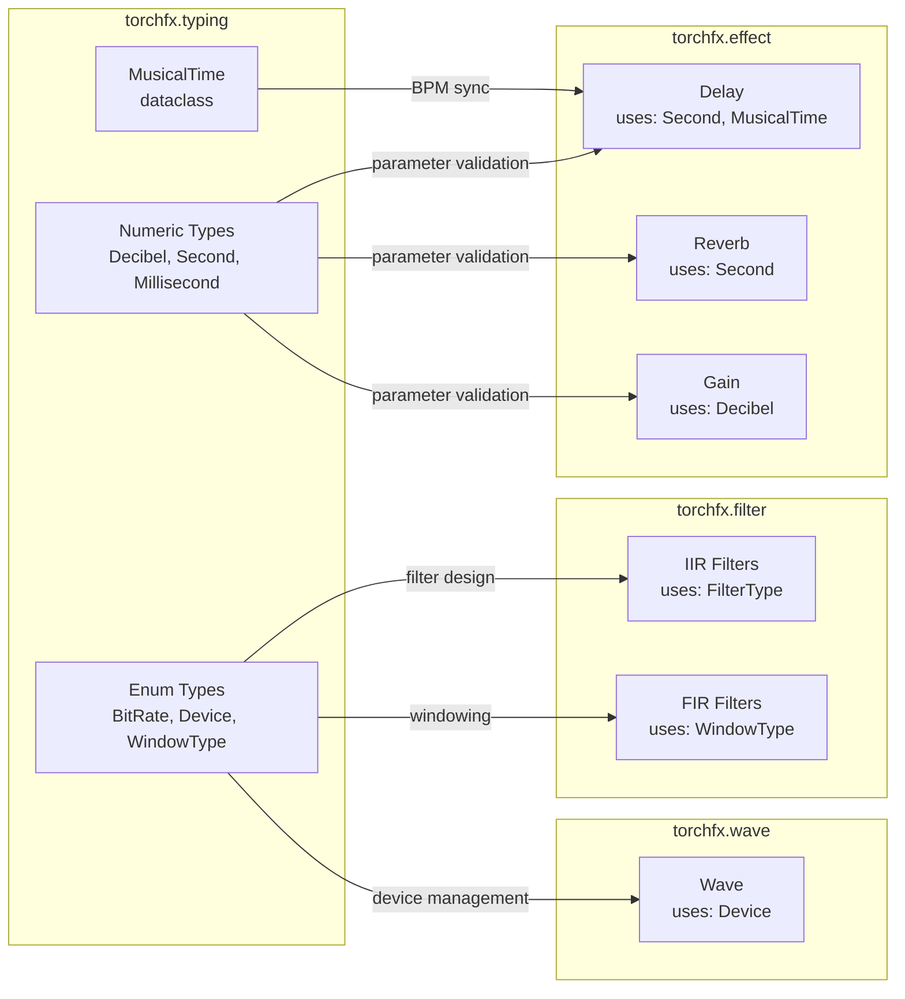

# 8.4 torchfx.typing

# torchfx.typing

<details>
<summary>Relevant source files</summary>

The following files were used as context for generating this wiki page:

- [.gitignore](.gitignore)
- [.vscode/settings.json](.vscode/settings.json)
- [docs/source/api.rst](docs/source/api.rst)
- [src/torchfx/typing.py](src/torchfx/typing.py)

</details>


## Purpose and Scope

The `torchfx.typing` module provides type definitions and constraints used throughout the torchfx library. It defines type aliases for audio parameters with runtime validation constraints, literal types for enumerated values, and the `MusicalTime` dataclass for BPM-synchronized time representations.

For information about how these types are used in effects, see [Effects](#3). For filter-specific type usage, see [torchfx.filter](#8.3). For the core `Wave` and `FX` classes that use these types, see [torchfx.Wave](#8.1) and [torchfx.FX and Effects](#8.2).

**Sources**: [src/torchfx/typing.py:1-159]()

---

## Type System Overview

The module defines three categories of types: numeric types with constraints, enumerated literal types, and the `MusicalTime` dataclass for musical timing.



**Sources**: [src/torchfx/typing.py:1-159]()

---

## Numeric Type Aliases

### Decibel

```python
Decibel = tp.Annotated[float, Le(0)]
```

Represents decibel values, constrained to be less than or equal to 0. Used for gain parameters that are expected to attenuate or maintain signal level without amplification.

| Property | Value |
|----------|-------|
| Base Type | `float` |
| Constraint | `Le(0)` (less than or equal to 0) |
| Typical Use | Gain attenuation parameters |

**Sources**: [src/torchfx/typing.py:10]()

### Millisecond

```python
Millisecond = tp.Annotated[float, Ge(0)]
```

Represents time durations in milliseconds, constrained to non-negative values.

| Property | Value |
|----------|-------|
| Base Type | `float` |
| Constraint | `Ge(0)` (greater than or equal to 0) |
| Typical Use | Short time durations |

**Sources**: [src/torchfx/typing.py:11]()

### Second

```python
Second = tp.Annotated[float, Ge(0)]
```

Represents time durations in seconds, constrained to non-negative values. Used throughout the library for delay times, reverb parameters, and other time-based effects.

| Property | Value |
|----------|-------|
| Base Type | `float` |
| Constraint | `Ge(0)` (greater than or equal to 0) |
| Typical Use | Delay times, reverb duration, time-based parameters |

**Sources**: [src/torchfx/typing.py:12]()

---

## Audio Parameter Types

### BitRate

```python
BitRate = tp.Literal[16, 24, 32]
```

Represents supported bit depths for audio data. Restricts values to common audio bit rates.

**Valid Values**: `16`, `24`, `32`

**Sources**: [src/torchfx/typing.py:13]()

### SpecScale

```python
SpecScale = tp.Literal["mel", "lin", "log"]
```

Specifies the scale type for spectrogram computation.

| Value | Description |
|-------|-------------|
| `"mel"` | Mel scale (perceptually-spaced frequency bins) |
| `"lin"` | Linear scale (equally-spaced frequency bins) |
| `"log"` | Logarithmic scale |

**Sources**: [src/torchfx/typing.py:17]()

---

## Filter Types

### FilterType

```python
FilterType = tp.Literal["low", "high"]
```

Specifies basic filter types for frequency-domain filtering.

| Value | Description |
|-------|-------------|
| `"low"` | Low-pass filter |
| `"high"` | High-pass filter |

**Sources**: [src/torchfx/typing.py:21]()

### FilterOrderScale

```python
FilterOrderScale = tp.Literal["db", "linear"]
```

Specifies the scale for filter order or response measurements.

| Value | Description |
|-------|-------------|
| `"db"` | Decibel scale |
| `"linear"` | Linear scale |

**Sources**: [src/torchfx/typing.py:25]()

---

## Device Type

```python
Device = tp.Literal["cpu", "cuda"] | torch.device
```

Represents compute device specifications for PyTorch operations. Accepts either string literals or `torch.device` objects.

| Value | Description |
|-------|-------------|
| `"cpu"` | CPU device |
| `"cuda"` | First available CUDA device |
| `torch.device` | Any PyTorch device object |

**Sources**: [src/torchfx/typing.py:30]()

---

## Window Types

```python
WindowType = tp.Literal[
    "hann", "hamming", "blackman", "kaiser", "boxcar",
    "bartlett", "flattop", "parzen", "bohman", "nuttall", "barthann"
]
```

Specifies window functions for signal processing operations. These window types correspond to functions available in `scipy.signal.get_window`.

| Window Type | Description |
|-------------|-------------|
| `"hann"` | Hann window (raised cosine) |
| `"hamming"` | Hamming window |
| `"blackman"` | Blackman window |
| `"kaiser"` | Kaiser window (adjustable parameter) |
| `"boxcar"` | Rectangular window |
| `"bartlett"` | Bartlett (triangular) window |
| `"flattop"` | Flat top window |
| `"parzen"` | Parzen window |
| `"bohman"` | Bohman window |
| `"nuttall"` | Nuttall window |
| `"barthann"` | Barthann window |

**Sources**: [src/torchfx/typing.py:34-46]()

---

## MusicalTime Class

The `MusicalTime` dataclass represents musical time durations as fractions of a bar (measure), enabling BPM-synchronized delay effects and other tempo-based processing.



**Sources**: [src/torchfx/typing.py:49-159]()

### Class Definition

```python
@dataclass(frozen=True)
class MusicalTime:
    numerator: int
    denominator: int
    modifier: str = ""
```

The class is frozen (immutable) to ensure musical time values cannot be accidentally modified after creation.

**Sources**: [src/torchfx/typing.py:49-71]()

### Attributes

| Attribute | Type | Description |
|-----------|------|-------------|
| `numerator` | `int` | Numerator of the time fraction (e.g., 1 in "1/4") |
| `denominator` | `int` | Denominator of the time fraction (e.g., 4 in "1/4") |
| `modifier` | `str` | Optional modifier: `""` (none), `"d"` (dotted), `"t"` (triplet). Default: `""` |

**Sources**: [src/torchfx/typing.py:59-71]()

### Modifier Values

The class maintains a mapping of modifiers to their multiplicative coefficients:

| Modifier | Coefficient | Description |
|----------|-------------|-------------|
| `""` | `1.0` | No modification |
| `"d"` | `1.5` | Dotted note (extends duration by 50%) |
| `"t"` | `1/3` | Triplet (divides duration into thirds) |

**Sources**: [src/torchfx/typing.py:73-77]()

### Methods

#### fraction()

```python
def fraction(self) -> float
```

Computes the duration as a fraction of a bar, accounting for the modifier.

**Returns**: `float` - The duration as a fraction of a bar (e.g., 0.25 for 1/4, 0.125 for 1/8)

**Raises**: `ValueError` if the modifier is invalid

**Examples**:
- `MusicalTime(1, 4).fraction()` → `0.25` (quarter note)
- `MusicalTime(1, 8, "d").fraction()` → `0.1875` (dotted eighth: 1/8 * 1.5)
- `MusicalTime(1, 8, "t").fraction()` → `0.04167` (eighth triplet: 1/8 * 1/3)

**Sources**: [src/torchfx/typing.py:79-99]()

#### duration_seconds()

```python
def duration_seconds(self, bpm: float, beats_per_bar: int = 4) -> Second
```

Converts the musical time to an absolute duration in seconds based on tempo.

**Parameters**:
- `bpm` (`float`): Beats per minute (must be positive)
- `beats_per_bar` (`int`, optional): Number of beats in one bar. Default: 4 (for 4/4 time)

**Returns**: `Second` - Duration in seconds

**Raises**: `AssertionError` if BPM is not positive

**Calculation**:
1. Compute beat duration: `60.0 / bpm`
2. Compute bar duration: `beat_duration * beats_per_bar`
3. Return: `fraction() * bar_duration`

**Examples**:
- At 120 BPM in 4/4 time:
  - `MusicalTime(1, 4).duration_seconds(120)` → `0.5` seconds (quarter note)
  - `MusicalTime(1, 8).duration_seconds(120)` → `0.25` seconds (eighth note)

**Sources**: [src/torchfx/typing.py:101-128]()

#### from_string() (classmethod)

```python
@classmethod
def from_string(cls, s: str) -> "MusicalTime"
```

Creates a `MusicalTime` instance from string notation.

**Parameters**:
- `s` (`str`): Musical time string (e.g., `"1/4"`, `"1/8d"`, `"1/8t"`)

**Format**: `numerator/denominator[modifier]` where modifier is optional (`"d"` for dotted, `"t"` for triplet)

**Returns**: `MusicalTime` - New instance parsed from the string

**Raises**: `ValueError` if the string format is invalid

**Examples**:
```python
MusicalTime.from_string("1/4")    # Quarter note
MusicalTime.from_string("1/8d")   # Dotted eighth
MusicalTime.from_string("1/8t")   # Eighth triplet
MusicalTime.from_string("3/16")   # Three sixteenths
```

**Sources**: [src/torchfx/typing.py:130-158]()

---

## Type System Integration

The following diagram shows how the typing module integrates with the rest of the torchfx codebase:



**Sources**: [src/torchfx/typing.py:1-159]()

---

## Usage Examples

### Using Type Annotations

The type aliases provide documentation and validation for function signatures:

```python
def apply_gain(signal: torch.Tensor, gain_db: Decibel) -> torch.Tensor:
    """Apply gain in decibels (must be <= 0 for attenuation)"""
    pass

def create_delay(delay_time: Second, feedback: float = 0.5) -> FX:
    """Create delay effect with time in seconds (must be >= 0)"""
    pass
```

### Working with MusicalTime

The `MusicalTime` class enables musical time calculations:

```python
# Create from components
quarter_note = MusicalTime(1, 4)
dotted_eighth = MusicalTime(1, 8, "d")

# Create from string notation
time = MusicalTime.from_string("1/4")
time = MusicalTime.from_string("1/8t")  # Eighth triplet

# Calculate bar fraction
quarter_note.fraction()  # 0.25

# Convert to seconds
bpm = 120
duration = quarter_note.duration_seconds(bpm)  # 0.5 seconds at 120 BPM

# With different time signature
duration = quarter_note.duration_seconds(bpm, beats_per_bar=3)  # 3/4 time
```

### Device Type Usage

The `Device` type accepts multiple formats:

```python
import torch

# String literals
wave.to("cpu")
wave.to("cuda")

# torch.device objects
device = torch.device("cuda:0")
wave.to(device)
```

**Sources**: [src/torchfx/typing.py:1-159]()