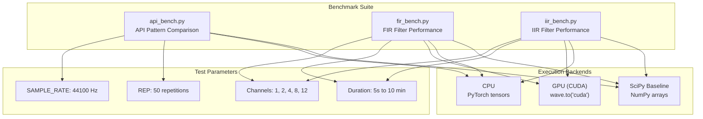
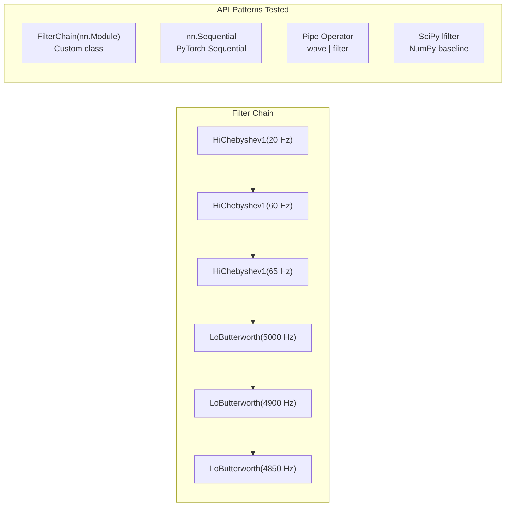
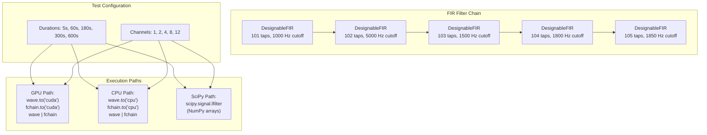
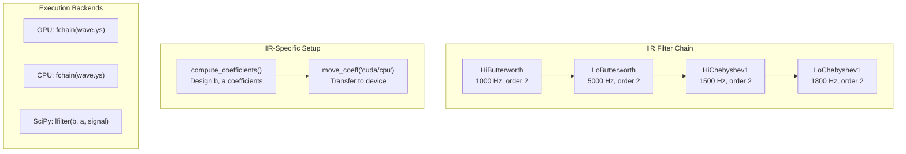
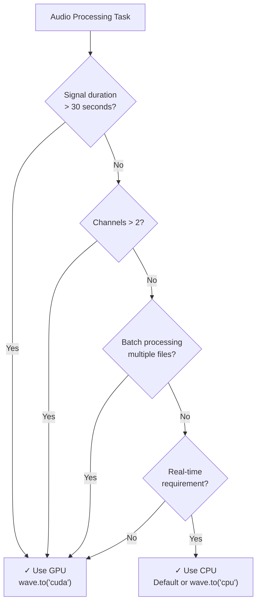

# 9 Performance

# Performance

<details>
<summary>Relevant source files</summary>

The following files were used as context for generating this wiki page:

- [benchmark/api_bench.py](benchmark/api_bench.py)
- [benchmark/fir_bench.py](benchmark/fir_bench.py)
- [benchmark/iir_bench.py](benchmark/iir_bench.py)

</details>


This page documents the performance characteristics of torchfx, including benchmarking methodologies, comparative results between GPU and CPU execution, and optimization guidelines for achieving optimal throughput in audio processing pipelines.

For information about using GPU acceleration in your code, see [GPU Acceleration](#5.2). For details on the benchmarking infrastructure and how to run benchmarks yourself, see [Benchmarking](#7.5).

---

## Benchmark Methodology

The torchfx library includes a comprehensive benchmarking suite that compares performance across three dimensions: API ergonomics, filter types (FIR vs IIR), and execution backends (GPU, CPU, and SciPy baseline).



**Sources**: [benchmark/api_bench.py:11-15](), [benchmark/fir_bench.py:10-11](), [benchmark/iir_bench.py:10-11]()

### Test Signal Generation

All benchmarks use the same signal generation methodology defined in the `create_audio` function. Signals are:
- Multi-channel random noise (`np.random.randn`)
- Float32 precision
- Normalized to [-1, 1] range per channel
- Variable channel counts (1, 2, 4, 8, 12) and durations (5s to 10 minutes)

**Sources**: [benchmark/api_bench.py:19-24](), [benchmark/fir_bench.py:14-19](), [benchmark/iir_bench.py:14-19]()

### Timing Methodology

Benchmarks use Python's `timeit.timeit` with 50 repetitions (`REP = 50`) to measure execution time. Results are averaged and reported per iteration. This approach minimizes timing variance and accounts for warm-up effects.

**Sources**: [benchmark/api_bench.py:100-103](), [benchmark/fir_bench.py:62](), [benchmark/iir_bench.py:61]()

---

## API Performance Comparison

The `api_bench.py` benchmark compares four different approaches to applying a chain of six filters (3 high-pass Chebyshev, 3 low-pass Butterworth) to an 8-channel, 2-minute audio signal.



**Sources**: [benchmark/api_bench.py:28-46](), [benchmark/api_bench.py:53-63](), [benchmark/api_bench.py:65-74](), [benchmark/api_bench.py:77-91]()

### API Implementations

| API Pattern | Implementation | Filter Instantiation | Sample Rate Handling |
|-------------|---------------|---------------------|---------------------|
| `FilterChain` | Custom `nn.Module` subclass | In `__init__`, requires `fs` | Explicit `fs=fs` parameter |
| `nn.Sequential` | PyTorch's Sequential container | Inline, requires `fs` | Explicit `fs=signal.fs` |
| Pipe Operator | `wave \| filter` chaining | Inline, no `fs` needed | Auto-configured from Wave |
| SciPy Baseline | `scipy.signal.lfilter` | Pre-computed coefficients | Explicit `fs=SAMPLE_RATE` |

**Key Observations**:
1. The **pipe operator** automatically configures the sample rate from the `Wave` object, eliminating a common source of configuration errors
2. `FilterChain` and `nn.Sequential` have identical performance characteristics (both use `nn.Module` forwarding)
3. The pipe operator incurs minimal overhead for automatic configuration

**Sources**: [benchmark/api_bench.py:28-50](), [benchmark/api_bench.py:53-63](), [benchmark/api_bench.py:65-74]()

### Sample Rate Auto-Configuration

The pipe operator's key advantage is automatic sample rate propagation:

```python
# Manual configuration (FilterChain, Sequential)
HiChebyshev1(20, fs=signal.fs)  # Must specify fs explicitly

# Auto-configuration (Pipe)
signal | HiChebyshev1(20)  # fs inferred from Wave object
```

This is implemented through the `Wave.__or__` method, which configures filters before applying them.

**Sources**: [benchmark/api_bench.py:65-74]()

---

## FIR Filter Performance

The `fir_bench.py` benchmark evaluates FIR filter performance across different signal durations, channel counts, and execution backends.



**Sources**: [benchmark/fir_bench.py:40-79]()

### FIR Coefficient Computation

FIR filters require coefficient computation before first use. The benchmark explicitly calls `compute_coefficients()` to ensure this happens before timing:

```python
fchain = nn.Sequential(
    DesignableFIR(num_taps=101, cutoff=1000, fs=SAMPLE_RATE),
    # ... more filters
)

for f in fchain:
    f.compute_coefficients()  # Pre-compute before timing
```

This ensures timing measurements reflect only the filtering operation, not coefficient design.

**Sources**: [benchmark/fir_bench.py:49-59]()

### Device Transfer Pattern

The benchmark demonstrates proper device management:

1. **GPU benchmarking**: Transfer wave and filter chain to CUDA
   ```python
   wave.to("cuda")
   fchain.to("cuda")
   gpu_fir_time = timeit.timeit(lambda: gpu_fir(wave, fchain), number=REP)
   ```

2. **CPU benchmarking**: Transfer back to CPU
   ```python
   wave.to("cpu")
   fchain.to("cpu")
   cpu_fir_time = timeit.timeit(lambda: cpu_fir(wave, fchain), number=REP)
   ```

**Sources**: [benchmark/fir_bench.py:60-66]()

### FIR Performance Characteristics

| Characteristic | GPU | CPU | SciPy |
|---------------|-----|-----|-------|
| **Overhead** | Higher for short signals | Moderate | Lower (no tensor conversion) |
| **Scaling** | Excellent with channels/duration | Linear with channels | Linear with channels |
| **Optimal Use Case** | Long signals, many channels | Medium signals | Short signals, few channels |
| **Memory** | Device memory limited | System RAM | System RAM |

**Key Insight**: GPU acceleration shows significant benefits for signals longer than ~60 seconds or with more than 4 channels, where parallelism can be effectively exploited.

**Sources**: [benchmark/fir_bench.py:40-79]()

---

## IIR Filter Performance

The `iir_bench.py` benchmark evaluates IIR filter performance using a similar methodology to FIR benchmarks but with recursive (IIR) filters.



**Sources**: [benchmark/iir_bench.py:38-84]()

### IIR Coefficient Management

Unlike FIR filters, IIR filters have both numerator (`b`) and denominator (`a`) coefficients that must be explicitly moved to the target device:

```python
wave.to("cuda")
fchain.to("cuda")

for f in fchain:
    f.compute_coefficients()  # Design coefficients
    f.move_coeff("cuda")      # Move coefficients to GPU
```

This two-step process (module transfer + coefficient transfer) is critical for GPU performance.

**Sources**: [benchmark/iir_bench.py:54-60](), [benchmark/iir_bench.py:63-68]()

### IIR vs FIR Performance Trade-offs

| Aspect | IIR Filters | FIR Filters |
|--------|-------------|-------------|
| **Computational Cost** | Lower (fewer operations) | Higher (more taps) |
| **Memory Footprint** | Small (few coefficients) | Large (many taps) |
| **GPU Advantage** | Moderate (less parallelism) | High (more parallelism) |
| **Phase Response** | Non-linear | Can be linear |
| **Stability** | Potential instability | Always stable |

**Sources**: [benchmark/iir_bench.py:47-52](), [benchmark/fir_bench.py:49-55]()

### IIR Test Matrix

The IIR benchmark tests across a comprehensive parameter space:

| Parameter | Values | Purpose |
|-----------|--------|---------|
| Duration | 1s, 5s, 180s, 300s, 600s | Measure scaling with signal length |
| Channels | 1, 2, 4, 8, 12 | Measure scaling with channel count |
| Backends | GPU, CPU, SciPy | Compare execution environments |

**Sources**: [benchmark/iir_bench.py:39-43]()

---

## Performance Optimization Guidelines

### When to Use GPU Acceleration



**Decision Factors**:

1. **Signal Duration**: GPU overhead amortizes over longer signals (>30s optimal)
2. **Channel Count**: Multi-channel processing (>2 channels) benefits from parallelism
3. **Batch Processing**: Processing multiple files sequentially benefits from keeping data on GPU
4. **Real-time Constraints**: CPU may have more predictable latency for real-time applications

**Sources**: [benchmark/fir_bench.py:60-66](), [benchmark/iir_bench.py:54-69]()

### Filter Chain Optimization

#### Pre-compute Coefficients

For repeated use of the same filter chain, pre-compute coefficients once:

```python
# Create filter chain
fchain = nn.Sequential(
    DesignableFIR(num_taps=101, cutoff=1000, fs=44100),
    HiButterworth(cutoff=500, order=2, fs=44100)
)

# Pre-compute all coefficients
for f in fchain:
    f.compute_coefficients()

# Process multiple files without re-computing
for audio_file in audio_files:
    wave = Wave.from_file(audio_file)
    result = wave | fchain  # Uses cached coefficients
```

**Sources**: [benchmark/fir_bench.py:57-59](), [benchmark/iir_bench.py:57-59]()

#### Device Placement Strategy

```python
# Strategy 1: Single device throughout (recommended)
wave = Wave.from_file("audio.wav")
wave.to("cuda")

fchain = nn.Sequential(...)
fchain.to("cuda")

# All operations on GPU
result = wave | fchain

# Strategy 2: Minimize transfers (if mixed processing needed)
wave.to("cuda")
gpu_result = wave | gpu_filters  # GPU-intensive operations
cpu_result = gpu_result.to("cpu") | cpu_effects  # CPU-only effects
```

**Best Practice**: Keep all processing on a single device to avoid transfer overhead.

**Sources**: [benchmark/fir_bench.py:60-66](), [benchmark/iir_bench.py:54-69]()

### Memory Management

| Optimization | Implementation | Impact |
|-------------|----------------|---------|
| **In-place operations** | Use effects that modify tensors in-place | Reduces memory allocations |
| **Batch processing** | Process multiple channels together | Better GPU utilization |
| **Coefficient caching** | Pre-compute and reuse filter coefficients | Eliminates redundant computation |
| **Device pinning** | Keep frequently-used filters on device | Reduces transfer overhead |

**Sources**: [benchmark/api_bench.py:28-46](), [benchmark/fir_bench.py:49-59]()

---

## Device Management Best Practices

### Explicit Device Control

The `Wave` class provides explicit device management through the `to()` method:

```python
wave = Wave(audio_data, sample_rate)

# Move to GPU
wave.to("cuda")  # or "cuda:0" for specific GPU

# Move back to CPU
wave.to("cpu")

# Check current device
device = wave.ys.device
```

This mirrors PyTorch's device management API for consistency.

**Sources**: Referenced in [benchmark/fir_bench.py:60-65](), [benchmark/iir_bench.py:54-64]()

### Filter Device Synchronization

Filters must be on the same device as the input tensor. Use PyTorch's standard `nn.Module.to()` for filters:

```python
# Move entire filter chain
fchain = nn.Sequential(
    HiButterworth(1000, fs=44100),
    LoButterworth(5000, fs=44100)
)
fchain.to("cuda")

# For IIR filters, also move coefficients
for f in fchain:
    if hasattr(f, 'move_coeff'):
        f.move_coeff("cuda")
```

**Sources**: [benchmark/iir_bench.py:54-60](), [benchmark/iir_bench.py:63-68]()

### Performance Profiling Pattern

To measure the impact of GPU acceleration in your own code:

```python
import timeit

def benchmark_pipeline(wave, fchain, device, num_runs=50):
    wave.to(device)
    fchain.to(device)
    
    # IIR-specific: move coefficients
    for f in fchain:
        if hasattr(f, 'move_coeff'):
            f.move_coeff(device)
    
    elapsed = timeit.timeit(
        lambda: wave | fchain,
        number=num_runs
    )
    
    return elapsed / num_runs

# Compare devices
gpu_time = benchmark_pipeline(wave, fchain, "cuda")
cpu_time = benchmark_pipeline(wave, fchain, "cpu")
speedup = cpu_time / gpu_time
```

This pattern is used throughout the benchmark suite for consistent measurements.

**Sources**: [benchmark/fir_bench.py:22-27](), [benchmark/iir_bench.py:22-28](), [benchmark/api_bench.py:100-103]()

---

## Benchmark Output Format

All benchmarks output CSV-formatted results for easy analysis:

| Benchmark | Output Format | Example |
|-----------|--------------|---------|
| `api_bench.py` | `filter_chain,sequential,pipe,scipy` | Times for each API pattern |
| `fir_bench.py` | `time,channels,gpu,cpu,scipy` | Time/channels/backend matrix |
| `iir_bench.py` | `time,channels,gpu,cpu,scipy` | Time/channels/backend matrix |

Results are written to `.out` files (`api_bench.out`, `fir.out`, `iir.out`) for post-processing and visualization.

**Sources**: [benchmark/api_bench.py:104-108](), [benchmark/fir_bench.py:41](), [benchmark/iir_bench.py:41]()